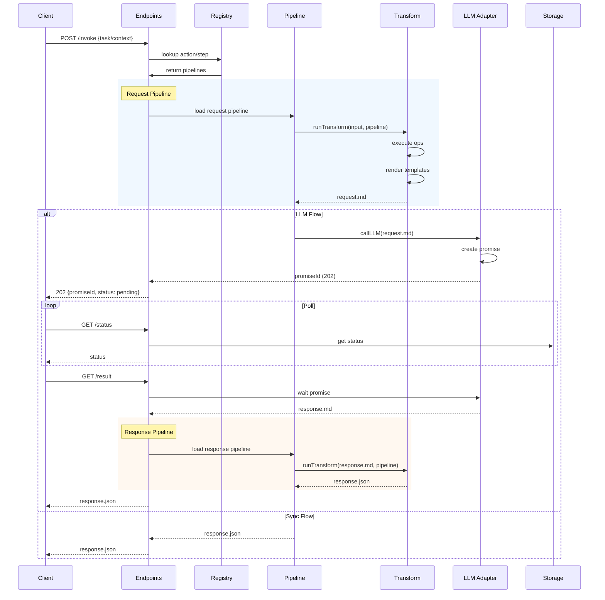
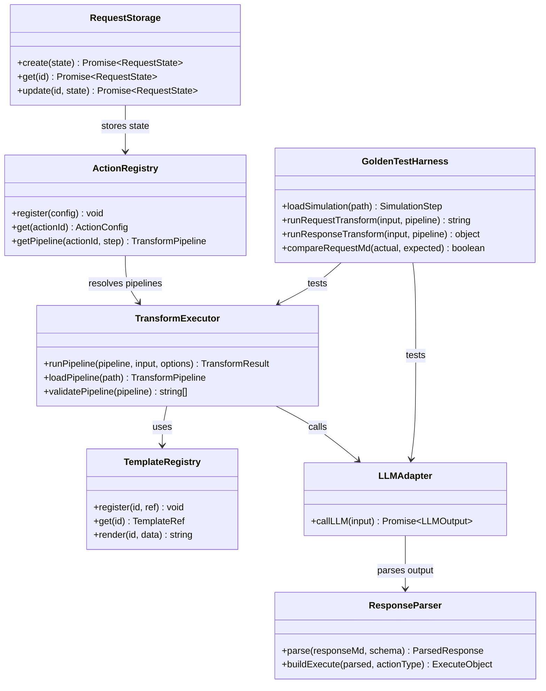
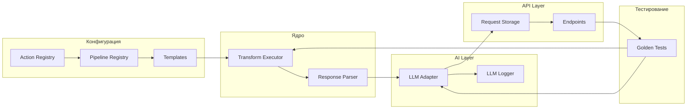

# Архитектура элементов сервера и хранения (Tasks 26-31)

> **Статус:** План реализации  
> **Версия:** 1.0  
> **Дата:** 2026-03-03

---

## 1. Обзор системы

Документ описывает архитектурный план для реализации задач 26-31, которые охватывают:

- **Task 26**: Transform DSL executor — интерпретатор JSON-пайплайнов для трансформации данных
- **Task 27**: Request.md schema и templates — каноническая структура и шаблоны для AI-Actions
- **Task 28**: LLM adapter с replay и promise-based async flow — адаптер для взаимодействия с LLM
- **Task 29**: Response.md parser и builder — парсинг и построение ответа
- **Task 30**: API endpoints интеграция — интеграция с HTTP endpoints
- **Task 31**: Golden tests — регрессионное тестирование против симуляций

### 1.1 Высокоуровневая диаграмма потока данных

```mermaid
flowchart TB
    subgraph Client["Клиент"]
        UI[Web UI / Client API]
    end
    
    subgraph Server["a2a-server"]
        subgraph Endpoints["API Endpoints"]
            INVOKE[/api/v1/invoke]
            STATUS[/api/v1/requests/:promiseId/status]
            RESULT[/api/v1/requests/:promiseId/result]
        end
        
        subgraph Engine["Simulation Engine"]
            REQ_PIPE[Request Pipeline]
            LLM[LLM Adapter]
            RESP_PIPE[Response Pipeline]
        end
        
        subgraph Transform["Transform DSL"]
            TE[Transform Executor]
            OPS[Operations]
        end
        
        subgraph Storage["Storage Layer"]
            REQ[Request Storage]
            LOGS[LLM Logs]
        end
    end
    
    subgraph Config["Configuration"]
        PIPELINES[Pipelines]
        TEMPLATES[Templates]
        REGISTRY[Action Registry]
    end
    
    subgraph External["External"]
        AI_HUB[AI Hub]
    end
    
    UI -->|request.json| INVOKE
    INVOKE -->|lookup action| REGISTRY
    REGISTRY -->|get pipelines| PIPELINES
    PIPELINES -->|load| REQ_PIPE
    REQ_PIPE -->|transform| TE
    TE --> OPS
    TEMPLATES -->|render| TE
    
    TE -->|request.md| LLM
    LLM -->|call| AI_HUB
    AI_HUB -->|promiseId| LLM
    
    LLM -->|response.md| RESP_PIPE
    RESP_PIPE -->|transform| TE
    TE -->|response.json| RESULT
    
    LLM -->|log| LOGS
    REQ_PIPE -->|store| REQ
```

---

## 2. Компонент 1: Transform DSL Executor (Task 26)

### 2.1 Назначение

Transform DSL executor — это интерпретатор JSON-пайплайнов, который выполняет преобразование данных между этапами обработки запроса. Он заменяет жёстко закодированную логику в коде на декларативные JSON-конфигурации.

### 2.2 Поддерживаемые операции

| Операция | Описание | Параметры |
|----------|----------|------------|
| `copy` | Глубокое копирование данных из одной позиции JSONPath в другую | `from`, `to` |
| `set` | Установка значения по JSONPath | `path`, `value` или `valueFrom` |
| `append-to-array` | Добавление элемента в массив | `to`, `value` |
| `parse-json-from-md` | Извлечение JSON из markdown | `fromFile`, `jsonPath`, `to` |
| `render-markdown` | Рендеринг markdown-шаблона | `templateRef`, `data`, `outputFile` |
| `switch` | Условное ветвление | `discriminator`, `cases`, `default` |

### 2.3 API трансформера

```typescript
// a2a-server/src/transform/types.ts

export interface TransformPipeline {
  type: 'pipeline';
  steps: TransformStep[];
}

export type TransformStep = 
  | CopyOperation 
  | SetOperation 
  | AppendToArrayOperation 
  | ParseJsonFromMdOperation 
  | RenderMarkdownOperation 
  | SwitchOperation;

export interface TransformContext {
  input: Record<string, unknown>;   // $ - входные данные
  $out: Record<string, unknown>;   // $out - выходные данные
  baseDir?: string;
  fs?: TransformFileSystem;
}

export interface TransformResult {
  output: Record<string, unknown>;
  files?: Record<string, string>;
  success: boolean;
  error?: string;
}

export interface TransformOptions {
  baseDir?: string;
  fs?: TransformFileSystem;
  renderTemplate?: (template: string, data: Record<string, unknown>) => string;
}

// Основная функция выполнения
export async function runTransformPipeline(
  pipeline: TransformPipeline,
  input: Record<string, unknown>,
  options?: TransformOptions
): Promise<TransformResult>;
```

### 2.4 Пример пайплайна

```json
// simulations/dialog/3/server-transforms-request.json
{
  "type": "pipeline",
  "steps": [
    { "op": "copy", "from": "$", "to": "$out" },
    {
      "op": "append-to-array",
      "to": "$.context.history",
      "value": { "role": "user", "message": "$.result.message" }
    },
    {
      "op": "render-markdown",
      "templateRef": "prompts/dialog-request.md",
      "data": "$out",
      "outputFile": "request.md"
    }
  ]
}
```

### 2.5 Расположение файлов

```
a2a-server/src/transform/
├── index.ts          # Экспорты
├── types.ts          # TypeScript интерфейсы
├── pipeline.ts       # Исполнитель пайплайнов
├── operations.ts     # Реализация операций
└── jsonpath.ts       # JSONPath resolution
```

---

## 3. Компонент 2: Templates (Task 27)

### 3.1 Назначение

Templates — это markdown-шаблоны для генерации LLM-prompts. Они хранятся как файлы и используются трансформером через операцию `render-markdown`.

### 3.2 Каноническая структура request.md

```markdown
## System Prompt

<роль и инструкции для LLM>

## Response Format

```json
<ожидаемая схема ответа>
```

## Current State

```json
<сериализованный контекст>
```

## Constraints

<правила валидации>
```

### 3.3 Доступные шаблоны

| Шаблон | Файл | Назначение |
|--------|------|------------|
| dialog | `prompts/dialog-request.md` | Диалог с пользователем |
| coder | `prompts/coder-request.md` | Генерация кода |
| auto-ai | `prompts/auto-ai-request.md` | Автоматизированные действия |
| analyze | `prompts/analyze-request.md` | Анализ и RAG |

### 3.4 Template Registry

```typescript
// a2a-server/src/templates/registry.ts

export interface TemplateRef {
  type: 'file' | 'inline';
  path?: string;
  content?: string;
}

export interface TemplateContext {
  context: Record<string, unknown>;
  result?: Record<string, unknown>;
  extras?: Record<string, unknown>;
}

export class TemplateRegistry {
  private templates: Map<string, TemplateRef> = new Map();
  
  register(id: string, ref: TemplateRef): void;
  
  get(id: string): TemplateRef | undefined;
  
  render(id: string, data: TemplateContext): string;
}
```

### 3.5 Расположение файлов

```
a2a-server/
├── prompts/                    # Директория шаблонов
│   ├── dialog-request.md
│   ├── coder-request.md
│   ├── auto-ai-request.md
│   └── analyze-request.md
└── src/
    └── templates/
        ├── registry.ts
        └── engine.ts
```

### 3.6 Пример шаблона

```markdown
## System Prompt

Ти AI-асистент для діалогу з користувачем. Твоя задача — відповідати на повідомлення та підтримувати розмову.

Завжди відповідай у форматі JSON:

```json
{
  "message": "твоя відповідь користувачу"
}
```

## Current State

```json
{{context}}
```

## Constraints

- Відповідай тільки валідним JSON
- Не додавай коментарі
- Використовуй українську мову
```

---

## 4. Компонент 3: LLM Adapter (Task 28)

### 4.1 Назначение

LLM Adapter — это единый модуль для всех взаимодействий с LLM. Он поддерживает:
- **Live mode** — реальные вызовы AI Hub
- **Replay mode** — чтение ответов из файловой системы
- **Logging** — запись request/response для отладки

### 4.2 Интерфейс адаптера

```typescript
// a2a-server/src/services/ai/llm-adapter.ts

export interface LLMInput {
  action: string;
  step: string;
  requestMd: string;
  model?: string;
  tags?: string[];
}

export interface LLMOutput {
  responseMd: string;
  meta: {
    action: string;
    step: string;
    timestamp: number;
    mode: 'live' | 'replay';
    model?: string;
    promiseId?: string;
    durationMs?: number;
  };
}

export interface LLMAdapter {
  callLLM(input: LLMInput): Promise<LLMOutput>;
}
```

### 4.3 Режим Replay

При установленном `LLM_REPLAY_DIR` адаптер читает `response.md` из указанной директории:

```typescript
// Логика replay
const replayPath = resolve(LLM_REPLAY_DIR, simulationId, step, 'response.md');
const responseMd = await fs.readFile(replayPath, 'utf-8');
```

### 4.4 Promise-based Async Flow

Для асинхронных запросов используется:

```typescript
// Создание promise в AI Hub
const { promiseId } = await createOllamaPromise({
  model: getOllamaModel(),
  prompt,
  stream: false,
});

// Ожидание результата
const text = await waitForPromise(promiseId, (status) => {
  logger.debug('Promise status', { promiseId, status: status.status });
});
```

### 4.5 Структура логов

```
logs/llm/
└── <YYYY-MM-DD>/
    └── <request-id>/
        ├── request.md    # Отправленный промпт
        ├── response.md   # Ответ LLM
        └── meta.json     # Метаданные
```

### 4.6 Пример meta.json

```json
{
  "action": "dialog",
  "step": "request",
  "timestamp": 1706812800000,
  "mode": "live",
  "model": "qwen3:8b",
  "promiseId": "abc123",
  "durationMs": 1500
}
```

---

## 5. Компонент 4: Response Parser (Task 29)

### 5.1 Назначение

Response Parser извлекает JSON из `response.md` и строит `response.json` согласно протоколу.

### 5.2 Интерфейс парсера

```typescript
// a2a-server/src/response/parser.ts

export interface ResponseParser {
  parse(responseMd: string, schema: ResponseSchema): ParsedResponse;
  buildExecute(parsed: ParsedResponse, actionType: string): ExecuteObject;
  updateHistory(context: Context, parsed: ParsedResponse): Context;
}

export interface ParsedResponse {
  data: Record<string, unknown>;
  action?: string;
  message?: string;
  choices?: Choice[];
  commands?: Command[];
}
```

### 5.3 Пример пайплайна ответа

```json
// simulations/dialog/3/server-transforms-response.json
{
  "type": "pipeline",
  "steps": [
    {
      "op": "parse-json-from-md",
      "fromFile": "response.md",
      "jsonPath": "$",
      "to": "$llm"
    },
    {
      "op": "append-to-array",
      "to": "$.context.history",
      "value": {
        "role": "assistant",
        "message": "$.llm.message"
      }
    },
    {
      "op": "set",
      "path": "$.execute",
      "valueFrom": "$.result.execute"
    }
  ]
}
```

---

## 6. Компонент 5: API Endpoints (Task 30)

### 6.1 Обзор endpoints

| Endpoint | Метод | Описание |
|----------|-------|----------|
| `/api/v1/invoke` | POST | Создание запроса |
| `/api/v1/requests/:promiseId/status` | GET | Статус запроса |
| `/api/v1/requests/:promiseId/result` | GET | Результат запроса |

### 6.2 Flow диаграмма



### 6.3 Action Registry

```typescript
// a2a-server/src/registry/action-registry.ts

export interface ActionConfig {
  id: string;
  type: 'action' | 'ai-action';
  requestPipeline?: string;
  responsePipeline?: string;
  template?: string;
  steps?: Record<string, StepConfig>;
}

export interface StepConfig {
  pipeline: string;
  requiresLlm: boolean;
}

export class ActionRegistry {
  private actions: Map<string, ActionConfig> = new Map();
  
  register(config: ActionConfig): void;
  
  get(actionId: string): ActionConfig | undefined;
  
  getPipeline(actionId: string, step: string): TransformPipeline | undefined;
}
```

### 6.4 Конфигурация action registry

```yaml
# a2a-server/config/actions.yaml
actions:
  dialog:
    type: ai-action
    template: prompts/dialog-request.md
    requestPipeline: pipelines/dialog-request.yaml
    responsePipeline: pipelines/dialog-response.yaml
    steps:
      request:
        pipeline: pipelines/dialog-llm.yaml
        requiresLlm: true
      
  coder:
    type: ai-action
    template: prompts/coder-request.md
    requestPipeline: pipelines/coder-request.yaml
    responsePipeline: pipelines/coder-response.yaml
```

### 6.5 Request Storage

```typescript
// a2a-server/src/storage/request-storage.ts

export interface RequestState {
  id: string;
  promiseId: string;
  action: string;
  step: string;
  status: 'pending' | 'processing' | 'completed' | 'failed';
  requestMd?: string;
  responseMd?: string;
  result?: Record<string, unknown>;
  createdAt: number;
  updatedAt: number;
}

export interface RequestStorage {
  create(state: Omit<RequestState, 'id'>): Promise<RequestState>;
  get(id: string): Promise<RequestState | undefined>;
  update(id: string, state: Partial<RequestState>): Promise<RequestState>;
  delete(id: string): Promise<void>;
}
```

---

## 7. Компонент 6: Golden Tests (Task 31)

### 7.1 Назначение

Golden tests обеспечивают регрессионное тестирование, сравнивая поведение runtime с симуляциями.

### 7.2 Test Harness

```typescript
// a2a-server/tests/golden/harness.ts

export interface SimulationStep {
  path: string;
  requestJson?: object;
  requestTransform?: object;
  requestMd?: string;
  responseMd?: string;
  responseTransform?: object;
  responseJson?: object;
}

export interface TestResult {
  requestMdMatch: boolean;
  responseJsonMatch: boolean;
  errors: string[];
}

export class GoldenTestHarness {
  async loadSimulation(path: string): Promise<SimulationStep>;
  
  async runRequestTransform(input: object, pipeline: object): Promise<string>;
  
  async runResponseTransform(input: string, pipeline: object): Promise<object>;
  
  async compareRequestMd(actual: string, expected: string): Promise<boolean>;
  
  async compareResponseJson(actual: object, expected: object): Promise<boolean>;
}
```

### 7.3 Пример теста

```typescript
// a2a-server/tests/golden/dialog.test.ts

describe('Golden Tests: dialog', () => {
  const harness = new GoldenTestHarness();
  
  it('generates matching request.md for step 3', async () => {
    const step = await harness.loadSimulation('simulations/dialog/3');
    const actual = await harness.runRequestTransform(
      step.requestJson,
      step.requestTransform
    );
    
    const match = await harness.compareRequestMd(actual, step.requestMd);
    expect(match).toBe(true);
  });
  
  it('generates matching response.json for step 3', async () => {
    const step = await harness.loadSimulation('simulations/dialog/3');
    const actual = await harness.runResponseTransform(
      step.responseMd,
      step.responseTransform
    );
    
    const match = await harness.compareResponseJson(actual, step.responseJson);
    expect(match).toBe(true);
  });
});
```

### 7.4 Покрытие тестами

| Simulation | Steps | Type | Coverage |
|------------|-------|------|----------|
| dialog | 6 | ai-action | Full |
| coder | 8 | ai-action | Full |
| auto-ai | TBD | ai-action | Full |
| analyze | TBD | ai-action | Full |
| fix-vue-imports | 5 | action | Partial |
| phpunit-deprecations | 5 | action | Partial |

### 7.5 CI интеграция

```bash
# package.json
{
  "scripts": {
    "test:golden": "vitest run tests/golden",
    "test:sim": "vitest run tests/simulation-based.test.ts"
  }
}
```

---

## 8. Иерархия директорий

```
a2a-server/
├── config/
│   └── actions.yaml              # Action registry
├── prompts/                       # Task 27: Templates
│   ├── dialog-request.md
│   ├── coder-request.md
│   ├── auto-ai-request.md
│   └── analyze-request.md
├── pipelines/                    # Pipeline configs
│   ├── dialog-request.yaml
│   ├── dialog-response.yaml
│   ├── coder-request.yaml
│   └── ...
├── logs/                          # Task 28: LLM logs
│   └── llm/
│       └── <YYYY-MM-DD>/
│           └── <request-id>/
│               ├── request.md
│               ├── response.md
│               └── meta.json
├── src/
│   ├── transform/                # Task 26: Transform DSL
│   │   ├── index.ts
│   │   ├── types.ts
│   │   ├── pipeline.ts
│   │   ├── operations.ts
│   │   └── jsonpath.ts
│   ├── templates/                # Task 27: Template engine
│   │   ├── registry.ts
│   │   └── engine.ts
│   ├── services/
│   │   └── ai/
│   │       ├── llm-adapter.ts   # Task 28: LLM Adapter
│   │       ├── ollama-adapter.ts
│   │       └── ai-service.ts
│   ├── response/                # Task 29: Response parser
│   │   ├── parser.ts
│   │   └── builder.ts
│   ├── registry/                # Task 30: Action registry
│   │   └── action-registry.ts
│   ├── storage/                 # Task 30: Storage
│   │   └── request-storage.ts
│   └── routes/
│       └── index.ts             # Task 30: Endpoints
└── tests/
    └── golden/                  # Task 31: Golden tests
        ├── harness.ts
        ├── dialog.test.ts
        ├── coder.test.ts
        └── auto-ai.test.ts
```

---

## 9. Конфигурация Pipeline Registry

### 9.1 Выбор пайплайна по action + step

```typescript
// a2a-server/src/registry/pipeline-registry.ts

export interface PipelineRegistryConfig {
  pipelines: Record<string, {
    request?: string;
    response?: string;
    steps?: Record<string, {
      request?: string;
      response?: string;
    }>;
  }>;
}

export class PipelineRegistry {
  constructor(private config: PipelineRegistryConfig) {}
  
  getRequestPipeline(action: string, step?: string): string | undefined {
    const actionConfig = this.config.pipelines[action];
    if (!actionConfig) return actionConfig?.request;
    
    if (step && actionConfig.steps?.[step]?.request) {
      return actionConfig.steps[step].request;
    }
    
    return actionConfig.request;
  }
  
  getResponsePipeline(action: string, step?: string): string | undefined {
    const actionConfig = this.config.pipelines[action];
    if (!actionConfig) return actionConfig?.response;
    
    if (step && actionConfig.steps?.[step]?.response) {
      return actionConfig.steps[step].response;
    }
    
    return actionConfig.response;
  }
}
```

### 9.2 Пример конфигурации

```yaml
# a2a-server/config/pipelines.yaml
pipelines:
  dialog:
    request: pipelines/dialog-request.yaml
    response: pipelines/dialog-response.yaml
    steps:
      request:
        request: pipelines/dialog-request.yaml
        response: pipelines/dialog-response.yaml
      
  coder:
    request: pipelines/coder-request.yaml
    response: pipelines/coder-response.yaml
    steps:
      plan:
        request: pipelines/coder-plan-request.yaml
      execute:
        request: pipelines/coder-execute-request.yaml
```

---

## 10. Environment Variables

| Variable | Описание | Пример |
|----------|----------|--------|
| `LLM_REPLAY_DIR` | Директория для replay-режима | `simulations/dialog/3` |
| `LLM_PROVIDER` | Провайдер LLM | `ollama`, `openai`, `proxy` |
| `OLLAMA_MODEL` | Модель Ollama | `qwen3:8b` |
| `OPENAI_MODEL` | Модель OpenAI | `gpt-4o-mini` |
| `AI_PROXY_URL` | URL AI Hub | `http://localhost:11434` |
| `LOG_LLM_DIR` | Директория для логов LLM | `logs/llm` |

---

## 11. Примеры структур данных

### 11.1 request.json (входной)

```json
{
  "task": "диалог",
  "context": {
    "execution": {
      "action": "dialog",
      "step": "request"
    },
    "history": [
      { "role": "user", "message": "hello world" }
    ]
  },
  "result": {
    "message": "hello world"
  }
}
```

### 11.2 request.md (LLM input)

```markdown
## System Prompt

Ти AI-асистент для діалогу...

## Response Format

```json
{
  "message": "твоя відповідь"
}
```

## Current State

```json
{
  "context": {
    "execution": { "action": "dialog", "step": "request" },
    "history": [
      { "role": "user", "message": "hello world" },
      { "role": "user", "message": "hello world" }
    ]
  }
}
```
```

### 11.3 response.md (LLM output)

```markdown
## Очікувана відповідь LLM

```json
{
  "message": "Привіт! Як справи?"
}
```
```

### 11.4 response.json (выходной)

```json
{
  "context": {
    "execution": { "action": "dialog", "step": "request" },
    "history": [
      { "role": "user", "message": "hello world" },
      { "role": "user", "message": "hello world" },
      { "role": "assistant", "message": "Привіт! Як справи?" }
    ]
  },
  "execute": {
    "form": {
      "title": "Продовжити діалог",
      "input": [
        {
          "name": "message",
          "type": "text",
          "label": "Ваше повідомлення",
          "required": true
        }
      ]
    }
  }
}
```

---

## 12. Диаграмма компонентов



---

## 13. Зависимости между компонентами



---

## 14. Checklist реализации

### Task 26: Transform DSL Executor

- [ ] Расширить поддержку операций (добавить `switch`)
- [ ] Добавить JSON Schema для валидации пайплайнов
- [ ] Написать unit-тесты для каждой операции
- [ ] Обеспечить интеграцию с файловой системой

### Task 27: Request.md Schema и Templates

- [ ] Определить каноническую структуру request.md
- [ ] Создать шаблоны: dialog, coder, auto-ai, analyze
- [ ] Реализовать TemplateRegistry
- [ ] Обновить симуляции для использования шаблонов

### Task 28: LLM Adapter с Replay

- [ ] Интегрировать replay-режим в LLMAdapter
- [ ] Реализовать логирование в logs/llm/
- [ ] Добавить поддержку promise-based async
- [ ] Написать тесты для replay и live mode

### Task 29: Response Parser

- [ ] Реализовать parse-json-from-md операцию
- [ ] Построить execute object согласно action-key shape
- [ ] Обновить context.history
- [ ] Интегрировать с pipeline registry

### Task 30: API Endpoints

- [ ] Интегрировать Engine в /api/v1/invoke
- [ ] Реализовать /status и /result endpoints
- [ ] Добавить request storage abstraction
- [ ] Интегрировать валидацию JSON Schema

### Task 31: Golden Tests

- [ ] Создать GoldenTestHarness
- [ ] Написать тесты для dialog, coder, auto-ai
- [ ] Интегрировать в CI
- [ ] Добавить E2E тесты через HTTP

---

## 15. Ссылки

- [Simulations Schema](../simulations/SCHEMA.md)
- [Protocol Documentation](../new-request-flow/PROTOCOL.md)
