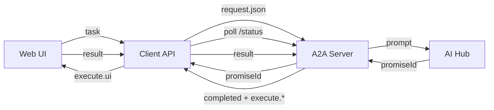

# Протоколы обмена A2A

> **Транспорт:** Все запросы используют **async flow с `promiseId`**.
> Server возвращает `promiseId`, Client API опрашивает статус до `completed`, затем возвращает результат Web.

## Обзор

Этот раздел содержит детальные протоколы обмена для системы A2A Script Agent. Протоколы описывают форматы запросов и ответов для всех типов взаимодействий.

## Структура разделов

### 1. [Действия (Actions)](actions/README.md)

Детальные протоколы для каждого типа действий:

| Action | Описание | Статус |
|--------|----------|--------|
| `read-file` | Чтение файла | ✅ |
| `write-file` | Запись файла | ✅ |
| `execute-command` | Выполнение команды | ✅ |
| `script` | Выполнение скрипта | ✅ |
| `rag-search` | RAG поиск | ✅ |
| `form` | Интерактивные формы | ✅ |
| `message` | Отображение сообщений | ✅ |
| `list-directory` | Список директории | 🔶 |
| `grep-search` | Текстовый поиск | ❌ |
| `file-exists` | Проверка файла | ❌ |
| `scan-directory` | Зарезервировано; нет отдельного ключа — см. [scan-directory.md](actions/scan-directory.md) | ➖ |
| `edit-patch` | Редактирование патчем | ❌ |
| `run-script` | Запуск скрипта | ❌ |

### 2. [Состояния (States)](states/README.md)

Протоколы для различных состояний системы:

| State | Описание | Статус |
|-------|----------|--------|
| `pending` | Ожидание выполнения | ✅ |
| `waiting` | Ожидание пользователя | ✅ |
| `processing` | Активная обработка | ✅ |
| `error` | Состояние ошибки | 🔶 |
| `completed` | Успешное завершение | ✅ |
| `cancelled` | Отменено | ❌ |

### 3. [Promise System](promise/README.md)

Протоколы для асинхронных операций:

- Создание Promise
- Polling результата
- Обработка прогресса
- Таймауты

### 4. [Сессии (Sessions)](sessions/README.md)

Протоколы управления сессиями:

- Создание сессии
- Жизненный цикл
- Контекст сессии
- Завершение сессии

## Диаграмма потока данных

> **Примечание:** Server возвращает `promiseId`. Client API опрашивает `/requests/:id/status` до `completed`,
> затем получает результат и возвращает `execute.*` в Web.

## Статусы реализации

- ✅ **Полностью реализовано** - протокол готов
- 🔶 **Частично реализовано** - требует доработки
- ❌ **Не реализовано** - запланировано
- ➖ **Не отдельное действие** - зарезервировано или сведено к другим ключам

## Быстрые ссылки

- [Этапы протокола](../STAGES/README.md)
- [JSON Схемы](../json-schemas/README.md)
- [Симуляции](../STAGES/simulations/OVERVIEW.md) → канонические фикстуры в [`simulations/`](../../../simulations/) (корень репозитория)
- [PROTOCOL](../PROTOCOL.md)
- [Планирование / roadmap](../../../a2a-server/docs/planning/README.md), [ревизия планов vs код](../../../a2a-server/docs/planning/PLAN_REVIEW.md)
- [Web UI + Client API](../../../a2a-client/docs/WEB_UI_PROTOCOL.md) — `POST .../next`, опрос `GET .../async` (Vite plugin)

> **Async:** здесь описан поток через `promiseId` и опрос **A2A Server** (`/api/v1/requests/...`). У file-backed Web UI преимущественно используется опрос **Client API** (`GET /api/a2a/sessions/:id/async`); см. `WEB_UI_PROTOCOL.md` и [`AGENTS.md`](../../../AGENTS.md).
