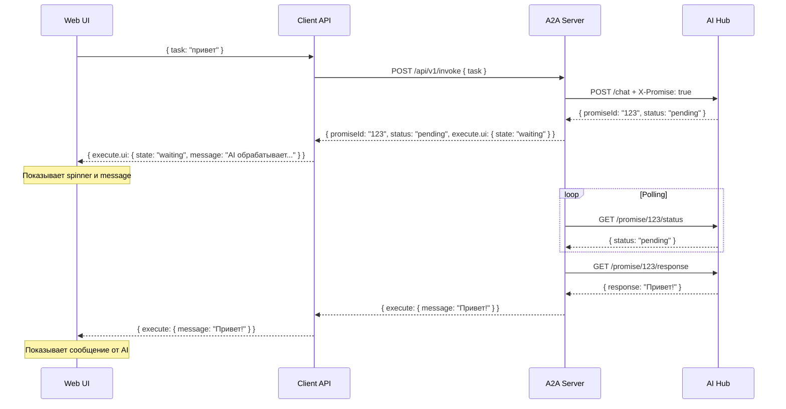

# Система Promise и управление UI

## Проблема

Сейчас:
- Web UI сам решает что показать пользователю
- При ожидании ответа от сервера - Web сам включает "waiting"
- Клиент (Client API) не управляет UI состоянием
- Страница быстро загружается, но сессии грузятся долго (даже при свернутой панели)

Нужно:
- **Client API (a2a-client/packages/sdk)** должен указывать что показывать
- Server возвращает promiseId, Client API формирует UI команды
- Web UI должен подчиняться командам от Client API

---

## Promise ID Flow

### Асинхронный ответ сервера

Когда Server отправляет запрос к External AI Hub и не может получить ответ сразу:

```
1. Server → AI Hub: POST /api/chat { messages } + X-Promise: true
2. AI Hub → Server: { promiseId: "abc123", status: "pending" }
3. Server → Client API: { promiseId: "abc123", status: "pending" }
4. Client API → Web: execute.ui { state: "waiting", message: "..." }
5. Server → AI Hub: GET /promise/abc123/status (polling)
6. AI Hub → Server: { status: "done" }
7. Server → AI Hub: GET /promise/abc123/response
8. AI Hub → Server: { response: "..." }
9. Server → Client API: { execute: {...} }
10. Client API → Web: { execute: {...} }
```

### Схема Pending Response

```json
{
  "promiseId": "abc123def456",
  "status": "pending"
}
```

---

## Server-Driven UI Commands

### Текущая проблема

Сейчас Web UI сам решает:
- Показать loading spinner
- Показать сообщение "AI обрабатывает..."
- Показать ошибку

### Решение

Client API должен передавать команды UI через `execute`:

```json
{
  "execute": {
    "ui": {
      "state": "waiting",
      "message": "AI обрабатывает ваш запрос...",
      "progress": 50,
      "spinner": true
    }
  }
}
```

### Типы UI состояний

| State | Описание | Параметры |
|-------|----------|-----------|
| `idle` | Ожидание ввода | - |
| `waiting` | Ожидание ответа | message, progress, spinner |
| `processing` | Активная обработка | progress, message |
| `error` | Ошибка | errorMessage, retryButton |
| `success` | Успешное завершение | message |

---

## Расширенная схема ответа

### Response с UI командой

```json
{
  "context": {
    "task": "диалог",
    "execution": {
      "action": "dialog",
      "step": "request"
    }
  },
  "promiseId": "abc123",
  "execute": {
    "ui": {
      "state": "waiting",
      "message": "AI анализирует ваш запрос...",
      "progress": 30,
      "spinner": true
    }
  }
}
```

### Response после завершения

```json
{
  "context": {
    "task": "диалог",
    "execution": {
      "action": "dialog",
      "step": "request"
    },
    "history": [...]
  },
  "execute": {
    "message": "Привет! Чем могу помочь?",
    "form": {
      "input": [...]
    }
  }
}
```

---

## Mermaid: Promise Flow с UI



---

## Инициализация при загрузке страницы

### Проблема

Страница загружается быстро, но сессии загружаются долго. При свернутой панели - пользователь не видит прогресс.

### Решение

При загрузке страницы Client API должен:

1. **Быстро вернуть базовую структуру:**
```json
{
  "execute": {
    "ui": {
      "state": "loading",
      "message": "Загрузка сессий...",
      "progress": 0
    }
  }
}
```

2. **После загрузки сессий:**
```json
{
  "execute": {
    "ui": {
      "state": "idle"
    },
    "sessions": [...]
  }
}
```

3. **При ошибке:**
```json
{
  "execute": {
    "ui": {
      "state": "error",
      "message": "Не удалось загрузить сессии",
      "retryButton": true
    }
  }
}
```

---

## Реализация

### Server (a2a-server)

1. При async запросе - возвращает `promiseId` + `status: "pending"`
2. Периодически опрашивает AI Hub
3. Возвращает результат когда готов

### Client API (a2a-client/packages/sdk)

1. **Генерирует `execute.ui` на основе ответа от Server**
2. При `promiseId` - добавляет `ui.state: "waiting"`
3. Прокидывает `execute.ui` в Web
4. Не добавляет свои собственные UI команды

### Web UI

1. Слушает `execute.ui` от Client API
2. Не добавляет свои loading состояния
3. Подчиняется командам от Client API

---

## Примеры execute.ui

### Dialog ожидание

```json
{
  "execute": {
    "ui": {
      "state": "waiting",
      "message": "AI думает над ответом...",
      "progress": 50,
      "spinner": true
    }
  }
}
```

### Files операция

```json
{
  "execute": {
    "ui": {
      "state": "processing",
      "message": "Читаю файл src/app.js",
      "progress": 75,
      "spinner": true
    },
    "read-file": {
      "path": "src/app.js"
    }
  }
}
```

### Progressbar

```json
{
  "execute": {
    "ui": {
      "state": "processing",
      "message": "Обработка файлов",
      "progress": 45,
      "total": 100,
      "showProgressBar": true
    }
  }
}
```

### Error

```json
{
  "execute": {
    "ui": {
      "state": "error",
      "message": "Не удалось выполнить запрос",
      "errorCode": "LLM_TIMEOUT",
      "retryButton": true
    }
  }
}
```

---

## References

- [server-invoke-response-pending.schema.json](../../json-schemas/server-invoke-response-pending.schema.json)
- [ARCHITECTURE.md](../../ARCHITECTURE.md)
- [PROTOCOL.md](../../PROTOCOL.md)
- [simulations/SCHEMA.md](../../../../../simulations/SCHEMA.md)
