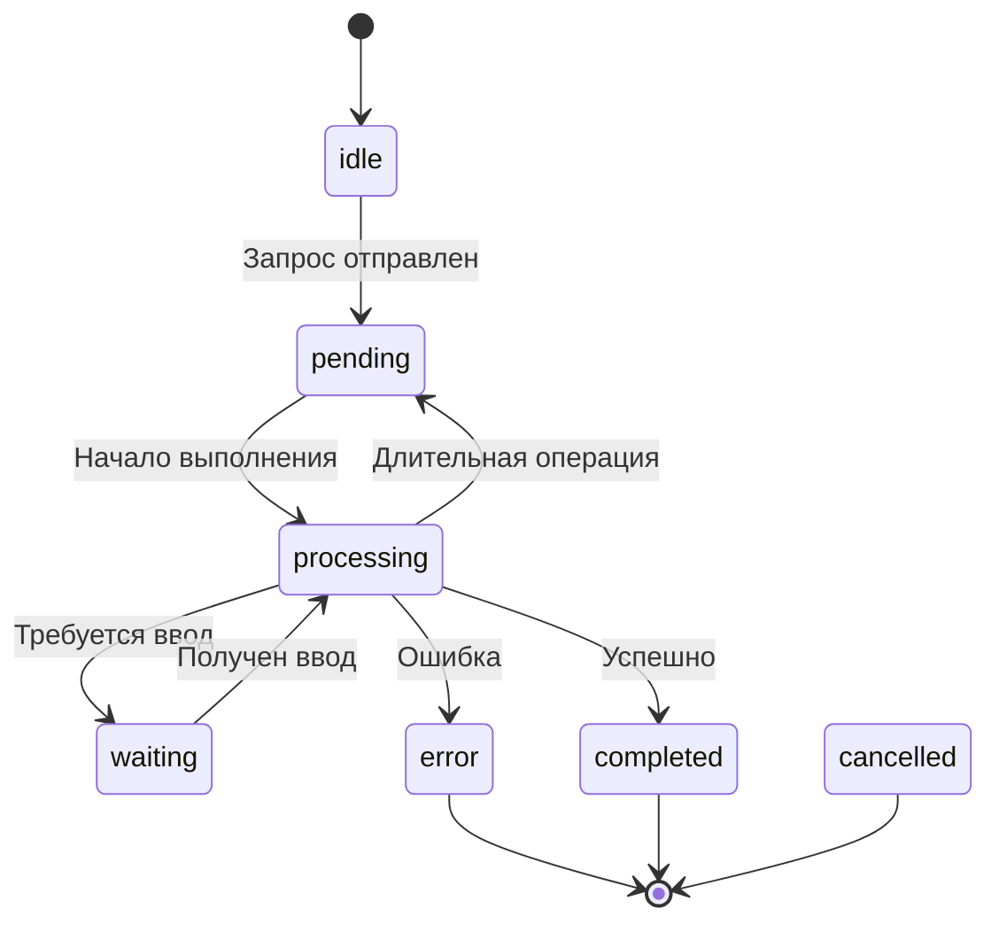

# Протоколы состояний (States)

## Обзор

Этот раздел содержит протоколы для различных состояний системы A2A.

## Типы состояний

| State | Файл | Статус | Описание |
|-------|------|--------|----------|
| `pending` | [pending.md](states/pending.md) | ✅ | Ожидание выполнения |
| `waiting` | [waiting.md](states/waiting.md) | ✅ | Ожидание пользователя |
| `processing` | [processing.md](states/processing.md) | ✅ | Активная обработка |
| `error` | [error.md](states/error.md) | 🔶 | Состояние ошибки |
| `completed` | [completed.md](states/completed.md) | ✅ | Успешное завершение |
| `cancelled` | [cancelled.md](states/cancelled.md) | ❌ | Отменено |

## Диаграмма состояний

## Статусы реализации

- ✅ **Реализовано** - полный протокол создан
- 🔶 **Частично** - протокол требует доработки
- ❌ **Не реализовано** - протокол только планируется

## see also

- [Этапы протокола](../STAGES/README.md)
- [Действия](actions/README.md)
- [Promise System](../promise/README.md)
