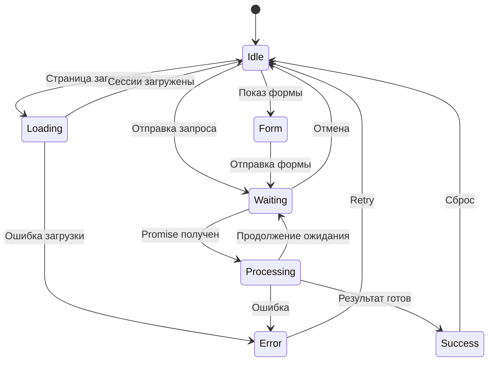

# UI Commands Schema (UI-COMMANDS.md)

## Обзор

Схема для команд управления UI от **Client API (a2a-client/packages/sdk)** к Web UI.

> **Важно:** `execute.ui` генерируется на стороне **Client API**, а не на A2A Server. Server возвращает `promiseId` при асинхронных запросах, а Client API на основе этого формирует UI команды.

## Определения

### UICommand

```json
{
  "ui": {
    "state": "waiting",
    "message": "AI обрабатывает...",
    "progress": 50,
    "spinner": true
  }
}
```

### UIStateType

```typescript
type UIStateType = 
  | "idle"          // Ожидание ввода
  | "loading"       // Загрузка при инициализации
  | "waiting"       // Ожидание ответа (Promise)
  | "processing"    // Активная обработка
  | "error"         // Ошибка
  | "success";      // Успешное завершение
```

### UICommandProperties

| Поле | Тип | Обязательный | Описание |
|------|-----|--------------|----------|
| state | string | Да | Состояние UI |
| message | string | Нет | Сообщение для пользователя |
| progress | number | Нет | Прогресс (0-100) |
| total | number | Нет | Всего элементов |
| spinner | boolean | Нет | Показать спиннер |
| showProgressBar | boolean | Нет | Показать прогрессбар |
| errorCode | string | Нет | Код ошибки |
| retryButton | boolean | Нет | Показать кнопку повтора |

---

## Примеры команд

### 1. Idle (Ожидание)

```json
{
  "execute": {
    "ui": {
      "state": "idle"
    }
  }
}
```

### 2. Loading (Загрузка)

```json
{
  "execute": {
    "ui": {
      "state": "loading",
      "message": "Загрузка сессий...",
      "progress": 0
    }
  }
}
```

### 3. Waiting (Ожидание Promise)

```json
{
  "execute": {
    "ui": {
      "state": "waiting",
      "message": "AI обрабатывает ваш запрос...",
      "progress": 30,
      "spinner": true
    }
  }
}
```

### 4. Processing (Обработка)

```json
{
  "execute": {
    "ui": {
      "state": "processing",
      "message": "Читаю файл src/app.js",
      "progress": 75,
      "spinner": true,
      "showProgressBar": true
    }
  }
}
```

### 5. Error (Ошибка)

```json
{
  "execute": {
    "ui": {
      "state": "error",
      "message": "Не удалось выполнить запрос",
      "errorCode": "LLM_TIMEOUT",
      "retryButton": true
    }
  }
}
```

### 6. Success (Успех)

```json
{
  "execute": {
    "ui": {
      "state": "success",
      "message": "Готово!"
    }
  }
}
```

---

## Полная схема

### ExecuteUISchema

```json
{
  "$schema": "http://json-schema.org/draft-07/schema#",
  "$id": "https://a2a.dev/schemas/ui-commands.schema.json",
  "title": "UI Commands Schema",
  "description": "Schema for UI commands from Client API to Web UI",
  "type": "object",
  "definitions": {
    "UIStateType": {
      "type": "string",
      "enum": ["idle", "loading", "waiting", "processing", "error", "success"],
      "description": "UI state type"
    },
    "UICommand": {
      "type": "object",
      "required": ["state"],
      "properties": {
        "state": {
          "$ref": "#/definitions/UIStateType"
        },
        "message": {
          "type": "string",
          "description": "User-visible message"
        },
        "progress": {
          "type": "number",
          "minimum": 0,
          "maximum": 100,
          "description": "Progress percentage (0-100)"
        },
        "total": {
          "type": "number",
          "description": "Total items for progress calculation"
        },
        "spinner": {
          "type": "boolean",
          "default": false,
          "description": "Show spinner"
        },
        "showProgressBar": {
          "type": "boolean",
          "default": false,
          "description": "Show progress bar"
        },
        "errorCode": {
          "type": "string",
          "description": "Error code for debugging"
        },
        "retryButton": {
          "type": "boolean",
          "default": false,
          "description": "Show retry button"
        }
      }
    }
  }
}
```

---

## Интеграция с Execute

### Полный Execute объект

```json
{
  "execute": {
    "ui": {
      "state": "waiting",
      "message": "AI обрабатывает...",
      "progress": 50,
      "spinner": true
    },
    "form": {
      "input": [...]
    }
  }
}
```

### Execute объект с несколькими командами

```json
{
  "execute": {
    "ui": {
      "state": "processing",
      "message": "Читаю файл",
      "progress": 80
    },
    "read-file": {
      "path": "src/app.js"
    },
    "message": "Файл найден"
  }
}
```

---

## Приоритеты UI команд

| Приоритет | Команда | Описание |
|-----------|---------|----------|
| 1 | ui.state="error" | Ошибка - показывать всегда |
| 2 | ui.state="waiting" | Ожидание - показывать spinner |
| 3 | ui.state="processing" | Обработка - показывать прогресс |
| 4 | form / message / action | Основной контент |

---

## Mermaid: UI Flow



---

## References

- [server-invoke-response-execute.schema.json](server-invoke-response-execute.schema.json)
- [server-invoke-response-pending.schema.json](server-invoke-response-pending.schema.json)
- [PROMISE-WAITING.md](../STAGES/simulations/PROMISE-WAITING.md)
