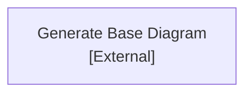
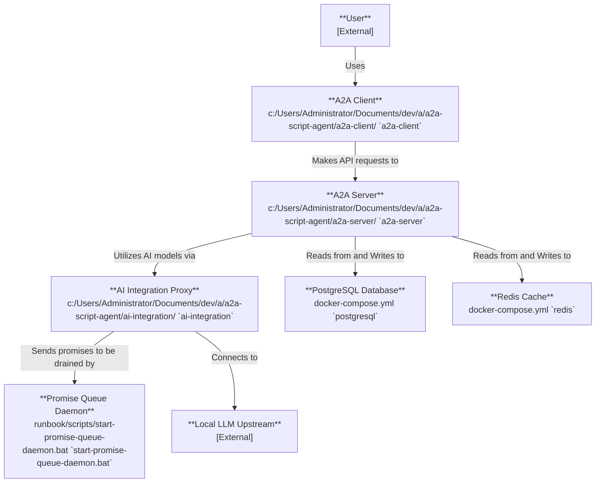

# Unnamed CodeViz Diagram

```mermaid
graph TD

    begin-diagram-generation["Generate Base Diagram<br>[External]"]

```
# Unnamed CodeViz Diagram

```mermaid
graph TD

    overall_architecture.cv::user["**User**<br>[External]"]
    overall_architecture.cv::a2a_client["**A2A Client**<br>c:/Users/Administrator/Documents/dev/a/a2a-script-agent/a2a-client/ `a2a-client`"]
    overall_architecture.cv::a2a_server["**A2A Server**<br>c:/Users/Administrator/Documents/dev/a/a2a-script-agent/a2a-server/ `a2a-server`"]
    overall_architecture.cv::ai_integration_proxy["**AI Integration Proxy**<br>c:/Users/Administrator/Documents/dev/a/a2a-script-agent/ai-integration/ `ai-integration`"]
    overall_architecture.cv::promise_queue_daemon["**Promise Queue Daemon**<br>runbook/scripts/start-promise-queue-daemon.bat `start-promise-queue-daemon.bat`"]
    overall_architecture.cv::postgresql["**PostgreSQL Database**<br>docker-compose.yml `postgresql`"]
    overall_architecture.cv::redis["**Redis Cache**<br>docker-compose.yml `redis`"]
    overall_architecture.cv::local_llm_upstream["**Local LLM Upstream**<br>[External]"]
    %% Edges at this level (grouped by source)
    overall_architecture.cv::user["**User**<br>[External]"] -->|"Uses"| overall_architecture.cv::a2a_client["**A2A Client**<br>c:/Users/Administrator/Documents/dev/a/a2a-script-agent/a2a-client/ `a2a-client`"]
    overall_architecture.cv::a2a_client["**A2A Client**<br>c:/Users/Administrator/Documents/dev/a/a2a-script-agent/a2a-client/ `a2a-client`"] -->|"Makes API requests to"| overall_architecture.cv::a2a_server["**A2A Server**<br>c:/Users/Administrator/Documents/dev/a/a2a-script-agent/a2a-server/ `a2a-server`"]
    overall_architecture.cv::a2a_server["**A2A Server**<br>c:/Users/Administrator/Documents/dev/a/a2a-script-agent/a2a-server/ `a2a-server`"] -->|"Utilizes AI models via"| overall_architecture.cv::ai_integration_proxy["**AI Integration Proxy**<br>c:/Users/Administrator/Documents/dev/a/a2a-script-agent/ai-integration/ `ai-integration`"]
    overall_architecture.cv::a2a_server["**A2A Server**<br>c:/Users/Administrator/Documents/dev/a/a2a-script-agent/a2a-server/ `a2a-server`"] -->|"Reads from and Writes to"| overall_architecture.cv::postgresql["**PostgreSQL Database**<br>docker-compose.yml `postgresql`"]
    overall_architecture.cv::a2a_server["**A2A Server**<br>c:/Users/Administrator/Documents/dev/a/a2a-script-agent/a2a-server/ `a2a-server`"] -->|"Reads from and Writes to"| overall_architecture.cv::redis["**Redis Cache**<br>docker-compose.yml `redis`"]
    overall_architecture.cv::ai_integration_proxy["**AI Integration Proxy**<br>c:/Users/Administrator/Documents/dev/a/a2a-script-agent/ai-integration/ `ai-integration`"] -->|"Sends promises to be drained by"| overall_architecture.cv::promise_queue_daemon["**Promise Queue Daemon**<br>runbook/scripts/start-promise-queue-daemon.bat `start-promise-queue-daemon.bat`"]
    overall_architecture.cv::ai_integration_proxy["**AI Integration Proxy**<br>c:/Users/Administrator/Documents/dev/a/a2a-script-agent/ai-integration/ `ai-integration`"] -->|"Connects to"| overall_architecture.cv::local_llm_upstream["**Local LLM Upstream**<br>[External]"]

```
# Unnamed CodeViz Diagram

```mermaid
graph TD

    subgraph a2a_server_containers.cv::c1["**Система A2A Script Agent**<br>[External]"]
        a2a_server_containers.cv::user["**Пользователь**<br>[External]"]
        a2a_server_containers.cv::a2a_client["**A2A Клиент**<br>[External]"]
        a2a_server_containers.cv::ai_integration_proxy["**Прокси ИИ Интеграции**<br>[External]"]
        a2a_server_containers.cv::promise_queue_daemon["**Демон Очереди Промисов**<br>[External]"]
        a2a_server_containers.cv::postgresql["**База данных PostgreSQL**<br>[External]"]
        a2a_server_containers.cv::redis["**Кэш Redis**<br>[External]"]
        subgraph a2a_server_containers.cv::a2a_server_boundary["**A2A Сервер**<br>c:/Users/Administrator/Documents/dev/a/a2a-script-agent/a2a-server/ `a2a-server`"]
            a2a_server_containers.cv::api_gateway["**API Шлюз**<br>c:/Users/Administrator/Documents/dev/a/a2a-script-agent/a2a-server/src/index.ts `server.listen`"]
            a2a_server_containers.cv::core_service["**Основной Сервис**<br>c:/Users/Administrator/Documents/dev/a/a2a-script-agent/a2a-server/src/services/core/ `core`"]
            a2a_server_containers.cv::llm_service["**LLM Сервис**<br>c:/Users/Administrator/Documents/dev/a/a2a-script-agent/a2a-server/src/services/llm/ `llm`"]
            a2a_server_containers.cv::context_management["**Управление Контекстом**<br>c:/Users/Administrator/Documents/dev/a/a2a-script-agent/a2a-server/src/services/context/ `context`"]
            a2a_server_containers.cv::rag_service["**RAG Сервис**<br>c:/Users/Administrator/Documents/dev/a/a2a-script-agent/a2a-server/src/services/rag/ `rag`"]
            a2a_server_containers.cv::skills_service["**Сервис Навыков**<br>c:/Users/Administrator/Documents/dev/a/a2a-script-agent/a2a-server/src/services/skills/ `skills`"]
            %% Edges at this level (grouped by source)
            a2a_server_containers.cv::api_gateway["**API Шлюз**<br>c:/Users/Administrator/Documents/dev/a/a2a-script-agent/a2a-server/src/index.ts `server.listen`"] -->|"Маршрутизирует запросы к"| a2a_server_containers.cv::core_service["**Основной Сервис**<br>c:/Users/Administrator/Documents/dev/a/a2a-script-agent/a2a-server/src/services/core/ `core`"]
            a2a_server_containers.cv::core_service["**Основной Сервис**<br>c:/Users/Administrator/Documents/dev/a/a2a-script-agent/a2a-server/src/services/core/ `core`"] -->|"Использует для запросов LLM"| a2a_server_containers.cv::llm_service["**LLM Сервис**<br>c:/Users/Administrator/Documents/dev/a/a2a-script-agent/a2a-server/src/services/llm/ `llm`"]
            a2a_server_containers.cv::core_service["**Основной Сервис**<br>c:/Users/Administrator/Documents/dev/a/a2a-script-agent/a2a-server/src/services/core/ `core`"] -->|"Использует для управления контекстом"| a2a_server_containers.cv::context_management["**Управление Контекстом**<br>c:/Users/Administrator/Documents/dev/a/a2a-script-agent/a2a-server/src/services/context/ `context`"]
            a2a_server_containers.cv::core_service["**Основной Сервис**<br>c:/Users/Administrator/Documents/dev/a/a2a-script-agent/a2a-server/src/services/core/ `core`"] -->|"Использует для RAG"| a2a_server_containers.cv::rag_service["**RAG Сервис**<br>c:/Users/Administrator/Documents/dev/a/a2a-script-agent/a2a-server/src/services/rag/ `rag`"]
            a2a_server_containers.cv::core_service["**Основной Сервис**<br>c:/Users/Administrator/Documents/dev/a/a2a-script-agent/a2a-server/src/services/core/ `core`"] -->|"Использует для выполнения навыков"| a2a_server_containers.cv::skills_service["**Сервис Навыков**<br>c:/Users/Administrator/Documents/dev/a/a2a-script-agent/a2a-server/src/services/skills/ `skills`"]
        end
        %% Edges at this level (grouped by source)
        a2a_server_containers.cv::llm_service["**LLM Сервис**<br>c:/Users/Administrator/Documents/dev/a/a2a-script-agent/a2a-server/src/services/llm/ `llm`"] -->|"Обращается к"| a2a_server_containers.cv::ai_integration_proxy["**Прокси ИИ Интеграции**<br>[External]"]
        a2a_server_containers.cv::core_service["**Основной Сервис**<br>c:/Users/Administrator/Documents/dev/a/a2a-script-agent/a2a-server/src/services/core/ `core`"] -->|"Хранит/получает данные"| a2a_server_containers.cv::postgresql["**База данных PostgreSQL**<br>[External]"]
        a2a_server_containers.cv::core_service["**Основной Сервис**<br>c:/Users/Administrator/Documents/dev/a/a2a-script-agent/a2a-server/src/services/core/ `core`"] -->|"Кэширует данные"| a2a_server_containers.cv::redis["**Кэш Redis**<br>[External]"]
        a2a_server_containers.cv::user["**Пользователь**<br>[External]"] -->|"Использует"| a2a_server_containers.cv::a2a_client["**A2A Клиент**<br>[External]"]
        a2a_server_containers.cv::a2a_client["**A2A Клиент**<br>[External]"] -->|"Выполняет запросы API к"| a2a_server_containers.cv::a2a_server_boundary["**A2A Сервер**<br>c:/Users/Administrator/Documents/dev/a/a2a-script-agent/a2a-server/ `a2a-server`"]
        a2a_server_containers.cv::a2a_server_boundary["**A2A Сервер**<br>c:/Users/Administrator/Documents/dev/a/a2a-script-agent/a2a-server/ `a2a-server`"] -->|"Использует модели ИИ через"| a2a_server_containers.cv::ai_integration_proxy["**Прокси ИИ Интеграции**<br>[External]"]
        a2a_server_containers.cv::a2a_server_boundary["**A2A Сервер**<br>c:/Users/Administrator/Documents/dev/a/a2a-script-agent/a2a-server/ `a2a-server`"] -->|"Читает и записывает в"| a2a_server_containers.cv::postgresql["**База данных PostgreSQL**<br>[External]"]
        a2a_server_containers.cv::a2a_server_boundary["**A2A Сервер**<br>c:/Users/Administrator/Documents/dev/a/a2a-script-agent/a2a-server/ `a2a-server`"] -->|"Читает и записывает в"| a2a_server_containers.cv::redis["**Кэш Redis**<br>[External]"]
    end

```
---
*Generated by [CodeViz.ai](https://codeviz.ai) on 4/11/2026, 2:01:54 AM*
