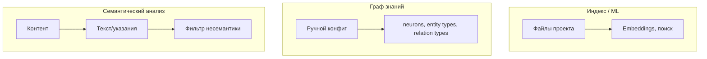

# План: нейроны, семантика, индекс

## Решения (итог сессии)

1. **Граф** — убрать. Система: вопросы + кодовая база (индекс отвечает).
2. **Закон:** Пути не участвуют в контексте. Важно содержимое.
3. **Нейроны:** Активируются только задачей. Управляют контекстом. Всегда действуют.
4. **Поток:** Парсинг документа → отбор семантики → много вопросов → индекс codebase.

---

## Целевая архитектура

```
Документ → Парсинг → Семантика → Вопросы (много) → Индекс → Ответы
```

---

## Фаза A: Отключить graph extraction

- RequestProcessor: убрать `recognizeEntitiesBatch`, `buildAndStoreGraph`
- Убрать `isGraphIncomplete`, `graph_incomplete` + questions
- Результат: `completed` (placeholder для ChatGPT)
- Оставить: `processNewTaskToContext`, нейроны

---

## Фаза B: Нейроны — content-based, всегда действие

- Триггеры по содержимому (FormRequest, extends Model), не по path
- Каждый нейрон при активации: inject / request_files / hint

---

## Фаза C: Семантика → вопросы → индекс

- Слой: парсинг → отбор семантики → много вопросов → поиск в индексе
- semantic-extractor, question-builder, интеграция с индексом

---

## Ссылки

- [docs/neurons-and-paths-law.md](docs/neurons-and-paths-law.md) — закон, поток
- [all-posible-concept-realisations/07-no-graph.md](all-posible-concept-realisations/07-no-graph.md) — выбранный вариант

---

## Диагноз (история)

**Текущая реализация** (entity-recognizer → relation-mapper → graph-store → question-generator) построена под задачу: **полный граф зависимостей проекта** — извлечение entities/relations из кода, итеративный сбор файлов через questions.

**Проблемы:**

- Граф описан как «полный граф зависимостей» — неочевидно, что его нужно настраивать вручную
- Индексы/ML работают — проблем с поиском нет
- Реализация графа — по галлюцинациям (неверная задача)
- Семантический анализ должен вытягивать текст/указания и обходить несемантику из кода — текущий entity-recognizer этого не делает

---

## Разделение ролей




| Компонент                | Назначение                                    | Источник           |
| ------------------------ | --------------------------------------------- | ------------------ |
| **Индекс**               | Поиск по коду, embeddings                     | ML, уже работает   |
| **Граф знаний**          | Ручная настройка: neurons, типы, связи        | LOADING.md, конфиг |
| **Семантический анализ** | Извлечение текста/указаний, обход несемантики | Отдельный слой     |


---

## Что менять

### 1. Документация

- **[docs/graph-wrong-task-diagnosis.md](docs/graph-wrong-task-diagnosis.md)** — диагноз: граф реализован под неверную задачу, разделение Index vs Graph vs Semantic
- **[docs/graph-local-config.md](docs/graph-local-config.md)** — уточнить: граф = только schema (neurons, types), не instance из кода
- **[LOADING.md](LOADING.md)** — явно: entity/relation types — это схема для ручной настройки, не результат entity-recognizer

### 2. Код (поэтапно)

**Фаза A — документ и заморозка:**

- Добавить `docs/graph-wrong-task-diagnosis.md`
- Обновить `graph-local-config.md`: граф = schema, не dependency extraction
- Не трогать entity-recognizer/relation-mapper (пока)

**Фаза B — отделение графа от extraction (позже):**

- RequestProcessor: не вызывать `recognizeEntitiesBatch` / `buildAndStoreGraph` из codeBlocks
- Граф: загрузка из конфига (YAML/JSON) или только schema из LOADING
- Убрать/заменить question-generator (questions про «добавь controller» — часть старой модели)

**Фаза C — семантический анализ (позже):**

- Слой: контент → текст/указания, фильтр несемантики
- Не regex entity extraction

---

## Ключевые файлы


| Файл                                                                                                         | Роль                                                     |
| ------------------------------------------------------------------------------------------------------------ | -------------------------------------------------------- |
| [a2a-server/src/knowledge/entity-recognizer.ts](a2a-server/src/knowledge/entity-recognizer.ts)               | Regex extraction — под задачу «dependency graph»         |
| [a2a-server/src/knowledge/question-generator.ts](a2a-server/src/knowledge/question-generator.ts)             | «Добавь controller» — итеративный сбор под старую модель |
| [a2a-server/src/services/request-processor.service.ts](a2a-server/src/services/request-processor.service.ts) | Вызывает recognizeEntitiesBatch, buildAndStoreGraph      |
| [LOADING.md](LOADING.md)                                                                                     | Entity/relation types — схема для ручной настройки       |


---

## Итог

Граф знаний ≠ полный граф зависимостей проекта. Граф = ручной конфиг (schema). Извлечение entities из кода — неверная задача. Индексы покрывают поиск. Семантический анализ — отдельный слой (текст/указания, без кодовой несемантики).