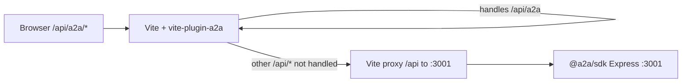

# Client API: Web UI vs `@a2a/sdk` (why results feel inconsistent)

## Two implementations (not one)

| Layer | Code | When it runs |
|--------|------|----------------|
| **Vite dev** | `vite-plugin-a2a.js` + `vite-plugin-a2a/routes/*.js` | `vite` / `dev:local`. Registers Connect middleware; handles `/api/a2a/*` **before** the proxy. |
| **Standalone** | `packages/sdk` Express (`createApp`, `setupRoutes`) | `CLIENT_API_PORT` (e.g. 3001), or when the browser talks only to that process. |

Both can serve **`/api/a2a/sessions/*`**. In `@a2a/sdk`, the same `sessions` router is mounted at **`/api/a2a/sessions`**, **`/api/v1/sessions`**, and **`/api/sessions`** (see `packages/sdk/src/server/server/routes/index.ts`). **`POST .../next`** and **`POST .../action`** follow the same contract: **ack-only** for `/next`; hydrate via **`GET .../sessions/:id`** and poll **`GET .../sessions/:id/promise/:promiseId`**. Verify edge cases when changing either side.

## What the browser actually uses

- `web/js/api-integration.js`, `session-store.js`, `storage.js`, etc. call **`/api/a2a/...`** (relative URLs).
- With **`vite` + plugin**: those requests are satisfied by **vite-plugin-a2a**, not by editing `packages/sdk` unless you remove/avoid the plugin and rely on the proxy to 3001 only.
- `localStorage['a2a_clientApiUrl']` is **not** used to rewrite session URLs in the main path; it is only guarded against corruption in `web/index.html` (reset to `'/api'`).

## Mental model

If the plugin answers `/api/a2a/*`, the proxy **never** reaches the SDK for those paths.

## Web session JSON (Vite plugin)

- **`POST /api/a2a/sessions`** (create): **`{ success, session }`** — aligned between Vite plugin and SDK (SDK responds with **201**). Session id: optional body **`id`**, else **`sess_<timestamp>`**.
- **`POST /api/a2a/sessions/:id/next`** returns an **ack only**: `{ success, accepted, step, promiseId? }`. It does **not** return `session`, `execute`, or `messages`. The web client hydrates from **`GET /sessions/:id`** (and polls **`GET .../promise/:promiseId`** while async).
- **`context` is omitted** on `GET /api/a2a/sessions/:id`, `POST /api/a2a/sessions`, `PUT ...`, and in public session snapshots. Internal step files still store full context (including **`workbench.sections`**) for invoke.
- **Debug only:** append `?includeContext=1` on `GET /sessions/:id`, `GET /sessions/:id/latest`, or `GET .../promise/:id` to receive `context` again.
- **Message sequence:** `GET /api/a2a/sessions/:id` includes `messages[]` with monotonic **`seq`** (1…N) and **`lastMessageSeq`**.
- **Delta polling (fewer full loads):** `GET /api/a2a/sessions/:id/messages?afterSeq=0&limit=50` returns only new messages with `seq > afterSeq`, plus `lastSeq`, `hasMore`, `currentStep`, `promiseId`. Add `&withExecute=1` to also receive current **`execute`** in the same response.
- **`api-integration.js`:** `getSession(id, { includeContext: true })`, `getSessionMessages(id, afterSeq, limit, withExecute)`.

## What to change when debugging

- UI/session bugs in dev → **`vite-plugin-a2a/`** (and `storage/` under `a2a-client`).
- Tests that `import` `packages/sdk/src/server/index.ts` → **SDK** code path.
- Long-term: merge implementations or have the plugin delegate to one shared module (see [MIGRATION-PLAN.md](./MIGRATION-PLAN.md) and [session-architecture-migration.md](./workflows/session-architecture-migration.md)).

## Known gaps & notes (2026-03)

| Issue | Detail |
|--------|--------|
| **Implementation duplication** | Vite plugin and SDK both implement `/api/a2a/sessions/*`; behavior is aligned for create + `/next` + public session DTOs, but keep both in sync when changing routes or DTOs. |
| **`SKIP_AUTH` + session middleware** | `validateSession` skips when `config.skipAuth` so `/api/v1/*` works in tests with `SKIP_AUTH=1`. |
| **Playwright mocks** | E2E helpers use `**/api/a2a/*` (`mock-a2a-client-api.ts`, `mock-api.ts`, `session-panel-smoke`, etc.). |
| **tester `waitForResponse`** | Removed (was polling non-existent `/api/sessions/:id/events`); throws with migration hint. |
| **`@a2a/sdk` entrypoints** | `package.json` exports `./src/*.ts`; production `npm start` uses `dist/` after `npm run build`. Plain `node` needs `tsx` or built `dist`. |
