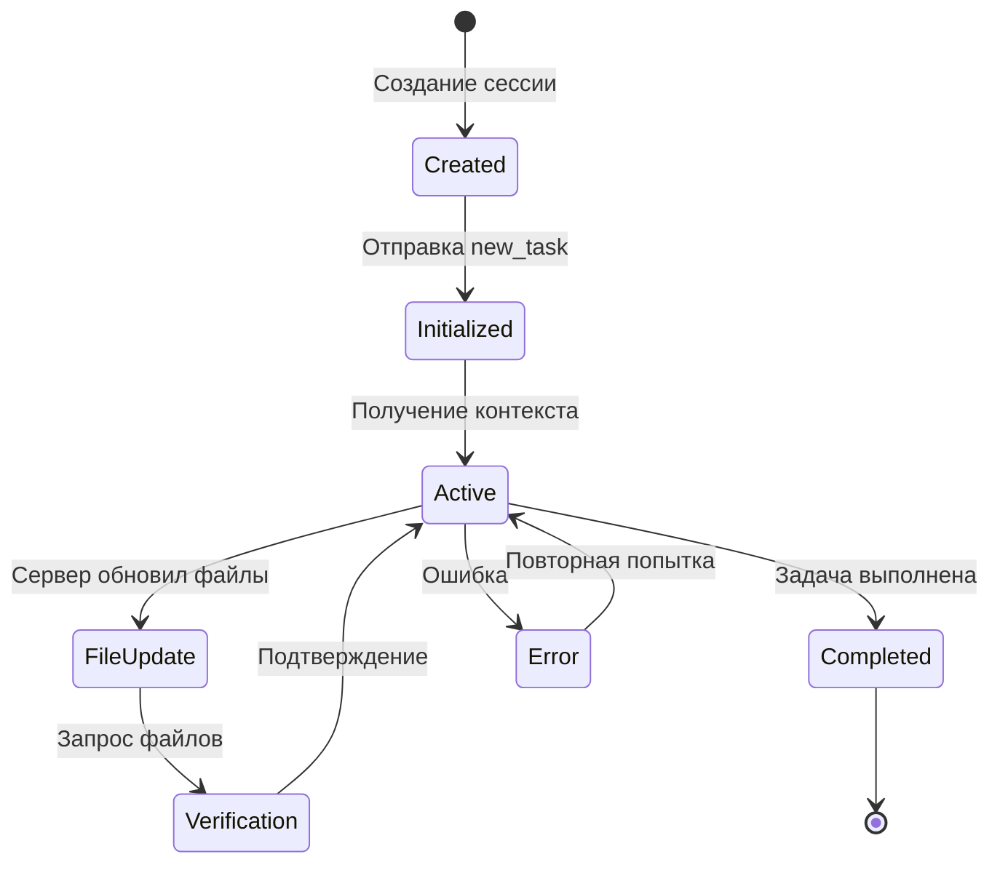
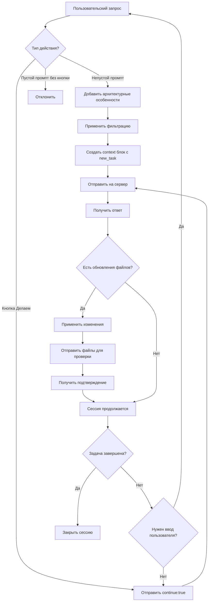
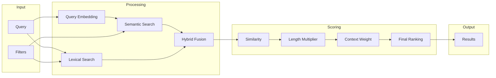

# Требования к A2A (Agent-to-Agent) приложению

**Индекс документации:** [docs/README.md](../../docs/README.md)

## Содержание

1. [Введение и обзор](#1-введение-и-обзор)
2. [Технологический стек анализируемых проектов](#2-технологический-стек-анализируемых-проектов)
3. [Протокол общения с сервером](#3-протокол-общения-с-сервером)
4. [ML модели для анализа кода](#4-ml-модели-для-анализа-кода)
5. [Форматы данных](#5-форматы-данных)
6. [Диаграммы взаимодействия](#6-диаграммы-взаимодействия)
7. [Примеры обмена сообщениями](#7-примеры-обмена-сообщениями)
8. [Метрики качества поиска](#8-метрики-качества-поиска)

---

## 1. Введение и обзор

### 1.1 Назначение приложения

A2A (Agent-to-Agent) приложение — это клиентская система для анализа программных проектов. Приложение работает на стороне клиента и обеспечивает интеллектуальный анализ кодовой базы через диалоговые сессии.

### 1.2 Ключевые функции

- **Анализ проектов по списку** — последовательная или параллельная обработка множества проектов
- **Диалоговые сессии** — открытие и управление сессиями взаимодействия с проектами
- **Интеллектуальный поиск** — ML-основанный поиск и ранжирование релевантного кода
- **Синхронизация файлов** — отслеживание и применение изменений к файлам проекта

### 1.3 Архитектурная схема

```
┌─────────────────────────────────────────────────────────────┐
│                    A2A Client Application                    │
├─────────────────────────────────────────────────────────────┤
│  ┌─────────────┐  ┌─────────────┐  ┌─────────────────────┐  │
│  │  Project    │  │  Session    │  │  ML Search Engine   │  │
│  │  Manager    │  │  Manager    │  │                     │  │
│  └──────┬──────┘  └──────┬──────┘  └──────────┬──────────┘  │
│         │                │                    │              │
│         └────────────────┼────────────────────┘              │
│                          │                                   │
│  ┌───────────────────────┴───────────────────────────────┐  │
│  │              Protocol Handler                          │  │
│  │         - Context Block Processing                     │  │
│  │         - File Block Management                        │  │
│  │         - Message Serialization                        │  │
│  └───────────────────────┬───────────────────────────────┘  │
└──────────────────────────┼──────────────────────────────────┘
                           │
                           │ Markdown Protocol
                           ▼
              ┌────────────────────────┐
              │   A2A Server Agent     │
              └────────────────────────┘
```

---

## 2. Технологический стек анализируемых проектов

### 2.1 Поддерживаемые технологии

Приложение специализируется на анализе проектов со следующим технологическим стеком:

| Технология | Версия | Назначение |
|------------|--------|------------|
| **Laravel** | 11.x | Backend фреймворк |
| **Inertia.js** | Latest | Связка frontend и backend |
| **Vue.js** | 3.x | Frontend фреймворк |
| **Tailwind CSS** | 3.x | CSS фреймворк |
| **i18n** | - | Интернационализация |
| **Vitest** | Latest | Unit тестирование |
| **Playwright** | Latest | E2E тестирование |

### 2.2 Структура типичного проекта

```
project-root/
├── app/                    # Laravel application
│   ├── Http/Controllers/   # Controllers
│   ├── Models/             # Eloquent models
│   └── Services/           # Business logic
├── routes/                 # Route definitions
│   ├── web.php
│   └── api.php
├── resources/
│   ├── js/                 # Vue.js components
│   │   ├── Components/
│   │   ├── Pages/
│   │   └── composables/
│   └── lang/               # i18n translations
├── tests/
│   ├── Unit/               # Vitest unit tests
│   └── E2E/                # Playwright e2e tests
└── tailwind.config.js      # Tailwind configuration
```

### 2.3 Особенности анализа

Приложение должно учитывать специфику стека:

- **Inertia.js** — анализ props, page components, shared data
- **Vue 3** — Composition API, reactive state, lifecycle hooks
- **Laravel 11** — routes, middleware, policies, services
- **Tailwind CSS** — utility classes, custom configurations
- **i18n** — ключи переводов, pluralization, locale switching
- **Vitest** — test coverage, mocking, assertions
- **Playwright** — page objects, selectors, test flows

---

## 3. Протокол общения с сервером

### 3.1 Общая структура протокола

Протокол использует **Markdown блоки** для обмена данными между клиентом и сервером.

**Ключевое правило:** JSON блок контекста присутствует **ВСЕГДА** — как в запросах клиента, так и в ответах сервера.

### 3.2 Типы блоков

| Тип блока | Подпись | Обязательность | Описание |
|-----------|---------|----------------|----------|
| Context | `context` | **Обязательный** | JSON-подобная структура с метаданными и задачами |
| File | `file:<path>` | По запросу | Полное содержимое файла |
| File Part | `file:<path>:<start>-<end>` | По запросу | Часть файла по строкам |

### 3.3 Инициализация сессии

#### 3.3.1 Правила инициализации

1. Клиент отправляет блок контекста с параметром `new_task`
2. `new_task` — массив, содержащий:
   - Текст задачи пользователя
   - Доступные подсказки из индекса
   - **Архитектурные особенности** — нестандартные моменты расположения файлов
3. Данные отправляются **неизбыточно** — применяется фильтрация
4. **Первый промпт не может быть пустым** — требуется текст задачи от пользователя
5. Приложение **НЕ определяет** что отправлять — фильтрация происходит по правилам

#### 3.3.2 Архитектурные особенности проекта

К первому непустому промпту автоматически добавляются **архитектурные особенности** — нестандартные моменты расположения файлов относительно стандартной структуры проекта.

**Что включается:**
- Файлы в нестандартных директориях
- Отсутствие ожидаемых директорий
- Нестандартные именования файлов
- Кастомные структуры модулей

**Пример архитектурных особенностей:**

```json
{
  "architectural_features": [
    "Services расположены в app/Domain/*/Services вместо app/Services",
    "Модели в app/Domain/*/Models вместо app/Models",
    "Отсутствует директория resources/js/Pages — страницы в resources/views/pages",
    "Конфиги в config/domain/* вместо корня config/"
  ]
}
```

**Назначение:**
- Помощь серверу в навигации по нестандартной структуре
- Ускорение поиска релевантных файлов
- Предотвращение ошибок при генерации путей

#### 3.3.3 Условие фильтрации

Фильтрация применяется когда:
- Пользователь отправляет **непустой промпт**
- Система использует предустановленные правила фильтрации
- Нет необходимости в ручном выборе данных

#### 3.3.4 Кнопка "Делаем" — пустой промпт

Для продолжения итерации без ввода данных от пользователя предусмотрена **кнопка "Делаем"**.

**Назначение:**
- Отправка пустого промпта для продолжения работы
- Сервер выполняет следующую итерацию по своему сценарию
- Пользователь не обязан вводить текст на каждом шаге

**Когда используется:**
- Сервер запросил подтверждение
- Итеративное выполнение многошаговой задачи
- Пользователь согласен с предложенными изменениями

**Формат запроса:**

```json
{
  "version": "1.0",
  "session_id": "550e8400-e29b-41d4-a716-446655440000",
  "continue": true
}
```

**Отличие от обычного промпта:**

| Действие | Поле в context | Описание |
|----------|----------------|----------|
| Обычный промпт | `new_task` | Новая задача или уточнение |
| Кнопка "Делаем" | `continue: true` | Продолжить без ввода данных |

### 3.4 Ответ сервера

#### 3.4.1 Структура ответа

1. **Обязательный блок контекста** — JSON с метаданными и задачами
2. **Блоки кода** — обновленные версии файлов (подписаны в блоке)
3. **Запрос файлов** — сервер может затребовать файлы для проверки

#### 3.4.2 Нейроны и данные триггера в контексте

Нейрон не попадает в контекст, если его не триггернуло. В контекст попадают **данные триггера** (matched paths, partial matches) — чтобы на следующей итерации заново триггернуть нейроны и обрабатывать другие данные. Один нейрон — множество триггеров; подозрение строится при неполном сходстве.

#### 3.4.3 Правило верификации изменений

> **Критически важно:** Если сервер обновил файлы, он **ОБЯЗАН** затребовать их для проверки правильности применения правок.

Это обеспечивает:
- Подтверждение корректности изменений
- Обнаружение конфликтов слияния
- Целостность данных проекта

### 3.5 Схема протокола

```
┌──────────────┐                              ┌──────────────┐
│    CLIENT    │                              │    SERVER    │
└──────┬───────┘                              └──────┬───────┘
       │                                             │
       │  ┌─────────────────────────────┐           │
       │  │ ```context                  │           │
       │  │ {                           │           │
       │  │   "new_task": [             │           │
       │  │     "task text",            │           │
       │  │     "hints from index",     │           │
       │  │     "architectural_features"│           │
       │  │   ]                         │           │
       │  │ }                           │           │
       │  │ ```                         │           │
       │  └─────────────────────────────┘           │
       │ ──────────────────────────────────────────►│
       │                                             │
       │                    ┌────────────────────────┤
       │  ┌─────────────────┴─────────────────────┐ │
       │  │ ```context                            │ │
       │  │ {                                     │ │
       │  │   "tasks": [...],                     │ │
       │  │   "request_files": ["path/to/file"]   │ │
       │  │ }                                     │ │
       │  │ ```                                   │ │
       │  │                                       │ │
       │  │ ```file:app/Services/UserService.php │ │
       │  │ // updated content                    │ │
       │  │ ```                                   │ │
       │  └───────────────────────────────────────┘ │
       │ ◄──────────────────────────────────────────│
       │                                             │
       │  ┌─────────────────────────────┐           │
       │  │ КНОПКА "ДЕЛАЕМ"             │           │
       │  │ ```context                  │           │
       │  │ { "tasks": [...] }        │           │
       │  │ ```                         │           │
       │  │                             │           │
       │  │ ```file:app/Services/       │           │
       │  │ UserService.php             │           │
       │  │ // current file content     │           │
       │  │ ```                         │           │
       │  └─────────────────────────────┘           │
       │ ──────────────────────────────────────────►│
       │                                             │
       ▼                                             ▼
```

### 3.6 Режимы взаимодействия

| Режим | Инициирующий действие | Поле context | Описание |
|-------|----------------------|--------------|----------|
| **Новая задача** | Пользователь вводит текст | `new_task` | Начало новой задачи или уточнение |
| **Продолжение** | Кнопка "Делаем" | `continue: true` | Итерация без ввода данных |
| **Подтверждение** | Автоматически после изменений | `confirm: true` | Верификация применённых правок |

---

## 4. ML модели для анализа кода

### 4.1 Архитектура ML компонентов

```
┌─────────────────────────────────────────────────────────────────┐
│                    ML Search Engine                              │
├─────────────────────────────────────────────────────────────────┤
│                                                                  │
│  ┌──────────────────┐  ┌──────────────────┐  ┌───────────────┐  │
│  │  Indexing Layer  │  │  Embedding Layer │  │ Search Layer  │  │
│  │                  │  │                  │  │               │  │
│  │  - Lexer         │  │  - Code Encoder  │  │  - Semantic   │  │
│  │  - Parser        │  │  - Text Encoder  │  │  - Lexical    │  │
│  │  - AST Builder   │  │  - Hybrid Model  │  │  - Hybrid     │  │
│  └────────┬─────────┘  └────────┬─────────┘  └───────┬───────┘  │
│           │                     │                    │          │
│           └─────────────────────┼────────────────────┘          │
│                                 │                               │
│                    ┌────────────┴────────────┐                  │
│                    │    Scoring Engine       │                  │
│                    │                         │                  │
│                    │  - Similarity Score     │                  │
│                    │  - Length Multiplier    │                  │
│                    │  - Context Weighting    │                  │
│                    │  - Final Ranking        │                  │
│                    └─────────────────────────┘                  │
│                                                                  │
└─────────────────────────────────────────────────────────────────┘
```

### 4.2 Модели анализа

#### 4.2.1 Code Embedding Model

**Назначение:** Векторное представление кода для семантического поиска

**Требования:**
- Поддержка PHP (Laravel) и JavaScript/TypeScript (Vue)
- Учет структуры кода (AST-aware)
- Сохранение семантических связей

**Параметры:**
| Параметр | Значение | Описание |
|----------|----------|----------|
| Dimension | 768 | Размерность вектора |
| Max Length | 512 tokens | Максимальная длина входа |
| Normalization | L2 | Нормализация векторов |

#### 4.2.2 Text Embedding Model

**Назначение:** Векторное представление текстовых запросов

**Требования:**
- Мультиязычность (с учетом i18n)
- Понимание технической терминологии
- Поддержка контекстных запросов

#### 4.2.3 Hybrid Search Model

**Назначение:** Комбинация семантического и лексического поиска

**Компоненты:**
- Semantic Search — на основе embeddings
- Lexical Search — BM25, TF-IDF
- Reranker — финальное ранжирование

### 4.3 Алгоритм поиска и оценки Score

#### 4.3.1 Формула ранжирования

```
final_score = base_similarity × length_multiplier × context_weight

где:
  base_similarity = cosine_similarity(query_embedding, code_embedding)
  
  length_multiplier = 1 + log(1 + query_length / base_factor)
  
  context_weight = Σ(context_factors) / count(factors)
```

#### 4.3.2 Принцип ранжирования

> **Ключевой принцип:** Чем длиннее запрос, тем больше баллов умножено на коэффициент сходства.

**Обоснование:**
- Длинные запросы содержат больше контекста
- Высокая специфичность требует большего веса
- Умножение (не сложение) сохраняет значимость similarity

#### 4.3.3 Факторы контекста

| Фактор | Вес | Описание |
|--------|-----|----------|
| File Type Match | 0.1-0.3 | Соответствие типа файла запросу |
| Recency | 0.05-0.15 | Недавние изменения файла |
| Import Graph | 0.1-0.2 | Связи с уже найденными файлами |
| Test Coverage | 0.05-0.1 | Наличие тестов для кода |
| Documentation | 0.05-0.15 | Качество документации |

### 4.4 Поддерживаемые алгоритмы поиска

#### 4.4.1 Семантический поиск

| Алгоритм | Применение |
|----------|------------|
| Cosine Similarity | Основная метрика сходства |
| Euclidean Distance | Альтернативная метрика |
| Dot Product | Быстрое приближение |

#### 4.4.2 Лексический поиск

| Алгоритм | Применение |
|----------|------------|
| BM25 | Классический IR алгоритм |
| TF-IDF | Взвешивание терминов |
| Fuzzy Match | Опечатки и вариации |

#### 4.4.3 Гибридные методы

| Метод | Описание |
|-------|----------|
| Reciprocal Rank Fusion | Объединение рангов |
| Weighted Score Fusion | Взвешенное объединение score |
| Learning to Rank | ML-based ранжирование |

### 4.5 Индексация кода

#### 4.5.1 Структура индекса

```json
{
  "index_version": "1.0",
  "project_hash": "sha256...",
  "files": [
    {
      "path": "app/Services/UserService.php",
      "hash": "sha256...",
      "embeddings": ["vector_id_1", "vector_id_2"],
      "symbols": ["UserService", "createUser", "updateUser"],
      "imports": ["App\\Models\\User", "Illuminate\\Support\\Facades\\DB"],
      "metadata": {
        "lines": 150,
        "language": "php",
        "framework": "laravel",
        "last_modified": "2024-01-15T10:30:00Z"
      }
    }
  ],
  "vectors": {
    "vector_id_1": {
      "embedding": [0.1, 0.2, ...],
      "context": "class UserService",
      "type": "class_definition"
    }
  }
}
```

#### 4.5.2 Гранулярность индексации

| Уровень | Описание | Пример |
|---------|----------|--------|
| File | Весь файл как единица | UserService.php |
| Class/Component | Класс или Vue компонент | class UserService |
| Method/Function | Отдельный метод | createUser() |
| Block | Логический блок кода | validation logic |

---

## 5. Форматы данных

### 5.1 Context Block Schema

```json
{
  "$schema": "http://json-schema.org/draft-07/schema#",
  "type": "object",
  "required": ["version"],
  "properties": {
    "version": {
      "type": "string",
      "const": "1.0",
      "description": "Версия формата контекста"
    },
    "session_id": {
      "type": "string",
      "format": "uuid",
      "description": "Уникальный идентификатор сессии"
    },
    "new_task": {
      "type": "array",
      "items": {
        "type": "string"
      },
      "minItems": 1,
      "description": "Новая задача: текст + подсказки из индекса + архитектурные особенности"
    },
    "architectural_features": {
      "type": "array",
      "items": {
        "type": "string"
      },
      "description": "Нестандартные моменты расположения файлов относительно стандартной структуры"
    },
    "continue": {
      "type": "boolean",
      "description": "Продолжить итерацию без ввода данных от пользователя - кнопка Делаем"
    },
    "tasks": {
      "type": "array",
      "items": {
        "$ref": "#/definitions/Task"
      },
      "description": "Активные задачи от сервера"
    },
    "request_files": {
      "type": "array",
      "items": {
        "type": "string"
      },
      "description": "Запрос файлов от сервера"
    },
    "confirm": {
      "type": "boolean",
      "description": "Подтверждение применения изменений"
    },
    "errors": {
      "type": "array",
      "items": {
        "$ref": "#/definitions/Error"
      },
      "description": "Ошибки обработки"
    }
  },
  "definitions": {
    "Task": {
      "type": "object",
      "required": ["id", "type", "status"],
      "properties": {
        "id": { "type": "string" },
        "type": { 
          "type": "string",
          "enum": ["analyze", "refactor", "test", "document", "fix"]
        },
        "status": {
          "type": "string",
          "enum": ["pending", "in_progress", "completed", "failed"]
        },
        "target": { "type": "string" },
        "progress": { "type": "number", "minimum": 0, "maximum": 100 }
      }
    },
    "Error": {
      "type": "object",
      "required": ["code", "message"],
      "properties": {
        "code": { "type": "string" },
        "message": { "type": "string" },
        "file": { "type": "string" },
        "line": { "type": "integer" }
      }
    }
  }
}
```

### 5.2 File Block Format

#### 5.2.1 Полный файл

```markdown
```file:app/Services/UserService.php
<?php

namespace App\Services;

use App\Models\User;

class UserService
{
    public function createUser(array $data): User
    {
        return User::create($data);
    }
}
```
```

#### 5.2.2 Часть файла

```markdown
```file:app/Services/UserService.php:15-25
    public function createUser(array $data): User
    {
        return User::create($data);
    }
    
    public function updateUser(User $user, array $data): User
    {
        $user->update($data);
        return $user;
    }
```
```

### 5.3 Search Query Format

```json
{
  "query": "найти все методы создания пользователя",
  "filters": {
    "file_types": ["php", "vue"],
    "directories": ["app/Services", "resources/js"],
    "framework": "laravel",
    "exclude": ["tests", "vendor"]
  },
  "options": {
    "limit": 20,
    "min_score": 0.5,
    "include_context": true,
    "highlight_matches": true
  }
}
```

### 5.4 Search Result Format

```json
{
  "results": [
    {
      "file": "app/Services/UserService.php",
      "score": 0.92,
      "matches": [
        {
          "line_start": 15,
          "line_end": 20,
          "content": "public function createUser...",
          "highlight": "<mark>createUser</mark>",
          "context_score": 0.85
        }
      ],
      "metadata": {
        "framework": "laravel",
        "type": "service",
        "last_modified": "2024-01-15T10:30:00Z"
      }
    }
  ],
  "total": 5,
  "query_time_ms": 45,
  "algorithm_used": "hybrid_rrf"
}
```

---

## 6. Диаграммы взаимодействия

### 6.1 Жизненный цикл сессии



### 6.2 Поток обработки запроса



### 6.3 Архитектура поиска



### 6.4 Модель состояний файла

```
┌─────────────────────────────────────────────────────────────┐
│                    File State Machine                        │
├─────────────────────────────────────────────────────────────┤
│                                                              │
│   ┌──────────┐    read     ┌──────────┐                     │
│   │  Pristine │ ──────────►│  Loaded  │                     │
│   └──────────┘             └────┬─────┘                     │
│        ▲                        │                            │
│        │                        │ modify                     │
│        │                        ▼                            │
│   ┌────┴─────┐            ┌──────────┐                      │
│   │  Saved   │ ◄──────────│ Modified │                      │
│   └──────────┘   save     └────┬─────┘                      │
│        ▲                        │                            │
│        │                        │ server_update              │
│        │                        ▼                            │
│        │                 ┌───────────┐                       │
│        └─────────────────│  Updated  │                       │
│            confirm       └───────────┘                       │
│                                                              │
└─────────────────────────────────────────────────────────────┘
```

---

## 7. Примеры обмена сообщениями

### 7.1 Инициализация новой задачи

**Клиент → Сервер:**

```markdown
```context
{
  "version": "1.0",
  "session_id": "550e8400-e29b-41d4-a716-446655440000",
  "new_task": [
    "Добавить валидацию email при регистрации пользователя",
    "hint: UserService.php содержит логику регистрации",
    "hint: RegisterController.php обрабатывает запрос",
    "hint: tests/Unit/UserServiceTest.php имеет примеры тестов"
  ],
  "architectural_features": [
    "Services расположены в app/Domain/User/Services вместо app/Services",
    "Модели в app/Domain/User/Models вместо app/Models",
    "Отсутствует директория app/Http/Controllers — контроллеры в app/Domain/*/Controllers"
  ]
}
```
```

**Сервер → Клиент:**

```markdown
```context
{
  "version": "1.0",
  "session_id": "550e8400-e29b-41d4-a716-446655440000",
  "tasks": [
    {
      "id": "task_001",
      "type": "analyze",
      "status": "in_progress",
      "target": "app/Services/UserService.php",
      "progress": 0
    }
  ],
  "request_files": [
    "app/Services/UserService.php",
    "app/Http/Controllers/Auth/RegisterController.php"
  ]
}
```
```

### 7.2 Отправка запрошенных файлов

**Клиент → Сервер:**

```markdown
```context
{
  "version": "1.0",
  "session_id": "550e8400-e29b-41d4-a716-446655440000"
}
```

```file:app/Services/UserService.php
<?php

namespace App\Services;

use App\Models\User;
use Illuminate\Support\Facades\Validator;

class UserService
{
    public function register(array $data): User
    {
        return User::create($data);
    }
}
```

```file:app/Http/Controllers/Auth/RegisterController.php
<?php

namespace App\Http\Controllers\Auth;

use App\Http\Controllers\Controller;
use App\Services\UserService;
use Illuminate\Http\Request;

class RegisterController extends Controller
{
    public function __construct(
        private UserService $userService
    ) {}
    
    public function __invoke(Request $request)
    {
        $user = $this->userService->register($request->all());
        return redirect()->route('dashboard');
    }
}
```
```

### 7.3 Сервер обновляет файлы

**Сервер → Клиент:**

```markdown
```context
{
  "version": "1.0",
  "session_id": "550e8400-e29b-41d4-a716-446655440000",
  "tasks": [
    {
      "id": "task_001",
      "type": "refactor",
      "status": "in_progress",
      "target": "app/Services/UserService.php",
      "progress": 50
    }
  ],
  "request_files": [
    "app/Services/UserService.php"
  ]
}
```

```file:app/Services/UserService.php
<?php

namespace App\Services;

use App\Models\User;
use Illuminate\Support\Facades\Validator;
use Illuminate\Validation\ValidationException;

class UserService
{
    public function register(array $data): User
    {
        $validator = Validator::make($data, [
            'email' => ['required', 'email', 'unique:users,email'],
            'password' => ['required', 'min:8'],
            'name' => ['required', 'string', 'max:255'],
        ]);
        
        if ($validator->fails()) {
            throw new ValidationException($validator);
        }
        
        return User::create($data);
    }
}
```
```

### 7.4 Клиент подтверждает изменения

**Клиент → Сервер:**

```markdown
```context
{
  "version": "1.0",
  "session_id": "550e8400-e29b-41d4-a716-446655440000",
  "confirm": true
}
```

```file:app/Services/UserService.php
<?php

namespace App\Services;

use App\Models\User;
use Illuminate\Support\Facades\Validator;
use Illuminate\Validation\ValidationException;

class UserService
{
    public function register(array $data): User
    {
        $validator = Validator::make($data, [
            'email' => ['required', 'email', 'unique:users,email'],
            'password' => ['required', 'min:8'],
            'name' => ['required', 'string', 'max:255'],
        ]);
        
        if ($validator->fails()) {
            throw new ValidationException($validator);
        }
        
        return User::create($data);
    }
}
```
```

### 7.5 Использование кнопки "Делаем"

**Сценарий:** Сервер выполнил часть работы и ожидает продолжения. Пользователь нажимает кнопку "Делаем" для продолжения без ввода данных.

**Клиент → Сервер:**

```markdown
```context
{
  "version": "1.0",
  "session_id": "550e8400-e29b-41d4-a716-446655440000",
  "continue": true
}
```
```

**Сервер → Клиент:**

```markdown
```context
{
  "version": "1.0",
  "session_id": "550e8400-e29b-41d4-a716-446655440000",
  "tasks": [
    {
      "id": "task_001",
      "type": "refactor",
      "status": "in_progress",
      "target": "app/Domain/User/Services/UserService.php",
      "progress": 75
    }
  ],
  "request_files": [
    "app/Domain/User/Services/UserService.php"
  ]
}
```

Продолжаю работу над валидацией. Добавляю обработку ошибок валидации.
```

### 7.6 Завершение задачи

**Сервер → Клиент:**

```markdown
```context
{
  "version": "1.0",
  "session_id": "550e8400-e29b-41d4-a716-446655440000",
  "tasks": [
    {
      "id": "task_001",
      "type": "refactor",
      "status": "completed",
      "target": "app/Services/UserService.php",
      "progress": 100
    },
    {
      "id": "task_002",
      "type": "test",
      "status": "completed",
      "target": "tests/Unit/UserServiceTest.php",
      "progress": 100
    }
  ]
}
```

Добавлена валидация email при регистрации:

1. **UserService.php** — добавлен метод валидации с правилами:
   - `email`: required, email, unique
   - `password`: required, min:8
   - `name`: required, string, max:255

2. **UserServiceTest.php** — добавлены тесты:
   - `test_registration_with_valid_email`
   - `test_registration_fails_with_invalid_email`
   - `test_registration_fails_with_duplicate_email`
```

---

## 8. Метрики качества поиска

### 8.1 Основные метрики

| Метрика | Формула | Целевое значение |
|---------|---------|------------------|
| **Precision@K** | relevant_in_top_k / k | ≥ 0.85 |
| **Recall@K** | relevant_in_top_k / total_relevant | ≥ 0.75 |
| **MRR** | Σ(1 / rank_i) / n | ≥ 0.80 |
| **NDCG** | DCG / IDCG | ≥ 0.85 |
| **Latency P95** | 95-й перцентиль времени | ≤ 100ms |

### 8.2 Метрики ранжирования

#### 8.2.1 Mean Reciprocal Rank (MRR)

```
MRR = (1/|Q|) × Σ(1/rank_i)

где:
  Q — множество запросов
  rank_i — позиция первого релевантного результата для запроса i
```

#### 8.2.2 Normalized Discounted Cumulative Gain (NDCG)

```
DCG@k = Σ(rel_i / log2(i + 1)) for i = 1 to k
NDCG@k = DCG@k / IDCG@k

где:
  rel_i — релевантность результата на позиции i
  IDCG — идеальный DCG при идеальном ранжировании
```

### 8.3 Метрики для A2A контекста

| Метрика | Описание | Цель |
|---------|----------|------|
| **Context Relevance** | Релевантность контекста задаче | ≥ 0.90 |
| **File Coverage** | Доля найденных релевантных файлов | ≥ 0.80 |
| **False Positive Rate** | Доля нерелевантных в результатах | ≤ 0.10 |
| **Query Understanding** | Корректность интерпретации запроса | ≥ 0.95 |

### 8.4 Мониторинг качества

#### 8.4.1 Логирование метрик

```json
{
  "timestamp": "2024-01-15T10:30:00Z",
  "query_id": "q_550e8400",
  "metrics": {
    "precision_at_5": 0.80,
    "precision_at_10": 0.70,
    "recall_at_10": 0.85,
    "mrr": 0.90,
    "ndcg_at_10": 0.88,
    "latency_ms": 45
  },
  "algorithm": "hybrid_rrf",
  "query_length": 25,
  "results_count": 10
}
```

#### 8.4.2 A/B тестирование алгоритмов

| Параметр | Значение |
|----------|----------|
| Минимальный размер выборки | 1000 запросов |
| Доверительный интервал | 95% |
| Минимальный эффект | 2% improvement |
| Метрики для сравнения | NDCG@10, Latency P95 |

### 8.5 Качество индексации

| Метрика | Описание | Цель |
|---------|----------|------|
| **Index Freshness** | Время от последнего обновления | ≤ 5 минут |
| **Index Completeness** | Доля проиндексированных файлов | 100% |
| **Embedding Quality** | Качество векторных представлений | Cosine similarity ≥ 0.7 для похожих |

---

## Приложение A: Глоссарий

| Термин | Определение |
|--------|-------------|
| **A2A** | Agent-to-Agent — протокол взаимодействия между агентами |
| **Context Block** | Обязательный JSON блок с метаданными сессии |
| **File Block** | Markdown блок с содержимым файла |
| **Embedding** | Векторное представление кода или текста |
| **Semantic Search** | Поиск по смыслу, а не по ключевым словам |
| **Lexical Search** | Классический поиск по ключевым словам |
| **Hybrid Search** | Комбинация семантического и лексического поиска |
| **Reranking** | Переранжирование результатов для улучшения качества |
| **NDCG** | Normalized Discounted Cumulative Gain — метрика качества ранжирования |
| **MRR** | Mean Reciprocal Rank — средний обратный ранг |

---

## Приложение B: Ссылки

- [Laravel 11 Documentation](https://laravel.com/docs/11.x)
- [Inertia.js Documentation](https://inertiajs.com/)
- [Vue 3 Documentation](https://vuejs.org/)
- [Tailwind CSS Documentation](https://tailwindcss.com/)
- [Vitest Documentation](https://vitest.dev/)
- [Playwright Documentation](https://playwright.dev/)

---

**Версия документа:** 1.0  
**Дата создания:** 2026-02-19  
**Статус:** Черновик
