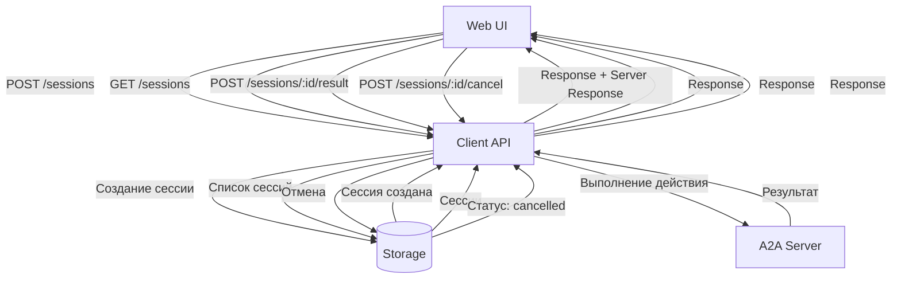

# Протоколы управления сессиями на Web UI

## Обзор

Документация по протоколам управления сессиями между Web UI и Client API.

## Существующие API Endpoints

### Sessions API

| Метод | Endpoint | Описание |
|-------|----------|----------|
| GET | `/api/sessions` | Получить список всех сессий |
| POST | `/api/sessions` | Создать новую сессию |
| GET | `/api/sessions/:sessionId` | Получить сессию по ID |
| PATCH | `/api/sessions/:sessionId` | Обновить сессию |
| DELETE | `/api/sessions/:sessionId` | Удалить сессию |
| DELETE | `/api/sessions` | Удалить несколько сессий |
| GET | `/api/sessions/:sessionId/messages` | Получить сообщения сессии |
| POST | `/api/sessions/:sessionId/messages` | Добавить сообщение |
| GET | `/api/sessions/:sessionId/metadata` | Получить метаданные |
| POST | `/api/sessions/:sessionId/action` | Отправить действие |
| POST | `/api/sessions/:sessionId/next` | Следующий шаг |
| POST | `/api/sessions/:sessionId/result` | Отправить результат |
| POST | `/api/sessions/:sessionId/cancel` | Отменить сессию |
| GET | `/api/sessions/updates` | Получить обновления (polling) |

### Projects API

| Метод | Endpoint | Описание |
|-------|----------|----------|
| GET | `/api/projects` | Получить список проектов |
| POST | `/api/projects` | Создать проект |
| DELETE | `/api/projects/:projectId` | Удалить проект |
| GET | `/api/projects/:projectId/files/*` | Получить файлы проекта |
| PUT | `/api/projects/:projectId/files/*` | Записать файл проекта |

---

## Протоколы взаимодействия Web ↔ Client API

### 1. Создание сессии

**Request (Web → Client API):**
```json
POST /api/sessions
{
  "title": "My Session",
  "task": "исправить импорты",
  "projectId": "proj_12345"
}
```

**Response (Client API → Web):**
```json
{
  "success": true,
  "data": {
    "id": "sess_abc123",
    "status": "active",
    "title": "My Session",
    "task": "исправить импорты",
    "projectId": "proj_12345",
    "startTime": "2024-01-01T00:00:00.000Z",
    "endTime": null,
    "progress": 0,
    "totalSteps": 0,
    "currentStep": null,
    "context": {},
    "history": [],
    "messages": [],
    "metadata": {
      "createdAt": "2024-01-01T00:00:00.000Z",
      "updatedAt": "2024-01-01T00:00:00.000Z"
    }
  },
  "serverResponse": {
    "context": { "task": "исправить импорты" },
    "execute": {
      "form": {
        "title": "Оберіть спосіб виконання",
        "choices": [
          { "id": "fix-vue-imports", "label": "Виправити імпорти" },
          { "id": "auto-ai", "label": "AI Assistant" }
        ]
      }
    }
  }
}
```

### 2. Получение списка сессий

**Request:**
```json
GET /api/sessions?projectId=proj_12345
```

**Response:**
```json
{
  "success": true,
  "data": [
    {
      "id": "sess_abc123",
      "status": "active",
      "title": "My Session",
      "task": "исправить импорты",
      "progress": 50,
      "currentStep": "vue-import-resolve",
      "startTime": "2024-01-01T00:00:00.000Z"
    }
  ]
}
```

### 3. Выбор действия (form.choices)

**Web → Client API:**
```json
POST /api/sessions/sess_abc123/result
{
  "result": {
    "choice": "fix-vue-imports"
  }
}
```

**Client API → Web:**
```json
{
  "success": true,
  "serverResponse": {
    "context": {
      "task": "исправить импорты",
      "execution": {
        "action": "fix-vue-imports",
        "step": "vue-import-detect"
      }
    },
    "execute": {
      "script": {
        "input": {},
        "output": "broken_imports",
        "code": "..."
      }
    }
  }
}
```

### 4. Отправка формы сообщения

**Web → Client API:**
```json
POST /api/sessions/sess_abc123/result
{
  "result": {
    "message": "привет, мне нужна помощь"
  }
}
```

### 5. Отмена сессии

**Web → Client API:**
```json
POST /api/sessions/sess_abc123/cancel
```

**Response:**
```json
{
  "success": true,
  "data": {
    "id": "sess_abc123",
    "status": "cancelled",
    "endTime": "2024-01-01T00:05:00.000Z"
  }
}
```

### 6. Polling обновлений

**Web → Client API:**
```json
GET /api/sessions/updates?sessionIds=sess_abc123,sess_def456
```

**Response:**
```json
{
  "success": true,
  "data": [
    {
      "sessionId": "sess_abc123",
      "status": "in_progress",
      "progress": 75,
      "currentStep": "vue-import-write",
      "hasUpdates": true,
      "lastUpdate": "2024-01-01T00:02:00.000Z"
    }
  ]
}
```

---

## Требующиеся расширения протоколов

### 1. Сессии

| Протокол | Описание | Статус |
|----------|----------|--------|
| Session Pause/Resume | Приостановка и возобновление сессии | ❌ Не реализовано |
| Session Clone | Клонирование сессии с новым ID | ❌ Не реализовано |
| Session Export | Экспорт сессии в файл | ❌ Не реализовано |
| Session Import | Импорт сессии из файла | ❌ Не реализовано |
| Batch Operations | Групповые операции | 🔶 Частично (DELETE) |
| Session History | Полная история изменений | ❌ Не реализовано |
| Session Notes | Пользовательские заметки | ❌ Не реализовано |

### 2. Projects

| Протокол | Описание | Статус |
|----------|----------|--------|
| Project Clone | Клонирование проекта | ❌ Не реализовано |
| Project Export | Экспорт проекта | ❌ Не реализовано |
| Project Import | Импорт проекта | ❌ Не реализовано |
| Project Settings | Настройки проекта | ❌ Не реализовано |

### 3. Communication

| Протокол | Описание | Статус |
|----------|----------|--------|
| WebSocket Connection | Постоянное соединение | 🔶 Частично (SSE) |
| Real-time Typing | Индикация набора | ❌ Не реализовано |
| Push Notifications | Push уведомления | ❌ Не реализовано |

---

## Mermaid: Поток управления сессиями



---

## Форматы данных

### Session Status

```typescript
type SessionStatus = 
  | 'pending'     // Ожидает выбора действия
  | 'ready'       // Действие выбрано
  | 'in_progress' // Выполняется
  | 'waiting_confirmation' // Ожидает подтверждения
  | 'completed'   // Завершено
  | 'error'       // Ошибка
  | 'cancelled';  // Отменено
```

### Session Summary

```typescript
interface SessionSummary {
  id: string;
  status: SessionStatus;
  title: string;
  task?: string;
  progress: number;
  currentStep?: string;
  startTime: string;
  endTime?: string;
}
```

### Session Detail

```typescript
interface SessionDetail extends SessionSummary {
  projectId?: string;
  totalSteps: number;
  context: Record<string, unknown>;
  history: Message[];
  messages: Message[];
  connections: number;
  metadata: SessionMetadata;
}
```

---

## Файловая структура шагов сессии

> **Подробнее:** см. [`api-client-server-logic.md`](api-client-server-logic.md)

### Директория шага

Каждый шаг сессии хранится в отдельной папке `{STEP}/` внутри директории сессии, обычно `a2a-client/storage/sessions/{SESSION_ID}/` (или `A2A_CLIENT_STORAGE_DIR/sessions`):

```
storage/sessions/{SESSION_ID}/
├── {N}/
│   ├── messages.json           # История сообщений для шага N
│   ├── client-result.json      # Результат от Web клиента
│   └── request-to-server.json  # Payload для шага N+1
├── {N+1}/
│   ├── server-response.json    # Ответ A2A Server для шага N+1
│   └── messages.json
├── {N+2}/
│   └── server-promise.json     # Promise metadata если ответ async
└── ...
```

### Логика обработки шага

1. На шаге `N` хранится `server-response.json` и `messages.json`.
2. Когда Web UI присылает `client-result` (message/choice), оно сохраняется как `{N}/client-result.json`.
3. Client API собирает `request-to-server.json` в `{N+1}/` и отправляет `POST /invoke`.
4. Если ответ синхронный, `server-response.json` попадает в `{N+1}/` и `stepNum` увеличивается на 1.
5. Если ответ вернул `promiseId`, `server-promise.json` создаётся в `{N+2}/`, `stepNum` переносится туда, а UI опрашивает `/sessions/:id/promise/:promiseId` до `completed`, после чего финальный `server-response.json` сохраняется в том же шаге.

### Типы обработки

| Тип | Описание |
|-----|----------|
| Auto | Скрипт/симуляция автоматически пишет результат и отправляет запрос |
| Manual | Ожидание ввода от пользователя через Web UI (form.input/form.choices) |
| Hybrid | Сценарий автоматически продолжает после ожидания или таймаута |

---

## References

- [API-CLIENT.md](../API-CLIENT.md)
- [SCHEMAS.md](../SCHEMAS.md)
- [DATA-FLOW.md](../DATA-FLOW.md)
- [api-client-server-logic.md](api-client-server-logic.md) - Логика работы API клиент сервера
- [server/index.ts (SDK)](../../a2a-client/packages/sdk/src/server/index.ts)
- [session-service.ts](../../a2a-client/packages/sdk/src/server/services/session-service.ts)
