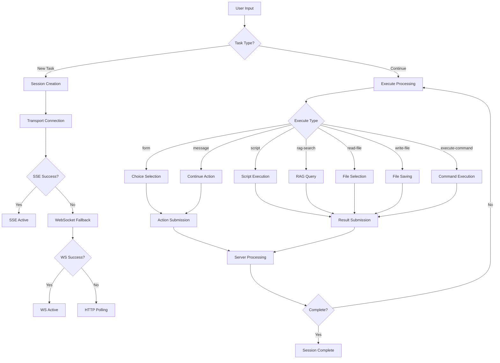

# A2A Web Client Workflows & Scenarios

This directory contains comprehensive documentation of all user workflows and system scenarios in the A2A Script Agent web client.

## Directory Structure

### Core Workflows
- **[Session Lifecycle](./session-lifecycle/)** - Session creation, management, switching, and deletion
- **[Task Execution](./task-execution/)** - Task submission and execution flows
- **[Communication](./communication/)** - Real-time data transport and fallback mechanisms
- **[UI Interactions](./ui-interactions/)** - Panel management and user interface workflows

### Quality Assurance
- **[Testing](./testing/)** - Test scenarios, validation workflows, and reliability checks

## Related Documentation

### Architecture & Implementation
- **[Unified Architecture Complete](./UNIFIED_ARCHITECTURE_COMPLETE.md)** - Implementation status of major refactoring steps (Stateless + Unified Transport)
- **[Session Architecture Migration](./session-architecture-migration.md)** - Migration guide for unified session architecture
- **[Context Synchronization Guide](./context-synchronization-guide.md)** - How components handle state synchronization

## Key Scenarios Overview

### 1. Session Management Scenarios
| Scenario | Description | Entry Points | Key Components |
|----------|-------------|--------------|----------------|
| **Session Creation** | User submits task → session initialized | Task input form, API calls | SessionStore, TransportManager |
| **Session Switching** | User switches between active sessions | Session panel, navigation | SessionManager, PanelManager |
| **Session Deletion** | User removes completed/error sessions | Session controls, cleanup | SessionStore, UI cleanup |
| **Project Context** | Sessions grouped by projects | Project selector, filtering | Project API, session grouping |

### 2. Task Execution Scenarios
| Execute Type | User Interaction | Result Action | Components |
|--------------|------------------|---------------|------------|
| **form** | Choice selection via buttons | `sendChoice()` → server | ActionHandler, UI forms |
| **message** | Continue button click | `sendMessageResult()` → server | ActionHandler, message display |
| **script** | Client-side JavaScript execution | Submit result object | ScriptRunner, sandbox |
| **rag-search** | RAG query execution | Submit search results | RagSearch, vector DB |
| **read-file** | File selection dialog | Submit file content | FileSelector, FS API |
| **write-file** | Save file dialog | Submit write confirmation | FileSaver, FS API |
| **execute-command** | Shell command execution | Submit command output | Terminal, process execution |

### 3. Communication Scenarios
| Transport | Trigger | Fallback | Reliability |
|-----------|---------|----------|-------------|
| Transport | Trigger | Fallback | Reliability |
|-----------|---------|----------|-------------|
| **SSE Primary** | Session connection | WebSocket | Heartbeat every 30s |
| **WebSocket** | SSE failure | HTTP Polling | Bidirectional fallback |
| **HTTP Polling** | Fallback / Stateless | Manual/Auto | Async polling via `/async` |
| **Reconnection** | Network interruption | Exp. backoff | Auto-recovery <5s |

### 4. UI Interaction Scenarios
| Component | States | Transitions | Persistence |
|-----------|--------|-------------|-------------|
| **Panels** | visible ↔ minimized ↔ closed | User actions + SSE updates | Layout saved to localStorage |
| **Cubes** | Represent minimized panels | Color-coded by type | Position persistence |
| **Modals** | Settings, Projects, Alerts | Overlay display | No persistence needed |
| **Progress** | Step indicators, progress bars | SSE context updates | Tied to execution state |

### 5. Testing Scenarios
| Test Type | Coverage | Automation | Validation |
|-----------|----------|------------|------------|
| **Smoke Tests** | Service health + basic UI | PowerShell scripts | Manual verification |
| **SSE Reliability** | Connection, heartbeat, reconnection | Playwright e2e | Automated assertions |
| **Cross-browser** | Chrome, Firefox, Safari, Edge | Playwright matrix | UI consistency |
| **Load Testing** | Multiple concurrent sessions | Custom scripts | Performance metrics |

## Workflow State Machine

## Error Handling Scenarios

| Error Type | Trigger | Recovery | User Experience |
|------------|---------|----------|-----------------|
| **Network Failure** | Connection lost | Auto-reconnection with backoff | Progress preserved, seamless recovery |
| **SSE Blocked** | CORS/Network policy | WebSocket fallback | Transparent transport switch |
| **Session Error** | Server processing failure | Error display + retry option | Clear error messaging |
| **UI State Corruption** | Race conditions | State reset + reload | Graceful degradation |

## Performance Scenarios

| Scenario | Target | Monitoring | Optimization |
|----------|--------|------------|--------------|
| **Initial Load** | <3s page load | Bundle size, asset loading | Code splitting, lazy loading |
| **Session Switch** | <1s UI update | Transport latency, rendering | State management, caching |
| **SSE Heartbeat** | <30s intervals | Network monitoring | Connection pooling |
| **Panel Operations** | <100ms transitions | DOM manipulation | Virtual scrolling, efficient updates |

## Security Scenarios

| Component | Threat | Protection | Validation |
|-----------|--------|------------|------------|
| **Client Scripts** | Code injection | Sandboxed execution | Input validation, timeout limits |
| **File Operations** | Path traversal | Restricted file access | Path sanitization, allowlists |
| **API Communication** | MITM attacks | HTTPS only | Certificate validation |
| **Session Data** | Unauthorized access | Encrypted storage | Authentication checks |

---

*This documentation provides the complete reference for all A2A web client workflows and scenarios. Each subdirectory contains detailed flow documentation with code examples and validation criteria.*