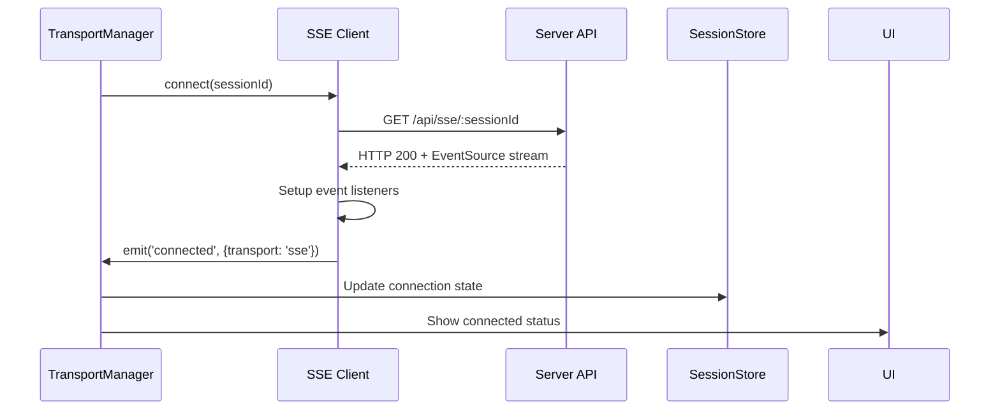
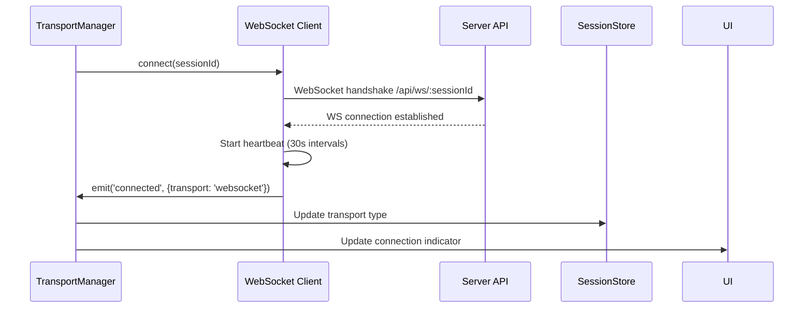
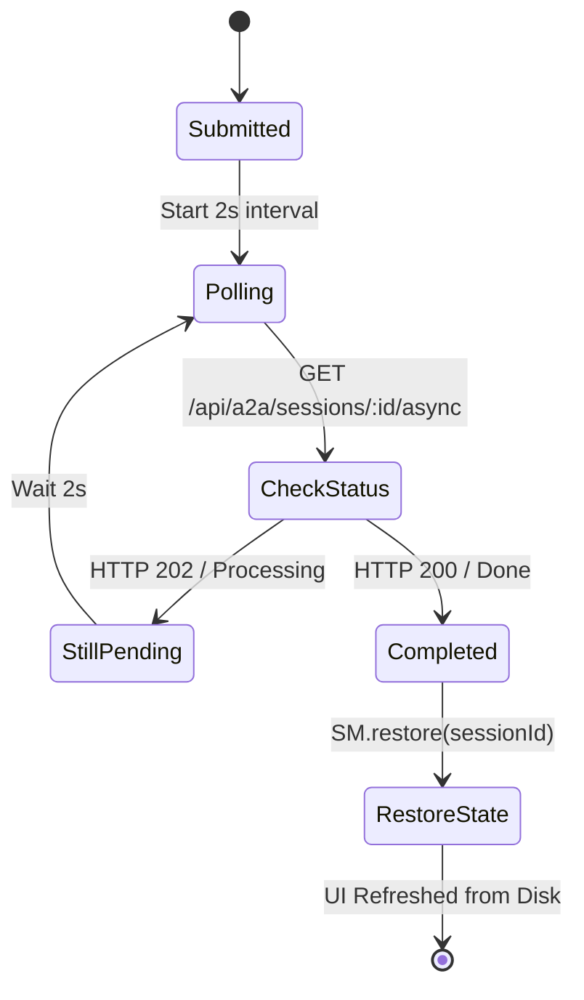
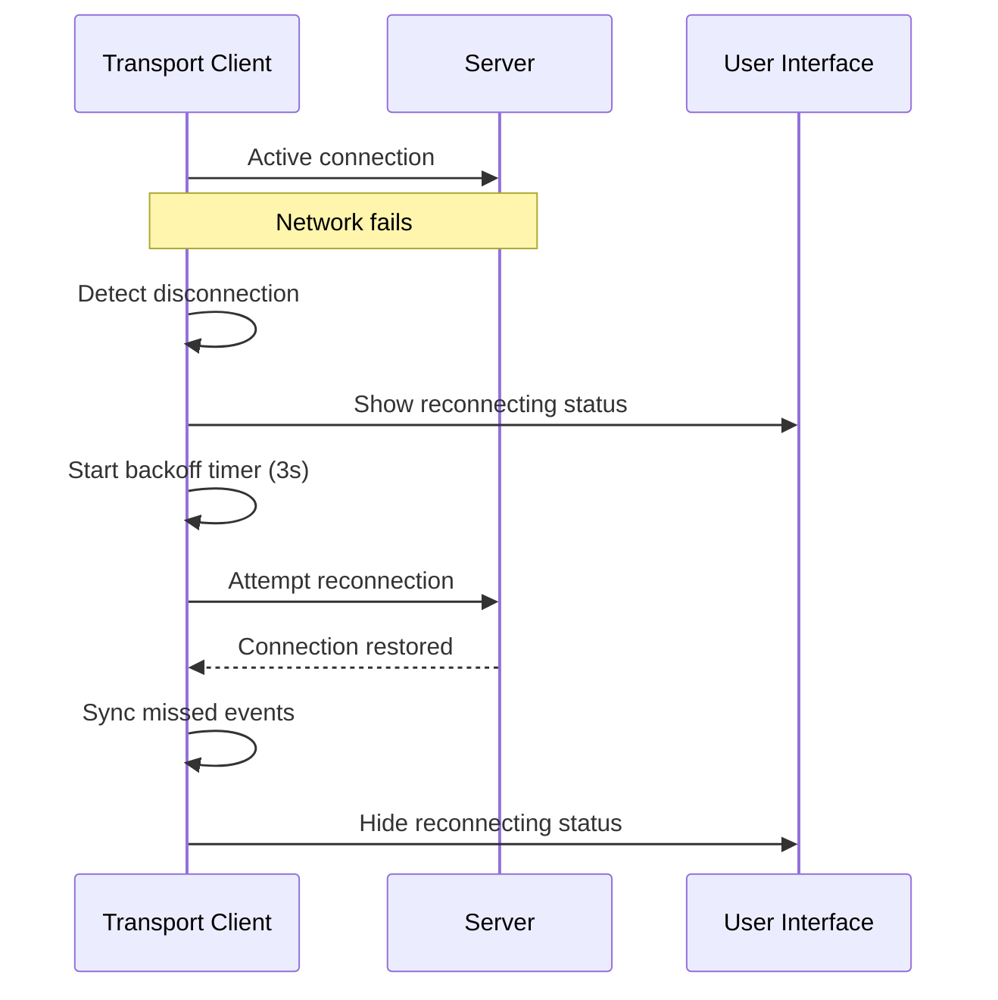

# Communication Scenarios

This directory documents all real-time communication workflows, transport mechanisms, and fallback scenarios.

## Related Documentation

- **[Session Architecture Migration](../session-architecture-migration.md)** - Transport layer changes and fallback implementation
- **[Agent Architecture Tasks](../tasks/agent-architecture-tasks.md)** - SSE vs WebSocket decision log and transport policy
- **[UNIFIED_ARCHITECTURE_COMPLETE](../UNIFIED_ARCHITECTURE_COMPLETE.md)** - Transport strategy implementation (SSE primary, WebSocket fallback)
- **[Web UI DEV_STATE](../../DEV_STATE.md)** - Transport endpoints and connection details

## Transport Hierarchy

### Unified Transport Hierarchy
```mermaid
graph TD
    A[Invoke Submitted] --> B[TransportManager.monitor()]
    B --> C[Try WebUI SSE First]
    C --> D{SSE Success?}
    D -->|Yes| E[SSE Active - /api/sse/:sessionId]
    D -->|No| F[WebSocket Fallback]
    F --> G{WS Success?}
    G -->|Yes| H[WebSocket Active - /api/ws/:sessionId]
    G -->|No| I[Stateless Async Polling]
    I --> J[Poll /api/a2a/sessions/:id/async]
```
| Transport | Protocol | Endpoint | Reliability | Use Case |
|-----------|----------|----------|-------------|----------|
| **SSE** | HTTP/1.1 + EventSource | `/api/sse/:sessionId` | High | Primary real-time updates |
| **WebSocket** | WS/WSS | `/api/ws/:sessionId` | High | Fallback for complex environments |
| **Async Polling** | HTTP/1.1 | `/api/a2a/sessions/:id/async` | Critical | Web UI stateless fallback |
| **Legacy Result**| HTTP/1.1 | `/api/v1/requests/:id/result`| Tooling | Testing and external SDKs |

## SSE Communication Flow

### Connection Establishment


### SSE Event Types

| Event Type | Server Trigger | Data Structure | Client Action |
|------------|----------------|----------------|---------------|
| **message** | Assistant response | `{content, role, timestamp}` | Append to conversation |
| **task_response** | Execute update | `{context, execute, messages}` | Update session state |
| **session_update** | Context change | `{context, execute}` | Update session data |
| **progress** | Step progress | `{progress, action, step}` | Update progress UI |
| **status** | Status change | `{context, execute}` | Update execution status |
| **interrupt** | Recursive LLM loop | `{context, interrupt: true}` | Show "Thinking" state / Wait |
| **complete** | Task completion | `{context, execute, result}` | Show completion |
| **error** | Processing error | `{message, error}` | Display error |
| **heartbeat** | Keepalive | `{type: "ping", timestamp}` | Reset watchdog timer |

### Heartbeat Monitoring
```javascript
// SSE heartbeat pattern
data: {"type": "heartbeat", "timestamp": 1647123456789}
```

- **Interval**: Every 30 seconds
- **Timeout**: 35 seconds (5s grace period)
- **Action on timeout**: Mark connection degraded
- **Recovery**: Auto-reconnect triggers new heartbeat

## WebSocket Fallback Flow

### Fallback Trigger Conditions
```
SSE Connection Fails Due To:
├── Network timeout (>5s)
├── CORS blocking
├── Firewall restrictions
├── HTTP/2 incompatibility
└── Server-side SSE issues
```

### WebSocket Connection Sequence


### WebSocket Message Format
```javascript
// Bidirectional messaging
{
  type: "session_update",
  sessionId: "sess_123",
  data: {
    context: {...},
    execute: {...}
  }
}
```

## HTTP Polling Fallback

### Stateless Async Polling (/async)


### Polling Specifications
- **Optimized Route**: `/api/a2a/sessions/:id/async` is the preferred route for Web UI. It is stateless and checks the backend promise registry.
- **Interval**: 2.5 seconds (aggressive for UI responsiveness).
- **Graceful Recovery**: If polling detects a completed promise, it triggers a full session reload from the file system (N+1).

### Server Interrupt Loop
The server may trigger an internal recursive loop (see `docs/adr/ADR-0029-server-interrupt-loop.md`) for complex reasoning.

- **Client Feedback**: The server sends a status update with `interrupt: true`.
- **UI Action**: The client should maintain the "Processing" state and display a "Thinking..." indicator or progress update.
- **Completion**: The final response arrives via a standard `complete` or `task_response` event once the interrupt loop finishes.

## Reconnection Scenarios

### Network Interruption Recovery


### Backoff Strategy
| Attempt | Delay | Total Time |
|---------|-------|------------|
| 1 | 3s | 3s |
| 2 | 6s | 9s |
| 3 | 12s | 21s |
| 4 | 24s | 45s |
| 5 | 30s | 75s |
| 6+ | 30s | Continues at 30s |

### State Synchronization on Reconnect
- **Event replay**: Server sends recent events
- **Context sync**: Full context state transfer
- **UI update**: Seamless transition without data loss
- **Progress preservation**: Execution state maintained

## Error Scenarios

### Transport Degradation
```
Connection unstable → Frequent reconnects → Show warning indicator → Continue operation
```

### Complete Transport Failure
```
All transports fail → Show offline mode → Queue actions → Retry on reconnection
```

### Server-Side Errors
```
SSE/WebSocket return errors → Fallback to next transport → Log error for debugging
```

### Message Corruption
```
Malformed JSON received → Skip invalid message → Log warning → Continue processing
```

## Connection State Management

### Connection States
```javascript
enum ConnectionState {
  DISCONNECTED = 'disconnected',     // No connection attempt
  CONNECTING = 'connecting',         // Establishing connection
  CONNECTED = 'connected',           // Active connection
  RECONNECTING = 'reconnecting',     // Recovering from failure
  DEGRADED = 'degraded',             // Unstable connection
  FAILED = 'failed'                  // All transports failed
}
```

### State Transitions
| From State | To State | Trigger | UI Action |
|------------|----------|---------|-----------|
| DISCONNECTED | CONNECTING | Session created | Show connecting spinner |
| CONNECTING | CONNECTED | Connection success | Show connected indicator |
| CONNECTED | RECONNECTING | Connection lost | Show reconnecting message |
| RECONNECTING | CONNECTED | Reconnect success | Hide reconnecting message |
| CONNECTED | DEGRADED | Heartbeat timeout | Show warning indicator |
| DEGRADED | CONNECTED | Heartbeat received | Hide warning |
| Any | FAILED | Max retries exceeded | Show offline mode |

## Message Ordering & Deduplication

### Event Ordering Requirements
- Messages must arrive in chronological order
- Context updates must be monotonic (progress increases)
- Duplicate events must be detected and ignored
- Out-of-order events trigger reconciliation

### Deduplication Strategy
```javascript
// Event ID based deduplication
const eventKey = `${event.type}_${event.timestamp}_${event.sequenceId}`;
if (processedEvents.has(eventKey)) {
  return; // Skip duplicate
}
processedEvents.add(eventKey);
```

## Performance Optimization

### Connection Pooling
- Single SSE/WebSocket per session
- Reuse connections across tab refreshes
- Automatic cleanup on session deletion
- Resource limits: max 10 concurrent connections

### Bandwidth Optimization
- **Compression**: Server-sent events compressed
- **Batching**: Multiple updates in single message
- **Filtering**: Client-side event filtering
- **Caching**: Context state cached locally

### Memory Management
- Event buffer limits (1000 events max)
- Automatic cleanup of old events
- Context size limits (10MB max)
- Garbage collection on session switch

## Monitoring & Debugging

### Connection Metrics
- Connection attempt success rate (>99.9%)
- Average reconnection time (<5s)
- Transport fallback frequency (<1%)
- Message delivery latency (<100ms)

### Debug Information
```javascript
// Transport debug info
{
  sessionId: "sess_123",
  connectionState: "connected",
  activeTransport: "sse",
  connectionTime: 1647123456789,
  reconnectCount: 0,
  lastHeartbeat: 1647123486789,
  messageCount: 42
}
```

## Validation Criteria

### SSE Tests
- [ ] SSE connects within 5 seconds
- [ ] Heartbeat received every 30 seconds
- [ ] Events processed in correct order
- [ ] Reconnection completes within 3 seconds
- [ ] Fallback to WebSocket when SSE blocked

### WebSocket Tests
- [ ] WebSocket connects when SSE fails
- [ ] Bidirectional messaging works
- [ ] Heartbeat mechanism functional
- [ ] Automatic fallback to polling

### Polling Tests
- [ ] HTTP polling starts after transport failure
- [ ] Status polling works at 5s intervals
- [ ] Result fetching succeeds
- [ ] Timeout handling correct

### Reconnection Tests
- [ ] Network interruption recovery works
- [ ] Backoff timing correct
- [ ] State synchronization on reconnect
- [ ] No data loss during reconnection
- [ ] UI shows appropriate status messages