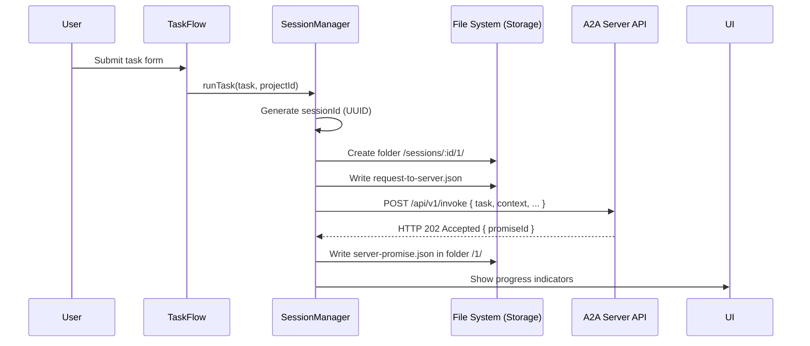
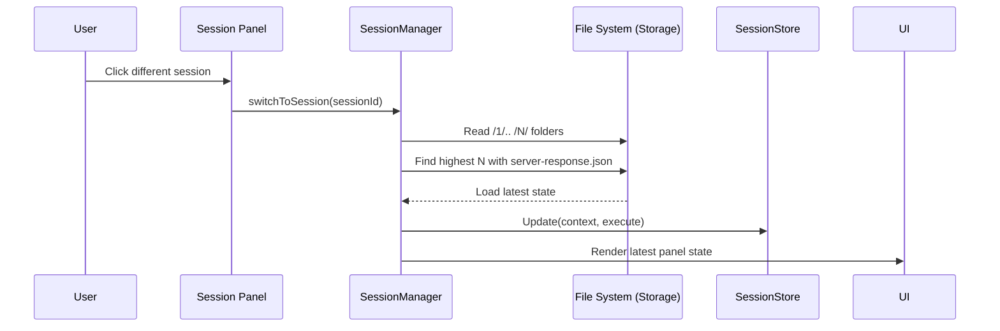
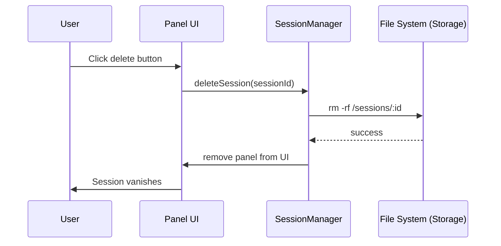

# Session Lifecycle Scenarios

This directory documents all session lifecycle workflows from creation to completion.

## Related Documentation

- **[Session Architecture Migration](../session-architecture-migration.md)** - Technical details of session architecture changes
- **[Context Synchronization Guide](../context-synchronization-guide.md)** - How session state is synchronized across components
- **[Agent Architecture Tasks](../tasks/agent-architecture-tasks.md)** - Session lifecycle audit and QA scenarios
- **[UNIFIED_ARCHITECTURE_COMPLETE](../UNIFIED_ARCHITECTURE_COMPLETE.md)** - Unified state management implementation
- **[Web UI DEV_STATE](../../DEV_STATE.md)** - Session persistence and state management overview

## Session Creation Flow

### Stateless Creation Flow (N+1 Folder)


### Error Scenarios

#### Network Failure During Creation
```
User submits task → Network fails → Show retry option → User retries → Success
```

#### Server Error Response
```
Task submit → 500 error → Display error modal → User can retry or cancel
```

#### Transport Connection Failure
```
Session created → SSE fails → WebSocket fallback → HTTP polling if needed
```

## Session Switching Flow

### Manual Session Switch


### Project Context Switch
```
User selects project → Filter sessions → Auto-switch to first session in project
```

## Session States

| State | Description | Entry Conditions | Exit Conditions | UI Display |
|-------|-------------|------------------|-----------------|------------|
| **New** | Session folder created, no response yet | `/invoke` sent | `server-response.json` written | Indeterminate spinner |
| **In-Transit** | Async promise pending | `server-promise.json` exists | Promise resolves to result | Step-specific progress |
| **Ready** | Response received, awaiting user | `server-response.json` written | User submits next input | Interactive form/message |
| **Processing** | Executing auto-AI or tool | Result submitted | Next response folder created | Activity feedback / Attachment info |
| **Completed** | Task finished | Final result in latest step | N/A | Completion summary |
| **Error** | Execution failed | Result with `error` written | User retries | Error overlay |
| **Deleted** | Folder removed from disk | User delete action | N/A | Panel removed |

## Session Persistence

### File-Based Persistence (N+1)
- All session history is stored in numbered step folders (`/1/`, `/2/`, etc.)
- **State Recovery**: Client reads the highest step folder to rebuild the current UI context.
- **Message Merging**: Conversation history is assembled by concatenating `messages.json` from all steps.
- **Offline Reliability**: Even if the tab is closed, the next launch restores the exact state from the last synchronized step.

### Cross-Session State
- Project context maintained
- Recent sessions list preserved
- User preferences (settings modal)
- Authentication state

## Cleanup Scenarios

### Session Deletion Flow


### Browser Tab Close
```
Tab close → No explicit cleanup → Server handles orphaned sessions via timeout
```

### Network Interruption
```
Connection lost → Auto-reconnection → State preserved → Seamless recovery
```

## Session Recovery Scenarios

### Connection Recovery
```
SSE disconnect → WebSocket fallback → Reconnect attempt → State sync → Continue
```

### Page Reload Recovery
```
Page reload → Load from localStorage → Reconnect transport → Restore UI state
```

### Server Restart Recovery
```
Server down → Connection fails → Retry with backoff → Server back → Full resync
```

## Multi-Session Management

### Concurrent Sessions
- Maximum 10 active sessions per project
- Each session has independent transport connection
- UI panels stack vertically in right panel area
- Session switching preserves other session states

### Session Grouping
- Sessions grouped by project ID
- Project selector filters visible sessions
- Bulk operations (delete all in project)
- Session history with timestamps

## Validation Criteria

### Session Creation Tests
- [ ] Task input creates session with correct project ID
- [ ] Transport connects within 5 seconds
- [ ] UI shows loading state during creation
- [ ] Error handling for network failures
- [ ] Retry mechanism for transient failures

### Session Switching Tests
- [ ] Transport cleanup on switch (no connection leaks)
- [ ] UI state transfers correctly
- [ ] SSE reconnection completes within 3 seconds
- [ ] Panel focus updates immediately
- [ ] Other sessions remain active

### Session Persistence Tests
- [ ] Page reload restores active session
- [ ] Panel layouts preserved across reloads
- [ ] Project context maintained
- [ ] Authentication state survives refresh

### Cleanup Tests
- [ ] Delete removes panel immediately
- [ ] Transport connections closed
- [ ] Server session deleted
- [ ] No memory leaks in UI
- [ ] localStorage cleaned up