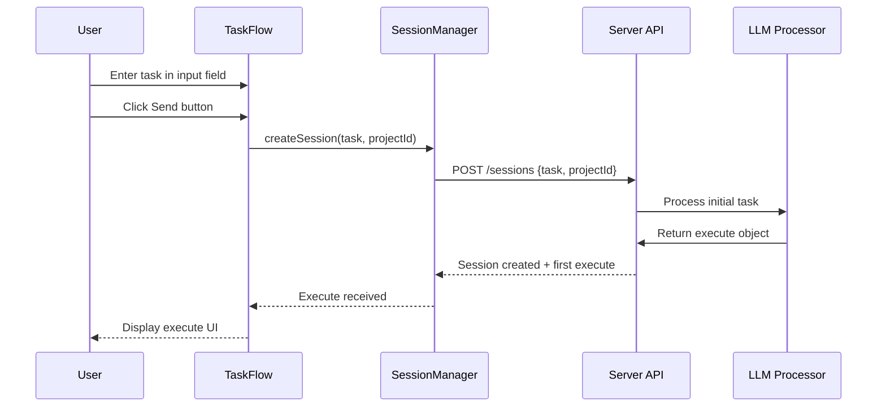
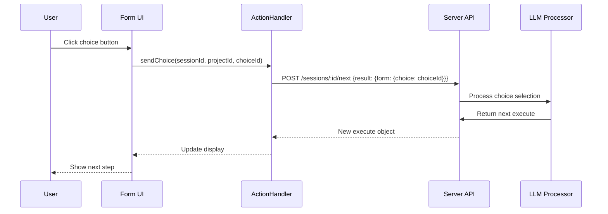
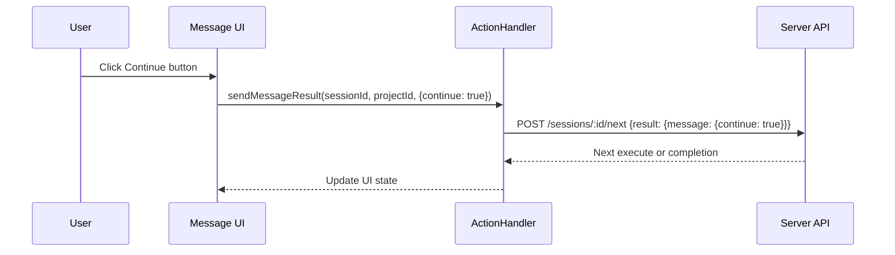
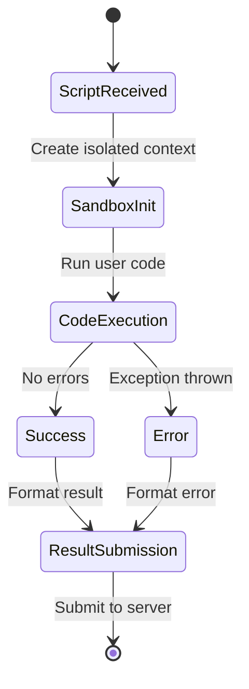
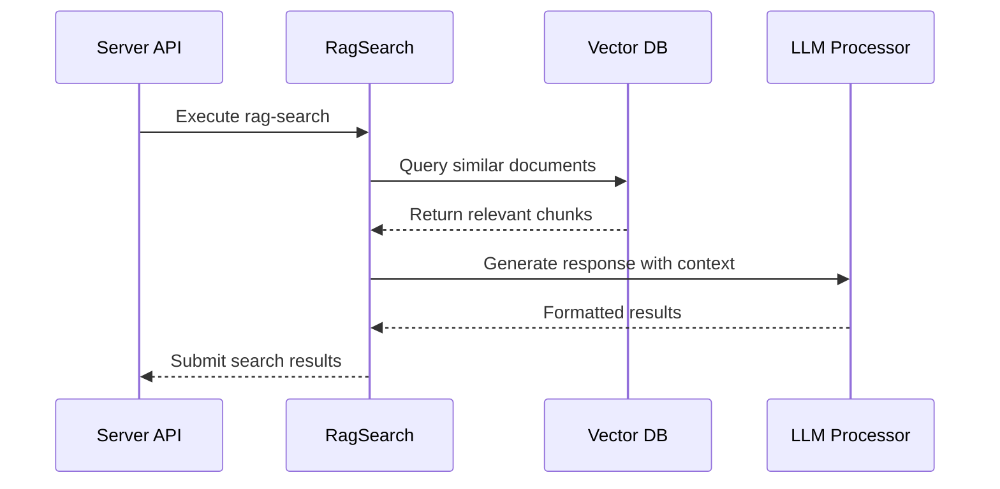
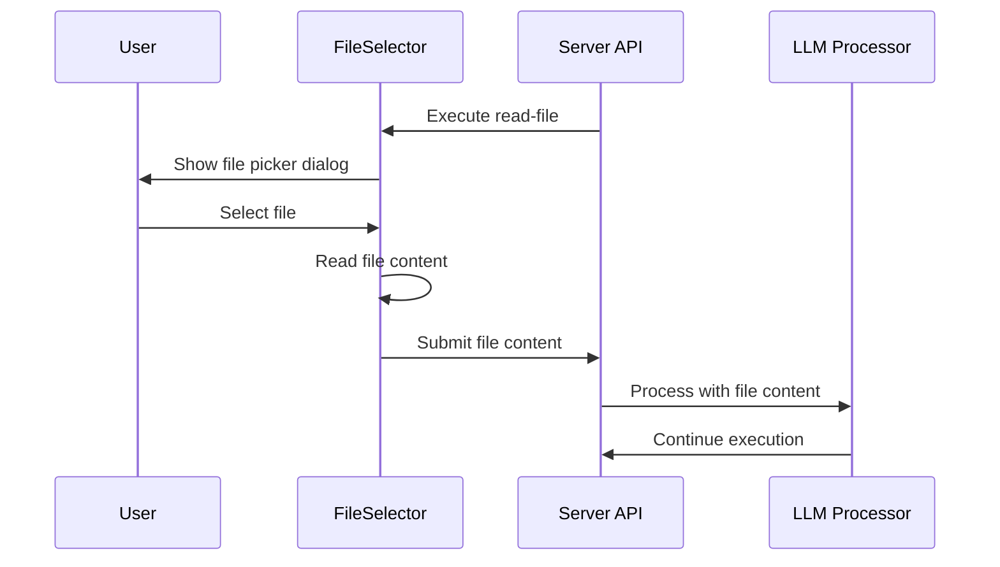
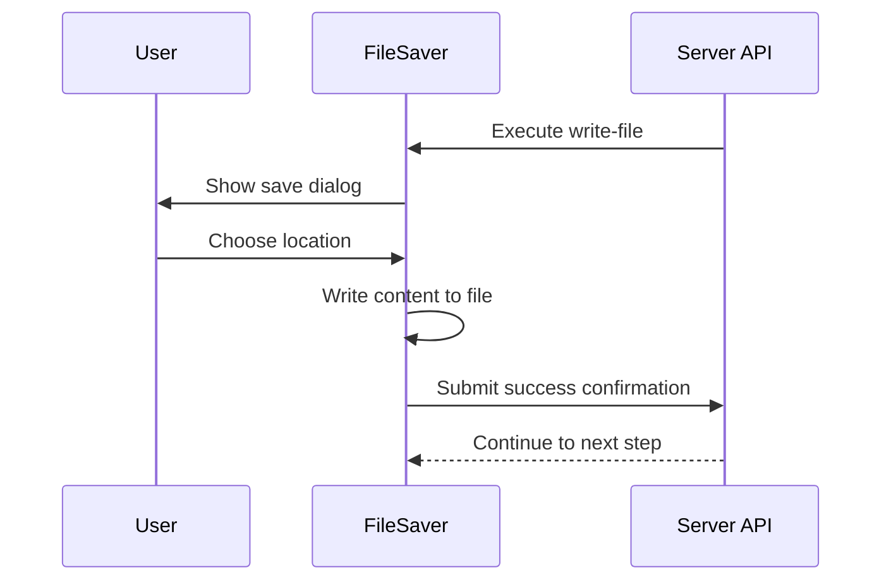
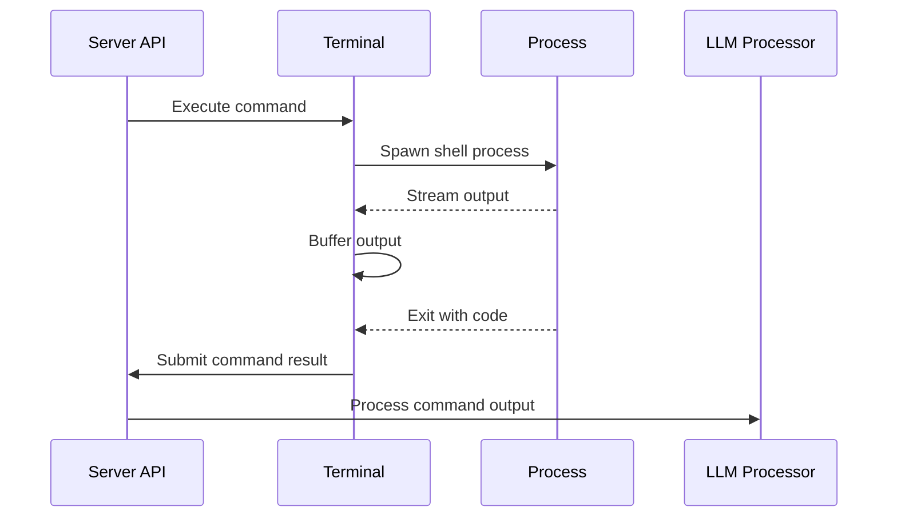

# Task Execution Scenarios

This directory documents all task execution workflows and execute types in the A2A system.

## Related Documentation

- **[Actions & Events Decomposition](../actions-events-decomposition.md)** - Detailed breakdown of execute types and UI interactions
- **[Context Synchronization Guide](../context-synchronization-guide.md)** - Execute processing and context updates
- **[Dialog Architecture Tasks](../tasks/dialog-architecture-tasks.md)** - Execute handling catalog and processing flows
- **[UNIFIED_ARCHITECTURE_COMPLETE](../UNIFIED_ARCHITECTURE_COMPLETE.md)** - Action standardization and action-key shape
- **[Web UI DEV_STATE](../../DEV_STATE.md)** - Protocol overview and submission formats

## Task Submission Flow

### Initial Task Creation


### Execute Types Overview

| Execute Type | Description | User Interaction | Result Payload | Components |
|--------------|-------------|------------------|----------------|------------|
| **form** | Multiple choice selection | Click choice button | `{"form": {"choice": "id"}}` | Choice buttons, ActionHandler |
| **message** | Continue confirmation | Click Continue button | `{"message": {"continue": true}}` | Message display, ActionHandler |
| **script** | Client-side JavaScript | Auto-execution in sandbox | `{"script": {"result": "...", "error": "..."}}` | ScriptRunner, sandbox |
| **rag-search** | RAG query execution | Auto-execution | `{"rag-search": {"results": [...], "query": "..."}}` | RagSearch, vector DB |
| **read-file** | File content reading | File selection dialog | `{"read-file": {"content": "...", "path": "..."}}` | FileSelector, FS API |
| **write-file** | File content writing | Save file dialog | `{"write-file": {"success": true, "path": "..."}}` | FileSaver, FS API |
| **execute-command** | Shell command execution | Auto-execution | `{"execute-command": {"output": "...", "exitCode": 0}}` | Terminal, process execution |

## Form Choice Execution

### Interactive Choice Selection


### Choice Validation
- Choice IDs must match form.choices array
- Invalid choice IDs rejected by server
- Choice submission triggers immediate UI update
- Progress indicator shows processing state

## Message Continuation Execution

### Continue Button Flow


### Message Display Rules
- Messages show with markdown rendering
- Continue button appears after message display
- Progress bar shows during processing
- No user input validation required

## Script Execution Scenarios

### Client-Side JavaScript Execution


### Script Security Constraints
- Code executes in isolated iframe sandbox
- No access to parent window DOM
- Network requests blocked
- File system access restricted
- Execution timeout: 30 seconds
- Memory limit: 50MB

### Script Result Format
```javascript
// Success result
{
  result: {
    script: {
      result: "execution output",
      executionTime: 150, // milliseconds
      success: true
    }
  }
}

// Error result
{
  result: {
    script: {
      error: "ReferenceError: x is not defined",
      executionTime: 50,
      success: false
    }
  }
}
```

## RAG Search Execution

### Vector Database Query Flow


### RAG Result Structure
```javascript
{
  result: {
    "rag-search": {
      query: "user search query",
      results: [
        {
          content: "relevant document chunk",
          score: 0.95,
          source: "document.md",
          metadata: { line: 42, section: "API" }
        }
      ],
      totalResults: 5,
      executionTime: 200
    }
  }
}
```

## File Operation Scenarios

### Read File Execution


### Write File Execution


## Command Execution Scenarios

### Shell Command Flow


### Command Result Format
```javascript
{
  result: {
    "execute-command": {
      command: "ls -la",
      output: "total 24\ndrwxr-xr-x  5 user  staff   160 Mar 6 10:30 .\n...",
      error: "", // stderr output
      exitCode: 0,
      executionTime: 500,
      workingDirectory: "/home/user/project"
    }
  }
}
```

## Execution State Management

### Context Progression
```javascript
// Initial context
{
  task: "user input",
  messages: [],
  execution: {
    step: "initial",
    action: "processing",
    progress: 0
  }
}

// After execute processing
{
  task: "user input",
  messages: [{role: "assistant", content: "..."}],
  execution: {
    step: "form-selection",
    action: "user-choice",
    progress: 25
  }
}
```

### Progress Tracking
- Progress values: 0-100 (monotonic)
- Step names: semantic identifiers (`plan`, `execute`, `clarify`, etc.)
- Action names: current operation type
- UI updates progress bars and step indicators

## Error Handling Scenarios

### Execution Timeouts
```
Script/command exceeds timeout → Force termination → Submit error result → Continue flow
```

### Permission Errors
```
File access denied → Show user error → Allow retry with different selection
```

### Network Failures
```
Result submission fails → Queue for retry → Auto-resubmit on reconnection
```

### Invalid Results
```
Malformed result object → Server validation → Error response → Retry option
```

## Validation Criteria

### Form Execution Tests
- [ ] All choice buttons render correctly
- [ ] Choice submission succeeds
- [ ] Invalid choices rejected
- [ ] UI updates immediately after submission
- [ ] Progress indicators work during processing

### Script Execution Tests
- [ ] Code executes in sandbox environment
- [ ] Timeout handling works correctly
- [ ] Error results formatted properly
- [ ] Success results include execution time
- [ ] No access to parent window objects

### File Operation Tests
- [ ] File picker opens on read-file
- [ ] Save dialog appears on write-file
- [ ] Large files handled correctly
- [ ] Permission errors displayed to user
- [ ] File content transmitted accurately

### Command Execution Tests
- [ ] Commands execute in proper working directory
- [ ] Output streaming works
- [ ] Exit codes captured correctly
- [ ] Long-running commands don't block UI
- [ ] Error output separated from stdout