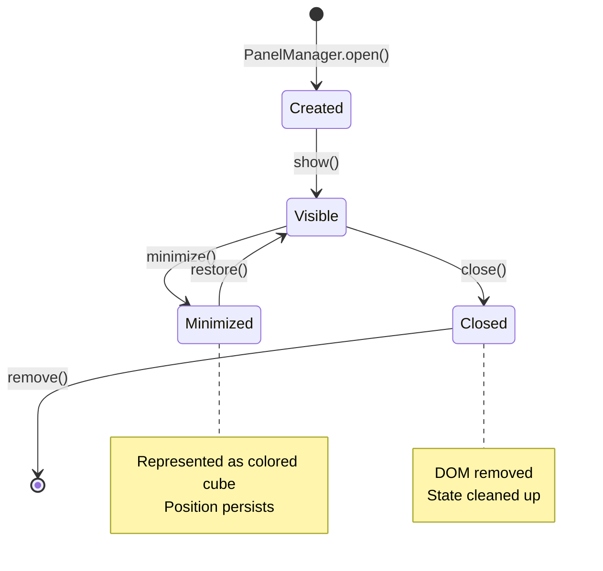
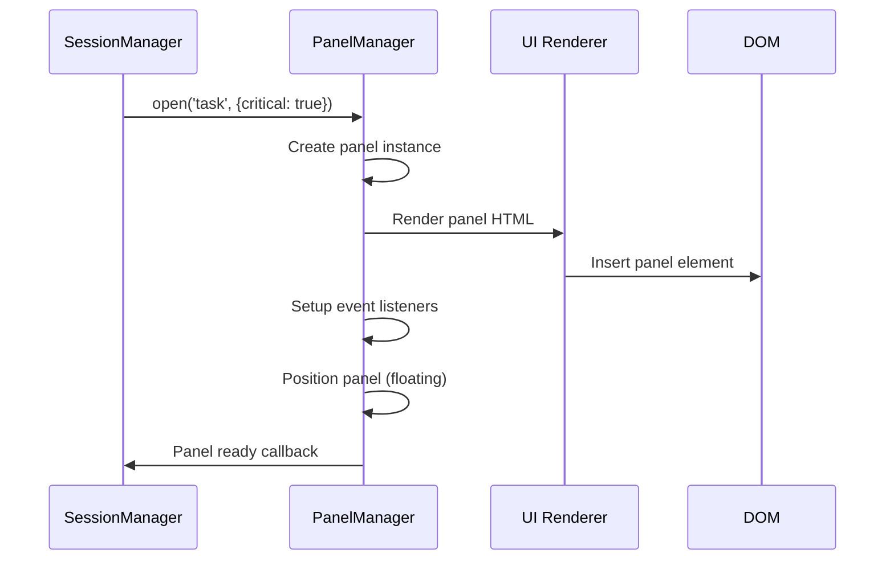
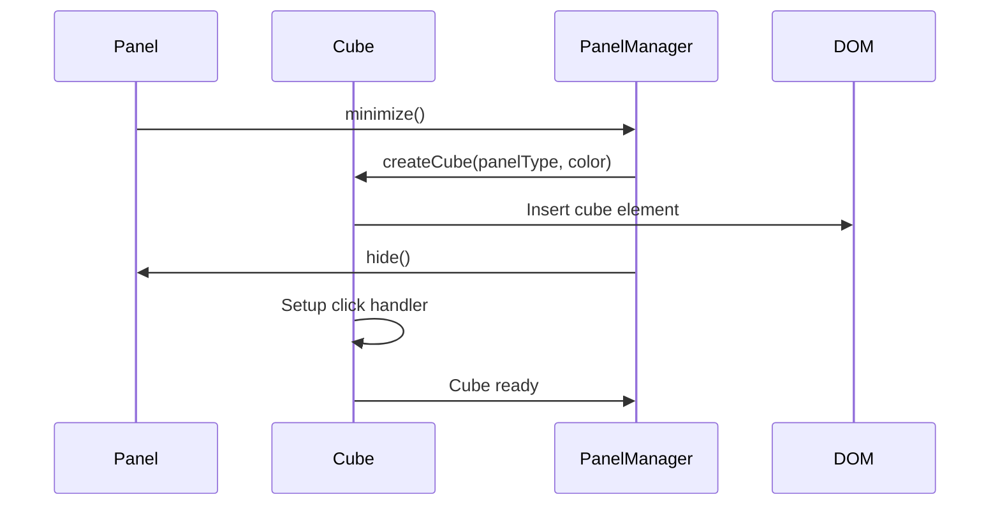
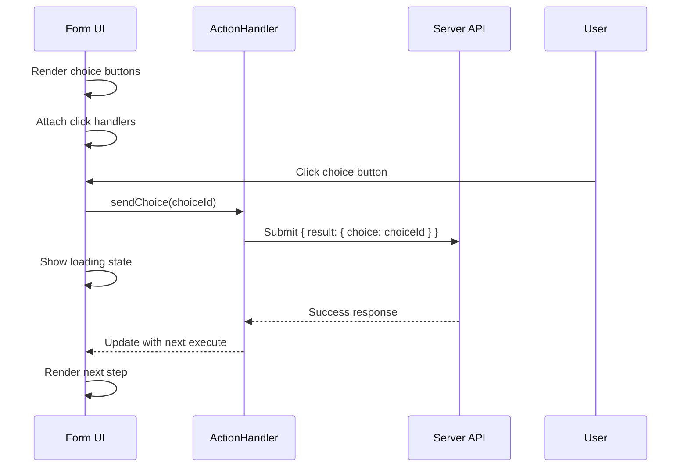

# UI Interaction Scenarios

This directory documents all user interface interaction workflows, panel management, and visual state transitions.

## Related Documentation

- **[Panel Manager Reference](../../api-reference/panel-manager.md)** - Detailed PanelManager API
- **[Session Store Reference](../../api-reference/session-store.md)** - UI-State synchronization
- **[UNIFIED_ARCHITECTURE_COMPLETE](../UNIFIED_ARCHITECTURE_COMPLETE.md)** - Simplified panels implementation and legacy removal
- **[Context Synchronization Guide](../context-synchronization-guide.md)** - PlasticineUI panel lifecycle and behavior
- **[Agent Architecture Tasks](../tasks/agent-architecture-tasks.md)** - Panel QA scenarios and lifecycle coverage
- **[Web UI DEV_STATE](../../DEV_STATE.md)** - Panel management overview and component structure

## Panel Management System

### Panel Types & Slots

| Panel Type | Slot | Critical | Auto-Create | Description |
|------------|------|----------|-------------|-------------|
| **task** | floating | false | true | Task execution UI, choices, messages |
| **logs** | bottom | false | false | System logs and command output |
| **chat** | right | false | false | Conversation history |
| **debug** | bottom | false | false | Debug information and state |
| **sessions** | left | true | true | Session list and management |
| **settings** | floating | false | false | Application settings |
| **alerts** | header | true | false | System alerts and notifications |
| **graph** | left | false | false | Graph visualization |

### Visual Language (Premium Interface)

- **Glow & Depth**: Active panels have a `0 0 20px rgba(99, 102, 241, 0.15)` indigo glow.
- **Glassmorphism**: Components use 85% opacity backgrounds with 16px backdrop blurs.
- **Shadows**: Large, soft shadows (`shadow-lg`) provide depth and floating effects.

### Panel Lifecycle States



## Panel Creation Scenarios

### Automatic Panel Creation


### User-Initiated Panel Creation
```
User clicks menu item → PanelManager.open(type) → Render panel → Position in slot → Show to user
```

## Panel Interaction Patterns

### Drag & Drop
```javascript
// Panel dragging workflow
mousedown on header → capture mouse position → track mouse movement → update panel position → mouseup release
```

### Z-Index Management
- **Bring to front**: Click anywhere on panel
- **Modal priority**: Settings/projects modals always on top
- **Alert priority**: System alerts override all other panels

### Panel Grouping
- **Slot-based**: Panels in same slot stack vertically
- **Type-based**: Multiple instances of same type allowed
- **Session-based**: Task panels linked to specific sessions

## Cube System (Minimized Panels)

### Cube Lifecycle


### Cube Color Coding
| Panel Type | Color | Purpose |
|------------|-------|---------|
| task | Blue | Primary workflow |
| logs | Green | System output |
| chat | Purple | Communication |
| debug | Orange | Development |
| settings | Gray | Configuration |

> [!NOTE]
> Cubes are **16x16px glowing squares** located in the taskbar. They provide immediate visual feedback on the number of active background tasks.

### Cube Interactions
- **Left click**: Restore panel to previous position
- **Right click**: Cycle through color options
- **Drag**: Reposition cube in cube area
- **Hover**: Show panel preview tooltip

## Modal System

### Modal Types
| Modal Type | Trigger | Behavior | Close Conditions |
|------------|---------|----------|------------------|
| **settings** | Settings button | Overlay, centered | Save/Cancel/X buttons |
| **projects** | Projects button | Overlay, centered | Close/X buttons |
| **alerts** | System events | Toast notifications | Auto-dismiss or manual close |

### Modal Overlay Behavior
- **Backdrop**: Semi-transparent overlay
- **Focus trap**: Tab navigation within modal
- **Escape key**: Close modal
- **Click outside**: Close non-critical modals

## Form Interaction Scenarios

### Choice Selection Form


### Message Continuation Form
```
Display message → Show continue button → User clicks continue → Submit continuation → Show loading → Receive next execute
```

## Progress & Status Indicators

### Progress Bar States
| State | Visual | Context |
|-------|--------|---------|
| **hidden** | Not shown | No active execution |
| **indeterminate** | Animated bar | Initial processing |
| **determinate** | Percentage bar | Progress available |
| **complete** | Full bar + checkmark | Task finished |
| **error** | Red bar + error icon | Processing failed |

### Status Text Display
```
Step: "Analyzing requirements" | Progress: 25% | Action: "Processing user input"
```

### Connection Status Indicators
| Status | Icon | Color | Description |
|--------|------|-------|-------------|
| Connected | ● | Green | SSE/WebSocket active |
| Reconnecting | ⟳ | Yellow | Recovering connection |
| Degraded | ⚠ | Orange | Heartbeat delayed |
| Disconnected | ✗ | Red | No connection |

## Layout Persistence

### Panel Position Storage
```javascript
// localStorage structure
{
  panels: {
    "task-panel-123": {
      position: { x: 100, y: 200 },
      size: { width: 400, height: 300 },
      minimized: false,
      zIndex: 10
    }
  },
  cubes: {
    positions: [
      { type: "task", color: "blue", x: 50, y: 100 }
    ]
  }
}
```

### Layout Restoration
```
Page load → Read from localStorage → Validate positions → Restore panels → Reconnect sessions
```

## Responsive Design Scenarios

### Mobile Layout Adaptation
- **Panels**: Stack vertically, full width
- **Cubes**: Hide on mobile, use tabs instead
- **Modals**: Full screen overlay
- **Touch**: Larger touch targets

### Desktop Layout Optimization
- **Multi-column**: Panels in designated slots
- **Drag & drop**: Full desktop interaction
- **Keyboard shortcuts**: Arrow keys for navigation
- **Multiple monitors**: Panels can span screens

## Keyboard Navigation

### Panel Navigation
| Key | Action |
|-----|--------|
| `Tab` | Cycle through interactive elements |
| `Escape` | Close current modal/panel |
| `Arrow Keys` | Move focused panel |
| `Enter` | Activate focused element |

### Shortcut Keys
| Shortcut | Action |
|----------|--------|
| `Ctrl+N` | New task |
| `Ctrl+P` | Projects modal |
| `Ctrl+,` | Settings modal |
| `F12` | Toggle debug panel |

## Animation & Transitions

### Panel Transitions
- **Open**: Fade in + scale from center
- **Close**: Fade out + scale to center
- **Minimize**: Shrink to cube position
- **Restore**: Expand from cube to full size

### State Transitions
- **Loading**: Pulse animation
- **Success**: Green checkmark + fade
- **Error**: Red cross + shake
- **Progress**: Smooth bar animation

## Error Handling UI

### Network Error Display
```
Connection lost → Show toast notification → Retry button → Auto-retry on reconnection
```

### Validation Error Display
```
Invalid input → Highlight field red → Show error message → Clear on correction
```

### System Error Display
```
Unexpected error → Show error modal → Provide debug info → Allow continue/retry
```

## Accessibility Features

### Screen Reader Support
- **ARIA labels**: All interactive elements labeled
- **Live regions**: Dynamic content announced
- **Focus management**: Logical tab order
- **Semantic HTML**: Proper heading hierarchy

### High Contrast Support
- **Color schemes**: Multiple themes available
- **Focus indicators**: Clear focus outlines
- **Text contrast**: WCAG AA compliance
- **Icon alternatives**: Text labels for icons

## Performance Optimizations

### Rendering Optimization
- **Virtual scrolling**: Large lists use virtualization
- **Lazy loading**: Panels load content on demand
- **Debounced updates**: UI updates throttled
- **Memory cleanup**: Event listeners removed on panel destruction

### Animation Performance
- **CSS transforms**: Hardware-accelerated animations
- **RequestAnimationFrame**: Smooth 60fps animations
- **Layer promotion**: GPU acceleration for moving elements

## Validation Criteria

### Panel Management Tests
- [ ] Panels create and position correctly
- [ ] Minimize/restore works seamlessly
- [ ] Drag & drop functions properly
- [ ] Z-index management works
- [ ] Panel cleanup on deletion

### Form Interaction Tests
- [ ] Choice buttons submit correctly
- [ ] Loading states display properly
- [ ] Error handling works
- [ ] Keyboard navigation functions
- [ ] Screen reader compatibility

### Layout Persistence Tests
- [ ] Panel positions save to localStorage
- [ ] Layout restores on page reload
- [ ] Invalid positions handled gracefully
- [ ] Multiple sessions preserve layouts

### Responsive Design Tests
- [ ] Mobile layout adapts correctly
- [ ] Touch interactions work
- [ ] Desktop features available
- [ ] Cross-device consistency

### Accessibility Tests
- [ ] Screen reader navigation works
- [ ] Keyboard-only operation possible
- [ ] Color contrast meets standards
- [ ] Focus management correct