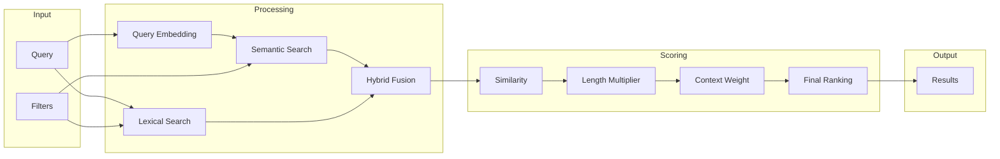

# ML Модели для A2A Codebase Agent

## Обзор

Данный раздел содержит документацию по ML моделям, используемым для интеллектуального поиска и анализа кода в A2A приложении. Документация учитывает практический опыт: **Fulltext поиск показал наилучшие результаты**, тогда как RAG и Graph индексы не оправдали ожиданий при работе со скриптами.

## Типы моделей

### Классификация по назначению

| Тип модели | Назначение | Приоритет |
|------------|------------|-----------|
| **Sparse Retrieval** | Fulltext-подобный поиск | ⭐⭐⭐ ВЫСОКИЙ |
| **Hybrid Retrieval** | Комбинация методов | ⭐⭐⭐ ВЫСОКИЙ |
| **Embedding Models** | Векторное представление | ⭐⭐ СРЕДНИЙ |
| **Cross-Encoder** | Точное ранжирование | ⭐⭐ СРЕДНИЙ |

## Структура документации

```
models/
├── README.md              # Этот файл - обзор всех моделей
├── embedding/             # Embedding модели
│   └── README.md
├── cross-encoder/         # Cross-encoder модели
│   └── README.md
├── sparse/                # Sparse retrieval (fulltext-like)
│   └── README.md
├── hybrid/                # Hybrid approaches
│   └── README.md
├── comparison.md          # Сравнение RAG vs Graph vs Fulltext
└── recommendations.md     # Рекомендации по выбору
```

## Архитектура ML компонентов

```
┌─────────────────────────────────────────────────────────────────┐
│                    ML Search Engine                              │
├─────────────────────────────────────────────────────────────────┤
│                                                                  │
│  ┌──────────────────┐  ┌──────────────────┐  ┌───────────────┐  │
│  │  Indexing Layer  │  │  Embedding Layer │  │ Search Layer  │  │
│  │                  │  │                  │  │               │  │
│  │  - Lexer         │  │  - Code Encoder  │  │  - Semantic   │  │
│  │  - Parser        │  │  - Text Encoder  │  │  - Lexical    │  │
│  │  - AST Builder   │  │  - Hybrid Model  │  │  - Hybrid     │  │
│  └────────┬─────────┘  └────────┬─────────┘  └───────┬───────┘  │
│           │                     │                    │          │
│           └─────────────────────┼────────────────────┘          │
│                                 │                               │
│                    ┌────────────┴────────────┐                  │
│                    │    Scoring Engine       │                  │
│                    │                         │                  │
│                    │  - Similarity Score     │                  │
│                    │  - Length Multiplier    │                  │
│                    │  - Context Weighting    │                  │
│                    │  - Final Ranking        │                  │
│                    └─────────────────────────┘                  │
│                                                                  │
└─────────────────────────────────────────────────────────────────┘
```

## Краткое описание типов моделей

### 1. Sparse Retrieval (Приоритет: ВЫСОКИЙ)

**Почему приоритет:** Основан на опыте пользователя — fulltext поиск показал наилучшие результаты.

**Принцип работы:**
- BM25, TF-IDF алгоритмы
- Точное совпадение терминов
- Высокая скорость работы
- Не требует обучения модели

**Подробнее:** [sparse/README.md](sparse/README.md)

### 2. Hybrid Retrieval (Приоритет: ВЫСОКИЙ)

**Почему приоритет:** Комбинирует преимущества sparse и dense методов.

**Принцип работы:**
- Объединение результатов разных методов
- Reciprocal Rank Fusion
- Адаптивное взвешивание

**Подробнее:** [hybrid/README.md](hybrid/README.md)

### 3. Embedding Models (Приоритет: СРЕДНИЙ)

**Назначение:** Векторное представление кода для семантического поиска.

**Особенности:**
- CodeBERT, GraphCodeBERT
- Поддержка PHP и JavaScript/TypeScript
- AST-aware представления

**Подробнее:** [embedding/README.md](embedding/README.md)

### 4. Cross-Encoder Models (Приоритет: СРЕДНИЙ)

**Назначение:** Точное ранжирование результатов поиска.

**Особенности:**
- Переупорядочивание top-k результатов
- Высокая точность, низкая скорость
- Используется как финальный этап

**Подробнее:** [cross-encoder/README.md](cross-encoder/README.md)

## Поток данных при поиске



## Интеграция с A2A протоколом

### Context Block и ML модели

ML модели интегрируются с A2A протоколом через:

1. **Индексация проекта** — создание поискового индекса
2. **Генерация hints** — подсказки для new_task блока
3. **Архитектурные особенности** — анализ структуры проекта

### Пример интеграции

```json
{
  "new_task": [
    "Найти методы валидации пользователя",
    "hint: UserService.php содержит методы валидации - score: 0.92",
    "hint: Validator.php содержит правила валидации - score: 0.85"
  ],
  "architectural_features": [
    "Валидаторы в app/Domain/*/Validators вместо app/Validators"
  ]
}
```

## Ключевые выводы из опыта

### Что работает хорошо

| Подход | Результат | Рекомендация |
|--------|-----------|--------------|
| **Fulltext Search** | ✅ Лучший результат | Использовать как основу |
| **Hybrid (Fulltext + Embeddings)** | ✅ Хорошо | Для улучшения точности |
| **BM25 с ранжированием** | ✅ Хорошо | Быстрый и надежный |

### Что не работает

| Подход | Проблема | Рекомендация |
|--------|----------|--------------|
| **RAG индексы через скрипты** | ❌ Не удалось реализовать | Использовать готовые решения |
| **Graph индексы через скрипты** | ❌ Не удалось реализовать | Использовать готовые решения |
| **Чистый semantic search** | ⚠️ Нестабилен | Комбинировать с lexical |

## Следующие шаги

1. Ознакомиться с [сравнением подходов](comparison.md)
2. Изучить [рекомендации по выбору](recommendations.md)
3. Выбрать подходящую модель для вашего use case
