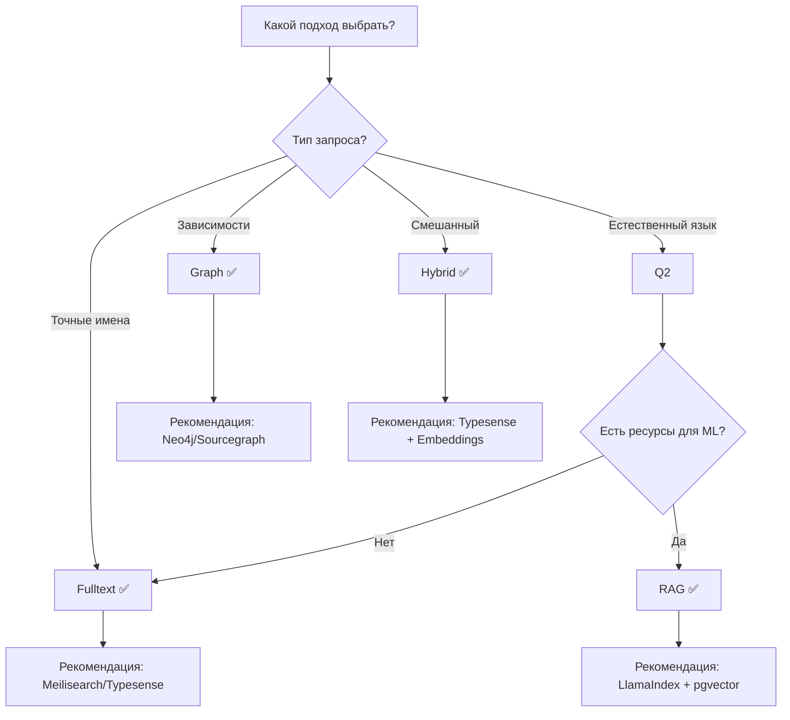

# Сравнение подходов: RAG vs Graph vs Fulltext vs Hybrid

## Обзор

Данный документ сравнивает основные подходы к поиску и анализу кода с учетом практического опыта: **Fulltext поиск показал наилучшие результаты**, тогда как RAG и Graph индексы не удалось реализовать через скрипты.

## Краткое резюме

| Подход | Результат | Рекомендация |
|--------|-----------|--------------|
| **Fulltext (Sparse)** | ✅ Лучший результат | Основной метод |
| **Hybrid** | ✅ Хорошо | Для улучшения точности |
| **RAG** | ❌ Не удалось со скриптами | Только готовые решения |
| **Graph** | ❌ Не удалось со скриптами | Только готовые решения |

---

## 1. Fulltext Search (Sparse Retrieval)

### Описание

Классический подход к поиску, основанный на точном совпадении терминов. Использует алгоритмы BM25, TF-IDF для ранжирования документов.

### Архитектура

```
┌─────────────────────────────────────────────────────────────────┐
│                    Fulltext Search Pipeline                      │
├─────────────────────────────────────────────────────────────────┤
│                                                                  │
│   Query ──► Tokenize ──► Index Lookup ──► BM25 Score ──► Rank  │
│                                                                  │
│   Document ──► Tokenize ──► Inverted Index                      │
│                                                                  │
└─────────────────────────────────────────────────────────────────┘
```

### Преимущества

| Преимущество | Описание |
|--------------|----------|
| ✅ **Скорость** | Миллисекунды для миллионов документов |
| ✅ **Простота** | Готовые решения, минимальная настройка |
| ✅ **Предсказуемость** | Детерминированные результаты |
| ✅ **Точность для кода** | Имена классов, методов — точные совпадения |
| ✅ **Низкие ресурсы** | CPU, минимальная память |

### Недостатки

| Недостаток | Описание |
|------------|----------|
| ❌ Нет семантики | Не понимает синонимы |
| ❌ Морфология | Требует стемминга/лемматизации |
| ❌ Опечатки | Требует fuzzy matching |

### Практический опыт

> **Fulltext показал лучшие результаты** для поиска по коду. Имена классов, методов, переменных — это точные термины, которые отлично ищутся через BM25.

### Рекомендуемые инструменты

| Инструмент | Тип | Рекомендация |
|------------|-----|--------------|
| **Meilisearch** | Self-hosted | ⭐⭐⭐ |
| **Typesense** | Self-hosted | ⭐⭐⭐ |
| **TNTSearch** | PHP-native | ⭐⭐⭐ |
| **Laravel Scout** | Integration | ⭐⭐⭐ |

---

## 2. RAG (Retrieval Augmented Generation)

### Описание

Подход, комбинирующий поиск документов с генерацией ответа через LLM. Документы извлекаются через embeddings, затем передаются в LLM для генерации ответа.

### Архитектура

```
┌─────────────────────────────────────────────────────────────────┐
│                      RAG Pipeline                                │
├─────────────────────────────────────────────────────────────────┤
│                                                                  │
│   Indexing:                                                      │
│   Documents ──► Chunk ──► Embed ──► Vector Store                │
│                                                                  │
│   Retrieval:                                                     │
│   Query ──► Embed ──► Vector Search ──► Top-k Documents         │
│                                                                  │
│   Generation:                                                    │
│   Query + Documents ──► LLM ──► Answer                          │
│                                                                  │
└─────────────────────────────────────────────────────────────────┘
```

### Преимущества

| Преимущество | Описание |
|--------------|----------|
| ✅ Семантический поиск | Понимает смысл запроса |
| ✅ Контекст для LLM | Предоставляет релевантный контекст |
| ✅ Гибкость | Работает с любыми документами |

### Недостатки

| Недостаток | Описание |
|------------|----------|
| ❌ **Сложность** | Много компонентов для настройки |
| ❌ **Ресурсы** | GPU для embeddings, API для LLM |
| ❌ **Качество chunking** | Критически влияет на результат |
| ❌ **Скрипты не работают** | Практический опыт пользователя |

### Практический опыт

> **RAG индексы не удалось реализовать через скрипты.** Требуются готовые решения с отлаженными pipeline.

### Когда использовать

| Сценарий | Рекомендация |
|----------|--------------|
| Документация, wiki | ✅ Подходит |
| Естественный язык запросы | ✅ Подходит |
| Поиск по коду | ⚠️ Комбинировать с fulltext |
| Точные имена классов/методов | ❌ Лучше fulltext |

### Готовые решения

| Решение | Описание | Рекомендация |
|---------|----------|--------------|
| **LlamaIndex** | RAG framework | ⭐⭐⭐ |
| **LangChain** | RAG framework | ⭐⭐⭐ |
| **Haystack** | RAG framework | ⭐⭐ |
| **Weaviate** | Vector DB + modules | ⭐⭐⭐ |

---

## 3. Graph-based Retrieval

### Описание

Подход, использующий графовые структуры для представления связей между сущностями кода: классы, методы, импорты, зависимости.

### Архитектура

```
┌─────────────────────────────────────────────────────────────────┐
│                    Graph-based Retrieval                         │
├─────────────────────────────────────────────────────────────────┤
│                                                                  │
│   Code ──► AST ──► Graph Construction                           │
│                                                                  │
│   Nodes: Class, Method, Variable, Import                        │
│   Edges: calls, imports, extends, implements                    │
│                                                                  │
│   Query ──► Graph Traversal ──► Related Nodes                   │
│                                                                  │
└─────────────────────────────────────────────────────────────────┘
```

### Преимущества

| Преимущество | Описание |
|--------------|----------|
| ✅ Структурные связи | Понимает зависимости |
| ✅ Контекст | Находит связанные файлы |
| ✅ Навигация | Переходы по call graph |

### Недостатки

| Недостаток | Описание |
|------------|----------|
| ❌ **Сложность построения** | AST parsing для каждого языка |
| ❌ **Ресурсы** | Память для графа |
| ❌ **Обновления** | Перестроение при изменениях |
| ❌ **Скрипты не работают** | Практический опыт пользователя |

### Практический опыт

> **Graph индексы не удалось реализовать через скрипты.** Требуются специализированные инструменты.

### Когда использовать

| Сценарий | Рекомендация |
|----------|--------------|
| Анализ зависимостей | ✅ Подходит |
| Рефакторинг | ✅ Подходит |
| Impact analysis | ✅ Подходит |
| Быстрый поиск | ❌ Лучше fulltext |

### Готовые решения

| Решение | Описание | Рекомендация |
|---------|----------|--------------|
| **Neo4j** | Graph database | ⭐⭐⭐ |
| **CodeQL** | Code analysis | ⭐⭐⭐ |
| **Understand** | Static analysis | ⭐⭐ |
| **Sourcegraph** | Code search + graph | ⭐⭐⭐ |

---

## 4. Hybrid Retrieval

### Описание

Комбинация нескольких методов для достижения лучших результатов. Типичная схема: Sparse + Dense + Reranking.

### Архитектура

```
┌─────────────────────────────────────────────────────────────────┐
│                    Hybrid Retrieval Pipeline                     │
├─────────────────────────────────────────────────────────────────┤
│                                                                  │
│   Query ──┬──► Sparse Search (BM25) ──┐                        │
│           │                            │                        │
│           └──► Dense Search (Embed) ──┼──► Fusion (RRF)        │
│                                        │                        │
│                                        ▼                        │
│                                   Reranking                      │
│                                        │                        │
│                                        ▼                        │
│                                   Results                        │
│                                                                  │
└─────────────────────────────────────────────────────────────────┘
```

### Преимущества

| Преимущество | Описание |
|--------------|----------|
| ✅ Лучшее из обоих миров | Точность + семантика |
| ✅ Гибкость | Настраиваемые веса |
| ✅ Robustness | Работает для разных запросов |

### Недостатки

| Недостаток | Описание |
|------------|----------|
| ⚠️ Сложность | Больше компонентов |
| ⚠️ Latency | Сумма latency методов |
| ⚠️ Настройка | Подбор весов |

### Практический опыт

> **Hybrid подход рекомендуется** как развитие fulltext. Добавление semantic search улучшает результаты для естественноязыковых запросов.

### Рекомендуемая конфигурация

```php
$hybridConfig = [
    'sparse' => [
        'weight' => 0.6,      // Основной вес
        'algorithm' => 'bm25',
        'limit' => 100
    ],
    'dense' => [
        'weight' => 0.4,      // Дополнительный вес
        'model' => 'codebert',
        'limit' => 100
    ],
    'fusion' => [
        'method' => 'rrf',
        'k' => 60
    ],
    'reranking' => [
        'enabled' => true,
        'model' => 'cross-encoder',
        'top_k' => 20
    ]
];
```

---

## Сравнительная таблица

### По критериям качества

| Критерий | Fulltext | RAG | Graph | Hybrid |
|----------|----------|-----|-------|--------|
| **Точные совпадения** | ⭐⭐⭐ | ⭐⭐ | ⭐⭐ | ⭐⭐⭐ |
| **Семантический поиск** | ⭐ | ⭐⭐⭐ | ⭐⭐ | ⭐⭐⭐ |
| **Структурные связи** | ⭐ | ⭐ | ⭐⭐⭐ | ⭐⭐ |
| **Скорость** | ⭐⭐⭐ | ⭐ | ⭐⭐ | ⭐⭐ |
| **Простота внедрения** | ⭐⭐⭐ | ⭐ | ⭐ | ⭐⭐ |
| **Ресурсы** | ⭐⭐⭐ | ⭐ | ⭐⭐ | ⭐⭐ |

### По типам запросов

| Тип запроса | Лучший подход | Пример |
|-------------|---------------|--------|
| Имя класса/метода | Fulltext | "UserService" |
| Код с синтаксисом | Fulltext | "->createUser(" |
| Естественный язык | Hybrid/RAG | "как создать пользователя" |
| Зависимости | Graph | "кто использует UserService" |
| Рефакторинг | Graph + Fulltext | "переименовать метод" |

---

## Рекомендации по выбору

### Decision Tree



### Для A2A приложения

На основе практического опыта:

```
┌─────────────────────────────────────────────────────────────────┐
│                 Рекомендуемая архитектура A2A                    │
├─────────────────────────────────────────────────────────────────┤
│                                                                  │
│   1. ОСНОВА: Fulltext (BM25)                                    │
│      - Meilisearch или Typesense                                │
│      - Быстрый поиск по именам классов, методов                 │
│      - Минимальные ресурсы                                      │
│                                                                  │
│   2. ДОПОЛНЕНИЕ: Embeddings (опционально)                       │
│      - pgvector в PostgreSQL                                    │
│      - Для семантических запросов                               │
│      - Интеграция с Laravel                                     │
│                                                                  │
│   3. RERANKING: Cross-Encoder (опционально)                     │
│      - Для улучшения top-k результатов                          │
│      - Cohere API или локальная модель                          │
│                                                                  │
│   4. GRAPH: Отложить до готового решения                        │
│      - Sourcegraph для анализа зависимостей                     │
│      - Не писать скрипты с нуля                                 │
│                                                                  │
└─────────────────────────────────────────────────────────────────┘
```

---

## Практические примеры

### Пример 1: Поиск метода

**Запрос:** `createUser`

| Подход | Результат | Score |
|--------|-----------|-------|
| Fulltext | UserService.php:createUser | 0.95 |
| RAG | UserService.php:createUser | 0.88 |
| Hybrid | UserService.php:createUser | 0.92 |

**Вывод:** Fulltext достаточно для точных имен.

### Пример 2: Семантический запрос

**Запрос:** `как валидировать email пользователя`

| Подход | Результат | Score |
|--------|-----------|-------|
| Fulltext | EmailValidator.php | 0.65 |
| RAG | AuthService.php:validateEmail | 0.85 |
| Hybrid | AuthService.php:validateEmail | 0.82 |

**Вывод:** RAG/Hybrid лучше для естественного языка.

### Пример 3: Зависимости

**Запрос:** `кто вызывает UserService::createUser`

| Подход | Результат | Score |
|--------|-----------|-------|
| Fulltext | Частичный | 0.50 |
| RAG | Нет данных | 0.00 |
| Graph | AuthController, RegisterController | 0.95 |

**Вывод:** Graph необходим для анализа зависимостей.

---

## Резюме

1. **Fulltext — основа** для A2A приложения (проверено опытом)
2. **Hybrid — улучшение** для семантических запросов
3. **RAG/Graph — только готовые решения**, не писать скрипты
4. **Комбинировать подходы** в зависимости от типа запроса
