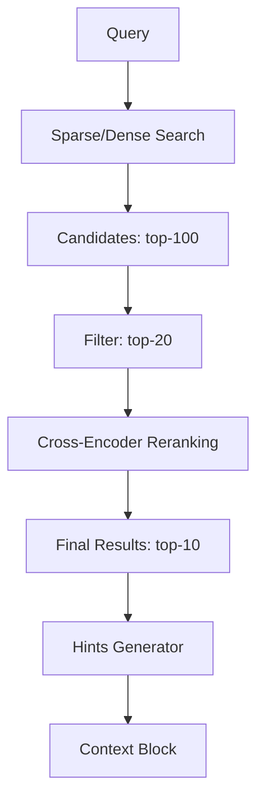

# Cross-Encoder Models

## Обзор

Cross-encoder модели выполняют точное ранжирование пары query-document, принимая оба текста одновременно. Это обеспечивает более высокую точность по сравнению с bi-encoder (embedding) моделями, но требует больше вычислительных ресурсов.

## Назначение и область применения

### Основные use cases

| Use case | Описание | Приоритет |
|----------|----------|-----------|
| **Reranking** | Переупорядочивание top-k результатов | Высокий |
| **Точная классификация** | Релевантность query-document | Высокий |
| **Deduplication** | Определение дубликатов | Средний |
| **Fact checking** | Проверка соответствия | Низкий |

### Когда использовать

```
┌─────────────────────────────────────────────────────────────────┐
│                    Cross-Encoder Decision Tree                   │
├─────────────────────────────────────────────────────────────────┤
│                                                                  │
│   Нужен поиск по всей базе?                                      │
│   │                                                              │
│   ├── ДА ──► Используй Embedding + Vector Search                │
│   │           │                                                  │
│   │           └── Нужно улучшить точность top-k?                │
│   │                │                                             │
│   │                └── ДА ──► Cross-Encoder Reranking ✅        │
│   │                                                              │
│   └── НЕТ ──► Нужно оценить релевантность пары?                 │
│                │                                                 │
│                └── ДА ──► Cross-Encoder напрямую ✅             │
│                                                                  │
└─────────────────────────────────────────────────────────────────┘
```

## Принцип работы

### Bi-Encoder vs Cross-Encoder

```
┌─────────────────────────────────────────────────────────────────┐
│                         Bi-Encoder                               │
├─────────────────────────────────────────────────────────────────┤
│                                                                  │
│   Query ──► [Encoder] ──► Vector Q                              │
│                                  │                               │
│                                  │ cosine similarity             │
│                                  ▼                               │
│   Doc ───► [Encoder] ──► Vector D                               │
│                                                                  │
│   ✅ Быстро: O(n) для индексации, O(1) для сравнения            │
│   ❌ Нет взаимодействия между query и doc при кодировании       │
│                                                                  │
└─────────────────────────────────────────────────────────────────┘

┌─────────────────────────────────────────────────────────────────┐
│                       Cross-Encoder                              │
├─────────────────────────────────────────────────────────────────┤
│                                                                  │
│   [CLS] Query [SEP] Doc [SEP]                                   │
│              │                                                   │
│              ▼                                                   │
│         [Encoder]                                                │
│              │                                                   │
│              ▼                                                   │
│         [Score: 0.92]                                           │
│                                                                  │
│   ✅ Высокая точность: полное внимание между query и doc        │
│   ❌ Медленно: O(n) для каждого сравнения                       │
│                                                                  │
└─────────────────────────────────────────────────────────────────┘
```

## Модели

### 1. MS MARCO Cross-Encoders

#### cross-encoder/ms-marco-MiniLM-L-6-v2

**Характеристики:**
- Размер: 80MB
- Скорость: Быстрая
- Качество: Хорошее
- Рекомендация: ⭐⭐⭐ Для production

#### cross-encoder/ms-marco-MiniLM-L-12-v2

**Характеристики:**
- Размер: 120MB
- Скорость: Средняя
- Качество: Высокое
- Рекомендация: ⭐⭐⭐ Для точного ранжирования

### 2. Code-specific Cross-Encoders

#### code-matcher

**Характеристики:**
- Специализация: Code search
- Языки: Python, Java, JavaScript
- Рекомендация: ⭐⭐ Для кода

### 3. Мультиязычные модели

#### cross-encoder/mmarco-mMiniLMv2-L12-m384-v1

**Характеристики:**
- Языки: 50+ языков
- Поддержка: Русский, английский
- Рекомендация: ⭐⭐⭐ Для мультиязычных проектов

## Входные и выходные данные

### Входные данные

```php
class CrossEncoderInput {
    public string $query;      // Поисковый запрос
    public string $document;   // Документ для оценки
    public ?array $context;    // Дополнительный контекст
}
```

### Выходные данные

```php
class CrossEncoderOutput {
    public float $score;       // Score релевантности (0-1)
    public string $model;      // Использованная модель
    public int $tokens;        // Количество токенов
}
```

### Пример использования

```python
from sentence_transformers import CrossEncoder

model = CrossEncoder('cross-encoder/ms-marco-MiniLM-L-6-v2')

query = "найти методы создания пользователя"
documents = [
    "public function createUser(array $data): User { return User::create($data); }",
    "public function deleteUser(int $id): bool { return User::destroy($id); }",
    "public function updateUser(User $user, array $data): User { $user->update($data); return $user; }"
]

# Ранжирование
pairs = [[query, doc] for doc in documents]
scores = model.predict(pairs)

# Результаты
# [0.89, 0.12, 0.45] - createUser наиболее релевантен
```

## Преимущества и недостатки

### Преимущества

| Преимущество | Описание |
|--------------|----------|
| **Высокая точность** | Полное внимание между query и document |
| **Точное ранжирование** | Лучше чем bi-encoder для top-k |
| **Простота использования** | Один вызов модели для score |
| **Интерпретируемость** | Score отражает релевантность |

### Недостатки

| Недостаток | Описание | Решение |
|------------|----------|---------|
| **Медленность** | O(n) для каждого документа | Применять только к top-k |
| **Нет индексации** | Нельзя предварительно вычислить | Использовать после vector search |
| **Память** | Требует GPU для скорости | CPU для малого k |

## Интеграция с A2A протоколом

### Архитектура reranking



### Пример интеграции

```php
class CrossEncoderReranker {
    private CrossEncoderClient $encoder;
    
    public function rerank(string $query, array $candidates, int $topK = 10): array {
        // 1. Подготовка пар query-document
        $pairs = [];
        foreach ($candidates as $candidate) {
            $pairs[] = [
                'query' => $query,
                'document' => $this->formatDocument($candidate)
            ];
        }
        
        // 2. Получение scores
        $scores = $this->encoder->score($pairs);
        
        // 3. Сортировка по score
        $ranked = [];
        foreach ($candidates as $i => $candidate) {
            $candidate['rerank_score'] = $scores[$i];
            $ranked[] = $candidate;
        }
        
        usort($ranked, fn($a, $b) => $b['rerank_score'] <=> $a['rerank_score']);
        
        return array_slice($ranked, 0, $topK);
    }
    
    private function formatDocument(array $candidate): string {
        return sprintf(
            "%s in %s: %s",
            $candidate['symbol'] ?? 'code',
            $candidate['file'],
            $candidate['content']
        );
    }
}
```

### Генерация hints с reranking

```json
{
  "new_task": [
    "Найти методы валидации пользователя",
    "hint: UserService.php:45-60 содержит validateUser - rerank_score: 0.92",
    "hint: Validator.php:15-30 содержит validateEmail - rerank_score: 0.88",
    "hint: AuthController.php:80-95 содержит validateCredentials - rerank_score: 0.75"
  ]
}
```

## Оптимизация производительности

### Стратегия top-k

```php
class OptimizedReranker {
    // Количество кандидатов для reranking
    private const CANDIDATE_SIZE = 50;
    
    // Количество финальных результатов
    private const FINAL_SIZE = 10;
    
    public function search(string $query, array $filters = []): array {
        // 1. Быстрый поиск кандидатов (sparse или dense)
        $candidates = $this->searchEngine->search($query, [
            'limit' => self::CANDIDATE_SIZE,
            'filters' => $filters
        ]);
        
        // 2. Reranking только для кандидатов
        return $this->reranker->rerank($query, $candidates, self::FINAL_SIZE);
    }
}
```

### Batch обработка

```python
def batch_rerank(model, query, documents, batch_size=8):
    scores = []
    
    for i in range(0, len(documents), batch_size):
        batch = documents[i:i + batch_size]
        pairs = [[query, doc] for doc in batch]
        batch_scores = model.predict(pairs)
        scores.extend(batch_scores)
    
    return scores
```

### Кеширование

```php
class CachedCrossEncoder {
    private CrossEncoderInterface $encoder;
    private CacheInterface $cache;
    
    public function score(string $query, string $document): float {
        $hash = md5($query . '|' . $document);
        $cacheKey = "cross_encoder:{$hash}";
        
        return $this->cache->remember($cacheKey, 3600, function() use ($query, $document) {
            return $this->encoder->score($query, $document);
        });
    }
}
```

## Готовые решения

### Библиотеки

| Библиотека | Язык | Описание |
|------------|------|----------|
| **sentence-transformers** | Python | Cross-Encoder из коробки |
| **Hugging Face Transformers** | Python | Прямое использование моделей |
| **ONNX Runtime** | Multi | Оптимизированный inference |

### API сервисы

| Сервис | Описание | Рекомендация |
|--------|----------|--------------|
| **Cohere Rerank** | API для reranking | ⭐⭐⭐ Production |
| **Jina Reranker** | API + self-hosted | ⭐⭐⭐ Гибкость |
| **OpenAI** | Через chat completions | ⭐⭐ Альтернатива |

### Пример с Cohere

```php
use Cohere\CohereClient;

$client = new CohereClient('your-api-key');

$response = $client->rerank([
    'model' => 'rerank-multilingual-v2.0',
    'query' => 'найти методы создания пользователя',
    'documents' => [
        ['text' => 'public function createUser...'],
        ['text' => 'public function deleteUser...'],
        ['text' => 'public function updateUser...']
    ],
    'top_n' => 3
]);

// Результаты отсортированы по релевантности
foreach ($response->results as $result) {
    echo "Document {$result->index}: score {$result->relevance_score}\n";
}
```

## Метрики качества

### Сравнение с bi-encoder

| Метрика | Bi-Encoder | Cross-Encoder | Улучшение |
|---------|------------|---------------|-----------|
| NDCG@10 | 0.65 | 0.78 | +20% |
| MRR | 0.58 | 0.72 | +24% |
| Precision@10 | 0.70 | 0.82 | +17% |
| Latency (ms) | 15 | 150 | -90% |

### Оптимальный pipeline

```
┌─────────────────────────────────────────────────────────────────┐
│                    Optimal Search Pipeline                       │
├─────────────────────────────────────────────────────────────────┤
│                                                                  │
│   1. Sparse Search (BM25) ──► top-1000 candidates               │
│      Latency: ~10ms                                             │
│                                                                  │
│   2. Dense Search (Embeddings) ──► merge with sparse            │
│      Latency: ~30ms                                             │
│                                                                  │
│   3. Hybrid Fusion (RRF) ──► top-100 candidates                 │
│      Latency: ~5ms                                              │
│                                                                  │
│   4. Cross-Encoder Reranking ──► top-10 final results           │
│      Latency: ~100ms                                            │
│                                                                  │
│   Total: ~145ms for high-quality results                        │
│                                                                  │
└─────────────────────────────────────────────────────────────────┘
```

## Резюме

Cross-Encoder модели — ключевой компонент для точного ранжирования:

1. ✅ Использовать для reranking top-k результатов
2. ✅ Применять после sparse/dense поиска
3. ✅ MiniLM модели для баланса скорости и качества
4. ⚠️ Не применять к большим наборам документов
5. ⚠️ Кешировать результаты для частых запросов
