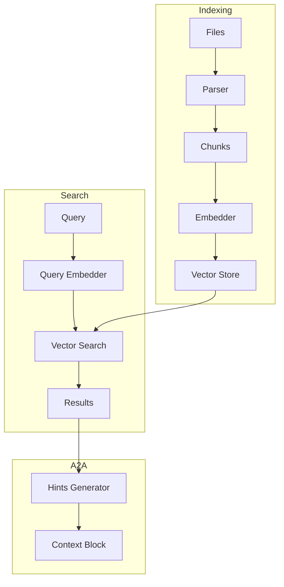

# Embedding Models

## Обзор

Embedding модели преобразуют текст и код в плотные векторные представления фиксированной размерности. Эти векторы позволяют выполнять семантический поиск — находить релевантный код даже при отсутствии точных совпадений терминов.

## Назначение и область применения

### Основные use cases

| Use case | Описание | Приоритет |
|----------|----------|-----------|
| Семантический поиск | Поиск по смыслу, а не по ключевым словам | Высокий |
| Кластеризация кода | Группировка похожих файлов/функций | Средний |
| Дубликаты | Обнаружение дублирующегося кода | Средний |
| Рекомендации | "Похие файлы" для контекста | Низкий |

### Ограничения

> **Важно:** На основе практического опыта — чистый embedding search менее эффективен для кода, чем fulltext. Рекомендуется использовать в составе hybrid подхода.

## Типы embedding моделей

### 1. Code-specific модели

#### CodeBERT

**Описание:** Модель от Microsoft, специально обученная на коде.

**Характеристики:**
- Размерность: 768
- Языки: Python, Java, JavaScript, PHP, Ruby, Go
- Задачи: code search, summarization, generation

**Пример использования:**

```python
from transformers import AutoTokenizer, AutoModel

tokenizer = AutoTokenizer.from_pretrained("microsoft/codebert-base")
model = AutoModel.from_pretrained("microsoft/codebert-base")

code = """
public function createUser(array $data): User {
    return User::create($data);
}
"""

inputs = tokenizer(code, return_tensors="pt")
embeddings = model(**inputs).last_hidden_state.mean(dim=1)
```

#### GraphCodeBERT

**Описание:** Расширение CodeBERT с учетом структуры кода (data flow).

**Характеристики:**
- Размерность: 768
- Учитывает: AST, data flow, control flow
- Лучше для: сложных запросов, зависимостей

#### CodeT5

**Описание:** Seq2seq модель для задач с кодом.

**Характеристики:**
- Поддержка: generation, summarization, translation
- Языки: мультиязычная

### 2. General-purpose модели

#### Sentence-BERT (SBERT)

**Описание:** BERT-модели, fine-tuned для sentence embeddings.

**Характеристики:**
- Размерность: 384-768
- Быстрая генерация embeddings
- Хорошо для текстовых запросов

#### OpenAI Embeddings

**Описание:** API-based embeddings от OpenAI.

**Характеристики:**
- Размерность: 1536 (text-embedding-3-small), 3072 (text-embedding-3-large)
- Высокое качество
- Требует API calls

**Пример:**

```php
use OpenAI\Client;

$client = OpenAI::client('your-api-key');

$response = $client->embeddings()->create([
    'model' => 'text-embedding-3-small',
    'input' => 'createUser method in UserService'
]);

$embedding = $response->embeddings[0]->embedding;
```

### 3. Модели для PHP/JavaScript

#### Рекомендуемые модели для Laravel/Vue

| Модель | Размерность | PHP | JS/TS | Рекомендация |
|--------|-------------|-----|-------|--------------|
| CodeBERT | 768 | ✅ | ✅ | ⭐⭐⭐ |
| UniXcoder | 768 | ✅ | ✅ | ⭐⭐⭐ |
| CodeT5+ | 768 | ✅ | ✅ | ⭐⭐ |
| OpenAI | 1536 | ✅ | ✅ | ⭐⭐ (API) |

## Входные и выходные данные

### Входные данные

```php
class EmbeddingInput {
    public string $content;      // Код или текст
    public string $type;         // php, vue, js, text
    public ?string $context;     // Окружающий контекст
    public ?array $metadata;     // Дополнительные данные
}
```

### Выходные данные

```php
class EmbeddingOutput {
    public array $vector;        // Вектор размерности 768/1536
    public float $norm;          // L2 норма вектора
    public int $tokens;          // Количество токенов
    public string $model;        // Использованная модель
}
```

### Пример структуры

```json
{
  "input": {
    "content": "public function createUser(array $data): User { return User::create($data); }",
    "type": "php",
    "context": "class UserService",
    "metadata": {
      "file": "app/Services/UserService.php",
      "line_start": 15,
      "line_end": 20
    }
  },
  "output": {
    "vector": [0.123, -0.456, 0.789, ...],
    "norm": 1.0,
    "tokens": 25,
    "model": "codebert-base"
  }
}
```

## Преимущества и недостатки

### Преимущества

| Преимущество | Описание |
|--------------|----------|
| **Семантический поиск** | Находит код по смыслу, а не по ключевым словам |
| **Мультиязычность** | Работает с разными языками программирования |
| **Устойчивость к опечаткам** | Векторные представления сглаживают ошибки |
| **Похожесть** | Вычисление similarity между кусками кода |

### Недостатки

| Недостаток | Описание | Решение |
|------------|----------|---------|
| **Требует GPU** | Медленно на CPU | Использовать API или оптимизированные модели |
| **Неточные совпадения** | Может пропустить точные совпадения | Комбинировать с sparse |
| **Черный ящик** | Сложно объяснить результаты | Добавить explainability layer |
| **Размер модели** | 100MB-5GB | Использовать quantized модели |

## Интеграция с A2A протоколом

### Архитектура интеграции



### Генерация hints

```php
class EmbeddingHintGenerator {
    public function generate(string $query, int $topK = 5): array {
        // 1. Получить embedding запроса
        $queryEmbedding = $this->embedder->embed($query);
        
        // 2. Найти ближайшие векторы
        $results = $this->vectorStore->search($queryEmbedding, $topK);
        
        // 3. Сгенерировать hints
        $hints = [];
        foreach ($results as $result) {
            $hints[] = sprintf(
                "hint: %s:%d-%d содержит %s - score: %.2f",
                $result['file'],
                $result['line_start'],
                $result['line_end'],
                $result['symbol'],
                $result['score']
            );
        }
        
        return $hints;
    }
}
```

### Пример context block

```json
{
  "new_task": [
    "Найти методы валидации пользователя",
    "hint: UserService.php:45-60 содержит validateUser - score: 0.89",
    "hint: Validator.php:15-30 содержит validateEmail - score: 0.85",
    "hint: AuthController.php:80-95 содержит validateCredentials - score: 0.82"
  ]
}
```

## Оптимизация для Laravel/Vue

### Токенизация для PHP

```php
class PhpTokenizer {
    public function tokenize(string $code): array {
        $tokens = token_get_all($code);
        
        $significant = [];
        foreach ($tokens as $token) {
            if (is_array($token)) {
                $type = $token[0];
                $value = $token[1];
                
                // Значимые типы токенов
                if (in_array($type, [
                    T_STRING,      // Имена классов, функций
                    T_VARIABLE,    // Переменные
                    T_FUNCTION,    // function
                    T_CLASS,       // class
                    T_NAMESPACE    // namespace
                ])) {
                    $significant[] = $value;
                }
            }
        }
        
        return $significant;
    }
}
```

### Токенизация для Vue

```javascript
class VueTokenizer {
    tokenize(content) {
        const tokens = [];
        
        // Извлечение из template
        const templateMatch = content.match(/<template>(.*?)<\/template>/s);
        if (templateMatch) {
            tokens.push(...this.extractTemplateTokens(templateMatch[1]));
        }
        
        // Извлечение из script
        const scriptMatch = content.match(/<script.*?>(.*?)<\/script>/s);
        if (scriptMatch) {
            tokens.push(...this.extractScriptTokens(scriptMatch[1]));
        }
        
        return tokens;
    }
    
    extractTemplateTokens(template) {
        // Извлечение имен компонентов, директив, событий
        const componentNames = template.match(/<[A-Z][a-zA-Z0-9]*/g) || [];
        const directives = template.match(/v-[a-z]+/g) || [];
        const events = template.match(/@[a-z]+/g) || [];
        
        return [...componentNames, ...directives, ...events];
    }
}
```

## Кеширование и оптимизация

### Стратегии кеширования

```php
class CachedEmbedder {
    private EmbedderInterface $embedder;
    private CacheInterface $cache;
    
    public function embed(string $content): array {
        $hash = md5($content);
        $cacheKey = "embedding:{$hash}";
        
        return $this->cache->remember($cacheKey, 86400, function() use ($content) {
            return $this->embedder->embed($content);
        });
    }
}
```

### Batch обработка

```php
class BatchEmbedder {
    public function embedBatch(array $contents, int $batchSize = 32): array {
        $embeddings = [];
        
        foreach (array_chunk($contents, $batchSize) as $batch) {
            $batchEmbeddings = $this->embedder->embedBatch($batch);
            $embeddings = array_merge($embeddings, $batchEmbeddings);
        }
        
        return $embeddings;
    }
}
```

## Готовые решения

### Vector Stores

| Хранилище | Описание | Рекомендация |
|-----------|----------|--------------|
| **Pinecone** | Cloud, managed | ⭐⭐⭐ Production |
| **Weaviate** | Open-source, hybrid | ⭐⭐⭐ Self-hosted |
| **Qdrant** | Rust, fast | ⭐⭐⭐ Self-hosted |
| **Milvus** | Scalable | ⭐⭐ Large scale |
| **pgvector** | PostgreSQL extension | ⭐⭐ Laravel integration |

### Пример с pgvector

```php
// Миграция
Schema::create('code_embeddings', function (Blueprint $table) {
    $table->id();
    $table->string('file_path');
    $table->integer('line_start');
    $table->integer('line_end');
    $table->text('content');
    $table->vector('embedding', 768);
    $table->timestamps();
});

// Поиск
class CodeEmbedding extends Model {
    public function scopeSimilarTo($query, array $embedding, int $limit = 10) {
        return $query->select('*')
            ->selectRaw('embedding <=> ? as distance', [json_encode($embedding)])
            ->orderBy('distance')
            ->limit($limit);
    }
}

// Использование
$results = CodeEmbedding::similarTo($queryEmbedding, 10)->get();
```

## Резюме

Embedding модели — важный компонент для семантического поиска, но:

1. ✅ Использовать в составе hybrid подхода
2. ✅ CodeBERT или UniXcoder для кода
3. ✅ pgvector для интеграции с Laravel
4. ⚠️ Не полагаться только на embeddings
5. ❌ Не писать скрипты с нуля — использовать готовые решения
