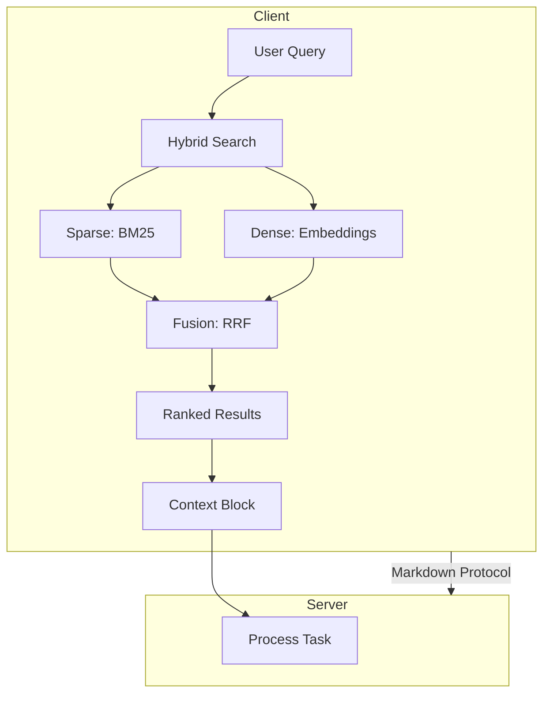

# Hybrid Retrieval Models

## Обзор

Hybrid retrieval комбинирует преимущества sparse (fulltext) и dense (embedding) методов поиска. Это позволяет достичь высокой точности при сохранении скорости работы.

## Принцип работы

### Архитектура гибридного поиска

```
┌─────────────────────────────────────────────────────────────────┐
│                    Hybrid Search Pipeline                        │
├─────────────────────────────────────────────────────────────────┤
│                                                                  │
│   Query ──────┬─────────────────────────────────────────────────┤
│               │                                                  │
│               ▼                                                  │
│   ┌───────────────────────┐      ┌───────────────────────┐      │
│   │   Sparse Branch       │      │   Dense Branch        │      │
│   │                       │      │                       │      │
│   │   ┌─────────────┐     │      │   ┌─────────────┐     │      │
│   │   │  Tokenize   │     │      │   │   Embed     │     │      │
│   │   └──────┬──────┘     │      │   └──────┬──────┘     │      │
│   │          │            │      │          │            │      │
│   │          ▼            │      │          ▼            │      │
│   │   ┌─────────────┐     │      │   ┌─────────────┐     │      │
│   │   │    BM25     │     │      │   │   Vector    │     │      │
│   │   └──────┬──────┘     │      │   │   Search    │     │      │
│   │          │            │      │   └──────┬──────┘     │      │
│   │          │            │      │          │            │      │
│   │   Results A           │      │   Results B           │      │
│   └──────────┬────────────┘      └──────────┬────────────┘      │
│              │                              │                    │
│              └──────────────┬───────────────┘                    │
│                             │                                    │
│                             ▼                                    │
│                    ┌─────────────────┐                          │
│                    │  Fusion Layer   │                          │
│                    │                 │                          │
│                    │  RRF / Weighted │                          │
│                    └────────┬────────┘                          │
│                             │                                    │
│                             ▼                                    │
│                    ┌─────────────────┐                          │
│                    │  Final Results  │                          │
│                    └─────────────────┘                          │
│                                                                  │
└─────────────────────────────────────────────────────────────────┘
```

## Методы объединения результатов

### 1. Reciprocal Rank Fusion (RRF)

**Описание:** Объединение рангов результатов из разных источников.

**Формула:**

```
RRF_score(d) = Σ 1 / (k + rank_i(d))
```

где:
- `k` = 60 (типичное значение)
- `rank_i(d)` — ранг документа d в источнике i

**Пример:**

```php
function reciprocalRankFusion(array $results, int $k = 60): array {
    $scores = [];
    
    foreach ($results as $source => $documents) {
        foreach ($documents as $rank => $doc) {
            $docId = $doc['id'];
            if (!isset($scores[$docId])) {
                $scores[$docId] = 0;
            }
            $scores[$docId] += 1 / ($k + $rank + 1);
        }
    }
    
    arsort($scores);
    return array_keys($scores);
}
```

### 2. Weighted Score Fusion

**Описание:** Взвешенное объединение нормализованных score.

**Формула:**

```
final_score(d) = α * sparse_score(d) + β * dense_score(d)
```

**Рекомендуемые веса:**

| Сценарий | α (sparse) | β (dense) |
|----------|------------|-----------|
| Точные совпадения | 0.7 | 0.3 |
| Семантический поиск | 0.3 | 0.7 |
| Сбалансированный | 0.5 | 0.5 |
| Код (рекомендуется) | 0.6 | 0.4 |

### 3. Learning to Rank (LTR)

**Описание:** ML-модель для оптимального объединения.

**Особенности:**
- Требует обучающих данных
- Адаптируется под конкретный домен
- Наилучшая точность при наличии данных

## Практическая реализация

### Структура класса HybridSearch

```php
class HybridSearch {
    private SparseIndex $sparseIndex;
    private DenseIndex $denseIndex;
    private FusionStrategy $fusion;
    
    public function search(string $query, array $options = []): array {
        // 1. Параллельный поиск
        $sparseResults = $this->sparseIndex->search($query, [
            'limit' => $options['limit'] ?? 100
        ]);
        
        $denseResults = $this->denseIndex->search($query, [
            'limit' => $options['limit'] ?? 100
        ]);
        
        // 2. Объединение результатов
        $fusedResults = $this->fusion->combine(
            $sparseResults,
            $denseResults,
            $options['weights'] ?? [0.6, 0.4]
        );
        
        // 3. Ранжирование и фильтрация
        return $this->rankAndFilter($fusedResults, $options);
    }
}
```

### Интеграция с A2A протоколом



## Оптимизация производительности

### Кеширование

```php
class CachedHybridSearch {
    private CacheInterface $cache;
    private HybridSearch $search;
    
    public function search(string $query, array $options = []): array {
        $cacheKey = $this->generateCacheKey($query, $options);
        
        return $this->cache->remember($cacheKey, 300, function() use ($query, $options) {
            return $this->search->search($query, $options);
        });
    }
}
```

### Асинхронный поиск

```php
class AsyncHybridSearch {
    public async function search(string $query): Promise {
        // Параллельное выполнение
        [$sparse, $dense] = await Promise::all([
            $this->sparseIndex->searchAsync($query),
            $this->denseIndex->searchAsync($query)
        ]);
        
        return $this->fusion->combine($sparse, $dense);
    }
}
```

## Адаптивное взвешивание

### На основе типа запроса

```php
class AdaptiveWeighting {
    public function getWeights(string $query): array {
        // Определение типа запроса
        if ($this->isExactMatchQuery($query)) {
            return ['sparse' => 0.8, 'dense' => 0.2];
        }
        
        if ($this->isSemanticQuery($query)) {
            return ['sparse' => 0.3, 'dense' => 0.7];
        }
        
        if ($this->isCodeQuery($query)) {
            return ['sparse' => 0.6, 'dense' => 0.4];
        }
        
        return ['sparse' => 0.5, 'dense' => 0.5];
    }
    
    private function isExactMatchQuery(string $query): bool {
        // Запрос содержит точные имена классов/методов
        return preg_match('/^[A-Z][a-zA-Z0-9_]+$/', $query) ||
               preg_match('/->\w+\(/', $query);
    }
    
    private function isSemanticQuery(string $query): bool {
        // Естественный язык
        return str_word_count($query) > 3;
    }
    
    private function isCodeQuery(string $query): bool {
        // Смешанный запрос
        return preg_match('/[{}();$]/', $query);
    }
}
```

## Примеры использования

### Пример 1: Поиск метода в Laravel проекте

**Запрос:**
```
"createUser method in UserService"
```

**Результаты:**

| Источник | Файл | Score | Ранг |
|----------|------|-------|------|
| Sparse | app/Services/UserService.php | 0.92 | 1 |
| Dense | app/Services/UserService.php | 0.85 | 2 |
| **Fused** | app/Services/UserService.php | **0.89** | **1** |

### Пример 2: Семантический поиск

**Запрос:**
```
"как валидировать email при регистрации"
```

**Результаты:**

| Источник | Файл | Score | Ранг |
|----------|------|-------|------|
| Sparse | app/Validators/EmailValidator.php | 0.65 | 3 |
| Dense | app/Services/AuthService.php | 0.88 | 1 |
| **Fused** | app/Services/AuthService.php | **0.78** | **1** |

## Готовые решения

### Рекомендуемые библиотеки

| Библиотека | Описание | Интеграция |
|------------|----------|------------|
| **Meilisearch + OpenAI** | Hybrid search с embeddings | API |
| **Typesense** | Built-in vector search | Self-hosted |
| **Pinecone + BM25** | Cloud vector + local sparse | Hybrid |
| **Elasticsearch** | Dense + Sparse в одном | Self-hosted |

### Пример с Typesense

```php
// Конфигурация
$client = new Typesense\Client([
    'nodes' => [['host' => 'localhost', 'port' => '8108']],
    'api_key' => 'your-api-key'
]);

// Создание коллекции с векторами
$client->collections->create([
    'name' => 'code_index',
    'fields' => [
        ['name' => 'content', 'type' => 'string'],
        ['name' => 'embedding', 'type' => 'float[]', 'num_dim' => 768],
        ['name' => 'type', 'type' => 'string'],
        ['name' => 'framework', 'type' => 'string']
    ]
]);

// Гибридный поиск
$results = $client->collections['code_index']->documents->search([
    'q' => 'createUser',
    'query_by' => 'content,embedding',
    'vector_query' => 'embedding:([0.1, 0.2, ...], k: 100)'
]);
```

## Метрики качества

### Оценка эффективности

| Метрика | Sparse | Dense | Hybrid |
|---------|--------|-------|--------|
| Precision@10 | 0.72 | 0.68 | **0.81** |
| Recall@100 | 0.85 | 0.78 | **0.91** |
| MRR | 0.65 | 0.61 | **0.74** |
| Latency (ms) | 15 | 45 | 60 |

### A/B тестирование

```php
class HybridSearchExperiment {
    public function run(string $query, string $variant): array {
        switch ($variant) {
            case 'sparse_only':
                return $this->sparseSearch($query);
            case 'dense_only':
                return $this->denseSearch($query);
            case 'hybrid_rrf':
                return $this->hybridSearchRRF($query);
            case 'hybrid_weighted':
                return $this->hybridSearchWeighted($query);
        }
    }
    
    public function logMetrics(string $query, string $variant, array $results, float $latency): void {
        // Логирование для анализа
        $this->logger->info('search_experiment', [
            'query' => $query,
            'variant' => $variant,
            'result_count' => count($results),
            'latency_ms' => $latency,
            'timestamp' => time()
        ]);
    }
}
```

## Резюме

Hybrid retrieval — это **оптимальный подход** для A2A приложения:

1. ✅ Комбинирует преимущества sparse и dense методов
2. ✅ RRF — простой и эффективный метод объединения
3. ✅ Адаптивное взвешивание улучшает точность
4. ✅ Использовать готовые решения (Typesense, Elasticsearch)
5. ⚠️ Мониторить latency при добавлении dense branch
