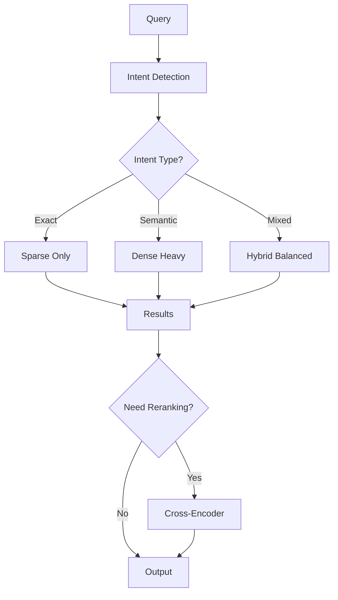
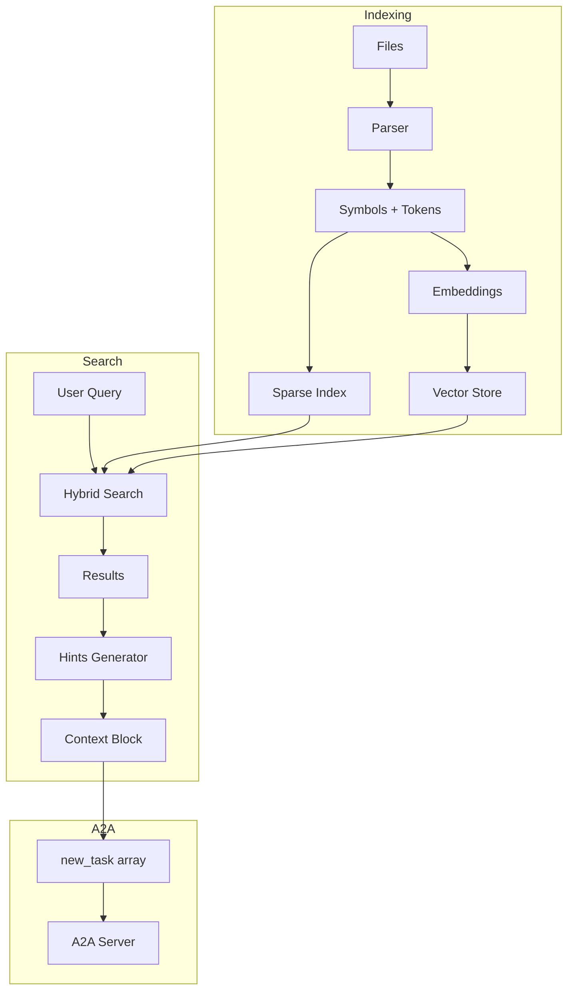
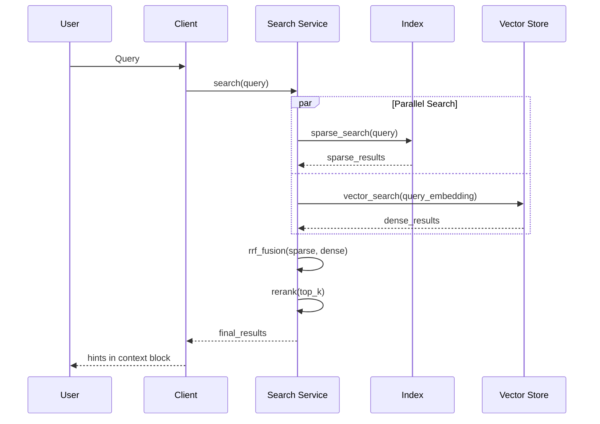

# Рекомендации по выбору ML моделей

## Обзор

Данный документ содержит практические рекомендации по выбору и комбинации ML моделей для A2A приложения, основанные на практическом опыте: **Fulltext показал лучшие результаты**, RAG и Graph не удалось реализовать скриптами.

---

## Критерии выбора модели

### 1. По типу запроса

| Тип запроса | Пример | Рекомендуемая модель |
|-------------|--------|----------------------|
| **Точное имя** | `UserService` | Sparse (BM25) |
| **Код с синтаксисом** | `->createUser(` | Sparse (BM25) |
| **Естественный язык** | "как создать пользователя" | Hybrid или RAG |
| **Зависимости** | "кто использует UserService" | Graph (готовое решение) |
| **Смешанный** | "методы валидации в User" | Hybrid |

### 2. По размеру проекта

| Размер проекта | Файлов | Рекомендация |
|----------------|--------|--------------|
| **Малый** | < 100 | Sparse достаточно |
| **Средний** | 100-1000 | Hybrid (Sparse + Dense) |
| **Большой** | > 1000 | Hybrid + Reranking |

### 3. По доступным ресурсам

| Ресурсы | CPU | GPU | Рекомендация |
|---------|-----|-----|--------------|
| **Минимальные** | ✅ | ❌ | Sparse (Meilisearch) |
| **Средние** | ✅ | ❌ | Hybrid (API embeddings) |
| **Высокие** | ✅ | ✅ | Full Hybrid (локальные модели) |

---

## Рекомендуемые конфигурации

### Конфигурация 1: Минимальная (рекомендуется для старта)

```
┌─────────────────────────────────────────────────────────────────┐
│                    Minimal Configuration                         │
├─────────────────────────────────────────────────────────────────┤
│                                                                  │
│   Компоненты:                                                    │
│   ┌─────────────────────────────────────────────────────────┐   │
│   │  Meilisearch / Typesense                                │   │
│   │  - BM25 поиск                                           │   │
│   │  - Фильтрация по типу файла                             │   │
│   │  - Typo tolerance                                       │   │
│   └─────────────────────────────────────────────────────────┘   │
│                                                                  │
│   Ресурсы: CPU only, ~100MB RAM                                 │
│   Latency: < 50ms                                               │
│   Качество: ⭐⭐⭐ для кода                                      │
│                                                                  │
└─────────────────────────────────────────────────────────────────┘
```

**Реализация:**

```php
// config/scout.php
return [
    'driver' => 'meilisearch',
    'host' => env('MEILISEARCH_HOST', 'http://localhost:7700'),
    'key' => env('MEILISEARCH_KEY', null),
];

// Модель для индексации
class CodeFile extends Model {
    use Searchable;
    
    public function toSearchableArray(): array {
        return [
            'path' => $this->path,
            'content' => $this->content,
            'type' => $this->type,        // php, vue, js
            'framework' => $this->framework, // laravel, vue
            'symbols' => $this->symbols,   // классы, методы
        ];
    }
}
```

### Конфигурация 2: Стандартная (рекомендуется)

```
┌─────────────────────────────────────────────────────────────────┐
│                   Standard Configuration                         │
├─────────────────────────────────────────────────────────────────┤
│                                                                  │
│   Компоненты:                                                    │
│   ┌─────────────────────────────────────────────────────────┐   │
│   │  1. Meilisearch (Sparse)                                │   │
│   │     - BM25 поиск                                        │   │
│   │     - Быстрый retrieval                                 │   │
│   └─────────────────────────────────────────────────────────┘   │
│   ┌─────────────────────────────────────────────────────────┐   │
│   │  2. pgvector (Dense)                                    │   │
│   │     - Embeddings для семантики                          │   │
│   │     - Интеграция с Laravel                              │   │
│   └─────────────────────────────────────────────────────────┘   │
│   ┌─────────────────────────────────────────────────────────┐   │
│   │  3. RRF Fusion                                          │   │
│   │     - Объединение результатов                           │   │
│   └─────────────────────────────────────────────────────────┘   │
│                                                                  │
│   Ресурсы: CPU, ~500MB RAM                                      │
│   Latency: < 100ms                                              │
│   Качество: ⭐⭐⭐⭐                                              │
│                                                                  │
└─────────────────────────────────────────────────────────────────┘
```

**Реализация:**

```php
class HybridSearchService {
    public function search(string $query, int $limit = 20): array {
        // 1. Sparse search
        $sparseResults = $this->meilisearch->search($query, [
            'limit' => 100
        ]);
        
        // 2. Dense search
        $queryEmbedding = $this->embedder->embed($query);
        $denseResults = CodeEmbedding::similarTo($queryEmbedding, 100);
        
        // 3. RRF Fusion
        return $this->rrfFusion($sparseResults, $denseResults, $limit);
    }
    
    private function rrfFusion(array $sparse, array $dense, int $k): array {
        $scores = [];
        $k_rff = 60;
        
        foreach ($sparse as $rank => $doc) {
            $scores[$doc['id']] = $scores[$doc['id']] ?? 0;
            $scores[$doc['id']] += 1 / ($k_rff + $rank + 1);
        }
        
        foreach ($dense as $rank => $doc) {
            $scores[$doc['id']] = $scores[$doc['id']] ?? 0;
            $scores[$doc['id']] += 1 / ($k_rff + $rank + 1);
        }
        
        arsort($scores);
        return array_slice(array_keys($scores), 0, $k);
    }
}
```

### Конфигурация 3: Продвинутая

```
┌─────────────────────────────────────────────────────────────────┐
│                   Advanced Configuration                         │
├─────────────────────────────────────────────────────────────────┤
│                                                                  │
│   Компоненты:                                                    │
│   ┌─────────────────────────────────────────────────────────┐   │
│   │  1. Meilisearch (Sparse)                                │   │
│   └─────────────────────────────────────────────────────────┘   │
│   ┌─────────────────────────────────────────────────────────┐   │
│   │  2. pgvector + CodeBERT (Dense)                         │   │
│   └─────────────────────────────────────────────────────────┘   │
│   ┌─────────────────────────────────────────────────────────┐   │
│   │  3. Cross-Encoder Reranking                             │   │
│   │     - Cohere API или локальная модель                   │   │
│   └─────────────────────────────────────────────────────────┘   │
│   ┌─────────────────────────────────────────────────────────┐   │
│   │  4. Intent Detection                                    │   │
│   │     - Классификация типа запроса                        │   │
│   └─────────────────────────────────────────────────────────┘   │
│                                                                  │
│   Ресурсы: CPU + GPU/API, ~1GB RAM                              │
│   Latency: < 200ms                                              │
│   Качество: ⭐⭐⭐⭐⭐                                             │
│                                                                  │
└─────────────────────────────────────────────────────────────────┘
```

**Реализация:**

```php
class AdvancedSearchService {
    public function search(string $query): array {
        // 1. Определить intent
        $intent = $this->intentDetector->detect($query);
        
        // 2. Выбрать стратегию на основе intent
        $strategy = $this->selectStrategy($intent);
        
        // 3. Выполнить поиск
        $candidates = $this->executeSearch($query, $strategy);
        
        // 4. Reranking
        if ($strategy->needsReranking()) {
            $candidates = $this->reranker->rerank($query, $candidates);
        }
        
        return $candidates;
    }
    
    private function selectStrategy(Intent $intent): SearchStrategy {
        return match($intent->type) {
            Intent::EXACT_MATCH => new SparseOnlyStrategy(),
            Intent::SEMANTIC => new DenseHeavyStrategy(),
            Intent::HYBRID => new BalancedHybridStrategy(),
            default => new BalancedHybridStrategy()
        };
    }
}
```

---

## Комбинирование моделей

### Схема комбинации



### Веса для разных сценариев

```php
class WeightConfig {
    public static function forCode(): array {
        return [
            'sparse' => 0.7,  // Код = точные совпадения
            'dense' => 0.3
        ];
    }
    
    public static function forDocumentation(): array {
        return [
            'sparse' => 0.3,
            'dense' => 0.7   // Документация = семантика
        ];
    }
    
    public static function forMixed(): array {
        return [
            'sparse' => 0.5,
            'dense' => 0.5
        ];
    }
}
```

---

## Оптимизация под Laravel/Vue проекты

### Специализированные настройки

```php
// config/code_search.php
return [
    'file_types' => [
        'php' => [
            'weight' => 1.0,
            'tokenizer' => 'php_tokenizer',
            'symbols' => ['class', 'function', 'method', 'variable'],
        ],
        'vue' => [
            'weight' => 0.9,
            'tokenizer' => 'vue_tokenizer',
            'symbols' => ['component', 'props', 'emits', 'methods'],
        ],
        'js' => [
            'weight' => 0.8,
            'tokenizer' => 'js_tokenizer',
            'symbols' => ['function', 'class', 'export', 'import'],
        ],
    ],
    
    'framework_hints' => [
        'laravel' => [
            'service' => 1.2,
            'controller' => 1.1,
            'model' => 1.0,
            'middleware' => 0.9,
        ],
        'vue' => [
            'component' => 1.1,
            'composable' => 1.0,
            'page' => 0.9,
        ],
    ],
];
```

### Laravel-специфичные токены

```php
class LaravelTokenizer {
    private array $laravelKeywords = [
        // Eloquent
        'hasMany', 'belongsTo', 'belongsToMany', 'hasOne', 'morphMany',
        // Controllers
        'Controller', 'Middleware', 'Request', 'Response', 'validate',
        // Service Container
        'app', 'resolve', 'bind', 'singleton',
        // Routes
        'Route', 'get', 'post', 'put', 'delete', 'patch',
        // Blade
        '@if', '@foreach', '@yield', '@section', '@extends',
    ];
    
    public function tokenize(string $code): array {
        $tokens = parent::tokenize($code);
        
        // Добавить Laravel-специфичные токены
        foreach ($this->laravelKeywords as $keyword) {
            if (str_contains($code, $keyword)) {
                $tokens[] = 'laravel:' . $keyword;
            }
        }
        
        return $tokens;
    }
}
```

### Vue-специфичные токены

```javascript
class VueTokenizer {
    tokenize(content) {
        const tokens = [];
        
        // Composition API
        const compositionApi = ['ref', 'reactive', 'computed', 'watch', 
                                'onMounted', 'onUnmounted', 'useRef'];
        
        // Inertia.js
        const inertia = ['usePage', 'useForm', 'router', 'Link'];
        
        // Извлечение из SFC
        if (content.includes('<script setup>')) {
            tokens.push('vue:script-setup');
        }
        
        return tokens;
    }
}
```

---

## Практические схемы интеграции

### Схема 1: Интеграция с Context Block



### Схема 2: Поток данных при поиске



### Схема 3: Кеширование

```php
class CachedSearchService {
    private CacheInterface $cache;
    private SearchService $search;
    
    public function search(string $query, array $options = []): array {
        $cacheKey = $this->generateKey($query, $options);
        
        return $this->cache->remember($cacheKey, 300, function() use ($query, $options) {
            return $this->search->search($query, $options);
        });
    }
    
    public function invalidateFile(string $path): void {
        // Инвалидация кеша при изменении файла
        $pattern = "search:*:{$path}:*";
        $this->cache->deletePattern($pattern);
    }
}
```

---

## Готовые решения (не писать скрипты!)

### Поисковые движки

| Решение | Тип | Рекомендация | Ссылка |
|---------|-----|--------------|--------|
| **Meilisearch** | Sparse | ⭐⭐⭐ | meilisearch.com |
| **Typesense** | Hybrid | ⭐⭐⭐ | typesense.org |
| **Elasticsearch** | Full | ⭐⭐ | elastic.co |
| **TNTSearch** | PHP | ⭐⭐ | github.com/teamtnt/tntsearch |

### Vector Stores

| Решение | Тип | Рекомендация | Ссылка |
|---------|-----|--------------|--------|
| **pgvector** | PostgreSQL | ⭐⭐⭐ | github.com/pgvector/pgvector |
| **Qdrant** | Standalone | ⭐⭐⭐ | qdrant.tech |
| **Weaviate** | Hybrid | ⭐⭐⭐ | weaviate.io |
| **Pinecone** | Cloud | ⭐⭐ | pinecone.io |

### Reranking

| Решение | Тип | Рекомендация | Ссылка |
|---------|-----|--------------|--------|
| **Cohere Rerank** | API | ⭐⭐⭐ | cohere.com |
| **Jina Reranker** | API/Local | ⭐⭐⭐ | jina.ai |
| **sentence-transformers** | Local | ⭐⭐ | sbert.net |

### Embeddings

| Решение | Тип | Рекомендация | Ссылка |
|---------|-----|--------------|--------|
| **OpenAI** | API | ⭐⭐⭐ | openai.com |
| **CodeBERT** | Local | ⭐⭐⭐ | huggingface.co |
| **Voyage AI** | API | ⭐⭐ | voyageai.com |

---

## Чек-лист внедрения

### Фаза 1: Основа (1-2 дня)

- [ ] Установить Meilisearch/Typesense
- [ ] Настроить индексацию файлов проекта
- [ ] Реализовать базовый поиск
- [ ] Интегрировать с context block

### Фаза 2: Улучшение (3-5 дней)

- [ ] Добавить pgvector для embeddings
- [ ] Реализовать hybrid search
- [ ] Настроить RRF fusion
- [ ] Оптимизировать веса

### Фаза 3: Продвинутые функции (опционально)

- [ ] Добавить reranking через API
- [ ] Реализовать intent detection
- [ ] Настроить кеширование
- [ ] Добавить аналитику поиска

---

## Резюме

### Главные принципы

1. **Начинать с Sparse** — Fulltext проверен опытом
2. **Не писать скрипты** — использовать готовые решения
3. **Добавлять Dense постепенно** — для улучшения семантики
4. **Reranking в конце** — для точного top-k
5. **Кешировать всё** — скорость критична

### Рекомендуемый стек для A2A

```
Meilisearch (Sparse) + pgvector (Dense) + Cohere (Reranking)
```

Это сочетание:
- ✅ Проверено опытом
- ✅ Минимальные ресурсы
- ✅ Готовые решения
- ✅ Хорошее качество
- ✅ Простая интеграция с Laravel
