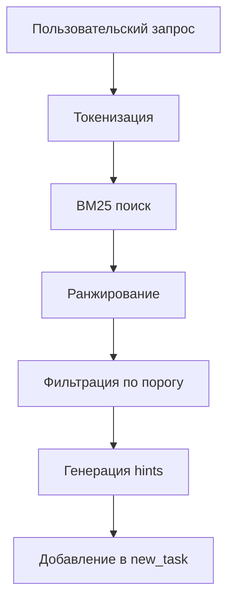
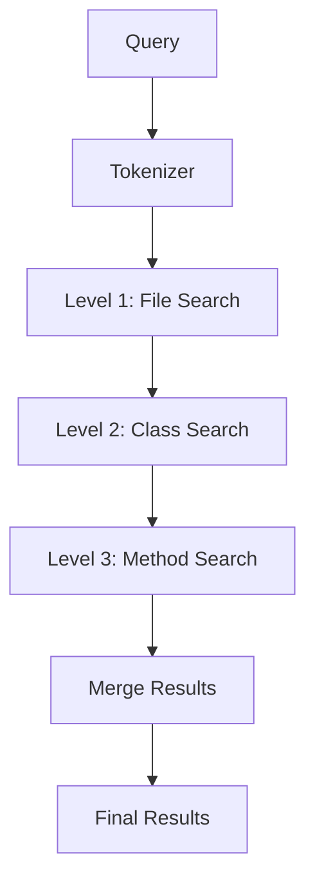
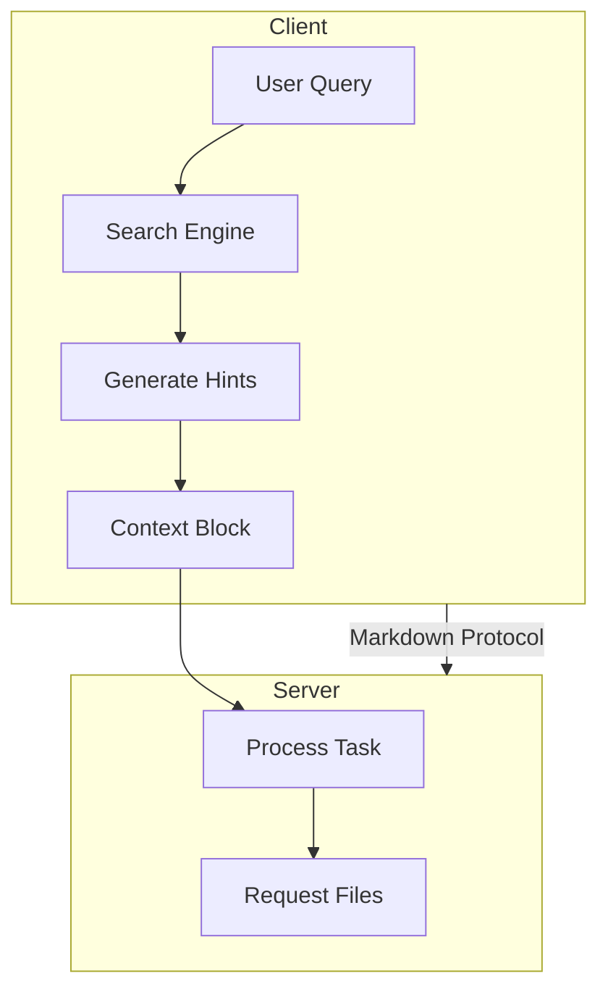

# Sparse Retrieval Models

## Обзор

Sparse retrieval модели — это основа fulltext поиска, показавшая **наилучшие результаты** в практическом опыте пользователя. Данный подход использует классические информационно-поисковые алгоритмы без нейронных сетей.

## Почему Sparse Retrieval работает лучше

### Преимущества

| Критерий | Sparse Retrieval | RAG/Graph |
|----------|------------------|-----------|
| **Скорость** | ⚡ Очень быстрая | 🐢 Медленная |
| **Точность** | ✅ Высокая для кода | ⚠️ Зависит от модели |
| **Простота** | ✅ Готовые решения | ❌ Требует настройки |
| **Ресурсы** | 💾 Минимальные | 💾 Высокие |
| **Предсказуемость** | ✅ Детерминированная | ❌ Стохастическая |

### Ключевой вывод из опыта

> **Fulltext поиск показал лучшие результаты**, тогда как RAG и Graph индексы не удалось реализовать через скрипты. Рекомендуется использовать готовые решения для sparse retrieval.

## Алгоритмы

### 1. BM25 (Best Matching 25)

**Описание:** Стандартный алгоритм ранжирования для поисковых систем.

**Формула:**

```
score(D, Q) = Σ IDF(qi) * (f(qi, D) * (k1 + 1)) / (f(qi, D) + k1 * (1 - b + b * |D| / avgdl))
```

**Параметры:**
- `k1` = 1.2-2.0 — насыщение частоты термина
- `b` = 0.75 — нормализация длины документа
- `avgdl` — средняя длина документа в коллекции

**Применение к коду:**

```php
// Пример индексации PHP файла
$document = [
    'id' => 'app/Services/UserService.php',
    'content' => 'class UserService { public function createUser(array $data): User { ... } }',
    'tokens' => ['class', 'UserService', 'public', 'function', 'createUser', 'array', 'data', 'User'],
    'length' => 150,
    'type' => 'php',
    'framework' => 'laravel'
];
```

### 2. TF-IDF (Term Frequency - Inverse Document Frequency)

**Описание:** Классический метод взвешивания терминов.

**Формула:**

```
TF-IDF(t, d) = TF(t, d) * IDF(t)
TF(t, d) = count(t in d) / |d|
IDF(t) = log(N / df(t))
```

**Когда использовать:**
- Быстрый прототип
- Малые коллекции кода
- Базовое ранжирование

### 3. SPLADE (Sparse Lexical and Expansion)

**Описание:** Современный подход, комбинирующий sparse с ML для расширения запросов.

**Преимущества:**
- Автоматическое расширение терминов
- Синонимы и связанные концепции
- Сохраняет sparse структуру

**Пример:**

```
Запрос: "валидация пользователя"
Расширенный запрос: "валидация", "проверка", "validation", "user", "пользователь", "auth", "authenticate"
```

## Структура индекса

### Схема индекса для кода

```json
{
  "index_version": "1.0",
  "project_hash": "sha256...",
  "documents": [
    {
      "id": "app/Services/UserService.php",
      "path": "app/Services/UserService.php",
      "tokens": {
        "UserService": 5,
        "createUser": 3,
        "updateUser": 2,
        "deleteUser": 1,
        "User": 8,
        "array": 4,
        "data": 6
      },
      "metadata": {
        "lines": 150,
        "language": "php",
        "framework": "laravel",
        "type": "service",
        "class": "UserService",
        "methods": ["createUser", "updateUser", "deleteUser"],
        "imports": ["App\\Models\\User", "Illuminate\\Support\\Facades\\DB"],
        "last_modified": "2024-01-15T10:30:00Z"
      }
    }
  ],
  "statistics": {
    "total_documents": 245,
    "total_tokens": 15420,
    "avg_doc_length": 63,
    "vocabulary_size": 3250
  }
}
```

### Гранулярность индексации

| Уровень | Описание | Пример |
|---------|----------|--------|
| **File** | Весь файл как документ | UserService.php |
| **Class** | Класс или компонент | class UserService |
| **Method** | Отдельный метод | createUser() |
| **Block** | Логический блок | validation logic |

## Интеграция с A2A протоколом

### Генерация hints для context block



### Пример интеграции

**Запрос пользователя:**
```
"Найти методы создания пользователя"
```

**Результат поиска:**

```json
{
  "results": [
    {
      "file": "app/Services/UserService.php",
      "score": 0.92,
      "matches": [
        {
          "line_start": 15,
          "line_end": 20,
          "content": "public function createUser(array $data): User",
          "terms": ["createUser", "User", "create"]
        }
      ]
    },
    {
      "file": "app/Http/Controllers/AuthController.php",
      "score": 0.78,
      "matches": [
        {
          "line_start": 45,
          "line_end": 60,
          "content": "public function register(Request $request)",
          "terms": ["register", "User", "create"]
        }
      ]
    }
  ]
}
```

**Интеграция в context block:**

```json
{
  "new_task": [
    "Найти методы создания пользователя",
    "hint: UserService.php:15-20 содержит createUser - score: 0.92",
    "hint: AuthController.php:45-60 содержит register - score: 0.78"
  ]
}
```

## Оптимизация для Laravel/Vue проектов

### Специализированные токены

```php
// Laravel-specific токены
$laravelTokens = [
    // Eloquent
    'hasMany', 'belongsTo', 'belongsToMany', 'hasOne',
    // Controllers
    'Controller', 'Middleware', 'Request', 'Response',
    // Services
    'Service', 'Repository', 'Factory',
    // Routes
    'Route', 'get', 'post', 'put', 'delete',
    // Blade
    'blade', '@if', '@foreach', '@yield', '@section'
];

// Vue-specific токены
$vueTokens = [
    // Composition API
    'ref', 'reactive', 'computed', 'watch', 'onMounted',
    // Components
    'defineComponent', 'defineProps', 'defineEmits',
    // Inertia
    'usePage', 'useForm', 'router', 'Link'
];
```

### Взвешивание по типу файла

```php
$weights = [
    'php' => [
        'service' => 1.2,      // Высокий приоритет
        'controller' => 1.1,
        'model' => 1.0,
        'middleware' => 0.9,
        'config' => 0.7,
        'test' => 0.6
    ],
    'vue' => [
        'component' => 1.1,
        'page' => 1.0,
        'composable' => 1.0,
        'layout' => 0.8
    ]
];
```

## Практические схемы

### Схема 1: Базовый поиск


### Схема 2: Многоуровневый поиск



### Схема 3: Интеграция с context block



## Кеширование и оптимизация

### Стратегии кеширования

| Уровень | Что кешируется | TTL |
|---------|----------------|-----|
| **Индекс** | Полный индекс проекта | При изменении файлов |
| **Запросы** | Результаты частых запросов | 5 минут |
| **Токены** | Токенизированные документы | При изменении файлов |

### Инкрементальное обновление

```php
class IndexUpdater {
    public function update(string $filePath, string $content): void {
        // 1. Вычислить хеш файла
        $hash = md5($content);
        
        // 2. Проверить, изменился ли файл
        if ($this->index->getHash($filePath) === $hash) {
            return; // Файл не изменился
        }
        
        // 3. Удалить старый документ
        $this->index->remove($filePath);
        
        // 4. Добавить новый документ
        $this->index->add($this->parseDocument($filePath, $content));
        
        // 5. Обновить статистику
        $this->index->updateStatistics();
    }
}
```

## Готовые решения

### Рекомендуемые библиотеки

| Библиотека | Язык | Описание |
|------------|------|----------|
| **Laravel Scout** | PHP | Интеграция с Algolia, Meilisearch |
| **Meilisearch** | Rust/Go | Быстрый поисковый движок |
| **Typesense** | C++ | Open-source альтернатива Algolia |
| **TNTSearch** | PHP | Полноценный search engine на PHP |
| **Lunr.js** | JS | Клиентский полнотекстовый поиск |

### Пример с Meilisearch

```php
// Конфигурация
$meili = new Meilisearch\Client('http://localhost:7700', 'masterKey');

// Индексация
$index = $meili->index('code');
$index->addDocuments([
    [
        'id' => 'app/Services/UserService.php',
        'content' => 'class UserService { ... }',
        'type' => 'service',
        'framework' => 'laravel'
    ]
]);

// Поиск
$results = $index->search('createUser', [
    'filter' => 'framework = laravel AND type = service',
    'limit' => 20
]);
```

## Резюме

Sparse retrieval — это **рекомендуемый подход** для A2A приложения, основанный на практическом опыте:

1. ✅ Использовать BM25 как основной алгоритм
2. ✅ Интегрировать с готовыми решениями (Meilisearch, Typesense)
3. ✅ Оптимизировать токенизацию для Laravel/Vue
4. ✅ Кешировать результаты и индексы
5. ❌ Не писать скрипты с нуля — использовать готовые библиотеки
