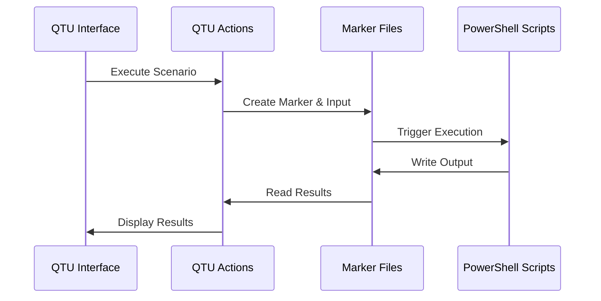

# Task and Scenario Integration for QTU v5

This document provides comprehensive guidance on integrating the Question-to-User (QTU) module v5 with the AI Task System's task and scenario functionality.

## Overview

The QTU module v5 provides specialized interfaces and actions for working with system tasks and scenarios. This integration allows users to:

1. View available tasks and scenarios in the system
2. Execute scenarios with optional parameters
3. Reset scenario progress markers
4. Monitor scenario execution status
5. Collect input from users as part of scenario execution

## Integration Components

### 1. UI Components

- **Task List Display** - `implement-modules/question-to-user/v5/templates/task-list-display.json`
  - Provides a UI for displaying and interacting with available system tasks
  - Includes a refresh button that calls the `list-system-tasks.json` action

- **Scenario List Display** - `implement-modules/question-to-user/v5/templates/scenario-list-display.json`
  - Displays available scenarios with their IDs and descriptions
  - Includes a refresh button that calls the `list-system-scenarios.json` action

- **Command Execution Form** - `implement-modules/question-to-user/v5/templates/command-execution-form.json`
  - Provides a form interface for executing scenarios with parameters
  - Allows selection of scenario ID, task ID, and optional user input value
  - Contains buttons for executing scenarios and resetting progress markers

### 2. Core Actions

- **list-system-tasks.json** - Retrieves available system tasks
  - Returns a list of task IDs and their descriptions
  - Data is temporarily fetched from `data/system_lists/tasks.json` until full backend integration

- **list-system-scenarios.json** - Retrieves available system scenarios
  - Returns a list of scenario IDs and their descriptions
  - Data is temporarily fetched from `data/system_lists/scenarios.json` until full backend integration

- **execute-main-work-scenario.json** - Executes a system scenario
  - Accepts `scenarioId`, `taskId`, and `userInputValue` as input parameters
  - Creates a marker file to trigger scenario execution
  - Returns execution status and any output data

- **reset-main-work-scenario.json** - Resets progress for a scenario
  - Accepts `scenarioId` and `taskId` as input parameters
  - Clears the progress marker for the specified scenario
  - Returns reset status

### 3. Data Flow

The integration with the task system follows this data flow:

1. QTU generates a marker file at `question-to-user/data/markers/{scenarioId}.json`
2. The scenario input is stored at `question-to-user/data/scenario_inputs/{scenarioId}.json`
3. An external process (PowerShell script) monitors these markers and executes the requested scenario
4. The script writes output to `question-to-user/data/scenario_outputs/{scenarioId}.json`
5. QTU reads this output file to display results to the user

## Integration with main-work.ps1

The QTU module integrates with the main-work.ps1 script using the following parameters:

- **RunScenario**: Executes a specific scenario
  - Required: `-ScenarioId <scenario-id>`
  - Optional: `-TaskId <task-id>` and `-UserInputValue <value>`

- **ResetScenario**: Clears the progress marker for a scenario
  - Required: `-ScenarioId <scenario-id>`
  - Optional: `-TaskId <task-id>`

## Example Usage

### Executing a Scenario from the UI

1. Navigate to Task & Scenario Management page (`/question-to-user/task-scenario-management-page`)
2. Click "Load Scenarios" to populate the scenario dropdown
3. Select a scenario from the dropdown (e.g., "SCN-FullyCollectTaskData")
4. (Optional) Click "Load Tasks" and select a task to associate with the scenario
5. (Optional) Enter a user input value if the scenario requires it
6. Click "Execute Scenario" to run the scenario
7. The execution result will be displayed in the result area

### Resetting Scenario Progress

1. Navigate to Task & Scenario Management page
2. Select the scenario to reset
3. (Optional) Select the associated task
4. Click "Reset Scenario Progress"
5. The reset confirmation will be displayed in the result area

## Error Handling

The QTU module provides the following error handling for scenario execution:

1. If the scenario execution fails, an error message is displayed in the result area
2. If the scenario requires additional input, the user is prompted to provide it
3. Timeout handling ensures the UI remains responsive even if scenario execution takes a long time

## Future Enhancements

Planned improvements for task and scenario integration:

1. Real-time status updates for long-running scenarios
2. History tracking of previously run scenarios
3. Direct integration with the task system backend instead of file-based communication
4. Enhanced error handling with more detailed error messages
5. Ability to save and restore execution state between sessions

## Reference Information

- Schema definitions for all data structures are available in `data-schema.md`
- For more details on the PowerShell script parameters, see `script/data/standards/powershell-script-standard.json`
- Example task and scenario files can be found in `script/engine/scenarios/` and `script/engine/task_definitions/` 