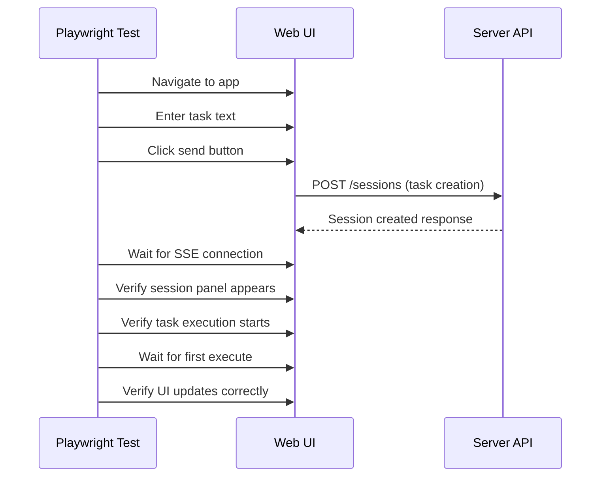

# Testing Scenarios

This directory documents all testing workflows, validation scenarios, and quality assurance processes for the A2A web client.

## Related Documentation

- **[Testing SSE Tasks](../tasks/testing-sse-tasks.md)** - Detailed SSE testing tasks and automation scripts
- **[Dialog Architecture Tasks](../tasks/dialog-architecture-tasks.md)** - QA scenarios and testing matrix for panels
- **[UNIFIED_ARCHITECTURE_COMPLETE](../UNIFIED_ARCHITECTURE_COMPLETE.md)** - Testing checklist for unified architecture
- **[Web UI DEV_STATE](../DEV_STATE.md)** - Development status and testing focus areas
- **[Actions & Events Decomposition](../actions-events-decomposition.md)** - Testing scenarios for UI interactions

## Testing Pyramid Structure

### Test Types by Speed & Coverage

| Test Type | Speed | Coverage | Automation | Purpose |
|-----------|-------|----------|------------|---------|
| **Unit Tests** | ⚡ Fast | Individual functions | Full | Logic validation |
| **Integration Tests** | 🟡 Medium | Component interaction | High | System integration |
| **E2E Tests** | 🔴 Slow | Full user journeys | Medium | End-to-end validation |
| **Smoke Tests** | ⚡ Fast | Service health | Full | Deployment validation |
| **Performance Tests** | 🟡 Medium | Load & responsiveness | High | Performance validation |

## Smoke Testing Scenarios

### Web UI Smoke Test (PowerShell)
```powershell
# Complete smoke test workflow
.\scripts\test-web-ui.ps1

# Steps executed:
# 1. Start Docker infrastructure (PostgreSQL + Redis)
# 2. Launch A2A Server (port 3000)
# 3. Start Client API proxy (port 3001)
# 4. Launch Vite dev server (port 5173)
# 5. Open browser (Chromium default)
# 6. Manual verification checklist
# 7. Log collection and cleanup
```

### Manual Verification Checklist
- [ ] Page loads without console errors
- [ ] Session panel appears in UI
- [ ] SSE connection establishes (`/api/sse/:sessionId`)
- [ ] No WebSocket fallback triggered
- [ ] Task input field accepts text
- [ ] Send button is clickable

### Automated Health Checks
```javascript
// Service health validation
const healthChecks = [
  { url: 'http://localhost:3000/health', name: 'A2A Server' },
  { url: 'http://localhost:3001/health', name: 'Client API' },
  { url: 'http://localhost:5173', name: 'Web UI' }
];
```

## End-to-End Testing Scenarios

### Session Lifecycle E2E Test


### Choice Selection E2E Test
```
1. Session active with form execute
2. Verify choice buttons render
3. Click first choice button
4. Verify loading state shows
5. Wait for server response
6. Verify UI updates with next step
7. Verify progress advances
```

### Message Continuation E2E Test
```
1. Session active with message execute
2. Verify message displays
3. Verify continue button appears
4. Click continue button
5. Verify submission succeeds
6. Verify next execute loads
```

## SSE Reliability Testing

### Connection Scenarios
| Scenario | Test Case | Validation |
|----------|-----------|------------|
| **Normal Connection** | SSE connects successfully | Connection state = 'connected' |
| **CORS Blocked** | SSE fails, WebSocket succeeds | Fallback to WebSocket transport |
| **Network Failure** | Connection drops mid-session | Auto-reconnection within 5s |
| **Heartbeat Timeout** | Server stops sending pings | Degraded state after 35s |
| **Server Restart** | Server goes down and back up | Full state resynchronization |

### SSE Instrumentation
```javascript
// Heartbeat monitoring
const watchdog = {
  lastHeartbeat: Date.now(),
  timeoutMs: 35000, // 35s timeout
  checkIntervalMs: 5000,

  monitor: () => {
    if (Date.now() - lastHeartbeat > timeoutMs) {
      markConnectionDegraded();
    }
  }
};
```

### Reconnection Testing
```javascript
// Simulate network interruption
test('SSE reconnection on network failure', async ({ page }) => {
  // 1. Establish SSE connection
  // 2. Simulate network disconnect
  // 3. Verify reconnection attempt
  // 4. Verify state preservation
  // 5. Verify seamless UI continuation
});
```

## Cross-Browser Testing Matrix

### Supported Browsers
| Browser | Version | Test Status | Known Issues |
|---------|---------|-------------|--------------|
| **Chrome** | Latest | ✅ Full support | None |
| **Firefox** | Latest | ✅ Full support | SSE timing differences |
| **Safari** | Latest | ✅ Full support | WebSocket quirks |
| **Edge** | Latest | ✅ Full support | None |

### Browser-Specific Scenarios
- **Chrome**: Full SSE/WebSocket support, best performance
- **Firefox**: SSE works, occasional timing issues
- **Safari**: WebSocket fallback more common, iOS compatibility
- **Edge**: Chromium-based, same as Chrome

### Mobile Browser Testing
- **iOS Safari**: Touch interactions, viewport handling
- **Android Chrome**: Mobile layout, touch targets
- **Responsive breakpoints**: 320px, 768px, 1024px+

## Component Testing Scenarios

### SessionStore Unit Tests
```javascript
describe('SessionStore', () => {
  test('initializes with correct default state', () => {
    const store = new SessionStore();
    expect(store.sessionId).toBeNull();
    expect(store.isActive()).toBe(false);
  });

  test('pushes messages correctly', () => {
    store.pushMessage('Hello', 'user');
    expect(store.messages).toHaveLength(1);
    expect(store.messages[0].content).toBe('Hello');
  });

  test('handles execute updates', () => {
    const execute = { form: { choices: [] } };
    store.setExecute(execute);
    expect(store.execute).toEqual(execute);
  });
});
```

### TransportManager Unit Tests
```javascript
describe('TransportManager', () => {
  test('connects with SSE first', async () => {
    const tm = new TransportManager();
    await tm.connect('session-123');
    expect(tm.getState().activeTransport).toBe('sse');
  });

  test('falls back to WebSocket', async () => {
    // Mock SSE failure
    mockSSEFailure();
    await tm.connect('session-123');
    expect(tm.getState().activeTransport).toBe('websocket');
  });
});
```

### PanelManager Unit Tests
```javascript
describe('PanelManager', () => {
  test('creates panels correctly', () => {
    const panel = PanelManager.open('task', { critical: true });
    expect(panel).toBeDefined();
    expect(panel.type).toBe('task');
  });

  test('minimizes to cube', () => {
    const panel = PanelManager.open('task');
    panel.minimize();
    expect(panel.isMinimized()).toBe(true);
    expect(PanelManager.getCubes()).toContain(panel.cube);
  });
});
```

## Integration Testing Scenarios

### Session Creation Integration
```javascript
test('session creation full flow', async () => {
  // 1. Mock server API
  // 2. Submit task through UI
  // 3. Verify API call made
  // 4. Verify session state updated
  // 5. Verify transport connected
  // 6. Verify panel created
});
```

### Execute Processing Integration
```javascript
test('form choice submission', async () => {
  // 1. Setup session with form execute
  // 2. Render choice buttons
  // 3. Click choice button
  // 4. Verify ActionHandler called
  // 5. Verify API submission
  // 6. Verify UI updates
});
```

### Transport Fallback Integration
```javascript
test('SSE to WebSocket fallback', async () => {
  // 1. Start with SSE connection
  // 2. Simulate SSE failure
  // 3. Verify WebSocket connection attempt
  // 4. Verify seamless transition
  // 5. Verify message continuity
});
```

## Performance Testing Scenarios

### Load Testing
```javascript
test('multiple concurrent sessions', async () => {
  const sessionCount = 10;
  const sessions = [];

  // Create multiple sessions simultaneously
  for (let i = 0; i < sessionCount; i++) {
    sessions.push(createSession(`Task ${i}`));
  }

  await Promise.all(sessions);

  // Verify all connections stable
  // Verify UI responsive
  // Verify memory usage reasonable
});
```

### Memory Leak Testing
```javascript
test('no memory leaks on session switch', async () => {
  // 1. Create session
  // 2. Perform multiple executes
  // 3. Switch to new session
  // 4. Verify old session cleaned up
  // 5. Verify event listeners removed
  // 6. Verify DOM elements removed
});
```

### Network Performance Testing
- **Connection time**: <5 seconds
- **Reconnection time**: <3 seconds
- **Message latency**: <100ms
- **Memory usage**: <50MB per session
- **CPU usage**: <10% during active execution

## Accessibility Testing Scenarios

### Screen Reader Testing
```javascript
test('screen reader navigation', async ({ page }) => {
  // 1. Enable screen reader mode
  // 2. Navigate with Tab key
  // 3. Verify ARIA labels present
  // 4. Verify live regions update
  // 5. Verify focus management
});
```

### Keyboard Navigation Testing
```javascript
test('keyboard-only operation', async ({ page }) => {
  // 1. Disable mouse input
  // 2. Create new task with keyboard
  // 3. Navigate panels with Tab
  // 4. Submit forms with Enter
  // 5. Close modals with Escape
});
```

### Color Contrast Testing
- **Text contrast**: WCAG AA compliance (4.5:1 minimum)
- **Focus indicators**: Clear visibility
- **Error states**: Red text on light backgrounds
- **Success states**: Green text with sufficient contrast

## Continuous Integration

### GitHub Actions Workflow
```yaml
name: Web UI Tests
on: [push, pull_request]

jobs:
  test:
    runs-on: ubuntu-latest
    steps:
      - uses: actions/checkout@v3
      - uses: actions/setup-node@v3
        with:
          node-version: '18'
      - run: npm ci
      - run: npm run test:unit
      - run: npm run test:integration
      - run: npm run test:e2e
```

### Test Reporting
- **JUnit XML**: For CI integration
- **HTML reports**: For manual review
- **Coverage reports**: Code coverage metrics
- **Performance metrics**: Load time, memory usage
- **Accessibility scores**: Automated WCAG compliance

## Test Data Management

### Test Fixtures
```javascript
// Mock session data
const mockSession = {
  id: 'sess_test_123',
  projectId: 'proj_test_456',
  context: {
    task: 'Test task',
    messages: [],
    execution: {
      step: 'test-step',
      action: 'test-action',
      progress: 50
    }
  },
  execute: {
    form: {
      title: 'Test Form',
      choices: [
        { id: 'choice_1', label: 'Option 1' },
        { id: 'choice_2', label: 'Option 2' }
      ]
    }
  }
};
```

### Environment Setup
- **Test database**: Isolated PostgreSQL instance
- **Mock LLM**: Deterministic response simulation
- **Network mocks**: Controlled latency and failures
- **Browser isolation**: Clean profile per test run

## Validation Criteria

### Smoke Test Validation
- [ ] All services start within 30 seconds
- [ ] Health endpoints return 200
- [ ] Browser opens successfully
- [ ] Manual checklist completed
- [ ] Logs collected without errors

### E2E Test Validation
- [ ] Session creation succeeds
- [ ] SSE connection establishes
- [ ] Execute rendering works
- [ ] Choice submission succeeds
- [ ] Error handling works

### Performance Validation
- [ ] Page load <3 seconds
- [ ] Session switch <1 second
- [ ] Memory usage <100MB
- [ ] CPU usage <15%
- [ ] Network requests <50

### Accessibility Validation
- [ ] WCAG AA compliance
- [ ] Screen reader compatibility
- [ ] Keyboard navigation works
- [ ] Color contrast sufficient
- [ ] Focus management correct