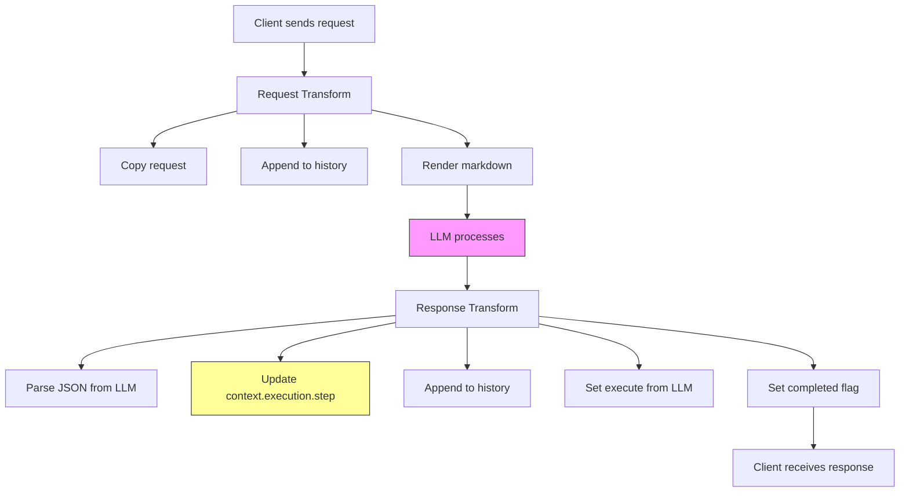

# AI-Action Transform Template Plan

## Обзор

Этот план описывает канонический паттерн для AI-actions (LLM-управляемых потоков) на основе `auto-ai` симуляции.

## Анализ текущего состояния

### Auto-AI (канонический пример)

**Prompt** — [`auto-ai-request.md`](../../prompts/auto-ai-request.md):
- LLM возвращает JSON: `{ step, message, execute, completed }`
- `step` — явное имя семантического этапа
- `execute` — action-key shape, ровно одно действие
- `completed` — флаг завершения

**Request Transform** — [`simulations/auto-ai/3/server-transforms-request.json`](../../../simulations/auto-ai/3/server-transforms-request.json):
```json
{
  "type": "pipeline",
  "steps": [
    { "op": "copy", "from": "$", "to": "$out" },
    { "op": "append-to-array", "to": "$.context.history", "value": { "role": "user", "message": "$.result.message" }},
    { "op": "render-markdown", "templateRef": "a2a-server/prompts/auto-ai-request.md", "data": "$out", "outputFile": "request.md" }
  ]
}
```

**Response Transform** — [`simulations/auto-ai/3/server-transforms-response.json`](../../../simulations/auto-ai/3/server-transforms-response.json):
```json
{
  "type": "pipeline",
  "steps": [
    { "op": "parse-json-from-md", "fromFile": "response.md", "jsonPath": "$", "to": "$llm" },
    { "op": "copy", "from": "$.context", "to": "$.context" },
    { "op": "set", "path": "$.context.execution.step", "value": "$.llm.step" },
    { "op": "append-to-array", "to": "$.context.history", "value": { "role": "assistant", "step": "$.llm.step", "message": "$.llm.message" }},
    { "op": "set", "path": "$.execute", "value": "$.llm.execute" }
  ]
}
```

### Другие AI-actions (проблемы)

| Simulation | Prompt | Transform Pattern | Проблема |
|------------|--------|-------------------|-----------|
| `coder-smart` | [`coder-request.md`](../../prompts/coder-request.md) | switch по `action`, нет `step` | Не использует `context.execution.step` |
| `analyze` | [`analyze-request.md`](../../prompts/analyze-request.md) | switch по `action`, нет `step` | Не использует `context.execution.step` |

## Переиспользуемый шаблон

### 1. Generic Request Transform

Файл (исторически): `templates/ai-action-transforms/server-transforms-request.json` — каталог удалён; использовать `a2a-server/prompts/transforms/` и симуляции.

```json
{
  "type": "pipeline",
  "steps": [
    {
      "op": "copy",
      "from": "$",
      "to": "$out"
    },
    {
      "op": "append-to-array",
      "to": "$.context.history",
      "value": {
        "role": "user",
        "message": "$.result.message"
      }
    },
    {
      "op": "render-markdown",
      "templateRef": "a2a-server/prompts/{{TEMPLATE_NAME}}",
      "data": "$out",
      "outputFile": "request.md"
    }
  ]
}
```

**Параметры для замены:**
- `{{TEMPLATE_NAME}}` — имя файла промпта (без расширения)

### 2. Generic Response Transform

Файл (исторически): `templates/ai-action-transforms/server-transforms-response.json` — см. выше.

```json
{
  "type": "pipeline",
  "steps": [
    {
      "op": "parse-json-from-md",
      "fromFile": "response.md",
      "jsonPath": "$",
      "to": "$llm"
    },
    {
      "op": "copy",
      "from": "$.context",
      "to": "$.context"
    },
    {
      "op": "set",
      "path": "$.context.execution.step",
      "value": "$.llm.step"
    },
    {
      "op": "append-to-array",
      "to": "$.context.history",
      "value": {
        "role": "assistant",
        "step": "$.llm.step",
        "message": "$.llm.message"
      }
    },
    {
      "op": "set",
      "path": "$.execute",
      "value": "$.llm.execute"
    },
    {
      "op": "set",
      "path": "$.result.completed",
      "value": "$.llm.completed"
    }
  ]
}
```

## Действия для реализации

### Шаг 1: Создать директорию шаблонов

```bash
mkdir -p templates/ai-action-transforms
```

### Шаг 2: Создать файлы шаблонов

- `templates/ai-action-transforms/server-transforms-request.json`
- `templates/ai-action-transforms/server-transforms-response.json`

### Шаг 3: Обновить промпт coder-request.md

Изменить формат ответа на:
```json
{
  "step": "clarify",
  "message": "your response",
  "execute": {
    "rag-search": { "query": "..." }
  },
  "completed": false
}
```

### Шаг 4: Обновить transforms для coder-smart

Заменить на канонический паттерн с `step`:
- `simulations/coder-smart/*/server-transforms-request.json`
- `simulations/coder-smart/*/server-transforms-response.json`

### Шаг 5: Обновить документацию

Добавить в [`AGENTS.md`](../../../AGENTS.md):
- Секцию о каноническом паттерне AI-actions
- Ссылку на шаблоны

## Пример применения: coder-smart

### Новый prompt: coder-request.md

```markdown
## System Prompt

You are Coder-Smart. You analyze code tasks, create plans, and execute them step by step.

You control execution via `context.execution.step`. On every turn:
- Read the current `step` from the state.
- Decide whether to stay or move to another step.
- Emit the next `step` explicitly in your JSON.

Steps:
- `"clarify"` — understand and refine the task using RAG
- `"research-plan"` — create a research plan for the codebase
- `"checklist"` — create a checklist of work items
- `"write-doc"` — write the task document to `.carrier/tasks/`
- `"execute-item"` — execute the next checklist item
- `"completed"` — all done

## Response Format

```json
{
  "step": "clarify",
  "message": "your explanation",
  "execute": {
    "rag-search": { "query": "" }
  },
  "completed": false
}
```

Rules:
- `execute` MUST have exactly ONE key
- Allowed actions: `rag-search`, `read-file`, `write-file`, `execute-command`
- `completed: true` when all items are done

## Current State

```json
{
  "context": ${context},
  "result": ${result},
  "docVirtual": ${docVirtual},
  "ragResults": ${ragResults}
}
```
```

## Mermaid: Поток AI-Action



## Резюме

| Компонент | Текущее состояние | Целевое состояние |
|-----------|------------------|-------------------|
| Auto-AI | ✅ Канонический паттерн | Без изменений |
| Coder-Smart | ❌Proprietary формат | Канонический паттерн |
| Analyze | ❌Proprietary формат | Канонический паттерн |
| Шаблоны | ❌Не существуют | ✅ Создать в `templates/ai-action-transforms/` |
