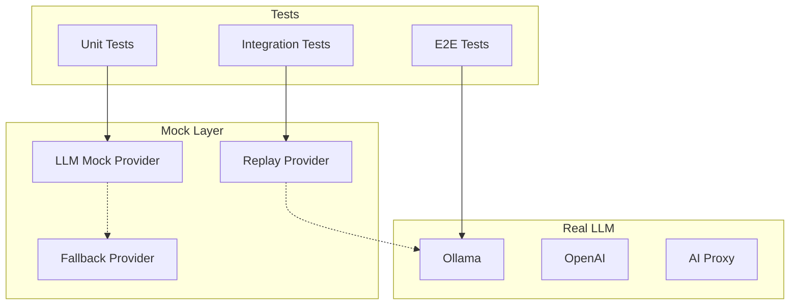

# Архитектура системы мокирования для тестов симуляций

## Обзор

Документ описывает архитектуру системы мокирования для тестирования симуляций в a2a-server. Архитектура обеспечивает:

- Изоляцию unit-тестов от внешних зависимостей
- Возможность тестирования парсинга и валидации без реального LLM
- Легковесные мок-серверы для интеграционных тестов
- Интеграционные тесты с реальными подключениями

## 1. Структура файлов

```
a2a-server/tests/
├── mocks/                      # Моки для тестов
│   ├── index.ts               # Экспорт всех моков
│   ├── llm/                   # Моки LLM
│   │   ├── index.ts
│   │   ├── mock-llm-adapter.ts    # Мок callLLM()
│   │   ├── replay-provider.ts     # Провайдер для replay из .md файлов
│   │   └── responses/             # Заготовленные ответы LLM
│   │       ├── dialog-step-1.md
│   │       ├── auto-ai-step-1.md
│   │       └── ...
│   ├── http/                   # Моки HTTP
│   │   ├── index.ts
│   │   └── mock-fetch.ts
│   ├── filesystem/             # Моки файловой системы
│   │   ├── index.ts
│   │   └── mock-fs.ts
│   ├── database/               # Моки БД
│   │   ├── index.ts
│   │   └── mock-prisma.ts
│   └── simulation/             # Моки для симуляций
│       ├── index.ts
│       ├── mock-simulation-runner.ts
│       └── fixtures/           # Симуляционные данные для тестов
│           ├── simple-request.json
│           └── expected-response.json
├── fixtures/                   # Тестовые данные
│   ├── requests/               # Примеры запросов
│   ├── responses/              # Примеры ответов
│   ├── contexts/               # Контексты для разных сценариев
│   └── validations/            # Данные для валидации
├── helpers/                    # Утилиты для тестов
│   ├── index.ts
│   ├── test-app.ts             # Создание тестового app
│   ├── test-db.ts              # Утилиты для работы с тестовой БД
│   ├── mock-server.ts           # Мок HTTP сервера
│   └── mock-client.ts           # Мок a2a-client
├── setup.ts                    # Глобальная настройка тестов
├── vitest.config.ts            # Конфигурация Vitest
└── ...
```

## 2. Мокирование LLM

### 2.1 Подход: Replay из файлов

Существующий механизм в `llm-adapter.ts` (строки 73-82) уже поддерживает replay:

```typescript
const replayDir = (process.env.LLM_REPLAY_DIR ?? '').trim();
if (replayDir) {
    // Читает ответы из simulations/<name>/<step>/response.md
}
```

**Расширение:** Создать провайдер для тестов, который:
1. Читает response.md из симуляции
2. Парсит JSON из action-key формата
3. Возвращает предсказуемые ответы

### 2.2 Архитектура моков LLM



### 2.3 Реализация Mock LLM Adapter

```typescript
// tests/mocks/llm/mock-llm-adapter.ts
import { vi } from 'vitest';
import type { LLMInput } from '../../../src/services/ai/llm-adapter.js';

// Карта ответов для replay
const responseMap = new Map<string, string>();

export function setupLLMMock() {
    const mockCallLLM = vi.fn(async (input: LLMInput): Promise<string> => {
        // Генерируем ключ из контекста
        const key = generateResponseKey(input);
        
        if (responseMap.has(key)) {
            return responseMap.get(key)!;
        }
        
        // Fallback: возвращаем placeholder из canonical формата
        return JSON.stringify({
            step: 'completed',
            message: 'Mock response',
            execute: { 'message': { text: 'Mock completed' } },
            completed: true
        });
    });
    
    return { mockCallLLM, responseMap };
}

export function mockLLMResponse(key: string, response: string) {
    responseMap.set(key, response);
}

export function clearLLMResponses() {
    responseMap.clear();
}
```

### 2.4 Использование в тестах

```typescript
// tests/unit/some-test.test.ts
import { describe, it, expect, vi, beforeEach } from 'vitest';
import { setupLLMMock, mockLLMResponse, clearLLMResponses } from '../mocks/llm/index.js';
import { callLLM } from '../../src/services/ai/llm-adapter.js';

describe('LLM Integration', () => {
    const { mockCallLLM } = setupLLMMock();
    
    beforeEach(() => {
        vi.mock('../../src/services/ai/llm-adapter.js', () => ({
            callLLM: mockCallLLM
        }));
        clearLLMResponses();
    });
    
    it('should return mocked response', async () => {
        mockLLMResponse('test-key', JSON.stringify({
            step: 'plan',
            message: 'Test response',
            execute: { 'message': { text: 'Hello' } },
            completed: false
        }));
        
        const result = await callLLM({ context: { test: true } });
        expect(result).toContain('Test response');
    });
});
```

## 3. Мок-сервер / Мок-клиент

### 3.1 Mock Server

Легковесный HTTP-сервер для unit-тестов:

```typescript
// tests/helpers/mock-server.ts
import express, { type Express } from 'express';
import request from 'supertest';

export class MockA2AServer {
    private app: Express;
    private responses: Map<string, any> = new Map();
    
    constructor() {
        this.app = express();
        this.setupRoutes();
    }
    
    private setupRoutes() {
        this.app.use(express.json());
        
        // Mock /api/v1/invoke
        this.app.post('/api/v1/invoke', (req, res) => {
            const key = this.generateKey(req.body);
            const response = this.responses.get(key);
            
            if (response) {
                return res.status(201).json(response);
            }
            
            // Default response
            res.status(201).json({
                success: true,
                data: {
                    id: 'mock-promise-id',
                    promiseId: 'mock-promise-id',
                    status: 'pending'
                }
            });
        });
        
        // Mock /api/v1/requests/:promiseId
        this.app.get('/api/v1/requests/:promiseId', (req, res) => {
            const response = this.responses.get(req.params.promiseId);
            
            if (response) {
                return res.json(response);
            }
            
            res.status(404).json({ error: 'Not found' });
        });
    }
    
    mockResponse(key: string, response: any) {
        this.responses.set(key, response);
    }
    
    getApp(): Express {
        return this.app;
    }
    
    async request() {
        return request(this.app);
    }
}
```

### 3.2 Mock Client

Мок a2a-client SDK для тестов без реального соединения:

```typescript
// tests/helpers/mock-client.ts
export class MockA2AClient {
    private requests: any[] = [];
    private responses: Map<string, any> = new Map();
    
    async invoke(params: { context: any; message: string }) {
        this.requests.push(params);
        
        const key = JSON.stringify(params);
        return this.responses.get(key) || {
            promiseId: `mock-${Date.now()}`,
            status: 'pending'
        };
    }
    
    async getResult(promiseId: string) {
        return this.responses.get(promiseId) || {
            status: 'pending'
        };
    }
    
    // Для настройки ожидаемых ответов
    whenInvoke(params: any).thenRespond(response: any) {
        const key = JSON.stringify(params);
        this.responses.set(key, response);
    }
    
    // Для проверки вызовов
    getInvocations() {
        return [...this.requests];
    }
}
```

## 4. Интеграционные тесты без моков

### 4.1 Подходы

1. **Тесты с реальной БД** - используют `a2a_test` database
2. **Тесты с реальным HTTP** - используют supertest с реальным app
3. **Record/Replay** - записывают реальные ответы для воспроизведения

### 4.2 Конфигурация для разных типов тестов

```typescript
// vitest.config.ts
import { defineConfig } from 'vitest/config';

export default defineConfig({
    test: {
        environment: 'node',
        setupFiles: ['tests/setup.ts'],
        include: ['tests/**/*.test.ts'],
        exclude: ['tests/e2e/**'],
        
        // Глобальные моки для всех тестов
        globals: true,
        
        // Переменные окружения для тестов
        env: {
            NODE_ENV: 'test',
            DATABASE_URL: 'postgresql://.../a2a_test',
            SKIP_AUTH: '1'  // Для интеграционных тестов
        }
    }
});
```

### 4.3 Тесты с Record/Replay

Использование nock для записи и воспроизведения HTTP-запросов:

```typescript
// tests/helpers/http-recorder.ts
import nock from 'nock';

export async function recordReplay(
    testName: string,
    fn: () => Promise<void>
) {
    const recordingsDir = 'tests/fixtures/recordings';
    
    // Проверяем, есть ли запись
    const recordingPath = `${recordingsDir}/${testName}.json`;
    
    if (existsSync(recordingPath)) {
        // Воспроизводим запись
        const recording = JSON.parse(readFileSync(recordingPath, 'utf-8'));
        nock.load(recording);
    } else {
        // Записываем
        nock.recorder.rec();
        await fn();
        const recordings = nock.recorder.play();
        
        // Сохраняем
        writeFileSync(recordingPath, JSON.stringify(recordings, null, 2));
        nock.cleanAll();
    }
}
```

## 5. Организация тестов по типам

### 5.1 Unit тесты

- Изолированы от внешних зависимостей
- Используют vi.mock() для всех внешних сервисов
- Быстрые, не требуют БД или сети

```typescript
// tests/unit/context-parser.test.ts
import { describe, it, expect, vi, beforeEach } from 'vitest';
import { vi.mock } from 'vitest';

vi.mock('../../src/services/ai/llm-adapter.js');
vi.mock('../../src/config/index.js');

describe('ContextParser', () => {
    // Тесты изолированы от реальных сервисов
});
```

### 5.2 Интеграционные тесты

- Тестируют взаимодействие между сервисами
- Используют реальную БД (a2a_test)
- Могут использовать мок HTTP для внешних сервисов

```typescript
// tests/integration/context-parser.test.ts
import { describe, it, expect } from 'vitest';
import { PrismaClient } from '@prisma/client';

const prisma = new PrismaClient({
    datasources: {
        db: {
            url: process.env.DATABASE_URL
        }
    }
});

describe('ContextParser Integration', () => {
    it('should parse and persist context', async () => {
        // Реальное взаимодействие с БД
    });
});
```

### 5.3 Симуляционные тесты

- Используют golden tests из simulations/
- Тестируют полный pipeline
- Могут использовать replay для LLM

```typescript
// tests/simulation/parser.test.ts
import { describe, it, expect } from 'vitest';
import { parseSimulationRequest } from './helpers.js';

describe('Simulation Pipeline', () => {
    it('should parse request.json correctly', async () => {
        const request = await parseSimulationRequest('dialog/1');
        expect(request.context).toBeDefined();
    });
});
```

## 6. Конфигурация через Environment Variables

| Variable | Description | Default |
|----------|-------------|---------|
| `TEST_LLM_PROVIDER` | LLM провайдер для тестов | `mock` |
| `TEST_DB_URL` | URL тестовой БД | `postgresql://.../a2a_test` |
| `TEST_USE_REAL_DB` | Использовать реальную БД | `false` |
| `TEST_RECORD_HTTP` | Записывать HTTP запросы | `false` |
| `TEST_LLM_REPLAY_DIR` | Директория для replay | `simulations/` |
| `SKIP_AUTH` | Пропускать auth | `1` (для интеграционных) |

## 7. Pipeline симуляций

Тестирование pipeline:

```mermaid
flowchart LR
    subgraph Input
        RQ[request.json]
        TR[server-transforms-request.json]
    end
    
    subgraph Processing
        P1[Parse Request]
        P2[Apply Transforms]
        P3[Render request.md]
    end
    
    subgraph LLM
        LLM[LLM Call]
    end
    
    subgraph Output
        RM[response.md]
        TR2[server-transforms-response.json]
        RS[response.json]
    end
    
    RQ --> P1
    TR --> P2
    P1 --> P2
    P2 --> P3
    P3 --> LLM
    LLM --> RM
    RM --> TR2
    TR2 --> RS
```

Каждый этап может быть протестирован отдельно:
1. **Unit**: тестирование отдельных transform операций
2. **Integration**: тестирование всего pipeline
3. **E2E**: тестирование с реальным LLM

## 8. Примеры использования

### 8.1 Тестирование парсинга симуляции

```typescript
// tests/simulation/parser.test.ts
import { describe, it, expect } from 'vitest';
import { parseSimulationRequest } from '../helpers/test-helpers.js';

describe('Simulation Parser', () => {
    it('should parse dialog/1 request.json', async () => {
        const request = await parseSimulationRequest('dialog/1');
        
        expect(request.context).toEqual({
            version: '1.0',
            session_id: expect.any(String)
        });
    });
    
    it('should validate action-key format in response', async () => {
        const response = await runSimulation('dialog/1');
        
        // Проверяем canonical формат
        expect(response.data.execute).toHaveProperty('message');
        expect(response.data.execute).toHaveProperty('form');
    });
});
```

### 8.2 Тестирование с моком LLM

```typescript
// tests/unit/action-processor.test.ts
import { describe, it, expect, vi, beforeEach } from 'vitest';
import { ActionProcessor } from '../../src/actions/action-processor.js';

describe('ActionProcessor', () => {
    const mockLLM = vi.fn().mockResolvedValue(JSON.stringify({
        step: 'execute',
        execute: { 'script': { code: 'console.log("test")' } },
        completed: true
    }));
    
    beforeEach(() => {
        vi.mock('../../src/services/ai/llm-adapter.js', () => ({
            callLLM: mockLLM
        }));
    });
    
    it('should process action with mocked LLM', async () => {
        const processor = new ActionProcessor();
        const result = await processor.process({
            action: 'auto-ai',
            context: {}
        });
        
        expect(result.execute).toBeDefined();
    });
});
```

## 9. Миграция существующих тестов

Рекомендуемый порядок:

1. **Создать структуру директорий** (mocks, fixtures, helpers)
2. **Переместить общие моки** в tests/mocks/
3. **Создать helpers** для типовых операций
4. **Обновить существующие тесты** для использования новой структуры
5. **Добавить documentation** по использованию

## 10. Рекомендации

1. **Избегать глобальных моков** - мокать только необходимые зависимости
2. **Использовать canonical формат** - проверять action-key shape в тестах
3. **Документировать replay данные** - чтобы понимать происхождение ответов
4. **Разделять тесты по скорости** - быстрые (unit) vs медленные (integration)
5. **Использовать .js расширение** для импортов с псевдонимами путей
