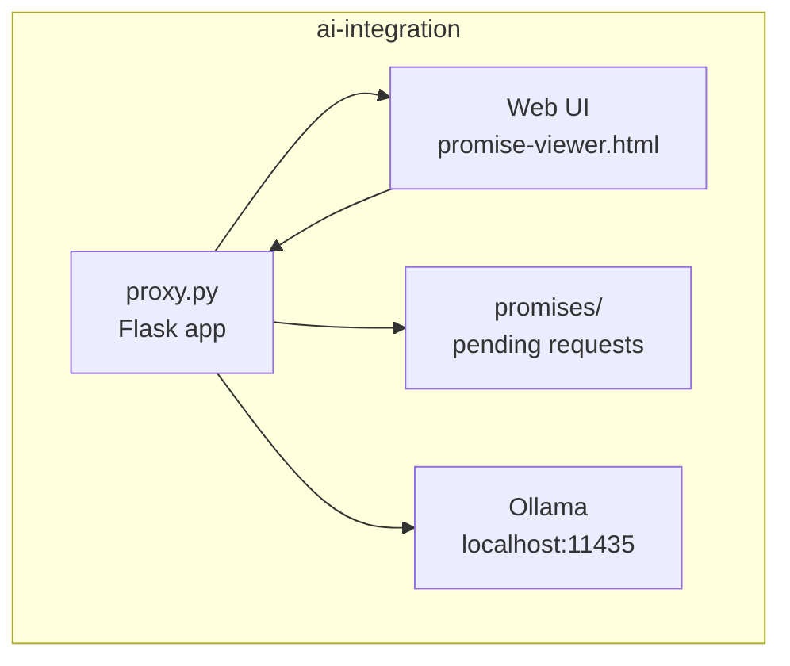

# План: Веб-страница просмотра Pending Requests

## Цель

Создать веб-интерфейс для отображения первого запроса с `promiseId`, требующего ответа, с возможностью копирования
запроса, выполнения/вставки ответа и одобрения.

## Архитектура



## API Endpoints для proxy.py

### 1. GET /promises/pending

Возвращает массив pending promises, отсортированный по created_at (старые first).

**Response:**

```json
[
  {
    "promiseId": "abc123",
    "status": "pending",
    "method": "POST",
    "path": "/api/generate",
    "target_url": "http://localhost:11434/api/generate",
    "created_at": 1234567890.123
  }
]
```

### 2. GET /promise/<promise_id>/request

Возвращает тело запроса (request body).

**Response:**

```json
{
  "promiseId": "abc123",
  "method": "POST",
  "path": "/api/generate",
  "headers": {"Content-Type": "application/json"},
  "body": {"model": "qwen3:8b", "prompt": "Hello"}
}
```

### 3. POST /promise/<promise_id>/answer

Установить ответ вручную (для "вставки ответа").

**Request Body:**

```json
{
  "status_code": 200,
  "content_type": "application/json",
  "body": "{\"response\": \"Hello world\"}"
}
```

**Response:**

```json
{"promiseId": "abc123", "status": "done"}
```

### 4. POST /promise/<promise_id>/execute

Выполнить запрос к Ollama (для "кнопка выполнить").

**Response:**

```json
{"promiseId": "abc123", "status": "done", "response": "..."}
```

## HTML Страница: web/promise-viewer.html

### UI Компоненты:

1. **Header** - заголовок "Promise Viewer"
2. **Request Panel** - отображение тела запроса
    - Кнопка "Copy Request" - копирует JSON запроса в буфер обмена
3. **Response Panel** - ввод ответа
    - Textarea для вставки ответа вручную
    - Кнопка "Execute Request" - выполнить запрос через proxy
    - Кнопка "Submit Answer" - отправить введённый ответ
4. **Action Buttons** - действия после получения ответа
    - Кнопка "Approve" - одобрить ответ (пометить как done)
5. **Status Bar** - отображение статуса promise
6. **Provider Panel** - карта доступных провайдеров (основана на `config/providers.json`)
    - Перечень провайдеров в порядке priority с выделением `default_provider`
    - Статус `enabled/disabled`, URL и тип (`ollama`, `openai`, `huggingface` и т.п.)
    - Timeout/max_retries и модели, связанные с каждым провайдером, для понимания маршрута
    - Индикация fallback chain и активного провайдера (когда `enable_fallback` true)
    - Подсказка по требуемым переменным окружения (`OPENROUTER_API_KEY`, `GROQ_API_KEY`, `HF_TOKEN`, `COHERE_API_KEY`)
    - Возможность обновить данные (кнопка Refresh или периодический polling)

### Workflow:

```
1. Загрузка страницы → GET /promises/pending
2. Отображение первого pending запроса
3. Пользователь может:
   a) Нажать "Copy Request" → копирует тело в буфер
   b) Нажать "Execute Request" → выполняет запрос к Ollama
   c) Ввести ответ в textarea и нажать "Submit Answer"
4. После получения ответа:
   a) Ответ отображается в Response Panel
   b) Кнопка "Approve" становится активной
   c) Нажатие "Approve" → подтверждает ответ
```

## Файлы для создания/изменения:

1. **ai-integration/proxy.py** - добавить новые endpoints
2. **ai-integration/web/promise-viewer.html** - создать HTML страницу

## Реализация

### Этап 1: API Endpoints (proxy.py)

- Добавить функцию `_collect_pending_promises()` (уже есть, но вернёт все)
- Добавить endpoint `/promises/pending`
- Добавить endpoint `/promise/<promise_id>/request`
- Добавить endpoint `/promise/<promise_id>/answer`
- Добавить endpoint `/promise/<promise_id>/execute`
- Добавить static file serving для `/web/` directory

### Этап 2: HTML Страница

- Создать promise-viewer.html с CSS стилями
- Добавить JavaScript для API вызовов
- Реализовать функционал кнопок

## Конфигурация

- Proxy порт по умолчанию: 11434
- Веб-интерфейс доступен по адресу: http://localhost:11434/web/promise-viewer.html
