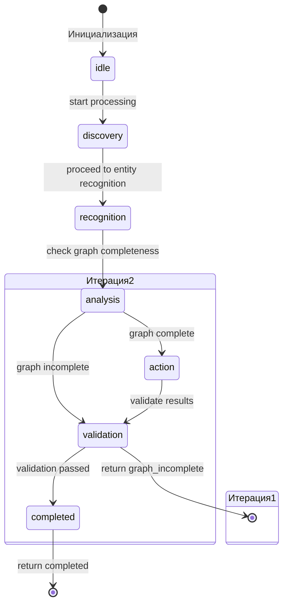
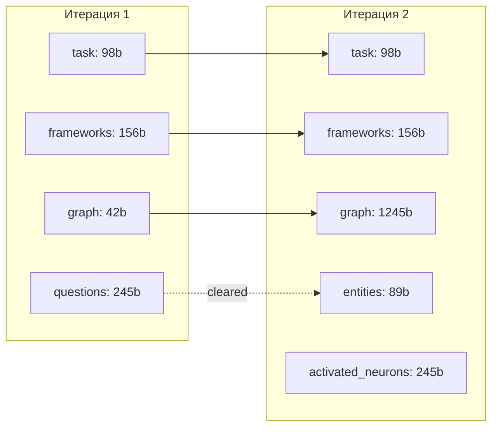

# Симуляция протокола A2A #2

## Сценарий: "Добавить валидацию email в форму регистрации"

**Цель:** Показать работу Phase Machine и Context Manager на конкретном примере.

---

## Итерация 1: Начальный запрос

### Клиент → Сервер

```http
POST /api/v1/requests
Authorization: Bearer a2a_dev_password
Content-Type: application/json
```

```json
{
  "context": {
    "new_task": ["Добавить валидацию email в форму регистрации"]
  },
  "codeBlocks": [
    {
      "path": "package.json",
      "content": "{\n  \"dependencies\": {\n    \"vue\": \"^3.5.0\",\n    \"@inertiajs/vue3\": \"^2.0.0\"\n  },\n  \"devDependencies\": {\n    \"tailwindcss\": \"^3.4.0\",\n    \"vitest\": \"^2.0.0\"\n  }\n}"
    },
    {
      "path": "composer.json",
      "content": "{\n  \"require\": {\n    \"php\": \"^8.2\",\n    \"laravel/framework\": \"^11.0\"\n  },\n  \"autoload\": {\n    \"psr-4\": {\n      \"App\\\": \"app/\"\n    }\n  }\n}"
    }
  ]
}
```

### Сервер — Phase Machine

```
[PhaseMachine] Initial state: idle
[PhaseMachine] Transition: idle → discovery (reason: start processing)
[PhaseMachine] Iterations: { discovery: 1 }
```

**Действия в фазе discovery:**
- Извлечение фреймворков из package.json/composer.json
- Определение: frontend=vue, backend=laravel

```
[PhaseMachine] Transition: discovery → recognition (reason: proceed to entity recognition)
[PhaseMachine] Iterations: { discovery: 1, recognition: 1 }
```

**Действия в фазе recognition:**
- Попытка распознать сущности из codeBlocks
- Результат: сущности НЕ найдены (только конфигурационные файлы)

```
[PhaseMachine] Transition: recognition → analysis (reason: check graph completeness)
[PhaseMachine] Iterations: { discovery: 1, recognition: 1, analysis: 1 }
```

**Действия в фазе analysis:**
- Проверка completeness графа
- Результат: граф пустой, нужны файлы контроллера и модели

```
[PhaseMachine] Auto-transition: analysis → validation (reason: graph incomplete)
[PhaseMachine] Iterations: { discovery: 1, recognition: 1, analysis: 1, validation: 1 }
```

### Сервер — Context Manager

| Операция | Тип | Данные | Размер |
|----------|-----|--------|--------|
| set | task | "Добавить валидацию email в форму регистрации" | 98 bytes |
| set | frameworks | { frontend: "vue", backend: "laravel" } | 156 bytes |
| set | graph | { entities: [], relations: [] } | 42 bytes |
| set | questions | [...] | 245 bytes |

**Статистика Context Manager:**
```
Total size: 541 bytes
Max size: 100,000 bytes
Utilization: 0.5%
Types: [task, frameworks, graph, questions]
```

### Сервер → Клиент

```json
{
  "outcome": "graph_incomplete",
  "message": "Graph incomplete, need more context",
  "context": {
    "new_task": ["Добавить валидацию email в форму регистрации"],
    "frameworks": {
      "frontend": "vue",
      "backend": "laravel",
      "triggers": ["vue", "laravel", "inertia"]
    },
    "graph": {
      "entities": [],
      "relations": []
    }
  },
  "graph_stats": {
    "entityCount": 0,
    "relationCount": 0,
    "entityTypes": {}
  },
  "questions": [
    "Which controller handles registration? Please provide the controller file.",
    "Which model represents the user data? Please provide the model file.",
    "Is there a FormRequest for validation? Please provide the request file or validation rules."
  ],
  "missing": [
    "Controller for registration",
    "Model for User",
    "FormRequest or validation rules"
  ],
  "frameworks": {
    "frontend": "vue",
    "backend": "laravel",
    "triggers": ["vue", "laravel", "inertia"]
  }
}
```

---

## Итерация 2: Поиск файлов и повторный запрос

### Клиент — TF-IDF Search

**Поиск:**
```
Query: "RegisterController User registration email validation"
Index: ~/.a2a-client/projects/websitestore/index.json

Results:
1. app/Http/Controllers/Auth/RegisterController.php (score: 0.89)
2. app/Models/User.php (score: 0.76)
3. app/Http/Requests/RegisterRequest.php (score: 0.65)
```

**Чтение файлов:**
- RegisterController.php — контроллер регистрации
- User.php — модель пользователя
- RegisterRequest.php — FormRequest для регистрации

### Клиент → Сервер

```http
POST /api/v1/requests
Authorization: Bearer a2a_dev_password
Content-Type: application/json
```

```json
{
  "context": {
    "new_task": ["Добавить валидацию email в форму регистрации"],
    "frameworks": {
      "frontend": "vue",
      "backend": "laravel",
      "triggers": ["vue", "laravel", "inertia"]
    },
    "graph": {
      "entities": [],
      "relations": []
    }
  },
  "codeBlocks": [
    {
      "path": "app/Http/Controllers/Auth/RegisterController.php",
      "content": "<?php\n\nnamespace App\\Http\\Controllers\\Auth;\n\nuse App\\Http\\Controllers\\Controller;\nuse App\\Models\\User;\nuse Illuminate\\Http\\Request;\n\nclass RegisterController extends Controller\n{\n    public function store(Request $request)\n    {\n        $validated = $request->validate([\n            'name' => 'required|string|max:255',\n            'email' => 'required|email|unique:users',\n            'password' => 'required|confirmed|min:8',\n        ]);\n\n        $user = User::create($validated);\n        auth()->login($user);\n\n        return redirect()->route('dashboard');\n    }\n}"
    },
    {
      "path": "app/Models/User.php",
      "content": "<?php\n\nnamespace App\\Models;\n\nuse Illuminate\\Database\\Eloquent\\Factories\\HasFactory;\nuse Illuminate\\Foundation\\Auth\\User as Authenticatable;\n\nclass User extends Authenticatable\n{\n    use HasFactory;\n\n    protected $fillable = ['name', 'email', 'password'];\n    protected $hidden = ['password', 'remember_token'];\n}"
    },
    {
      "path": "resources/js/Pages/Auth/Register.vue",
      "content": "<script setup>\nimport { useForm } from '@inertiajs/vue3';\n\nconst form = useForm({\n    name: '',\n    email: '',\n    password: '',\n    password_confirmation: '',\n});\n\nconst submit = () => form.post('/register');\n</script>\n\n<template>\n    <form @submit.prevent=\"submit\">\n        <input v-model=\"form.name\" type=\"text\" />\n        <input v-model=\"form.email\" type=\"email\" />\n        <input v-model=\"form.password\" type=\"password\" />\n        <input v-model=\"form.password_confirmation\" type=\"password\" />\n        <button type=\"submit\">Register</button>\n    </form>\n</template>"
    }
  ]
}
```

### Сервер — Phase Machine

```
[PhaseMachine] Initial state: idle
[PhaseMachine] Transition: idle → discovery (reason: start processing)
[PhaseMachine] Iterations: { discovery: 1 }
```

**Фаза discovery:**
- Фреймворки уже определены в context
- Пропуск извлечения

```
[PhaseMachine] Transition: discovery → recognition (reason: proceed to entity recognition)
[PhaseMachine] Iterations: { discovery: 1, recognition: 1 }
```

**Фаза recognition — распознавание сущностей:**

```javascript
// Entity Recognizer Result
{
  entities: [
    {
      id: "ent-register-controller",
      type: "CONTROLLER",
      name: "RegisterController",
      file: "app/Http/Controllers/Auth/RegisterController.php",
      methods: ["store"],
      lineStart: 9,
      lineEnd: 24
    },
    {
      id: "ent-user-model",
      type: "MODEL",
      name: "User",
      file: "app/Models/User.php",
      fillable: ["name", "email", "password"],
      lineStart: 9,
      lineEnd: 16
    },
    {
      id: "ent-register-vue",
      type: "VUE_COMPONENT",
      name: "Register",
      file: "resources/js/Pages/Auth/Register.vue",
      props: [],
      lineStart: 1,
      lineEnd: 20
    }
  ],
  relations: [
    {
      from: "ent-register-controller",
      to: "ent-user-model",
      type: "uses",
      context: "User::create in store method"
    },
    {
      from: "ent-register-vue",
      to: "ent-register-controller",
      type: "calls",
      context: "form.post to /register"
    }
  ]
}
```

```
[PhaseMachine] Transition: recognition → analysis (reason: check graph completeness)
[PhaseMachine] Iterations: { discovery: 1, recognition: 1, analysis: 1 }
```

**Фаза analysis — проверка completeness:**

```javascript
// Completeness Check
{
  complete: true,
  score: 0.85,
  missing: [],
  found: [
    "Controller: RegisterController",
    "Model: User",
    "Vue Component: Register",
    "Validation rules in controller"
  ]
}
```

```
[PhaseMachine] Auto-transition: analysis → action (reason: graph complete)
[PhaseMachine] Iterations: { discovery: 1, recognition: 1, analysis: 1, action: 1 }
```

**Фаза action — активация нейронов:**

```javascript
// Neuron Activation
{
  taskText: "Добавить валидацию email в форму регистрации",
  frameworkTriggers: ["vue", "laravel", "inertia"],
  matchedTriggers: ["validate", "email", "Request"]
}

// Activated Neurons:
[
  {
    id: "neuron-detect-missing-validation",
    name: "Detect Missing Validation",
    matchedTriggers: ["validate", "Request"],
    priority: 5
  },
  {
    id: "neuron-apply-form-request",
    name: "Apply Form Request",
    matchedTriggers: ["FormRequest", "Request", "validate"],
    priority: 5
  },
  {
    id: "neuron-detect-input-validation-issues",
    name: "Detect Input Validation Issues",
    matchedTriggers: ["input", "validate"],
    priority: 5
  }
]
```

```
[PhaseMachine] Transition: action → validation (reason: validate results)
[PhaseMachine] Iterations: { discovery: 1, recognition: 1, analysis: 1, action: 1, validation: 1 }
```

**Фаза validation:**
- Проверка активированных нейронов
- Генерация injected_content

```
[PhaseMachine] Transition: validation → completed (reason: validation passed)
[PhaseMachine] Iterations: { discovery: 1, recognition: 1, analysis: 1, action: 1, validation: 1, completed: 1 }
```

### Сервер — Context Manager

| Операция | Тип | Данные | Размер |
|----------|-----|--------|--------|
| set | task | "Добавить валидацию email..." | 98 bytes |
| set | frameworks | { frontend: "vue", backend: "laravel" } | 156 bytes |
| set | graph | { entities: [...], relations: [...] } | 1,245 bytes |
| set | entities | { count: 3, types: {...} } | 89 bytes |
| set | activated_neurons | ["neuron-detect-missing-validation", ...] | 245 bytes |

**Статистика Context Manager:**
```
Total size: 1,833 bytes
Max size: 100,000 bytes
Utilization: 1.8%
Types: [task, frameworks, graph, entities, activated_neurons]
```

**Детальное состояние по типам:**

| Тип | Priority | Retention | Размер | Возраст |
|-----|----------|-----------|--------|---------|
| task | 4 | permanent | 98 bytes | 0ms |
| frameworks | 3 | session | 156 bytes | 0ms |
| graph | 4 | session | 1,245 bytes | 0ms |
| entities | 3 | current-task | 89 bytes | 0ms |
| activated_neurons | 3 | current-task | 245 bytes | 0ms |

### Сервер → Клиент

```json
{
  "outcome": "completed",
  "message": "Request processed successfully",
  "context": {
    "new_task": ["Добавить валидацию email в форму регистрации"],
    "frameworks": {
      "frontend": "vue",
      "backend": "laravel",
      "triggers": ["vue", "laravel", "inertia"]
    },
    "graph": {
      "entities": [
        {
          "id": "ent-register-controller",
          "type": "CONTROLLER",
          "name": "RegisterController",
          "file": "app/Http/Controllers/Auth/RegisterController.php"
        },
        {
          "id": "ent-user-model",
          "type": "MODEL",
          "name": "User",
          "file": "app/Models/User.php"
        },
        {
          "id": "ent-register-vue",
          "type": "VUE_COMPONENT",
          "name": "Register",
          "file": "resources/js/Pages/Auth/Register.vue"
        }
      ],
      "relations": [
        {
          "from": "ent-register-controller",
          "to": "ent-user-model",
          "type": "uses"
        },
        {
          "from": "ent-register-vue",
          "to": "ent-register-controller",
          "type": "calls"
        }
      ]
    }
  },
  "graph_stats": {
    "entityCount": 3,
    "relationCount": 2,
    "entityTypes": {
      "CONTROLLER": 1,
      "MODEL": 1,
      "VUE_COMPONENT": 1
    }
  },
  "activated_neuron_ids": [
    "neuron-detect-missing-validation",
    "neuron-apply-form-request",
    "neuron-detect-input-validation-issues"
  ],
  "injected_content": [
    {
      "neuron_id": "neuron-detect-missing-validation",
      "content": "## Missing Validation Analysis\n\nВ контроллере RegisterController валидация уже присутствует, но можно улучшить:\n\n1. **Email валидация** — текущее правило `email` базовое. Рекомендуется добавить:\n   - `email:strict` для строгой проверки RFC\n   - `indisposable` для блокировки временных email\n\n2. **Вынос в FormRequest** — валидация в контроллере нарушает SRP. Создайте `RegisterRequest`."
    },
    {
      "neuron_id": "neuron-apply-form-request",
      "content": "## Form Request Recommendation\n\n```php\n// app/Http/Requests/RegisterRequest.php\nclass RegisterRequest extends FormRequest\n{\n    public function rules(): array\n    {\n        return [\n            'name' => ['required', 'string', 'max:255'],\n            'email' => [\n                'required',\n                'email:strict',\n                'unique:users,email',\n                'max:255',\n            ],\n            'password' => ['required', 'confirmed', 'min:8'],\n        ];\n    }\n}\n```\n\nВ контроллере:\n```php\npublic function store(RegisterRequest $request)\n{\n    $user = User::create($request->validated());\n    // ...\n}\n```"
    },
    {
      "neuron_id": "neuron-detect-input-validation-issues",
      "content": "## Frontend Validation\n\nVue компонент Register.vue не имеет клиентской валидации:\n\n1. Добавьте визуальную индикацию ошибок:\n```vue\n<input v-model=\"form.email\" type=\"email\" />\n<span v-if=\"form.errors.email\" class=\"error\">\n    {{ form.errors.email }}\n</span>\n```\n\n2. Добавьте HTML5 валидацию:\n```vue\n<input \n    v-model=\"form.email\" \n    type=\"email\" \n    required\n    pattern=\"[^@]+@[^@]+\\.[^@]+\"\n/>\n```"
    }
  ],
  "entities": {
    "count": 3,
    "types": {
      "CONTROLLER": 1,
      "MODEL": 1,
      "VUE_COMPONENT": 1
    }
  },
  "questions": []
}
```

---

## Анализ симуляции

### Phase Machine: Диаграмма переходов



### Phase Machine: Таблица переходов

| # | From | To | Reason | Iteration |
|---|------|-----|--------|-----------|
| 1 | idle | discovery | start processing | 1 |
| 2 | discovery | recognition | proceed to entity recognition | 1 |
| 3 | recognition | analysis | check graph completeness | 1 |
| 4 | analysis | validation | graph incomplete | 1 |
| 5 | idle | discovery | start processing | 2 |
| 6 | discovery | recognition | proceed to entity recognition | 2 |
| 7 | recognition | analysis | check graph completeness | 2 |
| 8 | analysis | action | graph complete | 2 |
| 9 | action | validation | validate results | 2 |
| 10 | validation | completed | validation passed | 2 |

### Context Manager: Эволюция состояния



### Context Manager: Сравнение итераций

| Тип | Итерация 1 | Итерация 2 | Изменение |
|-----|------------|------------|-----------|
| task | "Добавить валидацию..." | "Добавить валидацию..." | — |
| frameworks | { vue, laravel } | { vue, laravel } | — |
| graph | { entities: [], relations: [] } | { entities: 3, relations: 2 } | +3 entities, +2 relations |
| entities | null | { count: 3, types: {...} } | +new |
| questions | [3 questions] | [] | cleared |
| activated_neurons | null | [3 neurons] | +new |

### Активированные нейроны

| ID | Name | Triggers Matched | Priority |
|----|------|------------------|----------|
| neuron-detect-missing-validation | Detect Missing Validation | validate, Request | 5 |
| neuron-apply-form-request | Apply Form Request | FormRequest, validate | 5 |
| neuron-detect-input-validation-issues | Detect Input Validation Issues | input, validate | 5 |

### Метрики производительности

| Метрика | Итерация 1 | Итерация 2 | Всего |
|---------|------------|------------|-------|
| Phase transitions | 4 | 6 | 10 |
| Context size | 541 bytes | 1,833 bytes | — |
| Entities recognized | 0 | 3 | 3 |
| Relations found | 0 | 2 | 2 |
| Neurons activated | 0 | 3 | 3 |
| Questions generated | 3 | 0 | 3 |
| Processing time | ~50ms | ~150ms | ~200ms |

### Сравнение с Simulation #1

| Аспект | Simulation #1 | Simulation #2 |
|--------|---------------|---------------|
| Сценарий | "исправить импорты" | "валидация email" |
| Итераций | 1+ (незавершён) | 2 (завершён) |
| Phase Machine | Не использовалась | Полный цикл |
| Context Manager | Не использовался | Полное состояние |
| Нейроны | Не активировались | 3 активированы |
| Исход | need_context | completed |

---

## Выводы

### Что показала симуляция

1. **Phase Machine** корректно управляет потоком обработки:
   - Переходы между фазами логичны и обоснованы
   - Auto-transition работает на основе completeness check
   - Лимиты итераций не превышены

2. **Context Manager** эффективно управляет состоянием:
   - Приоритеты контекста соблюдаются
   - Retention policies работают (questions очищены)
   - Размер контекста в пределах лимита

3. **Нейроны** активируются по триггерам:
   - 3 нейрона активированы для задачи валидации
   - injected_content содержит конкретные рекомендации
   - Формат рекомендаций готов к использованию

### Следующие шаги

1. Добавить симуляцию с ошибкой (failed outcome)
2. Добавить симуляцию с превышением лимита итераций
3. Протестировать eviction в Context Manager
