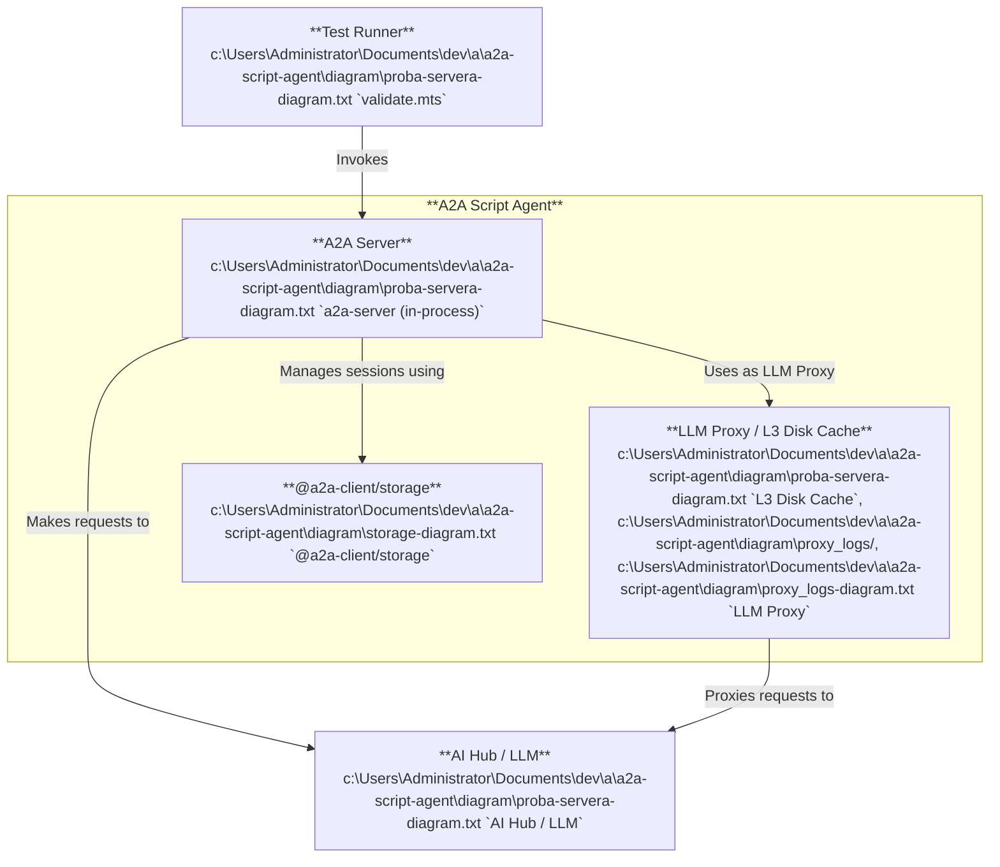

# Unnamed CodeViz Diagram

```mermaid
graph TD

    base.cv::ai_hub_llm["**AI Hub / LLM**<br>c:\Users\Administrator\Documents\dev\a\a2a-script-agent\diagram\proba-servera-diagram.txt `AI Hub / LLM`"]
    base.cv::test_runner["**Test Runner**<br>c:\Users\Administrator\Documents\dev\a\a2a-script-agent\diagram\proba-servera-diagram.txt `validate.mts`"]
    subgraph base.cv::a2a_script_agent_boundary["**A2A Script Agent**<br>[External]"]
        base.cv::a2a_server["**A2A Server**<br>c:\Users\Administrator\Documents\dev\a\a2a-script-agent\diagram\proba-servera-diagram.txt `a2a-server (in-process)`"]
        base.cv::l3_disk_cache["**LLM Proxy / L3 Disk Cache**<br>c:\Users\Administrator\Documents\dev\a\a2a-script-agent\diagram\proba-servera-diagram.txt `L3 Disk Cache`, c:\Users\Administrator\Documents\dev\a\a2a-script-agent\diagram\proxy_logs/, c:\Users\Administrator\Documents\dev\a\a2a-script-agent\diagram\proxy_logs-diagram.txt `LLM Proxy`"]
        base.cv::a2a_client_storage["**@a2a-client/storage**<br>c:\Users\Administrator\Documents\dev\a\a2a-script-agent\diagram\storage-diagram.txt `@a2a-client/storage`"]
        %% Edges at this level (grouped by source)
        base.cv::a2a_server["**A2A Server**<br>c:\Users\Administrator\Documents\dev\a\a2a-script-agent\diagram\proba-servera-diagram.txt `a2a-server (in-process)`"] -->|"Uses as LLM Proxy"| base.cv::l3_disk_cache["**LLM Proxy / L3 Disk Cache**<br>c:\Users\Administrator\Documents\dev\a\a2a-script-agent\diagram\proba-servera-diagram.txt `L3 Disk Cache`, c:\Users\Administrator\Documents\dev\a\a2a-script-agent\diagram\proxy_logs/, c:\Users\Administrator\Documents\dev\a\a2a-script-agent\diagram\proxy_logs-diagram.txt `LLM Proxy`"]
        base.cv::a2a_server["**A2A Server**<br>c:\Users\Administrator\Documents\dev\a\a2a-script-agent\diagram\proba-servera-diagram.txt `a2a-server (in-process)`"] -->|"Manages sessions using"| base.cv::a2a_client_storage["**@a2a-client/storage**<br>c:\Users\Administrator\Documents\dev\a\a2a-script-agent\diagram\storage-diagram.txt `@a2a-client/storage`"]
    end
    %% Edges at this level (grouped by source)
    base.cv::test_runner["**Test Runner**<br>c:\Users\Administrator\Documents\dev\a\a2a-script-agent\diagram\proba-servera-diagram.txt `validate.mts`"] -->|"Invokes"| base.cv::a2a_server["**A2A Server**<br>c:\Users\Administrator\Documents\dev\a\a2a-script-agent\diagram\proba-servera-diagram.txt `a2a-server (in-process)`"]
    base.cv::a2a_server["**A2A Server**<br>c:\Users\Administrator\Documents\dev\a\a2a-script-agent\diagram\proba-servera-diagram.txt `a2a-server (in-process)`"] -->|"Makes requests to"| base.cv::ai_hub_llm["**AI Hub / LLM**<br>c:\Users\Administrator\Documents\dev\a\a2a-script-agent\diagram\proba-servera-diagram.txt `AI Hub / LLM`"]
    base.cv::l3_disk_cache["**LLM Proxy / L3 Disk Cache**<br>c:\Users\Administrator\Documents\dev\a\a2a-script-agent\diagram\proba-servera-diagram.txt `L3 Disk Cache`, c:\Users\Administrator\Documents\dev\a\a2a-script-agent\diagram\proxy_logs/, c:\Users\Administrator\Documents\dev\a\a2a-script-agent\diagram\proxy_logs-diagram.txt `LLM Proxy`"] -->|"Proxies requests to"| base.cv::ai_hub_llm["**AI Hub / LLM**<br>c:\Users\Administrator\Documents\dev\a\a2a-script-agent\diagram\proba-servera-diagram.txt `AI Hub / LLM`"]

```
# Unnamed CodeViz Diagram

```mermaid
graph TD

    test_runner_activity.cv::start1["**start**<br>[External]"]
    test_runner_activity.cv::a2["**validate.mts reads input.json**<br>c:\Users\Administrator\Documents\dev\a\a2a-script-agent\diagram\proba-servera-diagram.txt `validate.mts`, c:\Users\Administrator\Documents\dev\a\a2a-script-agent\diagram\proba-servera-diagram.txt `читает input.json`"]
    test_runner_activity.cv::a3["**a2a-server (in-process) receives POST /api/v1/invoke**<br>c:\Users\Administrator\Documents\dev\a\a2a-script-agent\diagram\proba-servera-diagram.txt `a2a-server (in-process)`, c:\Users\Administrator\Documents\dev\a\a2a-script-agent\diagram\proba-servera-diagram.txt `POST /api/v1/invoke`"]
    test_runner_activity.cv::a4["**Check L3 Disk Cache (proxy_logs/)**<br>c:\Users\Administrator\Documents\dev\a\a2a-script-agent\diagram\proba-servera-diagram.txt `L3 Disk Cache`, c:\Users\Administrator\Documents\dev\a\a2a-script-agent\diagram\proxy_logs/"]
    test_runner_activity.cv::dec5["**Cache Hit?**<br>[External]"]
    test_runner_activity.cv::a7["**Return cached output**<br>c:\Users\Administrator\Documents\dev\a\a2a-script-agent\diagram\proxy_logs-diagram.txt `Есть в кэше? ──► вернуть сохранённый`"]
    test_runner_activity.cv::a8["**Call AI Hub / LLM (real call)**<br>c:\Users\Administrator\Documents\dev\a\a2a-script-agent\diagram\proba-servera-diagram.txt `AI Hub / LLM`, c:\Users\Administrator\Documents\dev\a\a2a-script-agent\diagram\proba-servera-diagram.txt `реальный вызов`"]
    test_runner_activity.cv::a9["**Save response to L3 Disk Cache**<br>c:\Users\Administrator\Documents\dev\a\a2a-script-agent\diagram\proxy_logs-diagram.txt `сохранить ответ`"]
    test_runner_activity.cv::merge10["<br>[External]"]
    test_runner_activity.cv::a11["**a2a-server returns output.json**<br>c:\Users\Administrator\Documents\dev\a\a2a-script-agent\diagram\proba-servera-diagram.txt `получает output.json`"]
    test_runner_activity.cv::a12["**Compare with expected.json**<br>c:\Users\Administrator\Documents\dev\a\a2a-script-agent\diagram\proba-servera-diagram.txt `сравнить с expected.json`"]
    test_runner_activity.cv::dec13["**Comparison OK?**<br>[External]"]
    test_runner_activity.cv::a15["**Test Passed**<br>c:\Users\Administrator\Documents\dev\a\a2a-script-agent\diagram\proba-servera-diagram.txt `ОК ──► тест прошёл`"]
    test_runner_activity.cv::a16["**Create error-report.md (diff structure)**<br>c:\Users\Administrator\Documents\dev\a\a2a-script-agent\diagram\proba-servera-diagram.txt `FAIL ──► создать error-report.md`"]
    test_runner_activity.cv::merge17["<br>[External]"]
    test_runner_activity.cv::end18["**end**<br>[External]"]
    %% Edges at this level (grouped by source)
    test_runner_activity.cv::start1["**start**<br>[External]"] --> test_runner_activity.cv::a2["**validate.mts reads input.json**<br>c:\Users\Administrator\Documents\dev\a\a2a-script-agent\diagram\proba-servera-diagram.txt `validate.mts`, c:\Users\Administrator\Documents\dev\a\a2a-script-agent\diagram\proba-servera-diagram.txt `читает input.json`"]
    test_runner_activity.cv::a2["**validate.mts reads input.json**<br>c:\Users\Administrator\Documents\dev\a\a2a-script-agent\diagram\proba-servera-diagram.txt `validate.mts`, c:\Users\Administrator\Documents\dev\a\a2a-script-agent\diagram\proba-servera-diagram.txt `читает input.json`"] --> test_runner_activity.cv::a3["**a2a-server (in-process) receives POST /api/v1/invoke**<br>c:\Users\Administrator\Documents\dev\a\a2a-script-agent\diagram\proba-servera-diagram.txt `a2a-server (in-process)`, c:\Users\Administrator\Documents\dev\a\a2a-script-agent\diagram\proba-servera-diagram.txt `POST /api/v1/invoke`"]
    test_runner_activity.cv::a3["**a2a-server (in-process) receives POST /api/v1/invoke**<br>c:\Users\Administrator\Documents\dev\a\a2a-script-agent\diagram\proba-servera-diagram.txt `a2a-server (in-process)`, c:\Users\Administrator\Documents\dev\a\a2a-script-agent\diagram\proba-servera-diagram.txt `POST /api/v1/invoke`"] --> test_runner_activity.cv::a4["**Check L3 Disk Cache (proxy_logs/)**<br>c:\Users\Administrator\Documents\dev\a\a2a-script-agent\diagram\proba-servera-diagram.txt `L3 Disk Cache`, c:\Users\Administrator\Documents\dev\a\a2a-script-agent\diagram\proxy_logs/"]
    test_runner_activity.cv::a8["**Call AI Hub / LLM (real call)**<br>c:\Users\Administrator\Documents\dev\a\a2a-script-agent\diagram\proba-servera-diagram.txt `AI Hub / LLM`, c:\Users\Administrator\Documents\dev\a\a2a-script-agent\diagram\proba-servera-diagram.txt `реальный вызов`"] --> test_runner_activity.cv::a9["**Save response to L3 Disk Cache**<br>c:\Users\Administrator\Documents\dev\a\a2a-script-agent\diagram\proxy_logs-diagram.txt `сохранить ответ`"]
    test_runner_activity.cv::dec5["**Cache Hit?**<br>[External]"] -->|"yes"| test_runner_activity.cv::a7["**Return cached output**<br>c:\Users\Administrator\Documents\dev\a\a2a-script-agent\diagram\proxy_logs-diagram.txt `Есть в кэше? ──► вернуть сохранённый`"]
    test_runner_activity.cv::dec5["**Cache Hit?**<br>[External]"] -->|"no"| test_runner_activity.cv::a8["**Call AI Hub / LLM (real call)**<br>c:\Users\Administrator\Documents\dev\a\a2a-script-agent\diagram\proba-servera-diagram.txt `AI Hub / LLM`, c:\Users\Administrator\Documents\dev\a\a2a-script-agent\diagram\proba-servera-diagram.txt `реальный вызов`"]
    test_runner_activity.cv::a7["**Return cached output**<br>c:\Users\Administrator\Documents\dev\a\a2a-script-agent\diagram\proxy_logs-diagram.txt `Есть в кэше? ──► вернуть сохранённый`"] --> test_runner_activity.cv::merge10["<br>[External]"]
    test_runner_activity.cv::a9["**Save response to L3 Disk Cache**<br>c:\Users\Administrator\Documents\dev\a\a2a-script-agent\diagram\proxy_logs-diagram.txt `сохранить ответ`"] --> test_runner_activity.cv::merge10["<br>[External]"]
    test_runner_activity.cv::a4["**Check L3 Disk Cache (proxy_logs/)**<br>c:\Users\Administrator\Documents\dev\a\a2a-script-agent\diagram\proba-servera-diagram.txt `L3 Disk Cache`, c:\Users\Administrator\Documents\dev\a\a2a-script-agent\diagram\proxy_logs/"] --> test_runner_activity.cv::dec5["**Cache Hit?**<br>[External]"]
    test_runner_activity.cv::merge10["<br>[External]"] --> test_runner_activity.cv::a11["**a2a-server returns output.json**<br>c:\Users\Administrator\Documents\dev\a\a2a-script-agent\diagram\proba-servera-diagram.txt `получает output.json`"]
    test_runner_activity.cv::a11["**a2a-server returns output.json**<br>c:\Users\Administrator\Documents\dev\a\a2a-script-agent\diagram\proba-servera-diagram.txt `получает output.json`"] --> test_runner_activity.cv::a12["**Compare with expected.json**<br>c:\Users\Administrator\Documents\dev\a\a2a-script-agent\diagram\proba-servera-diagram.txt `сравнить с expected.json`"]
    test_runner_activity.cv::dec13["**Comparison OK?**<br>[External]"] -->|"OK"| test_runner_activity.cv::a15["**Test Passed**<br>c:\Users\Administrator\Documents\dev\a\a2a-script-agent\diagram\proba-servera-diagram.txt `ОК ──► тест прошёл`"]
    test_runner_activity.cv::dec13["**Comparison OK?**<br>[External]"] -->|"FAIL"| test_runner_activity.cv::a16["**Create error-report.md (diff structure)**<br>c:\Users\Administrator\Documents\dev\a\a2a-script-agent\diagram\proba-servera-diagram.txt `FAIL ──► создать error-report.md`"]
    test_runner_activity.cv::a15["**Test Passed**<br>c:\Users\Administrator\Documents\dev\a\a2a-script-agent\diagram\proba-servera-diagram.txt `ОК ──► тест прошёл`"] --> test_runner_activity.cv::merge17["<br>[External]"]
    test_runner_activity.cv::a16["**Create error-report.md (diff structure)**<br>c:\Users\Administrator\Documents\dev\a\a2a-script-agent\diagram\proba-servera-diagram.txt `FAIL ──► создать error-report.md`"] --> test_runner_activity.cv::merge17["<br>[External]"]
    test_runner_activity.cv::a12["**Compare with expected.json**<br>c:\Users\Administrator\Documents\dev\a\a2a-script-agent\diagram\proba-servera-diagram.txt `сравнить с expected.json`"] --> test_runner_activity.cv::dec13["**Comparison OK?**<br>[External]"]
    test_runner_activity.cv::merge17["<br>[External]"] --> test_runner_activity.cv::end18["**end**<br>[External]"]

```
---
*Generated by [CodeViz.ai](https://codeviz.ai) on 4/11/2026, 1:38:59 AM*
