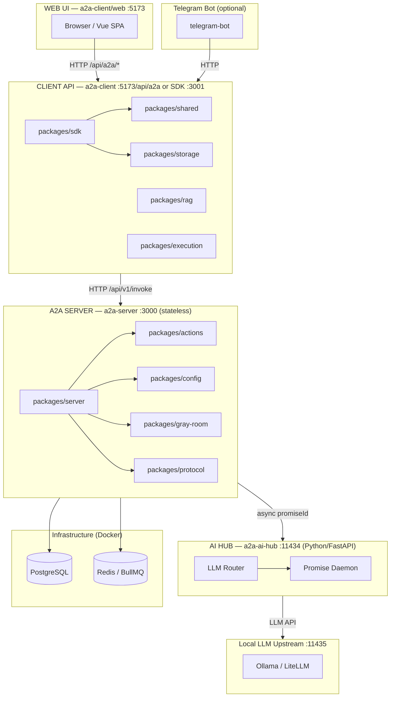
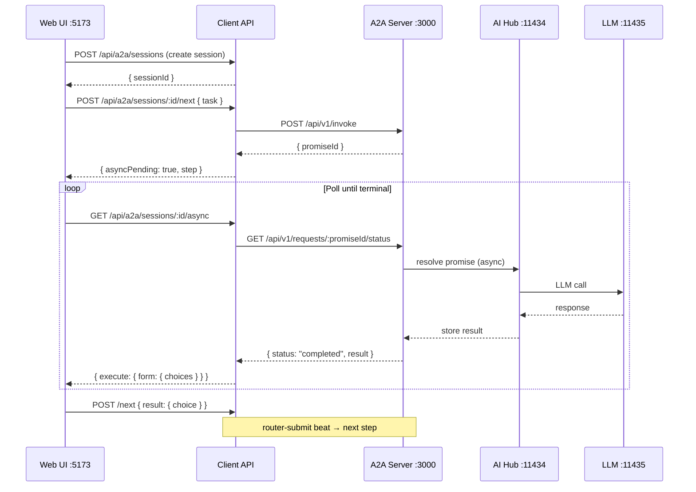

# Архитектура системы A2A

---
doc:
  id: architecture
  type: spec
  machine_readable: true
  updated: 2026-04-19
  tags: [architecture, client, server, web, ports, mermaid]
  references:
    - docs/DOCUMENTATION-MACHINE-READABLE.md
    - docs/PROTOCOL.md
    - docs/DATA-FLOW.md
---

## Обзор

Система A2A Script Agent — **автономная рабочая станция оператора**. Работа ведётся через **долгоживущие async-сессии** (`/next` + polling `/async`), а не через одиночные HTTP-запросы к LLM.

> **Транспорт:** Web ↔ Client API ↔ Server — **async flow с `promiseId`**. Server возвращает `promiseId`,
> Client API опрашивает статус до `completed`, затем возвращает `execute.*` в Web.
>
> **Canonical references:** [PROTOCOL.md](PROTOCOL.md) · [DATA-FLOW.md](DATA-FLOW.md) · [SESSION-FLOW.md](SESSION-FLOW.md)

---

## Диаграмма компонентов (Mermaid)

---

## Диаграмма потока запроса (sequence)

---

## Пакетная структура

```mermaid
graph LR
    subgraph ROOT["Root (монорепо)"]
        PKG[package.json — orchestrator scripts]
        APP[app/ — Next.js shell]
        SCRIPTS[scripts/ — CLI tooling]
        DOCS[docs/]
        TASKS[tasks/]
        SIMS[simulations/]
        TESTS[tests/]
    end

    subgraph SERVER_WS["a2a-server workspace"]
        S_SRV[packages/server — HTTP entry]
        S_ACT[packages/actions — executor]
        S_CFG[packages/config — Zod config]
        S_GR[packages/gray-room — session rooms]
        S_PROTO[packages/server-protocol]
        S_UTILS[packages/server-utils]
        S_DAEMON[packages/daemon — promise daemon]
        S_FEAT[packages/features]
        S_LLM[packages/llm]
        S_MEM[packages/memory]
        S_TRANS[packages/transform]
    end

    subgraph CLIENT_WS["a2a-client workspace"]
        C_SDK[packages/sdk — main API client]
        C_WEB[packages/web — Vue SPA]
        C_RAG[packages/rag — retrieval]
        C_EXEC[packages/execution — script runner]
        C_EMBED[packages/embedding]
        C_HIST[packages/history]
        C_STORE[packages/storage]
        C_SHARED[packages/shared — builders/envelopes]
        C_TYPES[packages/types]
        C_FS[packages/fs-utils]
    end

    subgraph PYTHON["Python services"]
        HUB[a2a-ai-hub — FastAPI LLM router]
        AGENT_OS[agent-os — bootstrap]
    end

    ROOT --> SERVER_WS
    ROOT --> CLIENT_WS
    ROOT --> PYTHON
```

---

## Порты и эндпоинты (сводка)

| Сервис | Порт | Основные маршруты |
|--------|------|-------------------|
| Web UI / Client API (Vite) | **5173** | `GET /api/a2a/projects`, `POST /api/a2a/sessions`, `POST /api/a2a/sessions/:id/next`, `GET /api/a2a/sessions/:id/async` |
| Client API SDK (standalone) | **3001** | те же пути |
| A2A Server (stateless) | **3000** | `POST /api/v1/invoke`, `GET /api/v1/requests/:id/status`, `GET /health` |
| AI Hub | **11434** | `POST /api/promise`, `GET /api/promise/:id`, `GET /health` |
| Local LLM upstream | **11435** | `POST /api/generate` (Ollama) |

## External AI Hub

Прокси **a2a-ai-hub** (**:11434** → Local LLM upstream **:11435**), async через **`promiseId`**. Поток и таблица endpoint'ов: [PROTOCOL.md → Async flow](PROTOCOL.md#async-flow-promiseid).

## Потоки данных

Пошаговые сценарии сессии и контракты: [SESSION-FLOW.md](SESSION-FLOW.md), [PROTOCOL.md](PROTOCOL.md). Асинхронный вызов LLM через Hub: [PROTOCOL.md → Async flow](PROTOCOL.md#async-flow-promiseid).

## Файловая структура

Дерево каталогов и назначение модулей: [FILES.md](FILES.md).

## Переменные окружения

Сервер, клиент, ключи, AI: [AGENTS-REFERENCE.md → Environment Variables](AGENTS-REFERENCE.md#environment-variables).

## Перекрёстные ссылки

- [DATA-FLOW.md](DATA-FLOW.md) — Полная диаграмма потока данных с портами
- [PROTOCOL.md](PROTOCOL.md) — Протокол взаимодействия (action-key shapes, async flow)
- [SESSION-FLOW.md](SESSION-FLOW.md) — Поток сессий
- [SCHEMAS.md](SCHEMAS.md) — JSON схемы запросов/ответов
- [SIMULATION-FORMAT.md](SIMULATION-FORMAT.md) — Формат симуляций
- [FILES.md](FILES.md) — Дерево каталогов и назначение модулей
- [AGENTS-REFERENCE.md](AGENTS-REFERENCE.md) — Порты, переменные окружения, debugging
- [OPTIMIZATION-IDEAS.md](OPTIMIZATION-IDEAS.md) — Идеи оптимизации
