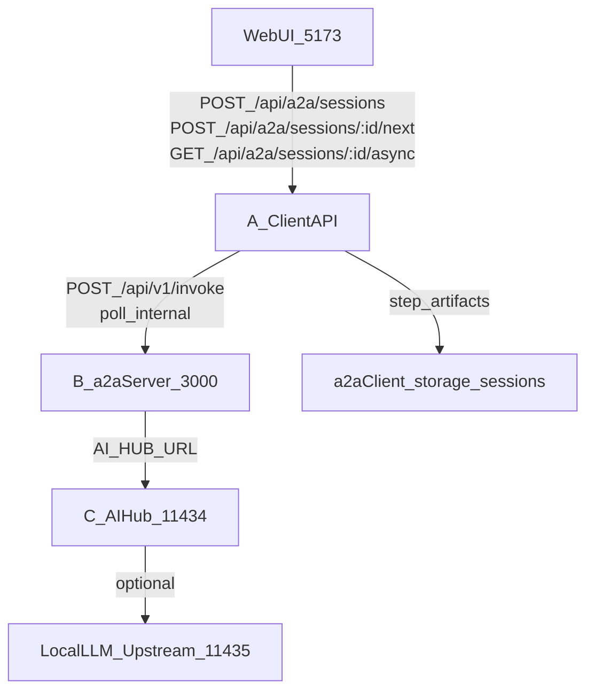

# Обзор проекта: A2A Script Agent (операторская рабочая станция)

## TL;DR (суть)

Этот репозиторий — **autonomous operator workstation**: стек сервисов и контрактов, где работа идёт через **долгоживущие асинхронные сессии** (Client API: `POST /sessions` → `POST /next` → polling `GET /async`), а не через “один HTTP-запрос к LLM”.

- **Канонический драйвер очереди задач**: **Task Monitor** (`npm run monitor`, `npm run monitor:once`). См. [`tools/monitor/MONITOR-QUICK-START.md`](../tools/monitor/MONITOR-QUICK-START.md).
- **Канонический запуск/перезапуск стека**: из **корня** репозитория (Windows: [`start-all.bat`](../start-all.bat); также root `npm run dev`). См. [`README.md`](../README.md), [`docs/SYSTEM_STARTUP.md`](SYSTEM_STARTUP.md).
- **Ключевой контракт**: **action-key shape** (один ключ действия в каждом `execute`/`result`), **async-only** transport. См. [`docs/PROTOCOL.md`](PROTOCOL.md), [`AGENTS.md`](../AGENTS.md).

---

## Структура монорепо (что где лежит)

Высокоуровневые подсистемы и их роль:

- **`a2a-client/`**: Web UI + Client API (dev: через Vite + plugin), standalone SDK (порт 3001), проекция `execute` для браузера.
  - Vite UI root указывает на `packages/web`: [`a2a-client/vite.config.js`](../a2a-client/vite.config.js).
  - Vite Client API middleware (`/api/a2a/*`): [`a2a-client/packages/vite-plugin/src/index.ts`](../a2a-client/packages/vite-plugin/src/index.ts).
  - Session endpoints (create/list/get/messages): [`a2a-client/packages/vite-plugin/src/routes/sessionRoutes.js`](../a2a-client/packages/vite-plugin/src/routes/sessionRoutes.js).
  - Router-flow helpers (choice vs message): [`a2a-client/packages/vite-plugin/src/routes/step-routes-router-flow.ts`](../a2a-client/packages/vite-plugin/src/routes/step-routes-router-flow.ts).
  - Web ↔ Client API протокол и DTO-проекция: [`a2a-client/docs/WEB_UI_PROTOCOL.md`](../a2a-client/docs/WEB_UI_PROTOCOL.md).

- **`a2a-server/`**: stateless сервер протокола: роутер, transforms, Gray Room, исполнение `invoke` и выдача `promiseId`.
  - Entry/start: [`a2a-server/packages/server/src/index.ts`](../a2a-server/packages/server/src/index.ts) (логирует `/health` и `/api/v1/invoke`).

- **`a2a-ai-hub/`**: AI hub / proxy / promise queue (вершина C), очереди промисов и интеграция с upstream’ами.
  - ASGI adapter для запуска через `uvicorn`: [`a2a-ai-hub/proxy/asgi.py`](../a2a-ai-hub/proxy/asgi.py).

- **`tools/monitor/`**: операторская документация Task Monitor (entrypoint в docs-потоке).
  - Quick start: [`tools/monitor/MONITOR-QUICK-START.md`](../tools/monitor/MONITOR-QUICK-START.md).

- **`tests/`**: контрактные и интеграционные проверки (direct-tests, monitor tests, sim schema).
  - **Direct tests (старт для shape/debug)**: [`tests/integration/direct-tests/README.md`](../tests/integration/direct-tests/README.md).
  - **Standalone validators (высокосигнальные сканеры)**: [`tests/integration/direct-tests/validators/README.md`](../tests/integration/direct-tests/validators/README.md).
  - **Simulation schema (канон контрактов)**: [`tests/integration/simulations/SCHEMA.md`](../tests/integration/simulations/SCHEMA.md).

- **`scripts/`**: оркестрация/хелперы; в т.ч. `runbook-cli` (root `npm run dev`).
  - Runbook CLI: [`scripts/runbook-cli.js`](../scripts/runbook-cli.js).

- **`prompts-to-agent-mode/`**: очередь индексированных markdown задач для Task Monitor (нормативный surface для “агентной” работы).

- **`docs/`**: нормативные документы (протокол/оператор/запуск/triage).

---

## “Треугольник” A/B/C (диагностика по слоям)

Определения (нормативно: [`docs/TRIANGLE-WORKFLOW.md`](TRIANGLE-WORKFLOW.md)):

- **A = Client API**: владеет сессией, шагами, хранением артефактов и `/next` + `/async`.
- **B = a2a-server**: stateless обработка `invoke`, transforms, роутер, Gray Room; возвращает `promiseId` (async-only).
- **C = AI Hub / proxy**: promise queue и проксирование к LLM upstream’ам.

### Порты (dev-типовой профиль)

Сверено с [`start-all.bat`](../start-all.bat) и [`docs/SYSTEM_STARTUP.md`](SYSTEM_STARTUP.md):

- **Web UI**: `5173`
- **Client API (standalone SDK / Express)**: `3001`
- **a2a-server**: `3000`
- **AI hub / proxy**: `11434`
- **Local LLM upstream** (опционально, за пределами “треугольника” как отдельного сервиса управления): часто `11435` (см. `AGENTS-REFERENCE` / `SYSTEM_STARTUP` упоминания и env-матрицы).

### Диаграмма потока (канон)

---

## Режимы эксплуатации (что “нормально”)

### 1) Нормальный режим: Task Monitor как “водитель”

**Task Monitor** — канонический способ прогонять индексированные задачи (`prompts-to-agent-mode/*.md`) через **тот же** session dialog, что и web UI:

- Команды: `npm run monitor`, `npm run monitor:once` (см. root [`package.json`](../package.json)).
- Док: [`tools/monitor/MONITOR-QUICK-START.md`](../tools/monitor/MONITOR-QUICK-START.md).
- Acceptance gate (оператор + manual QA): [`docs/OPERATOR-MONITOR-MANUAL-QA.md`](OPERATOR-MONITOR-MANUAL-QA.md).

**Смысл:** монитор гарантирует, что каждое задание проходит “правильный” цикл **`/next` + polling `/async`** и оставляет проверяемые артефакты/идентификаторы.

### 2) Ручной операторский режим: curl / UI (debug, один кейс)

Ручной путь нужен для **точечной диагностики** (одна сессия, один сбой, один stuck `promiseId`), но использует **тот же протокол** Client API:

- Канон и ловушки (router beats, async discipline): [`docs/OPERATOR-CURL.md`](OPERATOR-CURL.md), [`docs/AGENTS-REFERENCE.md`](AGENTS-REFERENCE.md).
- Веб-контур и DTO-проекция для UI: [`a2a-client/docs/WEB_UI_PROTOCOL.md`](../a2a-client/docs/WEB_UI_PROTOCOL.md).

**Критично:** `POST /next` — это **ack**, а не “готовый результат”; интерпретировать состояние надо после polling `GET /async` (и/или `GET /sessions/:id`).

---

## Ключевые контракты и “точки входа”

### 1) Action-key shape (обязательно)

Единое правило: в каждом объекте `execute` и `result` должен быть **ровно один ключ действия**:

- Канон: [`docs/PROTOCOL.md`](PROTOCOL.md) → *Action-key shape*.
- Тот же принцип продублирован в sim schema: [`tests/integration/simulations/SCHEMA.md`](../tests/integration/simulations/SCHEMA.md).

Примеры (концептуально):

- `execute: { "read-file": { ... } }` (а не `execute: { action: "...", ... }`)
- `result: { "read-file": { path, content } }` (а не “плоские” поля без типа действия)

### 2) Async-only транспорт (B никогда не “возвращает всё сразу”)

Серверный `invoke` возвращает `promiseId`; полное `execute/context` приходит через polling:

- Канон: [`docs/PROTOCOL.md`](PROTOCOL.md) (см. про `promiseId`).
- Операторский контур: [`docs/OPERATOR-CURL.md`](OPERATOR-CURL.md) → why not direct invoke as default.

### 3) Router dialog — “два удара” (message vs choice)

Типовой сценарий:

1. Вы отправляете **свободный текст** (пока нет `form.choices`).
2. Сервер/роутер отвечает `execute.form.choices`.
3. Следующий `POST /next` должен отправлять **`result.choice` = id выбора** (или shorthand `task` как id выбора, когда choices были на предыдущем шаге).

Источники:

- Описание: [`docs/SESSION-FLOW.md`](SESSION-FLOW.md), [`a2a-client/docs/WEB_UI_PROTOCOL.md`](../a2a-client/docs/WEB_UI_PROTOCOL.md).
- Реализация правил submit/normalization: [`a2a-client/packages/vite-plugin/src/routes/step-routes-router-flow.ts`](../a2a-client/packages/vite-plugin/src/routes/step-routes-router-flow.ts).

### 4) Точки входа запуска/оркестрации

- **Root `npm run dev`**: вызывает runbook start: [`package.json`](../package.json) → `scripts/dev`, реализация: [`scripts/runbook-cli.js`](../scripts/runbook-cli.js).
- **Windows start**: порт-очистка → запуск hub/daemon/server/client-api/web: [`start-all.bat`](../start-all.bat).
- **a2a-server dev**: `tsx watch .../index.ts`: [`a2a-server/package.json`](../a2a-server/package.json).

---

## Тестирование и эскалация (предсказуемый порядок)

Нормативная логика: сначала изоляция shape/контрактов, потом тяжёлые прогоны.

### 1) Shape/debug first: direct-tests + validators

- Entry: [`tests/integration/direct-tests/README.md`](../tests/integration/direct-tests/README.md).
- Validators: [`tests/integration/direct-tests/validators/README.md`](../tests/integration/direct-tests/validators/README.md).

Root команды (см. [`package.json`](../package.json)):

- `npm run test:direct-tests`
- `npm run scan-promise-bodies`
- `npm run scan-session-responses`
- `npm run verify:gray-room`
- `npm run report:promise -- <promiseId> [--out trace.md] [--logs]`

### 2) Monitor contract regression (offline)

- `npm run test:monitor` (см. [`package.json`](../package.json)).

### 3) Симуляции (контрактные goldens)

Симуляции — “золотой стандарт” форм/shape и pipeline-файлов:

- Канон схемы: [`tests/integration/simulations/SCHEMA.md`](../tests/integration/simulations/SCHEMA.md).
- Root команды (делегируют в `a2a-server`): `npm run sim:lint:all`, `npm run sim:validate -- --all`, `npm run sim:check-md:fail` (см. [`package.json`](../package.json)).

### 4) Операторская матрица (когда и что запускать)

Полный справочник “что чем проверять”:

- [`docs/OPERATOR-TESTING-MATRIX.md`](OPERATOR-TESTING-MATRIX.md)

---

## Triage: где искать проблему (A/B/C)

Ссылки на канон: [`docs/TRIANGLE-WORKFLOW.md`](TRIANGLE-WORKFLOW.md), [`docs/OPERATOR-CURL.md`](OPERATOR-CURL.md).

- **Если UI “крутится” / кажется зависло**:
  - **Сначала A**: подтверждаем polling `GET /api/a2a/sessions/:id/async` до terminal (а не верим ack от `/next`).
  - Проверяем “router beat”: если на предыдущем шаге есть `form.choices`, следующий `/next` должен быть `choice`, а не `message`.

- **Если promise “processing” бесконечно**:
  - **Сначала C**: hub queue/ошибки/daemon (см. web протокол и hub proxy surface: [`a2a-client/docs/WEB_UI_PROTOCOL.md`](../a2a-client/docs/WEB_UI_PROTOCOL.md)).
  - Затем B: собрать evidence по `promiseId` в один отчёт: `npm run report:promise -- <promiseId> --logs`.

- **Если shape/execute/result “поплыл”**:
  - **Сначала direct-tests/validators**, затем симы; не начинать расследование с UI.

---

## Куда смотреть дальше (канонические документы)

- Позиционирование, запуск и команды: [`README.md`](../README.md)
- Нормативные правила эксплуатации (async-only, action-key shape, evidence, empty queue): [`AGENTS.md`](../AGENTS.md)
- Ручной операторский HTTP-контур: [`docs/OPERATOR-CURL.md`](OPERATOR-CURL.md)
- Треугольная диагностика A/B/C: [`docs/TRIANGLE-WORKFLOW.md`](TRIANGLE-WORKFLOW.md)
- Протокол и action-key shape: [`docs/PROTOCOL.md`](PROTOCOL.md)
- Web UI ↔ Client API протокол и DTO-проекция: [`a2a-client/docs/WEB_UI_PROTOCOL.md`](../a2a-client/docs/WEB_UI_PROTOCOL.md)
- Acceptance gate: monitor + manual QA: [`docs/OPERATOR-MONITOR-MANUAL-QA.md`](OPERATOR-MONITOR-MANUAL-QA.md)
- Матрица проверок: [`docs/OPERATOR-TESTING-MATRIX.md`](OPERATOR-TESTING-MATRIX.md)

