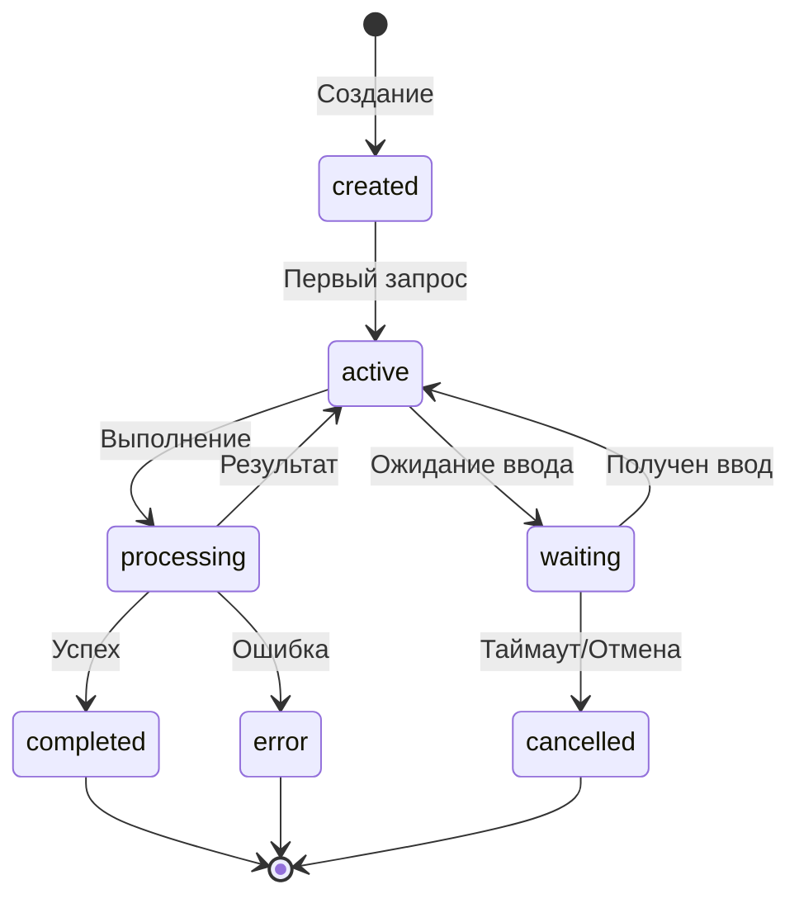

# Протоколы сессий (Session)

## Обзор

Сессия представляет собой контекст выполнения задачи пользователя. В A2A протоколе сессия связывает все этапы выполнения от инициации до завершения.

**HTTP (Web / Vite):** префикс **`/api/a2a/sessions`** — норматив. Standalone Client API дублирует те же маршруты на **`/api/sessions`** (см. [`ADR-0028`](../../../adr/ADR-0028-client-api-deployment-modes.md)).

## Жизненный цикл сессии



## Создание сессии

### Request

**Web → Client API:**
```json
{
  "task": "исправить импорты",
  "projectId": "proj_123"
}
```

### Пример ответа (снимок сессии)

**Client API → клиент** (типичный JSON сессии после создания; не сырой ack `POST /api/v1/invoke`, который даёт только `promiseId`):
```json
{
  "sessionId": "sess_abc123",
  "context": {
    "task": "исправить импорты",
    "execution": {
      "action": "router",
      "step": "init"
    }
  },
  "execute": {
    "form": {
      "choices": [...]
    }
  }
}
```

## Параметры сессии

| Параметр | Тип | Описание |
|----------|-----|----------|
| `sessionId` | string | Уникальный ID сессии |
| `projectId` | string | ID проекта |
| `userId` | string | ID пользователя |
| `createdAt` | timestamp | Время создания |
| `updatedAt` | timestamp | Время обновления |
| `status` | string | Статус сессии |

## Состояния сессии

| Состояние | Описание |
|-----------|----------|
| `created` | Сессия создана |
| `active` | Активна, выполняется |
| `waiting` | Ожидает ввода пользователя |
| `completed` | Успешно завершена |
| `error` | Завершена с ошибкой |
| `cancelled` | Отменена |

## Управление сессией

### Получение сессии

```http
GET /api/a2a/sessions/:sessionId
```

**Response:**
```json
{
  "sessionId": "sess_abc123",
  "status": "active",
  "context": {
    "task": "исправить импорты"
  },
  "history": [
    {
      "step": "init",
      "action": "router",
      "timestamp": "2024-01-15T10:00:00Z"
    }
  ]
}
```

### Завершение сессии

```http
DELETE /api/a2a/sessions/:sessionId
```

**Response:**
```json
{
  "sessionId": "sess_abc123",
  "status": "completed"
}
```

## Контекст сессии

### Структура context

```json
{
  "context": {
    "task": "описание задачи",
    "projectId": "proj_123",
    "userId": "user_456",
    "execution": {
      "action": "fix-vue-imports",
      "step": "scan",
      "status": "processing"
    },
    "history": [
      {
        "role": "user",
        "message": "исправить импорты"
      },
      {
        "role": "assistant",
        "message": "Выберите действие",
        "action": "form.choices"
      }
    ]
  }
}
```

##see also

- [Sesson Flow](../../SESSION-FLOW.md)
- [Этапы протокола](../STAGES/README.md)
