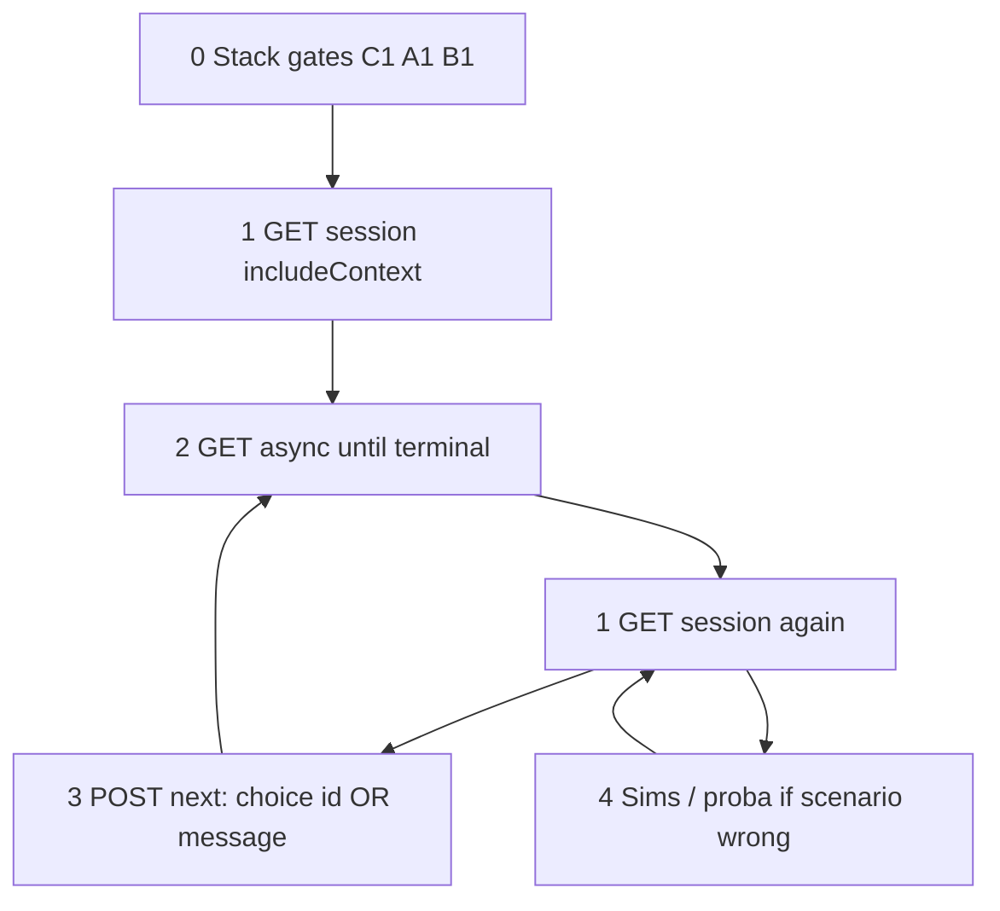

# Triangle workflow — stack triage (client ↔ server ↔ integration)

**When to use:** Loader stuck, wrong screen, wrong turn, or payload shape does not match the scenario you expect.

**Triangle:** three layers — **C** = ai-integration (LLM path), **B** = a2a-server (invoke/transforms), **A** = Client API (session + `/next` + `/async` + storage). **Local LLM upstream** (if present) is only the backend behind **C**, not a separate operator surface. Repo **`start-all`** / **`runbook-cli.ps1`** do not start a local upstream; configure **`LOCAL_LLM_UPSTREAM_URL`** / providers when you use one.

**Repeatable unit:** the **Triangle loop** below. Run **0** after any infra fix, port change, or `start-all` restart. For each turn you drive over HTTP, repeat **1 → 2 → (3 if sending) → 1**.

**Operator API (curl / Client API, normative):** [`OPERATOR-CURL.md`](OPERATOR-CURL.md) — [Minimal mental model](OPERATOR-CURL.md#minimal-mental-model) (create, router, `/async`), [`POST /api/a2a/sessions` body](OPERATOR-CURL.md#post-apia2asessions-body-create), [Driver checklist](OPERATOR-CURL.md#driver-checklist-anti-stop), [Local LLM upstream generating vs stuck](OPERATOR-CURL.md#compat_llm-is-generating--pause-other-work), [GET session / unwrap / messages](OPERATOR-CURL.md#web-access-and-a2a-server), [Direct A2A invoke (debug only)](OPERATOR-CURL.md#direct-a2a-server-invoke-debug-only-fallback).

### Colored alerts (triage) vs Rooms (runtime)

**Alerts** — [`GLOSSARY.md`](../GLOSSARY.md) section *Alerts (тревоги)*: labels for *where to look* or *what kind of fix* (e.g. **Gray alert** = server-first triage; **Black alert (proxy)** = hub-first). They are **not** runtime flags unless you add them.

**Rooms** — same glossary, *Core terms*: **Gray Room**, **Red Room**, **Black Room** are **pipeline phases** (server LLM chain, client tools, algorithm mode). **Gray alert ≠ Gray Room** (same doc: *Rooms vs alerts*).

**Quick map:** vertex **A** ↔ often **Blue** / **Purple** / **Teal**; **B** ↔ **Gray alert** + Gray Room *inside* server work; **C** ↔ **Black alert (proxy)**. **Red alert** = full Task Monitor / solo cycle through **A** (sessions), still classifying failures along **B/C** when stuck.

---

## Living queue — current tasks & problems

**Purpose:** Track **open** triangle-relevant issues (layers **A / B / C**, session projection, loader/async, proba vs live mismatch). **Not** a full project backlog — that stays in [`work/STATE.md`](../work/STATE.md) and [`tasks/`](../tasks/README.md).

**Maintenance (required):**

1. **Add** a row when a problem is confirmed (symptom + layer + pointer).
2. **Delete** the row when fixed or obsolete — do not leave “done” clutter here.
3. **Date** each row (`As of`) so stale entries are obvious at review time.
4. Prefer **links** (`error-report.md`, `tasks/pending/…`, PR) over long prose.

| As of | Layer | Symptom / problem | Next action | Link / artifact |
|-------|-------|-------------------|-------------|-----------------|
| 2026-04-06 | A/B | Loader / dialog “feels stuck” while debugging | Use loop **2 → 1** only; do not trust UI alone; classify generating vs stuck per [`OPERATOR-CURL.md`](OPERATOR-CURL.md) | — |

*(Remove rows above when resolved; keep the table short.)*

---

## Triangle loop (repeat many times)

Use **`BASE`** = your Client API origin (dev default `http://localhost:5173`). Use **`{id}`** = storage session id (`sess_…`).

### 0 — Stack gates (start here; repeat after any “service down” fix)

| Step | Action | OK means | If not OK |
|------|--------|----------|-----------|
| **C1** | `GET ${AI_HUB_URL}/health` (default host `http://localhost:11434`) | HTTP 200 | Fix ai-integration / its backend; [`docs/SYSTEM_STARTUP.md`](SYSTEM_STARTUP.md); then **go to 0** |
| **A1** | `GET {BASE}/api/a2a/projects` | HTTP 200 | Fix Vite / Client API; then **go to 0** |
| **B1** | `GET http://localhost:3000/health` (only if you need a2a-server directly) | HTTP 200 | Fix a2a-server; then **go to 0** |

Optional deep check (same idea as proba): backend tags for the integration’s LLM — see [`tests/proba-servera/validate.mts`](../tests/proba-servera/validate.mts). Failure → treat as **C1** backend dependency, not a “fourth app.”

---

### 1 — Observe session (one session under debug)

| Step | Action |
|------|--------|
| **S1** | `GET {BASE}/api/a2a/sessions/{id}?includeContext=1` (dev; `includeContext` may be 403 in production) |
| **S2** | Read **`execute.form`**: is there **`choices`** (array, length ≥ 1)? |
| **S3** | Read **`context.execution`**: **`action`**, **`step`**. |
| **S4** | If present, read **`context.operationHistory`** (last entries first) for failed transform / interrupt / LLM. |

Do **not** use the browser spinner as “done.”

---

### 2 — Wait until async is finished (mandatory before interpreting UI)

| Step | Action |
|------|--------|
| **W1** | `GET {BASE}/api/a2a/sessions/{id}/async` |
| **W2** | If response indicates work still pending (`asyncPending` / non-terminal `status`): wait with **backoff**, **repeat W1** until terminal. **No** fixed max attempts — see root [`AGENTS.md`](../AGENTS.md). |
| **W3** | If still pending and the **integration/backend** is idle while the server stays busy: treat as **stuck** — [`docs/OPERATOR-CURL.md`](OPERATOR-CURL.md) (*Local LLM upstream is generating* / stuck promise). Fix infra or server, then **go to 0**. |
| **W4** | After terminal: **S1** again so `execute` / `context` match the latest step. |

---

### 3 — Send the next `/next` (one turn)

| Step | Action |
|------|--------|
| **N0** | From **S2**: **`choices` present?** |
| **N1a** | **Yes** → `POST {BASE}/api/a2a/sessions/{id}/next` with **`{ "result": { "choice": "<id from form.choices>" } }`** or shorthand **`{ "task": "<id>" }`** (same as choice id, **not** free text). |
| **N1b** | **No** → `POST` with **`{ "result": { "message": "<text>" } }`** or shorthand **`{ "task": "<text>" }`**. |
| **N2** | After `POST`, **go to 2** (wait async), then **1** (re-read session). |

Router rules: [`AGENTS.md`](../AGENTS.md) → *Router dialog (two beats)*.

---

### 4 — Compare to goldens (when the stack is healthy but the story is wrong)

| Step | Action |
|------|--------|
| **G1** | Find **`context.execution.step`** (and action) in [`simulations/sync/`](../simulations/) — matching **golden** `request.json` / `response.json` for that beat. |
| **G2** | For **one server turn** regression: matching folder under [`tests/proba-servera/`](../tests/proba-servera/) with `input.json` / `expected.json`; read **`error-report.md`** on fail. |
| **G3** | If proba passes but the Client API session fails → focus on **A** (wrong `/next` body, async not polled, stale projection). |

Shape / contract: [`simulations/SCHEMA.md`](../simulations/SCHEMA.md). Broader escalation: [`docs/OPERATOR-CURL.md`](OPERATOR-CURL.md) → schema debugging order.

---

## Loop diagram (same cycle)

**Core repeat:** **1 → 2 → 1** until stable; add **3 → 2** for each turn you send. **0** only after restarts or failed gates. **4** when the stack is up but the story or shape is wrong.

---

## Vertices (reference)

| Layer | You touch | Typical break |
|-------|-----------|----------------|
| **A** | `{BASE}/api/a2a/sessions/*`, storage under `a2a-client/storage/sessions/` | Bad `/next` shape, no `/async` poll, UI out of date |
| **B** | `POST /api/v1/invoke` (via Client API), a2a-server logs | Empty execute, failed outcome, step/result mismatch |
| **C** | `AI_HUB_URL` | Health fails; generation stuck vs hub |

---

## See also

- [`work/STATE.md`](../work/STATE.md) — full task queue (not triangle-only)
- [`OPERATOR-CURL.md`](OPERATOR-CURL.md) — operator HTTP surface: [create / next / async](OPERATOR-CURL.md#minimal-mental-model), [sanitization to invoke](OPERATOR-CURL.md#invoke-sanitization-post-next--a2a-server-apiv1invoke), [schema-debug order](OPERATOR-CURL.md#schema-debugging-first-step-mandatory)
- [`AGENTS.md`](../AGENTS.md) — Client API table, polling policy, router two beats
- [`tests/proba-servera/README.md`](../tests/proba-servera/README.md) — proba vs sims
