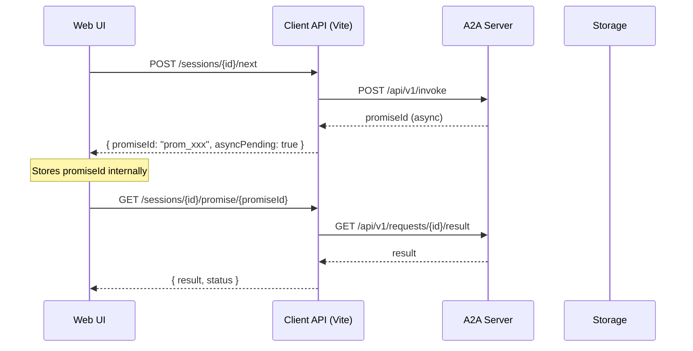

# ADR-0025: Decouple PromiseID from Web UI

Status: proposed
Date: 2026-03-21

## Context

Currently, Web UI depends on internal promiseID data returned by Client API. This creates tight coupling between UI and server implementation details:

**Current Problems:**

1. **Web UI performs polling** - `action-executor.js` calls `startPromisePolling(sessionId, promiseId)` directly in browser
2. **Web UI knows about promiseId** - Internal transport identifier leaked to presentation layer
3. **Two polling mechanisms** - Browser-side polling (`DialogPromise.startPolling`) AND server-side polling (incomplete)
4. **No clear state abstraction** - Web UI must understand promise lifecycle details

**Current Architecture Flow:**



## Decision

Implement server-side daemon polling and abstract status from Web UI:

### 1. Server-Side Daemon Polling

Client API daemon (`a2a-client/packages/vite-plugin/daemon/a2a-result-poll.js`) automatically polls A2A Server after receiving promiseId:

```javascript
// In stepRoutes.js POST /next handler
if (promiseData?.promiseId) {
    // Start daemon polling immediately
    daemon.pollPromise(promiseData.promiseId, (status) => {
        // Update storage on each status change
        saveServerPromise(cwd, sessionId, nextStepNum, {
            promiseId: promiseData.promiseId,
            status: status.status,
            checkedAt: new Date().toISOString()
        });
        
        // When complete, save server-response.json
        if (status.completed || status.execute) {
            saveServerResponse(cwd, sessionId, nextStepNum, stepRecord);
            session.status = 'completed';
        }
    });
    
    // Return minimal ack to UI - NO promiseId
    res.end(JSON.stringify({
        success: true,
        accepted: true,
        step: nextStepNum,
        asyncPending: true  // UI only knows about async, not promiseId
    }));
}
```

### 2. Web UI Receives Only Status

Web UI polls session endpoint and receives abstract state:

**Current Response (leaks promiseId):**
```json
{
    "id": "sess_xxx",
    "status": "processing",
    "promiseId": "prom_xxx",
    "asyncPending": true,
    "promiseStatus": "pending"
}
```

**Proposed Response (abstracted):**
```json
{
    "id": "sess_xxx",
    "status": "processing",
    "currentStep": 4,
    "asyncPending": true
}
```

### 3. Status Values (Not promiseId)

Web UI receives only these status values:

| Status | Description |
|--------|-------------|
| `idle` | No active async work |
| `pending` | Awaiting initial processing |
| `processing` | Actively processing (LLM, actions) |
| `completed` | Successfully completed |
| `error` | Failed with error |

### 4. Remove promiseId from Public API

**Files to modify:**

1. `a2a-client/packages/vite-plugin/routes/utils/web-session-dto.js` - Remove promiseId from `toPublicSession()`
2. `a2a-client/packages/vite-plugin/routes/stepRoutes.js` - Start daemon automatically after invoke
3. `a2a-client/packages/vite-plugin/routes/sessionRoutes.js` - Ensure GET /sessions/:id returns no promiseId

**Before:**
```javascript
export function toPublicSession(session, includeContext = false) {
    const { context: _c, ...rest } = session;
    return {
        ...rest,
        asyncPending: session.asyncPending,
        promiseStatus: session.promiseStatus
    };
}
```

**After:**
```javascript
export function toPublicSession(session, includeContext = false) {
    const { context: _c, promiseId: _pi, ...rest } = session;
    return {
        ...rest,
        asyncPending: session.asyncPending,
        // promiseStatus derived from session.status, NOT promiseId
        status: session.status || (session.asyncPending ? 'processing' : 'idle')
    };
}
```

## Implementation Plan

### Phase 1: Server-Side Daemon

1. **Enhance `a2a-result-poll.js`** - Add callback support for status updates
2. **Modify `stepRoutes.js`** - Start polling immediately after invoke response
3. **Update storage** - Write status changes to `server-promise.json`

### Phase 2: Remove promiseId from Responses

1. **Update `web-session-dto.js`** - Strip promiseId from public responses
2. **Update `sessionRoutes.js`** - Ensure consistent no-promiseId behavior
3. **Update `stepRoutes.js`** - Return minimal ack without promiseId

### Phase 3: Update Web UI

1. **Remove promiseId handling** - Delete `setPromiseId()` calls in UI
2. **Simplify polling** - Web UI polls `GET /sessions/{id}` only
3. **Update status handling** - Use `session.status` instead of promise polling

**Files to modify in Web UI:**

| File | Change |
|------|--------|
| `web/js/action-executor.js` | Remove `startPromisePolling()` calls |
| `web/js/api-integration.js` | Remove `checkPromise()` usage |
| `web/js/session-data.js` | Remove `setPromiseId()` |
| `web/js/core/DialogPromise.js` | Simplify to status-only |

### Phase 4: Cleanup

1. Remove `dialog-promise-poll.js` daemon from Web UI (no longer needed)
2. Remove promiseId references from error messages
3. Update documentation

## Consequences

### Positive

- **Decoupled architecture** - Web UI doesn't know about internal transport IDs
- **Single polling point** - Server daemon handles all async work
- **Clean state abstraction** - UI receives only meaningful status values
- **Better testability** - Can test daemon separately from UI
- **Security** - promiseId not exposed to client browser

### Negative

- **More server load** - Client API daemon must poll for all sessions
- **Complexity shift** - Polling logic moves from browser to server
- **Latency** - Two network hops instead of one for status checks

### Trade-offs

- **Simplicity vs Control** - UI simplicity over fine-grained promise control
- **Server load vs Client complexity** - More work on server, less on client

## Notes / Follow-ups

### Required Changes Summary

```diff
# API Response: GET /sessions/{id}
- promiseId: "prom_xxx"
- promiseStatus: "pending"
+ status: "processing"
```

```diff
# API Response: POST /sessions/{id}/next
- promiseId: "prom_xxx"
+ asyncPending: true
```

### Future Enhancements


- Add status subscription endpoint for efficient updates
- Consider moving daemon to separate microservice

### Related ADRs

- ADR-0016: Promise Queue Architecture
- ADR-0017: Promise Daemon Deployment
- ADR-0018: Promise State Synchronization
