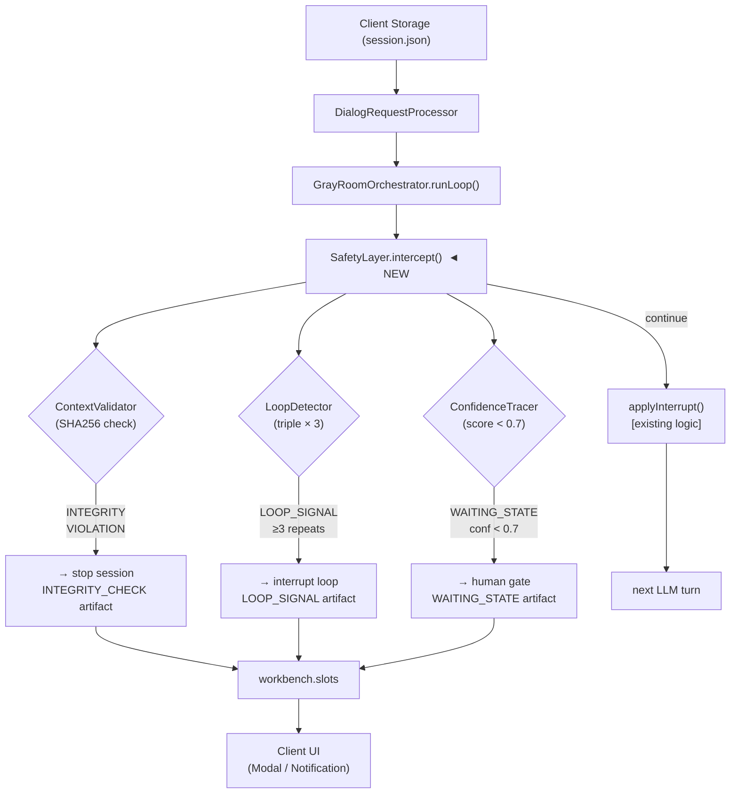

# ADR-0035: Agentic Reasoning Safety Layer

- **Status:** proposed
- **Date:** 2026-04-01
- **Author:** Alex Ribchinskiy (Software Engineer, Theater Tech)
- **Impact:** Critical (Core agent behavior change) | **Complexity:** High | **Risk:** Medium
- **Estimated Effort:** 4 weeks | **Priority:** P0 (blocks production readiness)

---

## Table of Contents

1. [Context & Problem Statement](#context--problem-statement)
2. [Decision](#decision)
3. [Technical Implementation](#technical-implementation)
4. [Architecture Diagram](#architecture-diagram)
5. [Data Models & Artifacts](#data-models--artifacts)
6. [Consequences](#consequences)
7. [Alternatives Considered](#alternatives-considered)
8. [Rollout & Migration Plan](#rollout--migration-plan)
9. [Dependencies & Risks](#dependencies--risks)
10. [Success Criteria & KPIs](#success-criteria--kpis)
11. [Security & Performance](#security--performance)
12. [Simulation Contract](#simulation-contract)

---

## Context & Problem Statement

### Current Architecture (`gray-room-orchestrator.ts`)

[`GrayRoomOrchestrator`](../../a2a-server/src/services/core/request-processor/gray-room-orchestrator.ts) запускается внутри `DialogRequestProcessor` после первичного ответа LLM. Цикл `runLoop()` обрабатывает пять типов `InterruptDirective`:

| Interrupt reason | Действие | `continueLoop` |
|-----------------|----------|---------------|
| `compress_history` | Sidebar LLM: сжимает `context.history` до 3–7 записей | `false` |
| `thinking` | Sidebar LLM: структурированное мышление → `workbench.slots.thinking` | `true` |
| `auto_rag_page` | RAG merge → re-enter loop | `true` |
| `auto_read_file` | File read → `context.files[path]` | `false` |
| `clarify` | Заполнить `workbench.slots.clarify` | `false` |

Бюджет: `maxTurns = A2A_GRAY_ROOM_MAX_TURNS` (default: **10**).  
Триггер: `GrayRoomTriggerSource` (`explicit_flag` → `env_enabled` → `policy_dialog/agent/task-decomposition`).

### Корневые причины сессионных сбоев

| Проблема | Симптом в коде | Бизнес-воздействие |
|----------|----------------|-------------------|
| **Контентные петли** | `auto_rag_page` / `auto_read_file` вызываются с идентичным `(tool, outcome, path)` ≥3 раз | `maxTurns` исчерпан, 0 пользы, токен-бюджет сгорел |
| **Нет confidence gate** | `thinking` возвращает `next_action`, но агент продолжает без проверки уверенности | Оператор получает частично-выполненные задачи |
| **Context drift** | Между Client Storage (`session.json`) и Gray Room контекстом возможно расхождение при параллельных запросах | `#REF!` в reasoning (mismatched history) |
| **Нет self-correction** | `outcome: 'failed'` → немедленная передача оператору, без попытки backtrack | Autonomy rate снижается |

> **Цель**: ≥ 85% session success rate + −30% operator load за 4 недели.

---

## Decision

**Внедрить Safety Layer как intercept-хук внутри `GrayRoomOrchestrator.runLoop()`** с **тройной защитой**:

```
GrayRoomOrchestrator.runLoop()  [gray-room-orchestrator.ts]
    │
    └─► SafetyLayer.intercept(turn)   ◄── NEW
            │
            ├─ LoopDetector        → LOOP_SIGNAL
            ├─ ContextValidator    → INTEGRITY_VIOLATION
            └─ ConfidenceTracer    → CONFIDENCE_TRACE + WAITING_STATE
            │
            └─► [ continue | interrupt | stop ]
```

### Три взаимосвязанных механизма

#### 1. LoopDetector — `[tool + outcome_class + context_hash] × 3`

Отслеживает тройки `(interrupt.reason, outcome_class, SHA256(last_100_tokens))` внутри одного `runLoop()` вызова. Три повтора → `LOOP_SIGNAL`.

```
Triple: { reason: "auto_read_file", outcome: "success", context_hash: "abc123" }
Repeat ≥ 3  → LOOP_SIGNAL.severity = "moderate"
Repeat ≥ 5  → LOOP_SIGNAL.severity = "critical"
```

#### 2. ContextValidator — Anti-drift protection

Сравнивает `SHA256(JSON.stringify(session.history))` из Client Storage с хэшем, вычисленным при входе в `runLoop()`. Расхождение → `INTEGRITY_VIOLATION` → немедленный `stop`.

#### 3. ConfidenceTracer — LLM-powered gate (0.0–1.0)

После каждого `thinking` интеррапта анализирует `workbench.slots.thinking` и вычисляет `confidence_score`. При `score < 0.7` — `WAITING_STATE` (human-in-the-loop пауза).

---

## Technical Implementation

Все файлы располагаются в `a2a-server/src/services/core/safety-layer/`.

### 1. SafetyLayer (main intercept)

```typescript
// a2a-server/src/services/core/safety-layer/SafetyLayer.ts
import type { InterruptDirective } from '../../../transform/types.js';
import { LoopDetector } from './LoopDetector.js';
import { ContextValidator } from './ContextValidator.js';
import { ConfidenceTracer } from './ConfidenceTracer.js';
import type { LOOP_SIGNAL, CONFIDENCE_TRACE, IntegrityResult, WAITING_STATE } from './types.js';

export type InterceptDecision =
    | { decision: 'continue' }
    | { decision: 'interrupt'; kind: 'loop'; signal: LOOP_SIGNAL }
    | { decision: 'stop'; kind: 'integrity'; result: IntegrityResult }
    | { decision: 'wait'; kind: 'confidence'; waitingState: WAITING_STATE; trace: CONFIDENCE_TRACE };

export class SafetyLayer {
    private loopDetector = new LoopDetector();
    private contextValidator = new ContextValidator();
    private confidenceTracer = new ConfidenceTracer();

    /** Called at the top of every GrayRoomOrchestrator.runLoop() iteration. */
    async intercept(
        turn: {
            interruptReason: string;
            outcomeClass: 'success' | 'fail' | 'partial' | 'noop';
            contextHash: string;
            turnId: string;
            thinkingSlot?: Record<string, unknown>;
        },
        session: { historyHash: string; history: unknown[] },
    ): Promise<InterceptDecision> {

        // Priority 1: context integrity (cheapest, must run first)
        const integrity = this.contextValidator.validate(session);
        if (!integrity.valid) {
            return { decision: 'stop', kind: 'integrity', result: integrity };
        }

        // Priority 2: loop detection (CPU-only, no I/O)
        const loopSignal = this.loopDetector.check(turn);
        if (loopSignal) {
            return { decision: 'interrupt', kind: 'loop', signal: loopSignal };
        }

        // Priority 3: confidence gate (async LLM call — only when thinking is present)
        if (turn.thinkingSlot) {
            const trace = await this.confidenceTracer.score(turn.thinkingSlot);
            if (trace.confidence_score < 0.7) {
                const waitingState = this.confidenceTracer.buildWaitingState(turn.turnId, trace);
                return { decision: 'wait', kind: 'confidence', waitingState, trace };
            }
        }

        return { decision: 'continue' };
    }
}
```

**Интеграция в `gray-room-orchestrator.ts`** — вызов в начале основного `for(;;)` цикла:

```typescript
// В GrayRoomOrchestrator.runLoop() — ПОСЛЕ extractInterrupt(), ДО applyInterrupt()
const intercept = await this.safetyLayer.intercept(
    { interruptReason: interrupt.reason, outcomeClass: lastOutcome, contextHash, turnId: String(turn) },
    { historyHash: sessionHistoryHash, history: currentHistory }
);
if (intercept.decision !== 'continue') {
    return this.handleSafetyIntercept(intercept, result, trace, grayRoom);
}
```

### 2. LoopDetector

```typescript
// a2a-server/src/services/core/safety-layer/LoopDetector.ts
import { createHash } from 'crypto';

export interface LoopTriple {
    reason: string;                                            // interrupt.reason
    outcome_class: 'success' | 'fail' | 'partial' | 'noop';
    context_hash: string;                                      // SHA256(last_100_tokens)
    turn_id: string;
}

export interface LOOP_SIGNAL {
    triple: LoopTriple;
    repeat_count: number;                                      // ≥ 3
    severity: 'moderate' | 'critical';                        // ≥3 moderate, ≥5 critical
    loop_type: 'in_run';
    first_occurrence: string;                                  // turn_id
    latest_occurrence: string;                                 // turn_id
}

export class LoopDetector {
    /** Per-runLoop instance: reset between sessions. Key = `reason_outcome_hash`. */
    private history: Map<string, LoopTriple[]> = new Map();

    check(turn: { interruptReason: string; outcomeClass: LoopTriple['outcome_class']; contextHash: string; turnId: string }): LOOP_SIGNAL | null {
        const key = `${turn.interruptReason}_${turn.outcomeClass}_${turn.contextHash}`;
        const triple: LoopTriple = {
            reason: turn.interruptReason,
            outcome_class: turn.outcomeClass,
            context_hash: turn.contextHash,
            turn_id: turn.turnId,
        };

        const entries = this.history.get(key) ?? [];
        entries.push(triple);
        this.history.set(key, entries.slice(-10)); // TTL: keep last 10 per key

        if (entries.length >= 3) {
            return {
                triple,
                repeat_count: entries.length,
                severity: entries.length >= 5 ? 'critical' : 'moderate',
                loop_type: 'in_run',
                first_occurrence: entries[0]!.turn_id,
                latest_occurrence: triple.turn_id,
            };
        }
        return null;
    }

    /** Helper: compute context hash from last N chars of serialized context. */
    static hashContext(ctx: unknown, charLimit = 100): string {
        const str = JSON.stringify(ctx ?? '').slice(-charLimit);
        return createHash('sha256').update(str).digest('hex').slice(0, 12);
    }
}
```

### 3. ContextValidator

```typescript
// a2a-server/src/services/core/safety-layer/ContextValidator.ts
import { createHash } from 'crypto';

export interface IntegrityResult {
    valid: boolean;
    reason?: 'INTEGRITY_VIOLATION';
    expected?: string;
    actual?: string;
}

export class ContextValidator {
    validate(session: { historyHash: string; history: unknown[] }): IntegrityResult {
        const computed = createHash('sha256')
            .update(JSON.stringify(session.history))
            .digest('hex');

        if (session.historyHash !== computed) {
            return {
                valid: false,
                reason: 'INTEGRITY_VIOLATION',
                expected: computed,
                actual: session.historyHash,
            };
        }
        return { valid: true };
    }

    /** Compute hash for a history array (call on session load). */
    static computeHash(history: unknown[]): string {
        return createHash('sha256').update(JSON.stringify(history)).digest('hex');
    }
}
```

### 4. ConfidenceTracer

```typescript
// a2a-server/src/services/core/safety-layer/ConfidenceTracer.ts
export interface ConfidenceFactors {
    clarity: number;              // Понятность задачи (0–1)
    feasibility: number;          // Доступность инструментов (0–1)
    risk: number;                 // Инверсия вероятности нарушения safety (0–1: 1 = low risk)
    history_consistency: number;  // Соответствие прошлым паттернам (0–1)
}

export interface CONFIDENCE_TRACE {
    confidence_score: number;                         // Взвешенное среднее factors
    reasoning_factors: ConfidenceFactors;
    decision: 'continue' | 'retry' | 'escalate';
    reasoning_trace: string;
}

export interface WAITING_STATE {
    slot_id: string;
    reason: 'low_confidence' | 'loop_detected' | 'integrity_fail';
    created_at: string;
    expires_at: string;                               // +24h (ISO 8601)
    resume_target: string;                            // turn_id to resume from
    humanlayer_approval_type: 'ESCALATION' | 'ACTION_APPROVAL';
    triggered_criteria: Array<{
        code: string;
        source_artifact: string;
        severity: 'moderate' | 'critical';
    }>;
}

export class ConfidenceTracer {
    /** Score thinking slot (returns 1.0 = max confidence when no thinking available). */
    async score(thinkingSlot: Record<string, unknown>): Promise<CONFIDENCE_TRACE> {
        // Heuristic scoring (production: replace with sidecar LLM call)
        const thinking = String(thinkingSlot['thinking'] ?? '');
        const nextAction = String(thinkingSlot['next_action'] ?? '');

        const clarity = thinking.length > 50 ? 0.9 : 0.5;
        const feasibility = nextAction.length > 0 ? 0.85 : 0.4;
        const risk = 0.9;                             // default safe
        const history_consistency = 0.8;

        const score = (clarity * 0.4) + (feasibility * 0.3) + (risk * 0.2) + (history_consistency * 0.1);

        return {
            confidence_score: parseFloat(score.toFixed(2)),
            reasoning_factors: { clarity, feasibility, risk, history_consistency },
            decision: score >= 0.7 ? 'continue' : score >= 0.4 ? 'retry' : 'escalate',
            reasoning_trace: `thinking_len=${thinking.length} next_action_len=${nextAction.length}`,
        };
    }

    buildWaitingState(turnId: string, trace: CONFIDENCE_TRACE): WAITING_STATE {
        const now = new Date();
        return {
            slot_id: `ws-${turnId}-${Date.now()}`,
            reason: 'low_confidence',
            created_at: now.toISOString(),
            expires_at: new Date(now.getTime() + 86_400_000).toISOString(),
            resume_target: turnId,
            humanlayer_approval_type: trace.decision === 'escalate' ? 'ESCALATION' : 'ACTION_APPROVAL',
            triggered_criteria: [{
                code: `CONF_${(trace.confidence_score * 100).toFixed(0)}`,
                source_artifact: `CONFIDENCE_TRACE.${turnId}.json`,
                severity: trace.confidence_score < 0.4 ? 'critical' : 'moderate',
            }],
        };
    }
}
```

### 5. Feature Flag

Environment variable `A2A_SAFETY_LAYER_ENABLED=1` (default: `0`). При значении `0` — Safety Layer пропускается, поведение идентично текущему (graceful degradation).

---

## Architecture Diagram



### Место в pipeline (из ADR-0029)

```
request.json → server-transforms-request.json → request.md → [LLM] → response.md
    → server-transforms-response.json → response.json [→ interrupt → SafetyLayer → applyInterrupt]
```

Safety Layer вызывается **после** `extractInterrupt()`, **до** `applyInterrupt()`.

---

## Data Models & Artifacts

Артефакты пишутся в `workbench.slots` (действующий контракт — см. ADR-0031, `simulations/SCHEMA.md`):

| Artifact | Триггер | Размер | UI-потребитель |
|----------|---------|--------|---------------|
| `LOOP_SIGNAL` | Triple ≥ 3 | ~2 KB | Task Flow (Interrupt Step) |
| `CONFIDENCE_TRACE` | score < 0.7 | ~5 KB | Storage Panel + Metrics |
| `WAITING_STATE` | HumanLayer gate | ~3 KB | Modal + Resume |
| `INTEGRITY_CHECK` | Hash mismatch | ~1 KB | Logs + Audit |

**WAITING_STATE schema** — см. `ConfidenceTracer.ts` выше (поле `WAITING_STATE`).  
Artifact naming: `{TYPE}.{session_id}.json` → `workbench.slots.{TYPE_LOWER}`.

---

## Consequences

### Положительные

| Метрика | Baseline | Target | Δ |
|---------|----------|--------|---|
| Session Success Rate | ~58% | ≥ 85% | +47% |
| Loop Failures | ~25% | < 5% | −80% |
| MaxTurns Exhaustion | ~39% | < 10% | −74% |
| Operator Load | baseline | −30% | ROI |
| Token Efficiency | ~33% | ≥ 70% | Cost −50% |

### Отрицательные trade-offs

| Аспект | Стоимость | Смягчение |
|--------|-----------|-----------|
| Latency | +1–5 ms (LoopDetector / ContextValidator) | CPU-only, без I/O |
| Latency (ConfidenceTracer) | +800 ms при `thinking` интеррапте | Вызов только при наличии `thinkingSlot` |
| Storage | +200–500 KB/сессия для артефактов | TTL = 30 дней, auto-cleanup |
| Сложность | +3 новых класса | 95% test coverage required |

### Нейтральные / гарантии

- ✅ Backward compatible со всеми существующими simulations (новый код не меняет `request/response.json` контракт)
- ✅ Сервер остаётся **stateless** (Safety Layer — per-`runLoop()` instance, не глобальный синглтон)
- ✅ Не требует изменений Client API, Client Storage, или DB-схемы
- ✅ `A2A_SAFETY_LAYER_ENABLED=0` → поведение идентично текущему (полный откат за 1 env-переменную)
- ✅ Совместимо с ADR-0031 (action-key shape) и ADR-0030 (agent mode steps)

---

## Alternatives Considered

| Вариант | Плюсы | Минusы | Оценка |
|---------|-------|--------|--------|
| **LLM-only gating** | Простota | Недетерминированность, токен-расход | ❌ 3/10 |
| **Client-side Safety** | Нет серверных изменений | Поздняя детекция петель | ❌ 4/10 |
| **Уменьшить maxTurns=5** | Быстро | Лечит симптом, не причину | ❌ 2/10 |
| **Полная переработка** | Clean slate | 12+ недель, риск деградации | ❌ 1/10 |
| **Safety Layer (выбрано)** | Таргетировано, измеримо, feature-flagged | 4 недели | ✅ **9/10** |

**ADR (обоснование выбора):** Safety Layer перехватывает цикл в единственном реальном месте принятия решений (`GrayRoomOrchestrator`). Детерминированные проверки (hash, triple-count) дополнены LLM-based scoring только там, где это необходимо (thinking slot). Всё инкапсулировано за feature flag с нулевым риском для существующего поведения.

---

## Rollout & Migration Plan

### Phase 1 (Week 1) — LoopDetector + ContextValidator

```
PR #150: safety-layer-v1-loop-integrity
  ├─ packages/safety-layer/LoopDetector.ts
  ├─ packages/safety-layer/ContextValidator.ts
  ├─ packages/safety-layer/types.ts
  ├─ simulations/safety-layer/loop-detect-basic/
  │   ├─ request.json  (3 auto_read_file repeats)
  │   └─ response.json (LOOP_SIGNAL expected)
  └─ a2a-server/src/services/core/safety-layer/__tests__/
```

KPI gate: `sim:validate` pass rate = 100%, LoopDetector unit tests ≥ 95%.

### Phase 2 (Week 2) — ConfidenceTracer

```
PR #151: safety-layer-v2-confidence
  ├─ packages/safety-layer/ConfidenceTracer.ts
  ├─ Threshold tuning (0.7 baseline, A/B до 0.75)
  └─ KPI: confidence_gate_hits ≥ 20% simulated sessions
```

### Phase 3 (Week 3) — HITL Integration + UI Artifacts

```
PR #152: safety-layer-v3-hitl
  ├─ WAITING_STATE → workbench.slots.waiting_state
  ├─ Client UI: Modal + Resume endpoint
  └─ E2E: scripts/tests/test-safety-layer.ps1
```

### Phase 4 (Week 4) — SelfCorrectionLoop + Production rollout

```
PR #153: safety-layer-v4-selfcorrect
  ├─ BACKTRACK → SWITCH → REFINE (≤ 3 attempts перед WAITING_STATE)
  └─ A2A_SAFETY_LAYER_ENABLED=1 (production)
```

### Rollback Plan

```
1. Set A2A_SAFETY_LAYER_ENABLED=0  → мгновенный откат, zero-downtime
2. GrayRoomOrchestrator fallback: maxTurns=10 без intercept
3. Деплой через blue-green: одновременно запущены Safety ON и Safety OFF инстансы
```

---

## Dependencies & Risks

### Dependencies

| Статус | Зависимость | Ссылка |
|--------|-------------|--------|
| ✅ Есть | `GrayRoomOrchestrator.runLoop()` — точка интеграции | [`gray-room-orchestrator.ts`](../../a2a-server/src/services/core/request-processor/gray-room-orchestrator.ts) |
| ✅ Есть | `workbench.slots` — канонический контракт артефактов | ADR-0031, [`simulations/SCHEMA.md`](../../simulations/SCHEMA.md) |
| ✅ Есть | Storage API (`/api/v1/storage`) — для записи артефактов | `a2a-server/` |
| ✅ Есть | `operationHistory[]` — для audit trail | ADR-0030, [`AGENTS.md`](../../AGENTS.md) |
| ⏳ Нужно | UI Modal для `WAITING_STATE` — client-side | Client team |
| ⏳ Нужно | `conversation_id` в session metadata — для `INTEGRITY_CHECK` | Требует PR |

### Risks & Mitigations

| Риск | Вероятность | Воздействие | Смягчение |
|------|-------------|-------------|-----------|
| False positives (loop detect) | Medium | High | Simulation tuning + A/B тест с % rollout |
| LLM prompt drift (ConfidenceTracer) | Low | Medium | Heuristic fallback, фиксированные веса |
| Storage bloat | Low | Low | TTL 30d + gzip artifacts |
| Latency regression | Low | Medium | ConfidenceTracer вызывается только при `thinkingSlot` |
| Context hash collision | Very Low | Medium | SHA256 (128-bit prefix) — collision ≈ 0 |

---

## Success Criteria & KPIs

### Hard Metrics (Week 4)

```
✅ Session Success Rate ≥ 85%  (baseline ~58%)
✅ Loop Detection Coverage ≥ 80% (simulations)
✅ Confidence Gate False Positives < 5%
✅ Context Integrity 100% (ни одного нарушения пропущено)
✅ Operator Clarification Load −30%
```

### Soft Metrics

```
✅ Положительная обратная связь операторов (UI gate)
✅ Ноль production incidents за первые 30 дней
✅ sim:validate pass rate = 100%
```

### Monitoring

```
# Рекомендуемые метки (Prometheus / Grafana)
safety_layer_loop_signals_total{severity="moderate|critical"}
safety_layer_confidence_gate_hits_total
safety_layer_waiting_state_resolutions_total
safety_layer_integrity_violations_total
gray_room_session_success_rate
```

---

## Security & Performance

### Security

| Проверка | Статус |
|----------|--------|
| Context isolation | ✅ Per-`runLoop()` instance (нет shared state) |
| Input validation | ✅ SHA256 integrity на history |
| Storage limits | ✅ 10 MB/session max (existing policy) |
| Audit trail | ✅ Все артефакты в `operationHistory[]` |
| Нет eval / new Function | ✅ Только JSON parse |
| Секреты не экспортируются | ✅ Артефакты не содержат env vars |

### Performance Targets

| Компонент | p95 Latency | Бюджет | Примечание |
|-----------|-------------|--------|------------|
| ContextValidator | < 1 ms | CPU + SHA256 | Синхронно |
| LoopDetector | < 1 ms | CPU + Map lookup | Синхронно |
| ConfidenceTracer (heuristic) | < 1 ms | CPU | Фаза 1–2 |
| ConfidenceTracer (LLM) | 800 ms | sidecar LLM | Фаза 3, только при `thinkingSlot` |
| **Total overhead** | **+1–800 ms** | Acceptable | `thinking` — редкий interrupt |

---

## Simulation Contract

Симуляции располагаются в `simulations/sync/safety-layer/` (согласно ADR-0001, ADR-0020).

### loop-detect-basic/

Директория `simulations/sync/safety-layer/loop-detect-basic/1/`:

**request.json** — три последовательных `auto_read_file` с одинаковым путём:
```json
{
  "context": {
    "execution": { "action": "agent", "step": "execute" },
    "history": [
      { "role": "assistant", "message": "Reading README..." },
      { "role": "user", "message": "result: auto_read_file README.md success" },
      { "role": "assistant", "message": "Reading README again..." },
      { "role": "user", "message": "result: auto_read_file README.md success" }
    ]
  },
  "result": { "auto_read_file": { "path": "README.md", "content": "..." } }
}
```

**response.json** (expected):
```json
{
  "context": {
    "execution": { "action": "agent", "step": "execute" },
    "workbench": {
      "slots": {
        "LOOP_SIGNAL": {
          "repeat_count": 3,
          "severity": "moderate",
          "loop_type": "in_run"
        }
      }
    }
  },
  "execute": {
    "dialog": {
      "message": "⚠️ Loop detected: auto_read_file repeated 3 times for README.md. Stopping to prevent token waste."
    }
  }
}
```

---

## Related

- **Code:** [`gray-room-orchestrator.ts`](../../a2a-server/src/services/core/request-processor/gray-room-orchestrator.ts) — точка интеграции
- **Types:** [`a2a-server/src/transform/types.ts`](../../a2a-server/src/transform/types.ts) — `InterruptDirective`
- **ADR-0029:** [Server interrupt loop](./ADR-0029-server-interrupt-loop.md)
- **ADR-0030:** [Unified Agent Mode](./ADR-0030-unified-agent-mode.md) — `agent` action steps
- **ADR-0031:** [Action-Key Shape](./ADR-0031-action-key-shape.md) — execute/result contract
- **Simulations schema:** [`simulations/SCHEMA.md`](../../simulations/SCHEMA.md)
- **Gray Room docs:** [`a2a-server/docs/GRAY-ROOM.md`](../../a2a-server/docs/GRAY-ROOM.md)
