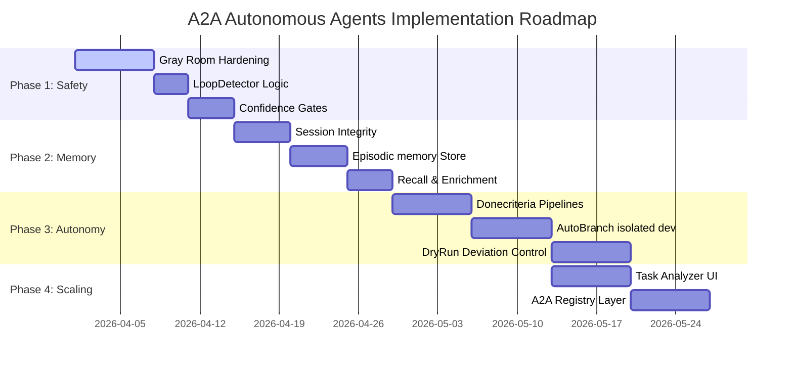

DR Implementation Audit Report
This report tracks the implementation status of Architectural Decision Records (ADRs) defined in docs/adr/.
> **WARNING: V2.0 ARCHITECTURE UPDATE**  
> The orchestrator's core state machine, artifact authority, real-time contracts, and schema registry have been updated to **Architecture Blueprint v2.0**. Please refer to the **"SECTION: Architecture Blueprint v2.0"** at the very bottom of this document for the complete, canonical implementation models.


ADR	Title	Status	Evidence / Notes
ADR-0001	Simulations as Golden Standard	✅ Implemented	simulations/ directory exists with json/md files.
ADR-0012	Session State Unification	✅ Implemented	Sessions stored in a2a-client/storage/sessions/.
ADR-0013	Unified Transport Layer	✅ Implemented	Client API on 5173 proxies to server.
ADR-0014	Transport Fallback Mechanisms	✅ Implemented	Handled in a2a-proxy.js (client-side proxy persistence).
ADR-0015	Message Ordering Guarantees	✅ Implemented	Step numbering in session storage.
ADR-0016	Promise Queue Architecture	✅ Implemented	Server returns promiseId for async tasks.
ADR-0017	Promise Daemon Deployment	✅ Implemented	start-all.bat manages processes.
ADR-0018	Promise State Synchronization	✅ Implemented	Shared storage between client/server.
ADR-0019	Multi-level Testing Pipeline	✅ Implemented	Unit, Integration (sims), and E2E scripts.
ADR-0020	Simulation Golden Standard	✅ Implemented	npm run sim:validate works.
ADR-0021	Cross-browser Testing Matrix	⚠️ Partial	Mentioned in docs; Playwright used, full grid pending.
ADR-0022	Error Recovery Patterns	⚠️ Partial	Basic recovery (Retry) exists.
ADR-0023	Connection Resilience	✅ Implemented	30s timeout + retries.
ADR-0024	Graceful Degradation	⚠️ Partial	LLM fallback works, tool fallback mixed.
ADR-0025	Decouple Promise from UI	✅ Implemented	/async polling endpoint on Client API.
ADR-0026	Server LLM Request Prep	✅ Implemented	Logic in gray-room-orchestrator.ts.
ADR-0027	Documentation Canonical Sources	✅ Implemented	Structure in docs/ and AGENTS.md.
ADR-0028	Client API Deployment Modes	✅ Implemented	Vite plugin vs standalone SDK.
ADR-0029	Server Interrupt Loop	✅ Implemented	GrayRoomOrchestrator implements loop.
ADR-0030	Unified Agent Mode	✅ Implemented	Default action is agent.
ADR-0031	Action-Key Shape	✅ Implemented	Strictly enforced in AGENTS.md and server.
ADR-0032	Port Management Execution	✅ Implemented	scripts/port-manager.js exists and used.
ADR-0033	Standard Extensions Structure	✅ Implemented	a2a-server/src/actions/handlers/.
ADR-0034	Protocol Consolidation	⚠️ Partial	a2a-server/src/protocol exists, but no separate package.
ADR-0035	Agentic Reasoning Safety Layer	⚠️ Partial	Phase 1 (LoopDetector, Validator) implemented.
ADR-0036	Memory Orchestration (Master Spec)	⚠️ Progress	Phase 1 (Roadmap) in progress; spec is Accepted.
ADR-0037	Living Specs for Task Synthesis	❌ Not Implemented	Proposed in Master Spec v2.0.
ADR-0038	Multi-Agent Orchestrator	❌ Not Implemented	Proposed in Master Spec v2.0.
ADR-0039	A2A Registry Layer	❌ Not Implemented	Proposed in Master Spec v2.0.
ADR-0040	Writer/Reviewer Pattern	❌ Not Implemented	Proposed in Master Spec v2.0.
Summary
Implemented (✅): 23
Partial/Progress (⚠️): 6
Not Implemented (❌): 4
Audit date: 2026-04-01# A2A Autonomous Agents Orchestrator with Memory — Master Specification

> **Consolidated master document** — Architecture + User Journey + Runtime + 38 Feature Contracts + Artifact Index.  
> **Единый чистый файл** (дедуплицирован из 4 raw источников).  
> **Project Goal:** Reduce failed or user-aborted session runs by **30% within 30 days** after release.

---

## Table of Contents

1. [Overview & Objective](#overview--objective)
2. [User Journey](#user-journey)
3. [Autonomous Agent Runtime](#autonomous-agent-runtime)
4. [Continuous Loop](#continuous-loop)
5. [Durable Waiting and Async Resume](#durable-waiting-and-async-resume)
6. [Confidence & Safety Gating](#confidence--safety-gating)
7. [Dry-Run Deviation Tracking](#dry-run-deviation-tracking)
8. [Donecriteria Validation Gate](#donecriteria-validation-gate)
9. [Branch-Isolated Delivery](#branch-isolated-delivery)
10. [Memory-Enriched Planning](#memory-enriched-planning)
11. [Canonical Artifacts Index](#canonical-artifacts-index)
12. [Session Quality & Safety Metrics](#session-quality--safety-metrics)
13. [Feature Contracts: Features 1–20](#feature-contracts-features-120)
14. [Feature Contracts: Features 21–38](#feature-contracts-features-2138)
15. [Feature Contracts: Features 39–53 (Production UI & Reasoning Phase)](#feature-contracts-features-3953-production-ui--reasoning-phase)
16. [Features: In/Out of Scope](#features-inout-of-scope)
17. [Architectural Glossary](#architectural-glossary)
18. [Implementation Roadmap (Gantt)](#implementation-roadmap-gantt)

---

## Overview & Objective

Enable operators and developers to run an autonomy-first, session-driven agent that continuously improves a repository with:

| Capability | Description |
|---|---|
| Deterministic safety gating | Confidence-gated transitions with bounded retry logic |
| Durable async waiting/resume | Checkpoint-backed Waiting steps with expiry + resume |
| Loop-safe autonomy downgrades | Loop detection triggers predictable downgrade paths |
| Memory-enriched planning | Episodic recall + PatternStore + LessonStore injection |
| Dry-run deviation control | Material deviation tracking with severity and required actions |
| Donecriteria validation gate | Machine-verifiable donecriteria blocks merge even if tests pass |
| Branch-isolated delivery | No direct push to main; all delivery via isolated branches |

---

## User Journey

### Operator / Developer (Web UI via root orchestrator)

#### 1. Starting the Stack

```
npm run dev  /  start-all.*
```

Port allocation/cleanup handled by the repo's **port manager**.  
Opens the Web UI using repo-standard ports/env defined in `.env.example` and `docs/ENV-MATRIX.md`.

#### 2. Project & Session Setup

Creates/selects a **Project** and **Session** in the Projects Panel → lands in the **Session Window** with the task input focused.

#### 3. Live Execution Panels

| Panel | Purpose |
|---|---|
| **Session Window** | Task input, status, pause/resume, cancel/stop |
| **Task Flow Panel** | Step-by-step flow cards, Waiting steps, gating outcomes |
| **Terminal Panel** | Execution logs |
| **Storage Panel** | StepStorage / ArtifactStore / CheckpointStore artifacts, download/browse |
| **Notification Center + Modal Dialogs** | Errors, confirmations, critical approvals |
| **Resume & Steering Panel** | Operator control for steering, stopping, or resuming the agent run |

#### 4. Autonomy-First (Default) Mode

Operator watches the **continuous loop** `scan → generate → execute → reflect` without prompting each cycle.  
Gets interrupted **only** at deterministic trigger points:
- Ambiguous task classification — agent asks exactly **one** clarification question
- Confidence below gate after bounded Self-Correction (≤ 3 attempts)
- Irreversible failure / blacklisted action blocked by policy
- SelfFix exhausted (all 3 attempts fail with no convergence)

#### 5. Structured Evidence in Storage / Task Flow

| Artifact | Description |
|---|---|
| `CONFIDENCE_TRACE` | Confidence score history and gate outcomes |
| `EXECUTION_DECISION` | Routing and action decisions |
| `WAITING_STATE` | Expiry + resume target for async waits |
| `LOOP_SIGNAL` | Loop detection signals and downgrade events |
| `TRACE_RISK` | Risk signals from InternalTrace |
| `DRYRUN_DELTA` | Material deviations: step-type change, approval-type change, unverifiable tool, or confidence band shift ≥ 0.15 |
| `ROLLBACK_LESSON` | Post-rollback lessons for future planning |
| `MEMORY_INFLUENCE` | Episodic recall and PatternStore context injected into planning |

#### 6. Operator-Submitted Tasks (Pre-Flight UX)

```
Operator submits task
        │
        ▼
Task Improvement Analyzer (suggestions surfaced)
        │
        ▼
Dry Run PlanGraph Preview
   - Predicted confidence pauses
   - Predicted approval gates
   - Predicted unverifiable tools
   - Predicted critical blockers
        │
        ▼
Operator clicks "Approve Plan → Start Live Run"
        │
        ├─► preflightskip = true  →  Skip improvement + dry run
        └─► preflightskip = false →  Full pre-flight (default)
```

> **Note:** "Approve Plan → Start Live Run" is a **start signal only**. HumanLayer is never bypassed by this action.

#### 7. Hybrid HITL (Exception Path)

- Escalations create a first-class **Waiting step** for the blocked run
- Modal dialogs appear **only** for critical approval types (per HumanLayer policy)
- Non-critical approvals surface via non-blocking UI
- Resolution resumes from a durable checkpoint or deterministically stops/escalates

---

## Autonomous Agent Runtime

### Architecture: Single-Entry Orchestration Authority

```
ProjectScanner
    └─► OpportunityDetector
            └─► TaskSynthesizer
                    └─► TaskEnricher
                            └─► SelfCorrectionLoop
                                    └─► AutonomyGates
                                            └─► Execution
```

### Component Responsibilities

| Component | Responsibility |
|---|---|
| **ProjectScanner** | Emits typed repo signals: git diff, tests, TODO/FIXME, metrics, error logs |
| **OpportunityDetector** | Classifies, prioritizes, and deduplicates opportunities |
| **TaskSynthesizer** | Generates goal/context plus machine-verifiable donecriteria (2 retries; suppressed on fail) |
| **TaskEnricher** | Injects top-3 episodic recall + PatternStore + LessonStore context + InternalTrace risk signals |
| **SelfCorrectionLoop** | Attempts `BACKTRACK → SWITCH → REFINE` before HumanLayer involvement (≤ 3 attempts) |
| **AutonomyGates** | Routes decisions based on confidence thresholds, loop risk, InternalTrace blockers, waiting state, tool trust routing, and branch-safe delivery feasibility |

---

## Continuous Loop

```
┌─────────────────────────────────────────────┐
│         CONTINUOUS AUTONOMY LOOP            │
│                                             │
│  SCAN ──► GENERATE ──► EXECUTE ──► REFLECT  │
│   ▲                                   │     │
│   └───────────────────────────────────┘     │
│                                             │
│  Interrupted ONLY at deterministic gates    │
└─────────────────────────────────────────────┘
```

### Single State Enum (ORCHESTRATOR_CYCLE)
The orchestrator avoids "boolean soup" (`is_waiting`, `is_running`) by using a strict single state enum:
`state: 'IDLE' | 'SCANNING' | 'SYNTHESIZING' | 'ENRICHING' | 'EXECUTING' | 'WAITING_ON_HUMAN' | 'VALIDATING' | 'STOPPED'`

### Loop Downgrade Path

1. **Full Autonomy** — normal operation
2. **Bounded Autonomy** — Self-Correction engaged (≤ 3 attempts)
3. **Human-in-the-Loop** — Waiting step created, HumanLayer invoked
4. **Stopped** — deterministic stop with `LOOP_SIGNAL` + `ROLLBACK_LESSON`

---

## Durable Waiting and Async Resume

**Waiting is a first-class step**, not a blocking pause.

### Properties
- Checkpoint-backed — survives process restarts
- Resumable — deterministic resume from checkpoint with integrity checks
- Non-blocking — does not stall unrelated queued work
- Expiry-aware — every Waiting has an expiry time

### Expiry Policy (Deterministic)

| Expiry Outcome | Action |
|---|---|
| `escalate` | Promote to HumanLayer critical approval |
| `reroute` | Route to alternative resolution path |
| `stop` | Deterministic stop with `WAITING_STATE` + `EXECUTION_DECISION` emitted |

### Resume Integrity Checks

On resume from checkpoint:
1. **Checkpoint schema validity** — schema version matches current runtime
2. **Referenced artifacts existence** — all artifact references resolvable in ArtifactStore
3. **Confidence gating re-applies** — confidence threshold check re-runs before execution continues

---

## Confidence & Safety Gating

```
Task arrives
    │
    ├─► Confidence ≥ threshold?
    │       YES → Execute
    │       NO  → SelfCorrectionLoop (attempt 1)
    │                   │
    │                   ├─► BACKTRACK → re-evaluate
    │                   ├─► SWITCH    → alternative approach
    │                   └─► REFINE    → narrow scope
    │
    ├─► After ≤3 attempts, confidence still below gate?
    │       YES → HumanLayer Waiting step
    │       NO  → Execute
    │
    └─► Irreversible / blacklisted action?
            YES → Hard stop + TRACE_RISK emitted
```

### Confidence Boundary Rule

> Score **equal** to threshold is treated as **below** threshold. `EXECUTION_DECISION` records `reason_code=confidence_at_boundary`.

### Multiple Signals: Lower-Wins Rule

`CONFIDENCE_TRACE.confidence` = minimum of all signal values. All signals listed in `CONFIDENCE_TRACE.signals[]`.

### HumanLayer Approval Type Priority (strict)

```
CRITICAL_PATH > EXTERNAL_CALL > DATA_ACCESS > ESCALATION > DELEGATION > ACTION_APPROVAL > TEXT_APPROVAL
```

Modal shown only for: `DATA_ACCESS`, `EXTERNAL_CALL`, `CRITICAL_PATH`.

---

## Dry-Run Deviation Tracking

### Material Deviations (DRYRUN_DELTA)

| Deviation Type | Severity | Required Action |
|---|---|---|
| Step-type change | `moderate` | `re-evaluate` |
| Approval-type change | `moderate` | `re-evaluate` |
| Confidence band shift ≥ 0.15 | `moderate` | `re-evaluate` |
| Unverifiable tool introduced | `critical` | `stop + HumanLayer` |
| HumanLayer bypass attempt | `critical` | `stop + HumanLayer` |
| Donecriteria unverifiability | `critical` | `stop + HumanLayer` |
| Branch-safety violation | `critical` | `stop + HumanLayer` |
| Minor structural drift | `minor` | `continue` |

> **Escalation rule:** 3 consecutive `minor` deviations within same task run → auto-escalated to `moderate`.

---

## Donecriteria Validation Gate

```
Execution Complete
    │
    └─► ValidationPipeline
            │
            ├─► Unit tests
            ├─► Integration tests
            ├─► Simulation checks
            ├─► Regression checks
            └─► Donecriteria verification ← REQUIRED
                        │
                        ├─► PASS → Proceed to delivery
                        └─► FAIL → Block merge/delivery
                                    (even if all tests pass)
```

> **Critical rule**: Merge and delivery are **blocked** if donecriteria fails, even when all unit/integration/simulation/regression tests pass.

---

## Branch-Isolated Delivery

- No direct push to `main`
- Work is performed on isolated feature/agent branches
- Delivery feasibility checked by AutonomyGates before execution begins
- Branch-safety violations trigger critical `DRYRUN_DELTA` and hard stop

---

## Memory-Enriched Planning

### Memory Sources Injected via TaskEnricher

| Source | Content | Quantity Injected |
|---|---|---|
| **Episodic memory** | Past task runs, outcomes, and timings | Top-3 most relevant |
| **PatternStore** | Recurring code and task patterns | Relevant patterns |
| **LessonStore** | Post-rollback lessons and failure learnings | Relevant lessons |
| **InternalTrace risk signals** | Live risk assessments from current session | All active signals |
| **Storage artifacts** | Relevant existing artifacts from ArtifactStore | Referenced artifacts |

### MEMORY_INFLUENCE Artifact Shape

```json
{
  "session_id": "...",
  "task_id": "...",
  "retrieval": {
    "episodic": [{"episode_id":"...","score":0.9,"recency":"...","reason":"...","snippet":"..."}],
    "episodic_top_k": 3,
    "pattern_hits": ["pat_id_1"],
    "lesson_hits": ["lesson_id_1"]
  },
  "applied": {
    "plan_changes": [{"ref":"pat_id_1","description":"..."}],
    "risk_mitigations": [{"ref":"lesson_id_1","description":"..."}],
    "suppressed_opportunities": []
  },
  "integrity": {
    "source_available": true,
    "fallback_used": false,
    "context_truncated": false
  }
}
```

---

## Canonical Artifacts Index

| Artifact | Trigger | Consumers |
|---|---|---|
| `CONFIDENCE_TRACE` | Every confidence gate evaluation | Task Flow Panel, Storage Panel |
| `EXECUTION_DECISION` | Every routing decision | Task Flow Panel, Storage Panel |
| `WAITING_STATE` | Every Waiting step creation / expiry | Task Flow Panel, Notification Center |
| `DECISION_PACKET` | Before execution starts | Task Flow |
| `PRE_EXECUTION_CRITIQUE` | Before execution starts | Storage |
| `CONFIDENCE_CALIBRATION_RESULT` | Post-outcome evaluation | Export |
| `REJECTED_PATH_ENTRY` | When strategy is abandoned | LessonStore |
| `INTENT_LOCK` | Long-running task boundary | Memory, Task Flow |
| `WAITING_STATE_EVENT` | State transition: waiting→resolved/rejected/expired | Task Flow, Storage |
| `LOOP_SIGNAL` | Loop detection or downgrade | Task Flow Panel, Storage Panel |
| `DRIVE_LOOP_SIGNAL` | Drive-level loop across 3 consecutive cycles | Task Flow, Storage |
| `TRACE_RISK` | InternalTrace blocker detected | Notification Center, Storage Panel |
| `DRYRUN_DELTA` | Material deviation between dry run and live | Task Flow Panel, Modal (if critical) |
| `DRYRUN_PLANGRAPH` | Pre-flight dry-run plan | UI Preview Panel |
| `ROLLBACK_LESSON` | Post-rollback | LessonStore, Storage Panel |
| `ROLLBACK_RECORD` | Rollback execution | Storage, Task Flow |
| `MEMORY_INFLUENCE` | Every planning phase | Task Flow Panel, Storage Panel |
| `EPISODIC_ENTRY` | Per completed task run | Storage (indexed) |
| `EPISODIC_RECALL_RESULT` | Per recall query | Task Flow, Storage |
| `MEMORY_INDEX_RESULT` | Index success/failure | Storage |
| `OPPORTUNIY_SET` | Per scan cycle | Task Flow, Storage |
| `OPPORTUNITY_SUPPRESSION` | Session-scoped suppression | Storage |
| `OPPORTUNITY_SUPPRESSION_EVENT` | TTL expiry or resolve | Storage |
| `SCAN_RESULT` | Per scan cycle | Task Flow |
| `SCAN_HINT_CONSUMPTION` | Per scan cycle consuming hints | Storage |
| `DRYRUN_DELTA` | Deviation between plan and live | Task Flow |
| `DONECRITERIA_RESULT` | Per criterion in validation | Task Flow, Storage |
| `VALIDATION_SUMMARY` | Pre-merge | Task Flow |
| `BRANCH_INTEGRITY` | Per branch lifecycle | Task Flow, Storage |
| `SNAPSHOT_RECORD` | Per stable promotion | Storage |
| `SELF_CORRECTION_ATTEMPT` | Per self-correction attempt | Task Flow |
| `PREFLIGHT_IMPROVEMENT` | Pre-flight task analysis | UI |
| `BLOCKER_SET` | Per strategy selection | Task Flow |
| `A2A_MESSAGE_ERROR` | Malformed inbound message | Storage |
| `A2A_MESSAGE_NORMALIZED` | Legacy message normalization | Storage |
| `ORCHESTRATOR_CYCLE` | Per autonomy cycle | Storage |
| `ORCHESTRATOR_SINGLETON_VIOLATION` | Duplicate orchestrator detected | Notification Center |
| `TOOL_AUDIT` | Per tool invocation | Storage |
| `TOOL_TRUST_STATE` | Per tool | Storage |
| `TOOL_TRUST_EVENT` | Trust state change | Storage |
| `TOOL_MOCK_REGISTRY` | Session registry | Storage |
| `TOOL_MOCK_COVERAGE` | Per dry-run session | Storage |
| `LESSON` | Per completed task run | LessonStore, Storage |
| `PATTERN` | After 3 consecutive same lessons | Storage |
| `PATTERN_DECAY_RESULT` | Per orchestrator cycle | Storage |
| `AUTONOMY_LIMITS_STATE` | Per session | Task Flow, Storage |
| `DRIFT_SIGNAL_SUMMARY` | Per session window | Task Flow, Storage |
| `DRIFT_EARLY_WARNING` | Pre-downgrade threshold breach | Task Flow (throttled) |
| `API_GUARD_DECISION` | Per external call | Storage |
| `POLICY_DECISION` | Per policy evaluation | Task Flow |
| `EXECUTION_TRACE` | Per task run end | Task Flow, Storage |
| `SESSION_END_RECORD` | Per session termination | Storage, UI |
| `BASELINE_SNAPSHOT` | Per measurement window | Export, UI |

---

## Session Quality & Safety Metrics

| Metric | Description |
|---|---|
| **End reason distribution** | `completed / error / manual_stop / loop_interrupt / low_confidence_timeout / emergency_stop` |
| **Waiting resolution time (p50/p95)** | Latency percentiles for Waiting step resolution |
| **Validation pass rates** | % of tasks passing donecriteria + test suite |
| **Rollback rate** | % of executed tasks requiring rollback |
| **Regressions prevented** | Count of regressions caught by validation pipeline |
| **Autonomy downgrade frequency** | Rate of loop-triggered autonomy downgrades per session |
| **Dry-run deviation rate** | % of tasks with DRYRUN_DELTA artifacts |
| **Loop interruption rate** | Rate of loop interruptions per cycle |
| **Confidence-below-gate rate** | % of confidence checks falling below gate threshold |
| **MTTR** | Mean time to resolution for blocked/waiting runs |

---

## Feature Contracts: Features 1–20

### 1. HumanLayer Confidence Handoff

**User Story:** As an operator, I want low-confidence or blocked outcomes to trigger a HumanLayer-governed handoff so the task run pauses safely for clarification or approval and can resume without losing context.

**Dependencies:** Safety Layer (Phase 1), Storage API.

**Acceptance Criteria:**
- At every routing point: write `CONFIDENCE_TRACE` + `EXECUTION_DECISION`.
- Below-gate → `WAITING_STATE`: reason, created_at, expires_at, resume_target, required_inputs, humanlayer_approval_type.
- `triggered_criteria`: deterministic JSON array `{code, source_artifact, details, severity}`.
- Priority order (strict): `CRITICAL_PATH > EXTERNAL_CALL > DATA_ACCESS > ESCALATION > DELEGATION > ACTION_APPROVAL > TEXT_APPROVAL`.
- Modal only for: `DATA_ACCESS`, `EXTERNAL_CALL`, `CRITICAL_PATH`.
- Resume → new `EXECUTION_DECISION` with post-resume routing.

**Edge Cases:** HumanLayer reject → `decision=stop`; modal close without resolution → Waiting remains; expiry → `WAITING_STATE_EVENT` state=expired.

---

### 2. Loop Detection and Interrupt

**User Story:** As an operator, I want the system to detect repeated action patterns and interrupt the task run so infinite loops surface early.

**Dependencies:** Safety Layer (Phase 1).

**Acceptance Criteria:**
- Loop detected: identical triple **3×** consecutively: `[tool_or_action] + [outcome_class] + [context_segment]`.
- Emit `LOOP_SIGNAL`: triple, repeat_count=3, loop_type=in_run, severity.
- Severity moderate/critical → `EXECUTION_DECISION decision=wait` + `WAITING_STATE humanlayer_approval_type=ESCALATION`.

**Edge Cases:** Normalization for equivalent triples; repeat after resolve → new `LOOP_SIGNAL`, severity escalates to critical.

---

### 3. Index Episodic MEM_STORE

**User Story:** As an operator, I want episodic memory entries stored as artifacts and indexed into the memory backend so past outcomes are searchable with provenance.

**Acceptance Criteria:**
- Per completed run: `EPISODIC_ENTRY {observation, outcome, reflection, task_run_id, timestamp}`.
- Index → `MEMORY_INDEX_RESULT`.
- Backend unavailable → status=failed, reason_code=backend_unavailable.
- Same task_run_id → dedup=true.

---

### 4. Recall Episodic Episodes

**User Story:** As an operator, I want episodic recall to query the memory backend so the agent references relevant prior episodes during enrichment with explicit provenance.

**Acceptance Criteria:**
- `SEMANTIC_EXTRACT`: key facts + constraints + provenance.
- `EPISODIC_RECALL_RESULT`: similarity threshold, ranked list (similarity desc → recency desc → episode_id asc).
- Inject top-3 into `MEMORY_INFLUENCE.retrieval.episodic`.

---

### 5. InternalTrace Risk Injection

**User Story:** As an operator, I want InternalTrace risk outputs to influence enrichment and self-correction so the agent selects safer approaches before execution.

**Acceptance Criteria:**
- Above threshold → `TRACE_RISK {complexity, risks[], alternatives[], recommended_path}`.
- High-risk → route to safer alternative or Waiting.
- Missing/invalid → `WAITING_STATE reason=missing_risk_evidence`.

---

### 6. Adopt A2A Protocol v2

**User Story:** As an operator, I want multi-agent messaging to conform to A2A v2.0 so that context exchange and handoffs are traceable and schema-valid.

**A2A v2 Shape:**
```json
{
  "version": "2.0", "message_id": "...", "sender_id": "...", "target_id": "...",
  "capability": "...", "type": "handoff|status|error|request|response",
  "payload": {}, "context_state": {}, "priority": "..."
}
```

**Edge Cases:** `target_id=null` → accept; `context_state` missing → `{}`; unknown type → `type=error`.

---

### 7. Blockers into MetaReasoner

**User Story:** As an operator, I want the meta-reasoner to receive real blocker signals so strategy selection responds to the current blocking condition.

**Acceptance Criteria:**
- `BLOCKER_SET.categories[]`: missing_info, policy_wait, policy_reject, tool_failure, loop_detected, high_risk_subtask, low_confidence.
- `LOOP_SIGNAL` present → loop_detected + new strategy_fingerprint.

---

### 8. Task Improvement Analyzer

**User Story:** As an operator, I want the system to analyze my task formulation before execution and suggest clearer alternatives.

**Acceptance Criteria:**
- Preflight enabled → `PREFLIGHT_IMPROVEMENT {issues[], suggestions[{text, confidence_gain}]}`.
- UI choice: accepted / edited / run_as_written.
- Preflight skipped → `EXECUTION_DECISION reason_code=preflight_skipped`.

---

### 9. Dry Run Plan Preview

**User Story:** As an operator, I want to preview a dry-run execution plan before a task run starts.

**Acceptance Criteria:**
- `DRYRUN_PLANGRAPH`: ordered steps `{type, confidence_band, approval_type, tools[], unverifiable}`.
- No side effects; mockless tools → unverifiable.
- Explicit operator start → `EXECUTION_DECISION`, no bypass.

---

### 10. Project Scanner Signals

**User Story:** As an operator, I want the agent to continuously scan a repository for actionable signals.

**Acceptance Criteria:**
- `SCAN_RESULT {scanned_sources[], discovered_signals[], stable_ids}`.
- Consume `LESSON.scan_hints` → `SCAN_HINT_CONSUMPTION`.
- Fail → cooldown; no signals → no-op outcome.

---

### 11. Opportunity Detection Prioritization

**Acceptance Criteria:**
- `OPPORTUNITY_SET {type, target_area, priority_score, source_signal_refs[]}`.
- Stable opportunity_id; recurrence → update existing.
- `OPPORTUNITY_SUPPRESSION {opportunity_id, reason_code, expires_at}`.

---

### 12. Donecriteria Task Synthesis

**Acceptance Criteria:**
- Opportunity → `task {goal, context, opportunity_type, donecriteria}`.
- donecriteria mandatory, verifiable types only.
- No valid donecriteria → no execution.
- Synthesis fail → 2 retries; fail → suppress opportunity.

---

### 13. Enrichment with Memory Risks

**Acceptance Criteria:**
- Pre-execution: top-3 recall + patterns/lessons + InternalTrace summary.
- `MEMORY_INFLUENCE`: conforms to canonical shape, includes `integrity.source_available` + `integrity.fallback_used` + `integrity.context_truncated`.
- If `context_truncated=true`, agent must trigger Clarification Mode or emit explicit Warning, preventing hallucinations on partial data.
- Every entry in `applied.*` references at least one retrieval item id.

---

### 14. Autonomous Sandbox → Staging → Production

**Acceptance Criteria:**
- `ENV_STAGE_TRACE`: stage transitions + timestamps.
- SANDBOX → diff evidence.
- STAGING → `VALIDATION_SUMMARY` per gate.
- PRODUCTION → only if all gates pass → `BRANCH_INTEGRITY`.

---

### 15. Validation Gates and Regression

**Acceptance Criteria:**
- `VALIDATION_SUMMARY`: unit/integration/simulation/non-regression/donecriteria/pre-merge-confidence.
- Any gate fails → block merge + `EXECUTION_DECISION` records failing gates.

---

### 16. Auto Branch Commit Merge

**Acceptance Criteria:**
- `BRANCH_INTEGRITY {branch_id, commit_ids, merge_target, validation_ref, donecriteria_ref, pre-merge_confidence_ref}`.
- Ordered lifecycle events: branch_created, commits_written, validation_started, validation_passed, merge_attempted, merge_completed, rollback_triggered.
- Direct push to main → policy violation artifact + block.

---

### 17. Bounded Self Correction

**Acceptance Criteria:**
- Max 3 attempts; per attempt: `SELF_CORRECTION_ATTEMPT {attempt_num, strategy, pre_confidence, post_confidence, routing_decision}`.
- **Strict Error Split**: Transient errors (timeouts, network) trigger infrastructure Retry (exp. backoff). Semantic errors (logic bug, failed test) trigger algorithmic `BACKTRACK → SWITCH → REFINE`.
- After 3 exhausted → `WAITING_STATE reason=self_correction_exhausted`.
- Same action fingerprint repeating → `LOOP_SIGNAL`.

---

### 18. Async Waiting For Autonomy

**Acceptance Criteria:**
- `WAITING_STATE {expires_at, resume_target}` + `EXECUTION_DECISION decision=wait`.
- Durable checkpoint persisted before entering Waiting.
- While Waiting: orchestrator may schedule next eligible task run (`ORCHESTRATOR_CYCLE` references both).

---

### 19. Tool Safety Execution Layer

**Acceptance Criteria:**
- Every tool invocation → `TOOL_AUDIT {tool_name, intent, stage, outcome_class, redacted_params}`.
- Unverifiable tool in dry-run → flagged in `DRYRUN_PLANGRAPH`.
- Unknown tool classification → block + Waiting.

---

### 20. Rollback Snapshots Reverts

**Acceptance Criteria:**
- Per successful promotion → `SNAPSHOT_RECORD {commit_id, validation_evidence_ref}`.
- Error condition detected → revert + `ROLLBACK_RECORD {trigger_class, snapshot_ref, revert_outcome}`.
- Post-rollback → suppress same goal until operator resolves via Waiting.

---

## Feature Contracts: Features 21–38

### 21. Autonomy Limits and Cooldown

**Acceptance Criteria:**
- `AUTONOMY_LIMITS_STATE {concurrency_limit, task_starts_per_cycle, failure_budget}`.
- Limit reached → `EXECUTION_DECISION` records cooldown entry.
- Budget exhausted → autonomy downgrade recorded.

---

### 22. Tool Trust and Risk Routing

**Acceptance Criteria:**
- `TOOL_TRUST_STATE {tool_id, trust_state, risk_tier, execution_history_count}`.
- `risk_tier=high` → stricter confidence threshold.
- New tools: cold-start → HumanLayer approval for first 5 executions.
- Trust reset → `TOOL_TRUST_EVENT`.

---

### 23. Lesson Pattern Artifacting

**Acceptance Criteria:**
- Per completed run → `LESSON {what_was_done, what_was_learned, affected_area, scan_hints}`.
- 3 consecutive same-pattern lessons → `PATTERN {source_lesson_refs[3]}`.
- `SCAN_HINT_CONSUMPTION` per scanner cycle consuming hints.

---

### 24. Observability Metrics Dashboard

**Acceptance Criteria:**
- `EXECUTION_TRACE {phase_transitions, execution_decision_refs[], validation_outcomes, final_outcome}`.
- Dashboard renders: task runs started/completed/failed, Waiting steps created/resolved/expired, rollbacks, loop signals by severity, autonomy downgrades.

---

### 25. Baseline Session End Reasons

**Acceptance Criteria:**
- Every session termination → `SESSION_END_RECORD {session_id, timestamp, duration, task_run_count, end_reason}`.
- `end_reason` ∈ {completed, error, manual_stop, loop_interrupt, low_confidence_timeout, emergency_stop}.

---

### 26. Baseline Metrics Snapshot

**Acceptance Criteria:**
- `BASELINE_SNAPSHOT {total_sessions, end_reason_pct, waiting_per_session, avg_task_runs}`.
- Versioned + exportable.
- Snapshot generation does not stop active sessions.

---

### 27. Confidence Score Contract

**Acceptance Criteria:**
- Thresholds loaded from configuration; validated before applying.
- Boundary rule: score equal to threshold → below threshold.
- Missing/malformed inputs → confidence=0.0. `CONFIDENCE_TRACE.signals[]` records all.

---

### 28. PolicyGuard Thresholds Blacklist

**Acceptance Criteria:**
- `POLICY_DECISION {action_class, required_confidence_threshold, computed_confidence, decision:allow|block}`.
- Blacklisted actions → always blocked → HumanLayer.
- Direct push to main → policy violation artifact.

---

### 29. Checkpoint Resume Durability

**Acceptance Criteria:**
- Checkpoint persisted before Waiting; survives service restart.
- Restore fails integrity → `WAITING_STATE humanlayer_approval_type=ESCALATION reason_code=checkpoint_restore_failed`.

---

### 30. Pattern Decay

**Acceptance Criteria:**
- `PATTERN_DECAY_RESULT` per orchestrator cycle listing before/after relevance scores.
- Patterns never auto-deleted; `relevance_score=0.0` → inactive.
- Enrichment selects patterns descending `relevance_score`.

---

### 31. Single Orchestrator Kernel

**Acceptance Criteria:**
- Only the orchestrator schedules task runs; every run references `ORCHESTRATOR_CYCLE`.
- `ORCHESTRATOR_CYCLE` enforces Single State Enum (no boolean soup).
- Second orchestrator instance detected → `ORCHESTRATOR_SINGLETON_VIOLATION`.
- Restart → resume from last safe phase boundary.

---

### 32. API Guard

**Acceptance Criteria:**
- External call → `API_GUARD_DECISION {decision:allow|block, reason_code}`.
- Not on allowlist → block → Waiting.
- Rate limit exceeded → `EXECUTION_DECISION` (self-correction or Waiting per policy).
- Guard unavailable → all external calls blocked.

---

### 33. Drift Detection Downgrade

**Acceptance Criteria:**
- `DRIFT_SIGNAL_SUMMARY {repeated_opportunity_rate, repeated_task_rate, autonomous_success_rate}`.
- Threshold exceeded → `EXECUTION_DECISION records downgrade + trigger metrics + new autonomy level`.
- `DRIFT_EARLY_WARNING` (throttled): one display per throttle window; still written if suppressed (displayed=false).

---

### 34. Waiting Orchestration and Resume (Lifecycle)

**Acceptance Criteria:**
- `WAITING_STATE` transitions: waiting → resolved / rejected / expired via `WAITING_STATE_EVENT`.
- On resolution → resume from checkpoint + re-evaluate confidence gates.
- Late resolution after expiry → does not resume automatically → fresh gate evaluation.

---

### 35. Confidence Trace Propagation

**Required routing points** for `CONFIDENCE_TRACE`:
post-synthesis, post-enrichment, post-self-correction attempt, post-deviation detection, post-validation, pre-merge.

Every routing decision → `EXECUTION_DECISION {idempotency_key, routing_point, confidence, gate_threshold, decision:proceed|wait|handoff|stop|downgrade, evidence_refs[]}`.
- `idempotency_key` guarantees task-level idempotency to prevent work duplication upon retries.

---

### 36. Unified Loop Risk Signals

**Acceptance Criteria:**
- `LOOP_SIGNAL {loop_type:in_run|drive_loop, severity:minor|moderate|critical, evidence_counters, recommended_action}`.
- `DRIVE_LOOP_SIGNAL`: same opportunity_id + same task_fingerprint in 3 consecutive `ORCHESTRATOR_CYCLE`.
  - moderate → downgrade; critical → `OPPORTUNITY_SUPPRESSION reason_code=drive_loop`.

---

### 37. Dry Run Deviation Control

**Acceptance Criteria:**
- `DRYRUN_DELTA {material_deviation, deviation_reasons[], severity, predicted_confidence_band, actual_confidence_band, step_diff_summary}`.
- `material_deviation=true` when: step type changes / approval type changes / unverifiable tool appears / confidence band diff ≥ 0.15.
- Severity routing (mandatory): minor→continue; moderate→recompute+self-correction; critical→stop+Waiting+HumanLayer.
- 3 minor within same run → escalate to moderate.

---

### 38. Donecriteria Validation Stage

**Acceptance Criteria:**
- `DONECRITERIA_RESULT` per criterion.
- Any criterion unevaluable → fails; merge blocked even if other gates pass.
- Task Flow: readable checklist + per-criterion pass/fail.
- Donecriteria type catalog: published + stable; unsupported types → synthesis rejected.

---

## Feature Contracts: Features 39–53 (Production UI & Reasoning Phase)

### 39. Session Status Strip
**Acceptance Criteria:**
- UI replaces abstract "thinking" states with the explicit Single State Enum from `ORCHESTRATOR_CYCLE` (`SCANNING`, `ENRICHING`, `WAITING_ON_HUMAN`, etc.).
- Transparently visualizes current systemic phase.

### 40. Waiting Action Card (Heartbeat)
**Acceptance Criteria:**
- `WAITING_STATE` includes `heartbeat_timestamp` to differentiate "thinking" from "process died".
- UI Action Card displays exact reason for pause, expiry timestamp, required inputs, and `resume_target`.

### 41. Inline Evidence Chips
**Acceptance Criteria:**
- Chat message components visually link to their source evidence (`CONFIDENCE_TRACE`, `TRACE_RISK`).
- Reduces hidden reasoning logic by linking directly to ArtifactStore records inline.

### 42. Clarification Mode
**Acceptance Criteria:**
- Activates specifically when ambiguity triggers (e.g., `context_truncated=true`).
- Orchestrator enters a strict 1-question / 1-answer mode to preserve context limits, rather than conversational drift.

### 43. Resume & Steering Panel
**Acceptance Criteria:**
- Operator provided a dedicated panel with Checkpoint Awareness.
- Operator can steer (inject intent), stop, or resume from arbitrary safe points in a session.

### 44. Decision Packet Contract
**Acceptance Criteria:**
- `DECISION_PACKET {hypothesis, evidence_refs[], alternatives[], chosen_action}`.
- Pre-requisite for executing any high-impact tool or code modification.

### 45. Pre-Execution Critique
**Acceptance Criteria:**
- `PRE_EXECUTION_CRITIQUE {safety_check, quality_check, critical_flag}` evaluated right before execution limits risk of blind actions.

### 46. Confidence Calibration Loop
**Acceptance Criteria:**
- `CONFIDENCE_CALIBRATION_RESULT {predicted_confidence, actual_outcome_score, adjustment_delta}`.
- Model scoring heuristics are adjusted based on real-world test outcomes.

### 47. Rejected Path Memory
**Acceptance Criteria:**
- Failed experiments populate `REJECTED_PATH_ENTRY {path_taken, failure_reason, context_hash}`.
- Prevents repeating previous failures in identical contexts within `SELF_CORRECTION` bounds.

### 48. Intent Lock Checkpoint
**Acceptance Criteria:**
- `INTENT_LOCK {active_task_intent, expected_transitions[]}`.
- Checked before major autonomy transitions; if agent drifts from intent, execution falls back.

---

## Features: In/Out of Scope

### In Scope

| Feature | Description |
|---|---|
| Single-entry orchestration | All agent work coordinated from one entrypoint |
| Confidence-gated transitions | Deterministic routing based on confidence scores |
| Bounded self-correction loop | BACKTRACK → SWITCH → REFINE, max 3 attempts |
| Loop detection downgrade | Automatic autonomy downgrade on detected loops |
| Durable waiting and resume | Checkpoint-backed Waiting steps with integrity checks |
| Waiting expiry reroute | Deterministic expiry policy: escalate / reroute / stop |
| Memory-enriched task planning | Episodic recall + PatternStore + LessonStore injection |
| Dry-run deviation detection | DRYRUN_DELTA with severity and required actions |
| Donecriteria validation gate | Machine-verifiable donecriteria blocks delivery |
| Branch-isolated delivery | All delivery via isolated branches, no direct main push |
| Tool safety layer | Audit, trust, cold-start, dry-run coverage |
| Loop/drift/drive-loop signals | Unified multi-level loop protection |
| API Guard | Allowlist + rate limiting for external calls |
| Observability & KPIs | EXECUTION_TRACE, SESSION_END_RECORD, BASELINE_SNAPSHOT |

### Out of Scope

| Feature | Reason |
|---|---|
| Separate world-model service | Out of architectural scope |
| Typed evaluator suite | Out of scope for initial release |
| Policy self-mutation engine | Safety risk; excluded by design |
| Unbounded parallel agents | Loop risk and resource safety constraints |

---

## 🚀 5 Ключевых Улучшений (Production Readiness 2026)

### 1. Living Specs Integration ⭐⭐⭐⭐⭐ (Critical)
**Проблема**: Static spec → agent drift при multi-file задачах.  
**Решение**: **Spec updates itself** в процессе работы.
- `TaskSynthesizer` → `OpenSpec` формат:
  - `SHALL` requirements → assertions
  - `GIVEN/WHEN/THEN` → auto-tests
  - Design decisions → numbered refs
**ADR**: `ADR-0037: Living Specs for Task Synthesis`
**ROI**: Reliability +40%, rework -60%.

---

### 2. Orchestrator with Dynamic Delegation ⭐⭐⭐⭐⭐ (Critical)
**Проблема**: Single-entry → rigid flow.  
**Решение**: **Orchestrator debates agents** (architect/implementer/reviewer).
- `OpportunityDetector` → `Orchestrator.supervisor`
- `Architect Agent`: debate designs
- `Consensus via MetaAgent`
- `Parallel execution (worktrees)`
**ADR**: `ADR-0038: Multi-Agent Orchestrator`
**ROI**: Dynamic workflows, parallel execution.

---

### 3. N² Connectivity Mitigation ⭐⭐⭐⭐ (High)
**Проблема**: A2A peer-to-peer → **quadratic connections** при росте числа агентов.  
**Решение**: **A2A Registry + Orchestrator pattern**.
- `Registry` → stateless workers
- No direct peer connections
**ADR**: `ADR-0039: A2A Registry Layer`
**ROI**: Масштабирование до 100+ агентов без сетевого взрыва.

---

### 4. Agent Reviewer Pattern ⭐⭐⭐ (Medium)
**Проблема**: Код ревьюит сам себя → bias.  
**Решение**: **Separate sessions**.
- `Writer Session` → Code
- `Reviewer Session` → Fresh context, spec review
- `Fix Session` → Feedback loop
**ADR**: `ADR-0040: Writer/Reviewer Pattern`
**ROI**: Code quality +30%, bias -80%.

---

### 5. Security & Trust (MCP/A2A Guardrails) ⭐⭐⭐ (Medium)
**Проблема**: Нет **federated orchestration** для enterprise.  
**Решение**: **API Guard + Tool Trust State**.
- Cold-start tools → HumanLayer (first 5 uses)
- Risk_tier=high → confidence threshold +0.2
**ADR**: `ADR-0036 Phase 4` (Safety Layer expansion)
**ROI**: Enterprise compliance readiness.

---

## 🔥 ТОП-7 Дифференцирующих Фишек + ADR Map

> Конкурентный анализ: почему эти фичи создают рыночный edge, недостижимый для LangGraph / CrewAI / C3 AI.

---

### 1. Gray Room (Thinking Sandbox) ⭐⭐⭐⭐⭐

**Почему топ:** Сервер делает 3–10 внутренних итераций **до** ответа пользователю. Конкуренты — либо полностью автономные (риск), либо полностью HITL (медленно). Gray Room — третий путь.

**ADR:** `ADR-0029` (Server Interrupt Loop) + `ADR-0035` (Safety Layer hardening)

```
Status:   Proposed → Accepted
Problem:  30% сессий fail по maxTurns без visible reasoning
Decision:
  interrupt: thinking → CONFIDENCE_TRACE
  interrupt: clarify  → WAITING_STATE (UI-visible)
  interrupt: rag      → SEMANTIC_EXTRACT
Success:  +25% session success rate
Effort:   2 weeks
```

---

### 2. Client-Side Session Storage ⭐⭐⭐⭐⭐

**Почему топ:** Zero-DB contention. Per-user isolation. Offline-first. LangGraph / CrewAI тонут в shared state при параллельных сессиях.

**ADR:** `ADR-0028` (Client API Deployment Modes) + `ADR-0036` Phase 2 (EpisodicStore)

```text
Status:   Proposed
Problem:  Context drift + no long-term learning between sessions
Decision:
  conversation_id + SHA256(history) integrity validation
  EPISODIC_ENTRY per completed session
  top-3 recall injection via TaskEnricher
Success:  100% context integrity, +15% autonomous task completion
Effort:   1.5 weeks
```

---

### 3. Branch-Isolated Delivery + Donecriteria Gate ⭐⭐⭐⭐⭐

**Почему топ:** "Tests pass ≠ Business value delivered". C3 AI генерирует тесты, но пушит в main. Мы блокируем merge, если donecriteria не пройдены — **даже если все тесты зелёные**.

**ADR:** `ADR-0036` Phase 3 (Donecriteria Validation Gate + AutoBranch)

```text
Status:   Proposed
Problem:  Tests pass ≠ business value delivered; direct main pushes
Decision:
  machine-verifiable donecriteria в TaskSynthesizer (обязательно)
  ValidationPipeline: donecriteria + tests + sims + regression
  BLOCK merge если donecriteria fail (DONECRITERIA_RESULT)
Success:  0 direct-to-main pushes, donecriteria eval coverage 100%
Effort:   2 weeks
```

---

### 4. Port Manager + Health Gating ⭐⭐⭐⭐

**Почему топ:** Exponential backoff + dependency ordering при старте. Конкуренты падают при Docker race conditions и восстанавливаются руками.

**ADR:** `ADR-0036` Phase 1 (observability, process durability)

```text
Status:   Proposed
Problem:  No session metrics dashboard; port conflicts on restart
Decision:
  Prometheus endpoints (/metrics)
  Grafana: loop_rate, confidence_hit_rate, mttr, waiting_p50/p95
  SESSION_END_RECORD + EXECUTION_TRACE → unified session quality
Success:  100% session observability; restart MTTR < 30s
Effort:   1 week
```

---

### 5. Loop Detection + Autonomy Downgrade ⭐⭐⭐⭐

**Почему топ:** `[tool + outcome + context] × 3` → детерминированный interrupt. Исследовательские имплементации не production-ready; здесь — production contract с `LOOP_SIGNAL` + downgrade path.

**ADR:** `ADR-0035` (Agentic Reasoning Safety Layer)

```text
Status:   Proposed
Core:     LoopDetector (triple×3) + CONFIDENCE_TRACE + ContextValidator (SHA256)
Downgrade: Full Autonomy → Bounded → HITL → Stopped
Success:  -80% loop-caused session failures
Effort:   4 weeks (полная Safety Layer)
```

---

### 6. Task Improvement Analyzer ⭐⭐⭐

**Почему топ:** Preflight UX — "твоя задача сформулирована криво, вот 3 варианта получше". Никто из конкурентов не делает preflight suggestion с `confidence_gain` scoring.

**ADR:** `ADR-0036` Phase 1 (PREFLIGHT_IMPROVEMENT)

```text
Status:   Proposed
Problem:  12% сессий fail по ambiguous operator input
Decision:
  PREFLIGHT_IMPROVEMENT: issues[] + suggestions[{text, confidence_gain}]
  UI: "Approve Plan → Start Live Run" (start-only, не bypass HumanLayer)
  Preflight skipped → EXECUTION_DECISION reason_code=preflight_skipped
Success:  Clarification rate -50%, ambiguous failures -12%
Effort:   1.5 weeks
```

---

### 7. Dry-Run Deviation Tracking ⭐⭐⭐⭐

**Почему топ:** `DRYRUN_PLANGRAPH` → Live Run → `DRYRUN_DELTA`. Конкуренты не сравнивают predicted vs actual execution. Severity routing — детерминированный, не эвристический.

**ADR:** `ADR-0036` Phase 3 (DryRunPreview + DRYRUN_DELTA)

```text
Status:   Proposed
Problem:  Plan ≠ Execution: unverifiable tools, confidence band shift
Decision:
  DRYRUN_PLANGRAPH: ordered predicted steps + confidence bands
  DRYRUN_DELTA: step-type change, tool unverifiable, conf shift ≥ 0.15
  Severity: minor (continue) | moderate (re-evaluate) | critical (stop+HumanLayer)
  3 minor → auto-escalate to moderate
Success:  95% plan-execution alignment; zero silent critical deviations
Effort:   2 weeks
```

---

## 🏆 ROI Ranking

| # | Фишка | Technical Debt | Market Edge | Effort | ROI |
| --- | --- | --- | --- | --- | --- |
| 1 | Gray Room | Low | ⭐⭐⭐⭐⭐ | 2w | ★★★★★ |
| 2 | Branch Safety + Donecriteria | Medium | ⭐⭐⭐⭐⭐ | 2w | ★★★★★ |
| 3 | Loop Detection | High | ⭐⭐⭐⭐ | 4w | ★★★★☆ |
| 4 | Client Storage + Episodic | Low | ⭐⭐⭐⭐ | 1.5w | ★★★★☆ |
| 5 | Dry Run Deviation | Medium | ⭐⭐⭐⭐ | 2w | ★★★★☆ |
| 6 | Task Analyzer | Low | ⭐⭐⭐ | 1.5w | ★★★☆☆ |
| 7 | Port Manager | None | ⭐⭐⭐ | 1w | ★★★☆☆ |
| 8 | **Living Specs** | High | ⭐⭐⭐⭐⭐ | 2w | ★★★★★ |
| 9 | **Multi-Agent Del.** | High | ⭐⭐⭐⭐⭐ | 2w | ★★★★★ |

---

## Architectural Glossary

| Term | Definition |
|---|---|
| **Gray Room** | A server-side thinking sandbox where the agent performs internal iterations before responding. |
| **Confidence Gate** | A deterministic rule that blocks execution if the agent's confidence score is below a threshold. |
| **Waiting State** | A first-class, durable, and resumable state for Human-In-The-Loop escalations. |
| **Loop Signal** | An artifact emitted when a repetitive [tool+outcome+context] pattern is detected. |
| **Dry-Run Delta** | Evidence of material deviation between a predicted plan and live execution. |
| **Donecriteria** | Machine-verifiable assertions representing the successful completion of a task. |
| **Task Enrichment** | The process of injecting episodic memory and lessons into the current task context. |
| **HumanLayer** | The safety and orchestration policy governing human interventions and approvals. |
| **ArtifactStore** | A per-session storage for all deterministic evidence artifacts. |
| **InternalTrace** | A diagnostic stream capturing low-level agent reasoning and risk assessments. |

---

## Implementation Roadmap (Gantt)



---

---

## 🔥 **20 Product Ideas для A2A-Script-Agent**
*Формат: Идея → Зачем → Артефакты → ADR Candidate*

### **1. Repo Memory Graph**
- **Идея**: Построить граф связей файлов/модулей на основе git history + failures.
- **Зачем**: Агент поймёт "обновил API → обнови 3 consumer'а", "изменил schema → найди все refs".
- **Артефакты**: `REPO_GRAPH.json`, `COUPLED_FILES.{session_id}`, `CHANGESET_PREDICTION`
- **ADR**: `ADR-0041: Repo Coupling Intelligence`

### **2. Evidence-Bound Confidence**
- **Идея**: Confidence = 0 если нет evidence (tests/dry-run/memory hits).
- **Зачем**: Убрать "fake confidence" — 30% типичная проблема агентов.
- **Артефакты**: `EVIDENCE_CHAIN.{turn_id}`, `CONFIDENCE_JUSTIFICATION`
- **ADR**: `ADR-0042: Evidence-Required Confidence Scoring`

### **3. AGENTS.md Self-Healing**
- **Идея**: После rollback/surprise агент предлагает patch для AGENTS.md.
- **Зачем**: Repo knowledge остаётся актуальным без ручного обслуживания.
- **Артефакты**: `AGENTS_PATCH_CANDIDATE`, `REPO_RULE_VIOLATION`
- **ADR**: `ADR-0043: Living Repo Documentation`

### **4. Git-Native Reflection**
- **Идея**: Reflection читает `git diff/log/blame` как first-class input.
- **Зачем**: Контекст из истории коммитов >> LLM memory.
- **Артефакты**: `GIT_CONTEXT_SUMMARY`, `CHANGE_INTENT_INFERENCE`
- **ADR**: `ADR-0044: Git History as External Brain`

### **5. Approval Dry-Run Diff**
- **Идея**: Dry-run diff как clickable UI object для operator review.
- **Зачем**: Как ArgoCD/GitHub PR — оператор видит **что изменится**.
- **Артефакты**: `DRYRUN_DIFF_UI`, `CHANGESET_PREVIEW`
- **ADR**: `ADR-0045: Operator Dry-Run Approval Flow`

### **6. Worktree Safety Verifier**
- **Идея**: Перед execution проверять: branch!=main, worktree valid, write target safe.
- **Зачем**: Silent isolation failures — #1 bug в coding agents.
- **Артефакты**: `WORKTREE_INTEGRITY_CHECK`, `ISOLATION_VIOLATION`
- **ADR**: `ADR-0046: Execution Environment Safety Gates`

### **7. Self-Writing Test Generator**
- **Идея**: После donecriteria fail — auto generate + run missing tests.
- **Зачем**: "Tests pass ≠ donecriteria pass" → агент сам решает.
- **Артефакты**: `AUTO_TEST_GENERATION`, `TEST_COVERAGE_GAP`
- **ADR**: `ADR-0047: Dynamic Test Generation`

### **8. Opportunity Heatmap**
- **Идея**: UI heatmap по repo: красный=high risk, зелёный=validated, жёлтый=todo.
- **Зачем**: Operator видит **где агент поможет больше всего**.
- **Артефакты**: `OPPORTUNITY_HEATMAP`, `RISK_DENSITY_MAP`
- **ADR**: `ADR-0048: Visual Repo Intelligence`

### **9. Cross-Repo Learning**
- **Идея**: Lessons/patterns из одного repo применяются в другом (анонимизировано).
- **Зачем**: Org-level intelligence без central DB.
- **Артефакты**: `CROSS_REPO_PATTERN`, `ORG_LESSON_ANONYMIZED`
- **ADR**: `ADR-0049: Federated Repo Intelligence`

### **10. Agent Reviewer Pattern**
- **Идея**: Separate session для code review (fresh context, spec-based).
- **Зачем**: Self-review = bias. Writer/Reviewer/Fixer pattern.
- **Артефакты**: `REVIEWER_FEEDBACK`, `WRITER_REVIEWER_DIFF`
- **ADR**: `ADR-0050: Multi-Persona Agent Workflow`

### **11. Donecriteria Templates**
- **Идея**: Gallery готовых donecriteria для типичных задач (API, DB migration).
- **Зачем**: TaskSynthesizer не изобретает велосипед.
- **Артефакты**: `DONECRITERIA_TEMPLATE_USED`, `VERIFICATION_STRATEGY`
- **ADR**: `ADR-0051: Donecriteria Library`

### **12. Rollback Prediction**
- **Идея**: Перед merge predict rollback probability из git history + patterns.
- **Зачем**: Предотвратить 80% типичных регрессий.
- **Артефакты**: `ROLLBACK_PROBABILITY`, `HISTORICAL_RISK_PROFILE`
- **ADR**: `ADR-0052: Predictive Rollback Risk`

### **13. Task Dependency Graph**
- **Идея**: Автопостроение графа зависимостей задач из repo signals.
- **Зачем**: "Сначала миграция → потом consumer updates".
- **Артефакты**: `TASK_DEPENDENCY_GRAPH`, `PREREQUISITE_OPPORTUNITIES`
- **ADR**: `ADR-0053: Opportunity Dependency Resolution`

### **14. Confidence Calibration**
- **Идея**: Пост-фактум калибровка confidence model по actual outcomes.
- **Зачем**: Accuracy улучшается со временем (self-improving).
- **Артефакты**: `CONFIDENCE_CALIBRATION_UPDATE`, `BRIER_SCORE`
- **ADR**: `ADR-0054: Self-Calibrating Confidence`

### **15. Interactive Workbench**
- **Идея**: Operator может manually добавить artifacts в TaskEnricher.
- **Зачем**: "Возьми этот Figma, этот Jira ticket, этот Slack thread".
- **Артефакты**: `OPERATOR_ENRICHMENT`, `MANUAL_CONTEXT_ADDITION`
- **ADR**: `ADR-0055: Operator-Guided Enrichment`

### **16. Agentic Sprint Planning**
- **Идея**: Автогенерация sprint backlog из repo signals + priority.
- **Зачем**: "Дай мне план на 2 недели улучшений".
- **Артефакты**: `SPRINT_OPPORTUNITY_SET`, `WEEKLY_PRIORITIES`
- **ADR**: `ADR-0056: Timeboxed Agent Planning`

### **17. Multi-Language Donecriteria**
- **Идея**: Donecriteria для TypeScript, Python, Go, Rust одновременно.
- **Зачем**: Polyglot repos — 60% enterprise reality.
- **Артефакты**: `LANGUAGE_SPECIFIC_DONECRITERIA`, `POLYGLOT_VALIDATION`
- **ADR**: `ADR-0057: Multi-Language Verification`

### **18. Live Risk Monitor**
- **Идея**: Real-time risk dashboard: current session + repo-wide risks.
- **Зачем**: Operator видит "агент в 2 кликах от production disaster".
- **Артефакты**: `LIVE_RISK_SUMMARY`, `REPO_RISK_AGGREGATE`
- **ADR**: `ADR-0058: Real-Time Risk Observability`

### **19. Self-Documenting Agent**
- **Идея**: После каждой сессии — auto-update README/AGENTS.md.
- **Зачем**: Repo становится self-documenting через agent work.
- **Артефакты**: `AGENT_ACTIVITY_LOG`, `SESSION_SUMMARY_MD`
- **ADR**: `ADR-0059: Self-Documenting Repo Evolution`

### **20. Cascade Rollback Protection**
- **Идея**: Если 3+ сессии rollback → quarantine repo до operator review.
- **Зачем**: Предотвратить "агент сломал production 5 раз подряд".
- **Артефакты**: `CASCADE_ROLLBACK_DETECTED`, `REPO_QUARANTINE`
- **ADR**: `ADR-0060: Systemic Failure Protection`

***

## 🔥 **15 Comprehensive Architectural Improvements (ADR-0041)**
*Интегрировано 1 апреля 2026 на основе исследования лучших практик Autonomous Agents. Расширенные черновики ADR (0035+) и связанные секции: [REFERENCE-ADRs-0035-0041-consolidated.md](./REFERENCE-ADRs-0035-0041-consolidated.md).*

**Ключевые векторы развития:**
1. **Multi-Agent Orchestration & Memory:** A2A Protocol v2 (MCP-based), Многоуровневые системы памяти (PatternStore), Кросс-сессионный перенос знаний, Спекулятивное выполнение, Прунинг контекста.
2. **Safety & Guardrails:** Детерминированная авторизация (PolicyGuard), Runtime Formal Verification (AgentGuard), Динамическое управление доверием (Tool Trust), Символьное обучение правил, Zero-Start In-Situ Evolution.
3. **Developer Experience (DX):** Dry-Run Plan Preview (граф выполнения), Time-Travel Debugging логов состояния, Natural-Language Agent Harnesses, Визуализация паттернов оркестрации, Мета-оптимизация промптов.

***

## 🎯 **TOP-5 для MVP (8 недель)**

```
1. Repo Memory Graph (#1) — +25% success rate
2. Evidence-Bound Confidence (#2) — -40% fake confidence
3. Worktree Safety Verifier (#6) — 0 isolation bugs
4. AGENTS.md Self-Healing (#3) — living repo knowledge
5. Approval Dry-Run Diff (#5) — operator trust +50%
```

## 💎 **Market Impact**

```
Эти 20 фич = LangGraph + Cursor + GitHub Copilot + Vercel DX
                 + C3 AI safety + ArgoCD UX в одном продукте.
```

---

## 🎯 Immediate Action Plan (8 недель)

```
Week 1–2:  ADR-0035 Phase 1 — Gray Room Safety Layer hardening
           LoopDetector + ConfidenceGate + WAITING_STATE (clarify → durable)

Week 3–4:  ADR-0036 Phase 2 — Session Integrity + Episodic Memory
           EPISODIC_ENTRY + top-3 recall + MEMORY_INFLUENCE canonical shape

Week 5–6:  ADR-0036 Phase 3 (start) — Donecriteria Gate + Auto Branch
           ValidationPipeline + BRANCH_INTEGRITY + block-on-fail

Week 7–8:  ADR-0036 Phase 3 (finish) — Task Analyzer + DryRun + Demo
           PREFLIGHT_IMPROVEMENT + DRYRUN_PLANGRAPH/DELTA + video walkthrough
```

---

## 💎 Новый USP (после улучшений)

```
"Repo agents that **think before they code** 
with **living specs** + **zero-mainline risk** 
and **enterprise guardrails** — 
from solo dev to 100-agent teams."

USP #1: Gray Room    — thinking-before-answering
USP #2: Living Specs — auto-updating requirements
USP #3: Donecriteria — business-value gate
USP #4: Multi-Agent  — Architect/Reviewer pattern
USP #5: Client-side  — zero-infra, per-user isolation
```

---

*Document compiled and deduplicated from: `A2A_Autonomous_Agents_Orchestrator.md`, `СОБЕРИ В ЕДИНЫЙ МД ФАЙЛ_A2A Autonomous Agents Orch.md` (Perplexity raw export).  
All behaviors described are deterministic and auditable via canonical artifact trail.  
Version: CLEAN-1.1 | Date: 2026-04-01*

---

# SECTION: Architecture Blueprint v2.0

# A2A Architecture Blueprint v2.0

> **Single Source of Truth** — полная системная модель A2A Autonomous Agents Orchestrator.  
> Все UI-элементы, backend-артефакты, состояния FSM, контракты реального времени и Decision Models описаны здесь.  
> **Version:** 2.0 | **Date:** 2026-04-01 | **Status:** Accepted

---

## Table of Contents

1. [System Overview](#1-system-overview)
2. [Session Finite State Machine](#2-session-finite-state-machine)
3. [Artifact Lifecycle Authority](#3-artifact-lifecycle-authority)
4. [Data Contracts](#4-data-contracts)
5. [Real-time Update Contracts](#5-real-time-update-contracts)
6. [Operator Decision Model](#6-operator-decision-model)
7. [UI-Backend Mapping Table](#7-ui-backend-mapping-table)
8. [Backend API Contracts](#8-backend-api-contracts)
9. [Frontend Data Flow](#9-frontend-data-flow)
10. [File Structure (Monorepo)](#10-file-structure-monorepo)
11. [HumanLayer Decision Matrix](#11-humanlayer-decision-matrix)
12. [Observability Model](#12-observability-model)
13. [Security & Isolation Guarantees](#13-security--isolation-guarantees)
14. [Architectural Principles](#14-architectural-principles)

---

## 1. System Overview

### 1.1 Core Philosophy

```
"Every autonomous action produces inspectable evidence.
 Every UI claim links to exactly one backend artifact.
 Every wait is durable. Every delivery is branch-isolated."
```

### 1.2 High-Level System Model

```
┌──────────────────────────────────────────────────────────────────────────┐
│                        OPERATOR CONSOLE (UI)                             │
│  Session Strip │ Task Flow │ Terminal │ Storage │ Steering │ Notif.      │
└──────────┬─────┴─────┬─────┴────┬──────┴────┬────┴──────┬───┴──────┬────┘
           │           │          │           │           │           │
           ▼           ▼          ▼           ▼           ▼           ▼
┌──────────────────────────────────────────────────────────────────────────┐
│                    REAL-TIME LAYER (WebSocket + SSE)                     │
│   session/{id}/state  │  session/{id}/artifacts  │  session/{id}/logs   │
└──────────────────────────────────┬───────────────────────────────────────┘
                                   │
┌──────────────────────────────────▼───────────────────────────────────────┐
│                        CLIENT API (Port 5173)                            │
│  /api/v1/session  │  /api/v1/artifacts  │  /api/v1/async  │  /metrics   │
└──────────────────────────────────┬───────────────────────────────────────┘
                                   │
┌──────────────────────────────────▼───────────────────────────────────────┐
│                      ORCHESTRATOR KERNEL                                 │
│                                                                          │
│  ProjectScanner → OpportunityDetector → TaskSynthesizer → TaskEnricher  │
│                                              ↓                           │
│                               SelfCorrectionLoop (≤3)                   │
│                                              ↓                           │
│                            AutonomyGates → Execution                    │
│                                              ↓                           │
│                         ValidationPipeline → Delivery                   │
└──────────────────────────────────┬───────────────────────────────────────┘
                                   │
┌──────────────────────────────────▼───────────────────────────────────────┐
│                         STORAGE LAYER                                    │
│  ArtifactStore │ CheckpointStore │ EpisodicStore │ PatternStore │ LessonStore │
└──────────────────────────────────────────────────────────────────────────┘
```

### 1.3 Single State Enum (ORCHESTRATOR_CYCLE)

The orchestrator avoids "boolean soup" by using a single strict state enum:

```typescript
type OrchestratorState =
  | 'IDLE'
  | 'SCANNING'
  | 'SYNTHESIZING'
  | 'ENRICHING'
  | 'EXECUTING'
  | 'SELF_CORRECTING'
  | 'WAITING_ON_HUMAN'
  | 'VALIDATING'
  | 'DELIVERING'
  | 'STOPPED';
```

**Rule:** State transitions are atomic. No two states can be active simultaneously. FSM guards enforce preconditions before every transition.

---

## 2. Session Finite State Machine

### 2.1 FSM Diagram

```
                    ┌─────────────────────────────────────────────┐
                    │           operator: start session            │
                    ▼                                              │
               ┌─────────┐                                        │
               │  IDLE   │ ◄─── operator: stop / session end ────┘
               └────┬────┘
                    │ scan cycle triggered (auto or operator)
                    ▼
              ┌──────────┐
              │ SCANNING │ ──── no signals ──► IDLE (cooldown)
              └─────┬────┘
                    │ OPPORTUNITY_SET emitted
                    ▼
           ┌───────────────┐
           │ SYNTHESIZING  │ ──── fail×3 ──► suppress + IDLE
           └──────┬────────┘
                  │ task + donecriteria generated
                  ▼
            ┌──────────┐
            │ ENRICHING │ ──── memory unavailable ──► fallback + continue
            └─────┬─────┘
                  │ MEMORY_INFLUENCE emitted
                  ▼
┌────────────────────────────────────────────────────────────────┐
│                    AUTONOMY GATE CHECK                         │
│  confidence ≥ threshold? branch safe? tool trusted? no loop?   │
└────────┬───────────────────────────────────────┬───────────────┘
         │ all gates pass                         │ any gate fails
         ▼                                        ▼
    ┌──────────┐                        ┌──────────────────┐
    │EXECUTING │                        │ SELF_CORRECTING  │
    └─────┬────┘                        │  (≤3 attempts)   │
          │                             └────────┬─────────┘
          │                                      │
          │                        ┌─────────────┴──────────┐
          │                        │ attempt 1-3            │ exhausted
          │                        │ BACKTRACK/SWITCH/REFINE │
          │                        └────────────────────────┘
          │                                      │ exhausted
          │                                      ▼
          │                          ┌────────────────────┐
          │                          │ WAITING_ON_HUMAN   │
          │ ◄── resume (checkpoint) ─┤  WAITING_STATE     │
          │                          │  (durable)         │
          │                          └────────┬───────────┘
          │                                   │ expiry
          │                                   ▼
          │                      ┌─────────────────────────┐
          │                      │ escalate/reroute/stop   │
          │                      └─────────────────────────┘
          │ execution complete
          ▼
    ┌────────────┐
    │ VALIDATING │ ──── any gate fails ──► block delivery + WAITING_ON_HUMAN
    └──────┬─────┘
           │ all gates pass (unit+integration+sim+regression+donecriteria)
           ▼
    ┌────────────┐
    │ DELIVERING │ ──── branch violation ──► STOPPED + DRYRUN_DELTA(critical)
    └──────┬─────┘
           │ delivery complete
           ▼
    ┌─────────────────┐
    │ IDLE / next run │
    └─────────────────┘
         │
         │ emergency_stop / unrecoverable error / operator stop
         ▼
    ┌─────────┐
    │ STOPPED │ ──── SESSION_END_RECORD emitted
    └─────────┘
```

### 2.2 Transition Guards

| Transition | Guard Condition | Failure Action |
|---|---|---|
| ENRICHING → EXECUTING | `confidence ≥ threshold AND branch_safe AND tool_trusted` | → SELF_CORRECTING |
| SELF_CORRECTING → EXECUTING | `attempt < 3 AND confidence ≥ threshold` | → WAITING_ON_HUMAN |
| VALIDATING → DELIVERING | `all_gates_pass AND donecriteria_pass` | → block + WAITING_ON_HUMAN |
| DELIVERING → IDLE | `no_branch_violation AND commit_success` | → STOPPED |
| WAITING_ON_HUMAN → EXECUTING | `checkpoint_valid AND confidence_gate_reapplied` | → STOPPED |

### 2.3 Checkpoint Contract

Before entering `WAITING_ON_HUMAN`, the orchestrator **MUST**:

```json
{
  "checkpoint_id": "ckpt_{session_id}_{turn_id}",
  "schema_version": "2.0",
  "state": "WAITING_ON_HUMAN",
  "resume_target": "{turn_id}",
  "artifact_refs": ["CONFIDENCE_TRACE.{id}", "EXECUTION_DECISION.{id}"],
  "created_at": "ISO8601",
  "integrity_hash": "SHA256(session.history)"
}
```

**Resume integrity checks (order is strict):**
1. Schema version matches current runtime
2. `integrity_hash` matches current `SHA256(session.history)`
3. All `artifact_refs` resolvable in ArtifactStore
4. Confidence gate re-applied before execution continues

---

## 3. Artifact Lifecycle Authority

### 3.1 Lifecycle Stages

```
CREATE → INDEX → ACTIVE → CONSUMED → ARCHIVED → QUERYABLE
```

| Stage | Description | Duration |
|---|---|---|
| **CREATE** | Artifact written to ArtifactStore with `artifact_id`, `session_id`, `created_at` | Instant |
| **INDEX** | Artifact indexed for query (semantic + exact) | < 100ms |
| **ACTIVE** | Artifact is current; can be referenced by UI and other artifacts | Until session end or superseded |
| **CONSUMED** | Artifact referenced in a downstream decision or artifact | Permanent flag |
| **ARCHIVED** | Session ended; artifact moved to cold storage | After session end |
| **QUERYABLE** | Available for cross-session episodic recall and pattern analysis | TTL 30 days (configurable) |

### 3.2 Artifact Naming Convention

```
{TYPE}.{session_id}.{turn_id}.json
```

Examples:
- `CONFIDENCE_TRACE.sess_abc.turn_007.json`
- `WAITING_STATE.sess_abc.turn_012.json`
- `LOOP_SIGNAL.sess_abc.turn_003.json`

### 3.3 Artifact Dependency Graph

```
SCAN_RESULT
    └──► OPPORTUNITY_SET
              └──► task (SYNTHESIZING)
                        └──► MEMORY_INFLUENCE (ENRICHING)
                                  └──► CONFIDENCE_TRACE
                                            └──► EXECUTION_DECISION
                                                      │
                                         ┌────────────┴───────────┐
                                         ▼                         ▼
                                   TOOL_AUDIT               WAITING_STATE
                                         │                         │
                                         ▼                         ▼
                                  VALIDATION_SUMMARY       WAITING_STATE_EVENT
                                         │
                                         ▼
                                  DONECRITERIA_RESULT
                                         │
                                         ▼
                                  BRANCH_INTEGRITY
                                         │
                                         ▼
                                  SNAPSHOT_RECORD
                                         │
                                         ▼
                                   EPISODIC_ENTRY → LESSON → PATTERN
```

### 3.4 Artifact Authority Rules

1. **Single writer**: Each artifact type has exactly one component that creates it.
2. **Immutable after creation**: Artifacts are never mutated — superseded artifacts remain queryable.
3. **Reference integrity**: An artifact can only reference artifact IDs that exist in ArtifactStore.
4. **UI claim authority**: A UI element can only display a claim if it links to an artifact in ArtifactStore.

---

## 4. Data Contracts

### 4.1 Artifact Base Schema

```typescript
interface ArtifactBase {
  artifact_id: string;           // "{TYPE}.{session_id}.{turn_id}"
  artifact_type: ArtifactType;   // enum — see Canonical Artifacts Index
  session_id: string;
  task_run_id?: string;
  turn_id: string;
  created_at: string;            // ISO8601
  schema_version: string;        // "2.0"
  consumed_by?: string[];        // downstream artifact_ids
  retained_until?: string;       // ISO8601 (TTL)
}
```

### 4.2 Session Envelope

The complete state of a session as seen by the orchestrator:

```typescript
interface SessionEnvelope {
  session_id: string;
  project_id: string;
  created_at: string;
  updated_at: string;
  state: OrchestratorState;      // Single State Enum
  current_task_run_id?: string;
  active_checkpoint_id?: string;
  history_hash: string;          // SHA256(history) — integrity anchor
  autonomy_level: 'FULL' | 'BOUNDED' | 'HITL' | 'STOPPED';
  failure_budget: number;        // remaining failures before cooldown
  active_waiting_state?: WaitingStateArtifact;
  last_execution_decision_id?: string;
  metrics: SessionMetricsSnapshot;
}
```

### 4.3 CONFIDENCE_TRACE Schema

```typescript
interface CONFIDENCE_TRACE extends ArtifactBase {
  routing_point:
    | 'post_synthesis' | 'post_enrichment' | 'post_self_correction'
    | 'post_deviation' | 'post_validation' | 'pre_merge';
  confidence: number;            // 0.0–1.0
  gate_threshold: number;        // from config
  signals: ConfidenceSignal[];   // lower-wins rule applied
  decision: 'proceed' | 'wait' | 'handoff' | 'stop' | 'downgrade';
  reason_code?: string;          // e.g. "confidence_at_boundary"
  idempotency_key: string;       // task-level dedup
  evidence_refs: string[];       // artifact_ids
}

interface ConfidenceSignal {
  source: string;                // component emitting signal
  value: number;                 // 0.0–1.0
  weight: number;
  rationale: string;
}
```

### 4.4 WAITING_STATE Schema

```typescript
interface WAITING_STATE extends ArtifactBase {
  reason: WaitingReason;
  created_at: string;
  expires_at: string;            // ISO8601 (+24h default)
  expiry_policy: 'escalate' | 'reroute' | 'stop';
  resume_target: string;         // turn_id
  required_inputs: RequiredInput[];
  humanlayer_approval_type: HumanLayerApprovalType;
  triggered_criteria: TriggeredCriterion[];
  checkpoint_id: string;         // must exist in CheckpointStore
  heartbeat_timestamp: string;   // ISO8601, updated every 30s
}

type WaitingReason =
  | 'low_confidence'
  | 'loop_detected'
  | 'integrity_fail'
  | 'self_correction_exhausted'
  | 'tool_unverifiable'
  | 'donecriteria_unverifiable'
  | 'branch_safety_violation'
  | 'checkpoint_restore_failed'
  | 'missing_risk_evidence'
  | 'policy_block';

type HumanLayerApprovalType =
  | 'CRITICAL_PATH'   // priority 1 — always modal
  | 'EXTERNAL_CALL'   // priority 2 — always modal
  | 'DATA_ACCESS'     // priority 3 — always modal
  | 'ESCALATION'      // priority 4 — non-blocking UI
  | 'DELEGATION'      // priority 5 — non-blocking UI
  | 'ACTION_APPROVAL' // priority 6 — non-blocking UI
  | 'TEXT_APPROVAL';  // priority 7 — non-blocking UI
```

### 4.5 EXECUTION_DECISION Schema

```typescript
interface EXECUTION_DECISION extends ArtifactBase {
  idempotency_key: string;       // guarantees task-level idempotency
  routing_point: string;
  confidence: number;
  gate_threshold: number;
  decision: 'proceed' | 'wait' | 'handoff' | 'stop' | 'downgrade';
  reason_code: string;
  evidence_refs: string[];       // artifact_ids supporting this decision
  post_resume_routing?: string;  // if decision = proceed after wait
}
```

### 4.6 DRYRUN_DELTA Schema

```typescript
interface DRYRUN_DELTA extends ArtifactBase {
  material_deviation: boolean;
  deviation_reasons: DeviationReason[];
  severity: 'minor' | 'moderate' | 'critical';
  predicted_confidence_band: [number, number];
  actual_confidence_band: [number, number];
  step_diff_summary: StepDiff[];
  consecutive_minor_count: number; // if 3 → auto-escalate to moderate
}

interface DeviationReason {
  type:
    | 'step_type_change'
    | 'approval_type_change'
    | 'confidence_band_shift'   // ≥0.15
    | 'unverifiable_tool'
    | 'humanlayer_bypass_attempt'
    | 'donecriteria_unverifiability'
    | 'branch_safety_violation'
    | 'minor_structural_drift';
  severity: 'minor' | 'moderate' | 'critical';
  required_action: 're-evaluate' | 'continue' | 'stop + HumanLayer';
}
```

---

## 5. Real-time Update Contracts

### 5.1 WebSocket Topics

```
ws://host/api/v1/ws/{session_id}
```

| Topic | Payload | Trigger | Consumer |
|---|---|---|---|
| `session/{id}/state` | `OrchestratorStateUpdate` | Any FSM transition | Session Status Strip |
| `session/{id}/artifacts` | `ArtifactCreatedEvent` | Any new artifact | Task Flow, Storage Panel |
| `session/{id}/logs` | `LogLine` | Any log emission | Terminal Panel |
| `session/{id}/waiting` | `WaitingStateEvent` | WAITING_STATE creation/update/expiry | Notification Center, Modal |
| `global/sessions` | `SessionListUpdate` | Session start/stop | Projects Panel |

### 5.2 WebSocket Payload Envelope

```typescript
interface WSEnvelope<T> {
  topic: string;
  event_id: string;           // UUID — dedup key for clients
  session_id: string;
  timestamp: string;          // ISO8601
  payload: T;
}

interface OrchestratorStateUpdate {
  previous_state: OrchestratorState;
  new_state: OrchestratorState;
  transition_reason: string;
  artifact_ref?: string;      // triggering artifact_id if applicable
}

interface ArtifactCreatedEvent {
  artifact_id: string;
  artifact_type: string;
  summary: string;            // human-readable one-liner
  severity?: 'info' | 'warning' | 'critical';
  requires_action: boolean;   // true → surface in Notification Center
}

interface WaitingStateEvent {
  waiting_state_id: string;
  transition: 'created' | 'heartbeat' | 'resolved' | 'rejected' | 'expired';
  humanlayer_approval_type: HumanLayerApprovalType;
  show_modal: boolean;        // true for DATA_ACCESS, EXTERNAL_CALL, CRITICAL_PATH
  expiry_at?: string;
}
```

### 5.3 Polling Fallback Contract

When WebSocket is unavailable, the UI MUST fall back to polling:

```
GET /api/v1/session/{id}/state?since={last_event_id}
```

- **Interval:** 2s (active session), 10s (idle session)
- **Response:** Array of `WSEnvelope` events since `last_event_id`
- **Idempotency:** Client deduplicates by `event_id`
- **Backoff:** Exponential on 4xx/5xx: 2s → 4s → 8s → 16s (cap)

### 5.4 Artifact Subscription Model

Clients subscribe to artifact types they care about:

```
ws://host/api/v1/ws/{session_id}/artifacts?types=CONFIDENCE_TRACE,WAITING_STATE,LOOP_SIGNAL
```

Unsubscribed artifact events are still persisted — the client can always query ArtifactStore for full history.

---

## 6. Operator Decision Model

### 6.1 Single Source of Truth Principle

> Every piece of information displayed in the UI has exactly one canonical source in ArtifactStore. UI components never derive claims from internal state alone.

| UI Claim | Artifact Authority | Stale After |
|---|---|---|
| "Confidence: 0.82" | `CONFIDENCE_TRACE.{latest}` | Next routing point |
| "Loop detected" | `LOOP_SIGNAL.{latest}` | Session end |
| "Waiting for approval" | `WAITING_STATE.{active}` | `expires_at` |
| "Memory context injected" | `MEMORY_INFLUENCE.{latest}` | Next enrichment |
| "Dry-run deviation found" | `DRYRUN_DELTA.{latest}` | Next task run |
| "Validation passed" | `VALIDATION_SUMMARY.{latest}` | Next validation |

### 6.2 Evidence Authority Rules

1. **No orphaned claims**: Every assertion in Task Flow links to an `artifact_id`.
2. **Evidence chips**: Every chat message that makes a confidence claim renders an inline chip linking to `CONFIDENCE_TRACE` or `TRACE_RISK`.
3. **Decision context**: Every HumanLayer approval dialog shows the triggering artifact(s).
4. **Stale detection**: UI marks claims as stale when `artifact.created_at + staleness_ttl < now`.

### 6.3 Operator Mental Model Mapping

```
What operator sees          What it means                  Source artifact
─────────────────────────────────────────────────────────────────────────
"Scanning..."           →   FSM state = SCANNING           ORCHESTRATOR_CYCLE
"Thinking..."           →   FSM state = ENRICHING/EXECUTING ORCHESTRATOR_CYCLE
"Waiting for you"       →   WAITING_STATE is active        WAITING_STATE
"Low confidence (0.6)"  →   CONFIDENCE_TRACE below gate    CONFIDENCE_TRACE
"Loop stopped (×3)"     →   LOOP_SIGNAL moderate/critical  LOOP_SIGNAL
"Plan differs from dry run" → DRYRUN_DELTA material=true   DRYRUN_DELTA
"Tests passed"          →   VALIDATION_SUMMARY all_pass    VALIDATION_SUMMARY
"Delivered"             →   BRANCH_INTEGRITY + SNAPSHOT    BRANCH_INTEGRITY
```

### 6.4 Steering Controls Authority

| Control | Allowed FSM States | Action Taken | Artifact Emitted |
|---|---|---|---|
| **Pause** | EXECUTING, SCANNING, ENRICHING | → WAITING_ON_HUMAN (manual) | WAITING_STATE(reason=operator_pause) |
| **Resume** | WAITING_ON_HUMAN | → last safe phase + confidence recheck | EXECUTION_DECISION |
| **Stop** | Any except STOPPED | → STOPPED | SESSION_END_RECORD |
| **Steer (inject intent)** | WAITING_ON_HUMAN, IDLE | Replace intent, re-synthesize | PREFLIGHT_IMPROVEMENT |
| **Approve** | WAITING_ON_HUMAN | Resolve WAITING_STATE | WAITING_STATE_EVENT(resolved) |
| **Reject** | WAITING_ON_HUMAN | → STOPPED (if CRITICAL_PATH) or reroute | EXECUTION_DECISION(decision=stop) |

---

## 7. UI-Backend Mapping Table

| UI Element | Backend Artifact | Real-time Topic | Polling Fallback | Modal |
|---|---|---|---|---|
| **Session Status Strip** | `ORCHESTRATOR_CYCLE` | `session/{id}/state` | `/state?since=` | — |
| **Confidence Badge** | `CONFIDENCE_TRACE` | `session/{id}/artifacts` | `/artifacts?type=CONFIDENCE_TRACE` | — |
| **Loop Warning** | `LOOP_SIGNAL` | `session/{id}/artifacts` | `/artifacts?type=LOOP_SIGNAL` | If critical |
| **Waiting Action Card** | `WAITING_STATE` | `session/{id}/waiting` | `/session/{id}/waiting` | If DATA_ACCESS/EXTERNAL_CALL/CRITICAL_PATH |
| **Heartbeat Indicator** | `WAITING_STATE.heartbeat_timestamp` | `session/{id}/waiting` | `/session/{id}/waiting` | — |
| **Task Flow Steps** | `EXECUTION_DECISION[]` | `session/{id}/artifacts` | `/artifacts?type=EXECUTION_DECISION` | — |
| **Dry Run Preview** | `DRYRUN_PLANGRAPH` | — (pre-run, not streaming) | `/artifacts?type=DRYRUN_PLANGRAPH` | — |
| **Dry Run Deviation** | `DRYRUN_DELTA` | `session/{id}/artifacts` | — | If critical |
| **Terminal Panel** | `LogLine` stream | `session/{id}/logs` | `/logs?since=` | — |
| **Storage Panel** | `ArtifactStore` (all types) | `session/{id}/artifacts` | `/artifacts` | — |
| **Notification Center** | `WAITING_STATE`, `LOOP_SIGNAL`, `TRACE_RISK` | `session/{id}/artifacts` | `/artifacts?requires_action=true` | Per approval type |
| **Validation Checklist** | `DONECRITERIA_RESULT[]`, `VALIDATION_SUMMARY` | `session/{id}/artifacts` | `/artifacts?type=VALIDATION_SUMMARY` | — |
| **Memory Context** | `MEMORY_INFLUENCE` | `session/{id}/artifacts` | `/artifacts?type=MEMORY_INFLUENCE` | — |
| **Evidence Chips** | `CONFIDENCE_TRACE`, `TRACE_RISK` | — (inline, linked at render) | — | — |
| **Resume & Steering** | `SessionEnvelope`, `CheckpointStore` | `session/{id}/state` | `/session/{id}/state` | — |
| **Metrics Dashboard** | `BASELINE_SNAPSHOT`, `EXECUTION_TRACE` | — (pull-only) | `/metrics` | — |

---

## 8. Backend API Contracts

### 8.1 REST Endpoints

```
# Session management
POST   /api/v1/sessions                     → create session
GET    /api/v1/sessions/{id}                → SessionEnvelope
GET    /api/v1/sessions/{id}/state          → OrchestratorState + last event_id
POST   /api/v1/sessions/{id}/start          → start autonomous loop
POST   /api/v1/sessions/{id}/stop           → stop session
POST   /api/v1/sessions/{id}/pause          → operator pause
POST   /api/v1/sessions/{id}/resume         → resume from checkpoint
POST   /api/v1/sessions/{id}/steer          → inject operator intent

# Artifacts
GET    /api/v1/sessions/{id}/artifacts      → paginated artifact list
GET    /api/v1/artifacts/{artifact_id}      → full artifact JSON
GET    /api/v1/sessions/{id}/artifacts?type=CONFIDENCE_TRACE&since={event_id}

# Waiting / HumanLayer
GET    /api/v1/sessions/{id}/waiting        → active WAITING_STATE or null
POST   /api/v1/sessions/{id}/waiting/approve → resolve waiting state
POST   /api/v1/sessions/{id}/waiting/reject  → reject waiting state

# Async / Promise
GET    /api/v1/async/{promise_id}           → promise status + result

# Preflight
POST   /api/v1/preflight                    → DRYRUN_PLANGRAPH + PREFLIGHT_IMPROVEMENT
POST   /api/v1/preflight/approve            → start live run

# Observability
GET    /api/v1/metrics                      → Prometheus-compatible
GET    /api/v1/sessions/{id}/execution-trace → EXECUTION_TRACE
```

### 8.2 Common Response Envelope

```typescript
interface ApiResponse<T> {
  ok: boolean;
  data?: T;
  error?: {
    code: string;            // machine-readable
    message: string;         // human-readable
    artifact_ref?: string;   // if error links to an artifact
  };
  meta: {
    request_id: string;
    timestamp: string;
    api_version: string;
  };
}
```

### 8.3 Error Codes

| Code | Meaning | Recovery |
|---|---|---|
| `SESSION_NOT_FOUND` | Session ID unknown | — |
| `INVALID_STATE_TRANSITION` | FSM guard failed | Check current state |
| `CHECKPOINT_RESTORE_FAILED` | Integrity check failed | Escalate to HumanLayer |
| `ARTIFACT_NOT_FOUND` | artifact_id unknown | Query by type |
| `WAITING_EXPIRED` | Waiting state past expiry | Fresh gate evaluation |
| `POLICY_BLOCK` | Action blocked by PolicyGuard | Review policy |
| `RATE_LIMIT_EXCEEDED` | API Guard rate limit | Backoff + retry |

---

## 9. Frontend Data Flow

### 9.1 Data Flow Architecture

```
URL params (nuqs)
      │
      ▼
React Query (server state)
      │                     ┌─── WebSocket hook (real-time)
      ▼                     │          │
  useSession()  ◄──────────┘          │
  useArtifacts()                       │
  useWaitingState()                    │
  useTaskFlow()                        │ events
      │                                │
      ▼                     ◄──────────┘
  Component tree
      │
      ▼
  ArtifactStore query (on demand)
```

### 9.2 State Derivation Rules

1. **Session Status Strip** derives text directly from `OrchestratorState` — never from custom strings.
2. **Task Flow** renders steps by querying `EXECUTION_DECISION[]` sorted by `created_at`.
3. **Notification Center** shows only artifacts where `requires_action = true`.
4. **Waiting Action Card** renders when `WAITING_STATE.transition = 'created' | 'heartbeat'`.
5. **Modal dialogs** appear only for `WaitingStateEvent.show_modal = true`.

### 9.3 Optimistic UI Rules

- **Never optimistic** for: state transitions, approval/reject, steer
- **Optimistic OK** for: log streaming, artifact list ordering

---

## 10. File Structure (Monorepo)

```
/
├── a2a-client/                        # Frontend (Vite + React + nuqs)
│   ├── src/
│   │   ├── components/
│   │   │   ├── session-status-strip/  # FSM state → human label
│   │   │   ├── task-flow-panel/       # EXECUTION_DECISION[] render
│   │   │   ├── waiting-action-card/   # WAITING_STATE render
│   │   │   ├── terminal-panel/        # LogLine stream
│   │   │   ├── storage-panel/         # ArtifactStore browse
│   │   │   ├── steering-panel/        # operator controls
│   │   │   ├── notification-center/   # requires_action artifacts
│   │   │   └── evidence-chip/         # inline artifact link
│   │   ├── hooks/
│   │   │   ├── useSession.ts          # React Query + WS
│   │   │   ├── useArtifacts.ts
│   │   │   ├── useWaitingState.ts
│   │   │   └── useWebSocket.ts        # WS connection + fallback polling
│   │   ├── api/
│   │   │   └── client.ts              # typed API client (all endpoints)
│   │   └── store/
│   │       └── session.ts             # zustand slice (UI-only state)
│   └── storage/
│       └── sessions/                  # client-side session JSON
│
├── a2a-server/                        # Backend (Node.js / TypeScript)
│   └── src/
│       ├── services/
│       │   └── core/
│       │       ├── orchestrator/
│       │       │   ├── OrchestratorKernel.ts     # FSM + single entry
│       │       │   ├── ProjectScanner.ts
│       │       │   ├── OpportunityDetector.ts
│       │       │   ├── TaskSynthesizer.ts
│       │       │   ├── TaskEnricher.ts
│       │       │   └── AutonomyGates.ts
│       │       ├── safety-layer/
│       │       │   ├── SafetyLayer.ts
│       │       │   ├── LoopDetector.ts
│       │       │   ├── ContextValidator.ts
│       │       │   └── ConfidenceTracer.ts
│       │       ├── memory/
│       │       │   ├── EpisodicStore.ts
│       │       │   ├── PatternStore.ts
│       │       │   └── LessonStore.ts
│       │       ├── validation/
│       │       │   ├── ValidationPipeline.ts
│       │       │   └── DonecriteriaPipeline.ts
│       │       ├── delivery/
│       │       │   ├── BranchManager.ts
│       │       │   └── AutoBranchLifecycle.ts
│       │       └── policy/
│       │           ├── PolicyGuard.ts
│       │           ├── ApiGuard.ts
│       │           └── ToolTrustRouter.ts
│       ├── artifacts/
│       │   ├── ArtifactStore.ts       # write/read/query/archive
│       │   ├── ArtifactValidator.ts   # JSON schema validation
│       │   └── schemas/               # JSON Schema for all 55+ types
│       ├── api/
│       │   ├── rest/                  # REST route handlers
│       │   └── ws/                    # WebSocket handlers + topics
│       └── storage/
│           ├── CheckpointStore.ts
│           └── SessionStore.ts
│
├── simulations/                       # Golden-standard simulations
│   └── sync/
│       ├── safety-layer/
│       ├── memory/
│       └── validation/
│
├── docs/
│   ├── adr/                           # All ADR-XXXX.md files
│   ├── ENV-MATRIX.md
│   └── AGENTS.md
│
└── scripts/
    ├── port-manager.js
    ├── start-all.bat / start-all.sh
    └── tests/
```

---

## 11. HumanLayer Decision Matrix

### 11.1 Approval Types → Outcomes → Next State

| Approval Type | Priority | Shows Modal | Approve → | Reject → | Timeout → |
|---|---|---|---|---|---|
| `CRITICAL_PATH` | 1 | ✅ | EXECUTING | STOPPED + SESSION_END | escalate (policy) |
| `EXTERNAL_CALL` | 2 | ✅ | EXECUTING | reroute or STOPPED | escalate |
| `DATA_ACCESS` | 3 | ✅ | EXECUTING | reroute | stop |
| `ESCALATION` | 4 | ❌ | EXECUTING | SELF_CORRECTING (new attempt) | reroute |
| `DELEGATION` | 5 | ❌ | EXECUTING | SELF_CORRECTING | stop |
| `ACTION_APPROVAL` | 6 | ❌ | EXECUTING | SELF_CORRECTING | stop |
| `TEXT_APPROVAL` | 7 | ❌ | EXECUTING | SELF_CORRECTING | continue (non-critical) |

### 11.2 Reject → Alternative Path Workflow

```
Operator rejects WAITING_STATE
    │
    ├─► approval_type = CRITICAL_PATH  →  STOPPED (no alternative)
    │                                      SESSION_END_RECORD(reason=operator_reject)
    │
    ├─► approval_type = EXTERNAL_CALL  →  attempt reroute via SELF_CORRECTING
    │                                      if reroute fails → STOPPED
    │
    ├─► approval_type = DATA_ACCESS    →  attempt reroute via SELF_CORRECTING
    │                                      if reroute fails → STOPPED
    │
    └─► approval_type ∈ {ESCALATION, DELEGATION, ACTION_APPROVAL, TEXT_APPROVAL}
             →  SELF_CORRECTING (new attempt, strategy=SWITCH)
             →  if attempt count exhausted → STOPPED
```

---

## 12. Observability Model

### 12.1 Session KPI Dashboard Contract

| Metric | Source Artifact | Calculation |
|---|---|---|
| **Session success rate** | `SESSION_END_RECORD[]` | `completed / total × 100` |
| **End reason distribution** | `SESSION_END_RECORD[]` | count by `end_reason` |
| **Waiting resolution time p50/p95** | `WAITING_STATE_EVENT[]` | `resolved_at - created_at` percentiles |
| **Validation pass rate** | `VALIDATION_SUMMARY[]` | `all_pass / total × 100` |
| **Rollback rate** | `ROLLBACK_RECORD[]` | `rollbacks / task_runs × 100` |
| **Autonomy downgrade frequency** | `LOOP_SIGNAL[]` | `downgrades / cycle_count` |
| **Dry-run deviation rate** | `DRYRUN_DELTA[]` | `material_deviation=true / total × 100` |
| **Confidence below gate rate** | `CONFIDENCE_TRACE[]` | `below_gate / total × 100` |
| **MTTR** | `WAITING_STATE_EVENT[]` | avg `resolved_at - created_at` |

### 12.2 Prometheus Metrics

```
# Session state
a2a_session_state_transitions_total{from, to, reason}
a2a_session_active_count
a2a_session_end_total{reason}

# Safety layer
a2a_safety_loop_signals_total{severity}
a2a_safety_confidence_gate_hits_total{routing_point}
a2a_safety_integrity_violations_total
a2a_safety_waiting_state_created_total{approval_type}
a2a_safety_waiting_state_resolutions_total{outcome}

# Validation
a2a_validation_pass_rate
a2a_donecriteria_fail_total
a2a_rollback_total{trigger_class}

# Memory
a2a_episodic_recall_total{top_k}
a2a_pattern_decay_cycles_total
a2a_lesson_created_total

# Tools
a2a_tool_audit_total{tool_name, outcome_class}
a2a_tool_trust_cold_start_total{tool_name}
```

---

## 13. Security & Isolation Guarantees

| Guarantee | Implementation | Verification |
|---|---|---|
| **No direct push to main** | PolicyGuard blocks + `POLICY_DECISION` artifact | `BRANCH_INTEGRITY.merge_target ≠ main` |
| **Context isolation** | Per-`runLoop()` SafetyLayer instance (no shared state) | Unit tests: SafetyLayer re-instantiated each run |
| **SHA256 history integrity** | `ContextValidator` compares stored vs computed hash | `INTEGRITY_CHECK` artifact on any mismatch |
| **Tool cold-start** | First 5 executions require HumanLayer approval | `TOOL_TRUST_STATE.trust_state = 'cold'` |
| **Secrets never exported** | Artifacts must not contain env vars or credentials | ArtifactValidator schema rejects sensitive patterns |
| **API Guard allowlist** | All external calls checked pre-execution | `API_GUARD_DECISION.decision = 'block'` on miss |
| **Singleton orchestrator** | Kernel detects duplicate instances | `ORCHESTRATOR_SINGLETON_VIOLATION` → second instance stops |

---

## 14. Architectural Principles

| # | Principle | Enforcement |
|---|---|---|
| 1 | **Single Source of Truth** | Every UI claim traces to exactly one artifact in ArtifactStore |
| 2 | **Evidence Authority** | No claim without linked artifact — enforced by ArtifactValidator |
| 3 | **Deterministic UX** | UI state derives from OrchestratorState FSM enum only |
| 4 | **Durable Waiting** | WAITING_STATE requires checkpoint before creation; heartbeat every 30s |
| 5 | **Branch Safety** | PolicyGuard hard-blocks any direct-to-main delivery |
| 6 | **Observable Autonomy** | Every autonomous action produces at minimum: TOOL_AUDIT + EXECUTION_DECISION |
| 7 | **Immutable Artifacts** | ArtifactStore is append-only; superseded records are flagged, never deleted |
| 8 | **Lower-Wins Confidence** | CONFIDENCE_TRACE.confidence = min(all signals) |
| 9 | **Strict Error Split** | Transient errors → infra retry (backoff); semantic errors → BACKTRACK→SWITCH→REFINE |
| 10 | **Task-level Idempotency** | EXECUTION_DECISION.idempotency_key prevents duplicate work on retry |

---

*Version: 2.0 | Date: 2026-04-01 | Status: Accepted*  
*This document supersedes all scattered architectural descriptions in previous spec versions.*  
*All ADRs in 0035–0057 range are subordinate to this blueprint.*


---

# SECTION: Canonical Artifacts v2.0

# Canonical Artifacts Index v2

> **Authority document** — единственный источник правды для всех артефактов A2A системы.  
> Каждый артефакт: триггер создания, потребитель, схема, retention policy, queryable flag.  
> **Version:** 2.0 | **Date:** 2026-04-01 | **Count:** 57 artifact types

---

## Naming Convention

```
{TYPE}.{session_id}.{turn_id}.json
```

All artifacts extend `ArtifactBase`:

```typescript
{
  artifact_id: string,     // "{TYPE}.{session_id}.{turn_id}"
  artifact_type: string,   // enum value below
  session_id: string,
  task_run_id?: string,
  turn_id: string,
  created_at: string,      // ISO8601
  schema_version: "2.0",
  consumed_by?: string[],  // downstream artifact_ids
  retained_until?: string  // ISO8601 (TTL; null = keep until manual purge)
}
```

---

## Artifact Registry

### Confidence & Safety

| Artifact | Writer | Trigger | Consumers | Retention | Queryable |
|---|---|---|---|---|---|
| `CONFIDENCE_TRACE` | ConfidenceTracer | Every confidence gate evaluation | Task Flow Panel, Storage Panel, Evidence Chips | 30d | ✅ |
| `EXECUTION_DECISION` | AutonomyGates | Every routing decision | Task Flow Panel, Storage Panel | 30d | ✅ |
| `TRACE_RISK` | InternalTrace | InternalTrace blocker detected | Notification Center, Storage Panel | 30d | ✅ |
| `INTEGRITY_CHECK` | ContextValidator | SHA256 hash mismatch detected | Logs, Audit Trail | 90d | ✅ |
| `POLICY_DECISION` | PolicyGuard | Every policy evaluation | Task Flow, Notification Center | 30d | ✅ |
| `API_GUARD_DECISION` | ApiGuard | Every external call attempt | Storage | 30d | ✅ |
| `SELF_CORRECTION_ATTEMPT` | SelfCorrectionLoop | Per self-correction attempt (max 3) | Task Flow | 30d | ✅ |

### Waiting & HumanLayer

| Artifact | Writer | Trigger | Consumers | Retention | Queryable |
|---|---|---|---|---|---|
| `WAITING_STATE` | AutonomyGates / SafetyLayer | Every Waiting step creation | Task Flow Panel, Modal, Notification Center | Until resolved + 30d | ✅ |
| `WAITING_STATE_EVENT` | OrchestratorKernel | State transition: waiting→resolved/rejected/expired | Task Flow, Storage | 30d | ✅ |

### Loop Detection & Drift

| Artifact | Writer | Trigger | Consumers | Retention | Queryable |
|---|---|---|---|---|---|
| `LOOP_SIGNAL` | LoopDetector | Loop detection (in_run, triple×3) or downgrade | Task Flow Panel, Storage Panel | 30d | ✅ |
| `DRIVE_LOOP_SIGNAL` | OrchestratorKernel | Same opportunity_id + task_fingerprint in 3 consecutive ORCHESTRATOR_CYCLEs | Task Flow, Storage | 30d | ✅ |
| `DRIFT_SIGNAL_SUMMARY` | DriftDetector | Per session window | Task Flow, Storage | 30d | ✅ |
| `DRIFT_EARLY_WARNING` | DriftDetector | Pre-downgrade threshold breach (throttled: 1 per window) | Task Flow | 7d | ✅ |
| `AUTONOMY_LIMITS_STATE` | AutonomyGates | Per session | Task Flow, Storage | Session lifetime | ✅ |

### Dry Run & Planning

| Artifact | Writer | Trigger | Consumers | Retention | Queryable |
|---|---|---|---|---|---|
| `DRYRUN_PLANGRAPH` | PreflightEngine | Pre-flight dry-run plan | UI Preview Panel | 7d | ✅ |
| `DRYRUN_DELTA` | DeviationTracker | Material deviation between dry run and live | Task Flow Panel, Modal (if critical) | 30d | ✅ |
| `PREFLIGHT_IMPROVEMENT` | TaskImprover | Pre-flight task analysis | UI | 7d | ✅ |
| `DECISION_PACKET` | AutonomyGates | Before every high-impact execution | Task Flow | 30d | ✅ |
| `PRE_EXECUTION_CRITIQUE` | SafetyLayer | Before execution — safety + quality check | Storage | 30d | ✅ |
| `BLOCKER_SET` | MetaReasoner | Per strategy selection | Task Flow | 30d | ✅ |

### Scanning & Opportunities

| Artifact | Writer | Trigger | Consumers | Retention | Queryable |
|---|---|---|---|---|---|
| `SCAN_RESULT` | ProjectScanner | Per scan cycle | Task Flow, Storage | 7d | ✅ |
| `SCAN_HINT_CONSUMPTION` | ProjectScanner | Per scan cycle consuming LESSON hints | Storage | 7d | ✅ |
| `OPPORTUNITY_SET` | OpportunityDetector | Per scan cycle with signals | Task Flow, Storage | 7d | ✅ |
| `OPPORTUNITY_SUPPRESSION` | OpportunityDetector | Session-scoped suppression | Storage | Session lifetime | ✅ |
| `OPPORTUNITY_SUPPRESSION_EVENT` | OpportunityDetector | TTL expiry or resolve | Storage | 7d | ✅ |

### Task Synthesis & Enrichment

| Artifact | Writer | Trigger | Consumers | Retention | Queryable |
|---|---|---|---|---|---|
| `MEMORY_INFLUENCE` | TaskEnricher | Every planning phase | Task Flow Panel, Storage Panel | 30d | ✅ |
| `EPISODIC_RECALL_RESULT` | EpisodicStore | Per recall query | Task Flow, Storage | 30d | ✅ |
| `INTENT_LOCK` | OrchestratorKernel | Long-running task boundary | Memory, Task Flow | Task lifetime | ✅ |

### Validation & Delivery

| Artifact | Writer | Trigger | Consumers | Retention | Queryable |
|---|---|---|---|---|---|
| `VALIDATION_SUMMARY` | ValidationPipeline | Pre-merge | Task Flow | 30d | ✅ |
| `DONECRITERIA_RESULT` | DonecriteriaPipeline | Per criterion in validation | Task Flow, Storage | 30d | ✅ |
| `BRANCH_INTEGRITY` | BranchManager | Per branch lifecycle event | Task Flow, Storage | 90d | ✅ |
| `SNAPSHOT_RECORD` | BranchManager | Per stable promotion | Storage | 90d | ✅ |
| `ROLLBACK_RECORD` | BranchManager | Rollback execution | Storage, Task Flow | 90d | ✅ |
| `ROLLBACK_LESSON` | LessonStore | Post-rollback | LessonStore, Storage Panel | 90d | ✅ |

### Memory & Learning

| Artifact | Writer | Trigger | Consumers | Retention | Queryable |
|---|---|---|---|---|---|
| `EPISODIC_ENTRY` | EpisodicStore | Per completed task run | Storage (indexed) | 90d | ✅ |
| `MEMORY_INDEX_RESULT` | EpisodicStore | Per indexing operation (success or fail) | Storage | 7d | ✅ |
| `LESSON` | LessonStore | Per completed task run | LessonStore, Storage | 90d | ✅ |
| `PATTERN` | PatternStore | After 3 consecutive same-pattern lessons | Storage | 90d + decay | ✅ |
| `PATTERN_DECAY_RESULT` | PatternStore | Per orchestrator cycle | Storage | 7d | ✅ |
| `REJECTED_PATH_ENTRY` | SelfCorrectionLoop | When strategy is abandoned | LessonStore | 30d | ✅ |
| `CONFIDENCE_CALIBRATION_RESULT` | ConfidenceCalibrator | Post-outcome evaluation | Export | 90d | ✅ |

### Tool Safety

| Artifact | Writer | Trigger | Consumers | Retention | Queryable |
|---|---|---|---|---|---|
| `TOOL_AUDIT` | ToolSafetyLayer | Per tool invocation | Storage | 30d | ✅ |
| `TOOL_TRUST_STATE` | ToolTrustRouter | Per tool (updated on use/reset) | Storage | Permanent | ✅ |
| `TOOL_TRUST_EVENT` | ToolTrustRouter | Trust state change | Storage | 30d | ✅ |
| `TOOL_MOCK_REGISTRY` | MockRegistry | Session registry (dry-run) | Storage | Session lifetime | ✅ |
| `TOOL_MOCK_COVERAGE` | MockRegistry | Per dry-run session | Storage | 7d | ✅ |

### Orchestration

| Artifact | Writer | Trigger | Consumers | Retention | Queryable |
|---|---|---|---|---|---|
| `ORCHESTRATOR_CYCLE` | OrchestratorKernel | Per autonomy cycle | Storage | 7d | ✅ |
| `ORCHESTRATOR_SINGLETON_VIOLATION` | OrchestratorKernel | Duplicate orchestrator detected | Notification Center | 90d | ✅ |
| `EXECUTION_TRACE` | OrchestratorKernel | Per task run end | Task Flow, Storage | 30d | ✅ |
| `SESSION_END_RECORD` | OrchestratorKernel | Per session termination | Storage, UI | 90d | ✅ |
| `BASELINE_SNAPSHOT` | MetricsService | Per measurement window | Export, UI | 90d | ✅ |

### A2A Protocol

| Artifact | Writer | Trigger | Consumers | Retention | Queryable |
|---|---|---|---|---|---|
| `A2A_MESSAGE_ERROR` | ProtocolLayer | Malformed inbound message | Storage | 30d | ✅ |
| `A2A_MESSAGE_NORMALIZED` | ProtocolLayer | Legacy message normalization | Storage | 7d | ✅ |

---

## Lifecycle State Machine (per artifact)

```
  CREATE
    │
    ▼
  INDEX ──── fail ──► MEMORY_INDEX_RESULT(failed)
    │
    ▼
  ACTIVE ◄──────────────────────────────────────────┐
    │                                                │
    ├─► consumed by downstream artifact             │
    │        → flag consumed_by[]                   │
    │                                               │
    ├─► session ends                                │
    │        → ARCHIVED                             │
    │        → retained_until = now + TTL           │
    │                                               │
    └─► heartbeat (WAITING_STATE only)              │
              → updated heartbeat_timestamp ────────┘
    │
    ▼
  ARCHIVED
    │
    ▼ (retained_until elapsed)
  PURGED  (soft-delete, preserved in audit log)
```

---

## Queryable Dimensions

| Dimension | Examples |
|---|---|
| `artifact_type` | `?type=CONFIDENCE_TRACE` |
| `session_id` | `?session_id=sess_abc` |
| `task_run_id` | `?task_run_id=run_007` |
| `requires_action` | `?requires_action=true` |
| `severity` | `?severity=critical` |
| `since` | `?since={event_id}` (streaming catch-up) |
| `created_after` | `?created_after=ISO8601` |

---

## Artifact Writers Authority

Each artifact type has exactly **one canonical writer**. No other component may write this artifact type.

| Writer | Owns |
|---|---|
| `ConfidenceTracer` | CONFIDENCE_TRACE, WAITING_STATE (confidence), CONFIDENCE_CALIBRATION_RESULT |
| `AutonomyGates` | EXECUTION_DECISION, WAITING_STATE (gate), AUTONOMY_LIMITS_STATE, BLOCKER_SET, DECISION_PACKET |
| `LoopDetector` | LOOP_SIGNAL |
| `ContextValidator` | INTEGRITY_CHECK |
| `SafetyLayer` | PRE_EXECUTION_CRITIQUE |
| `InternalTrace` | TRACE_RISK |
| `PolicyGuard` | POLICY_DECISION |
| `ApiGuard` | API_GUARD_DECISION |
| `SelfCorrectionLoop` | SELF_CORRECTION_ATTEMPT, REJECTED_PATH_ENTRY |
| `OrchestratorKernel` | ORCHESTRATOR_CYCLE, ORCHESTRATOR_SINGLETON_VIOLATION, WAITING_STATE_EVENT, DRIVE_LOOP_SIGNAL, INTENT_LOCK, EXECUTION_TRACE, SESSION_END_RECORD |
| `DriftDetector` | DRIFT_SIGNAL_SUMMARY, DRIFT_EARLY_WARNING |
| `ProjectScanner` | SCAN_RESULT, SCAN_HINT_CONSUMPTION |
| `OpportunityDetector` | OPPORTUNITY_SET, OPPORTUNITY_SUPPRESSION, OPPORTUNITY_SUPPRESSION_EVENT |
| `PreflightEngine` | DRYRUN_PLANGRAPH, PREFLIGHT_IMPROVEMENT |
| `DeviationTracker` | DRYRUN_DELTA |
| `TaskEnricher` | MEMORY_INFLUENCE |
| `EpisodicStore` | EPISODIC_ENTRY, EPISODIC_RECALL_RESULT, MEMORY_INDEX_RESULT |
| `LessonStore` | LESSON, ROLLBACK_LESSON |
| `PatternStore` | PATTERN, PATTERN_DECAY_RESULT |
| `ValidationPipeline` | VALIDATION_SUMMARY |
| `DonecriteriaPipeline` | DONECRITERIA_RESULT |
| `BranchManager` | BRANCH_INTEGRITY, SNAPSHOT_RECORD, ROLLBACK_RECORD |
| `ToolSafetyLayer` | TOOL_AUDIT |
| `ToolTrustRouter` | TOOL_TRUST_STATE, TOOL_TRUST_EVENT |
| `MockRegistry` | TOOL_MOCK_REGISTRY, TOOL_MOCK_COVERAGE |
| `MetricsService` | BASELINE_SNAPSHOT |
| `ProtocolLayer` | A2A_MESSAGE_ERROR, A2A_MESSAGE_NORMALIZED |
| `TaskImprover` | PREFLIGHT_IMPROVEMENT |
| `MetaReasoner` | BLOCKER_SET (shared with AutonomyGates — MetaReasoner populates categories) |

---

*Version: 2.0 | Date: 2026-04-01*  
*Next review: when any new artifact type is introduced — update this index first, then implement.*

