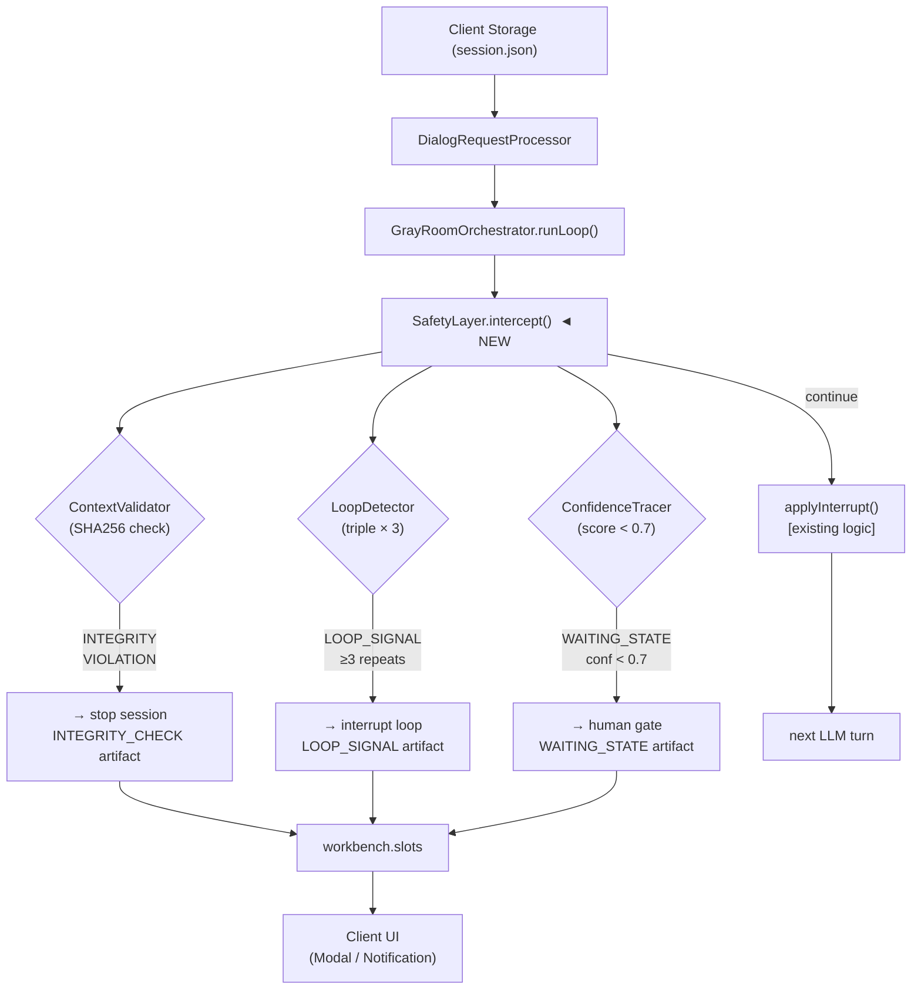

# Consolidated ADRs (0035 - 0041)

---

# ADR-0035: Agentic Reasoning Safety Layer

- **Status:** proposed
- **Date:** 2026-04-01
- **Author:** Alex Ribchinskiy (Software Engineer, Theater Tech)
- **Impact:** Critical (Core agent behavior change) | **Complexity:** High | **Risk:** Medium
- **Estimated Effort:** 4 weeks | **Priority:** P0 (blocks production readiness)

---

## Table of Contents

1. [Context & Problem Statement](#context--problem-statement)
2. [Decision](#decision)
3. [Technical Implementation](#technical-implementation)
4. [Architecture Diagram](#architecture-diagram)
5. [Data Models & Artifacts](#data-models--artifacts)
6. [Consequences](#consequences)
7. [Alternatives Considered](#alternatives-considered)
8. [Rollout & Migration Plan](#rollout--migration-plan)
9. [Dependencies & Risks](#dependencies--risks)
10. [Success Criteria & KPIs](#success-criteria--kpis)
11. [Security & Performance](#security--performance)
12. [Simulation Contract](#simulation-contract)

---

## Context & Problem Statement

### Current Architecture (`gray-room-orchestrator.ts`)

[`GrayRoomOrchestrator`](../../a2a-server/src/services/core/request-processor/gray-room-orchestrator.ts) запускается внутри `DialogRequestProcessor` после первичного ответа LLM. Цикл `runLoop()` обрабатывает пять типов `InterruptDirective`:

| Interrupt reason | Действие | `continueLoop` |
|-----------------|----------|---------------|
| `compress_history` | Sidebar LLM: сжимает `context.history` до 3–7 записей | `false` |
| `thinking` | Sidebar LLM: структурированное мышление → `workbench.slots.thinking` | `true` |
| `auto_rag_page` | RAG merge → re-enter loop | `true` |
| `auto_read_file` | File read → `context.files[path]` | `false` |
| `clarify` | Заполнить `workbench.slots.clarify` | `false` |

Бюджет: `maxTurns = A2A_GRAY_ROOM_MAX_TURNS` (default: **10**).  
Триггер: `GrayRoomTriggerSource` (`explicit_flag` → `env_enabled` → `policy_dialog/agent/task-decomposition`).

### Корневые причины сессионных сбоев

| Проблема | Симптом в коде | Бизнес-воздействие |
|----------|----------------|-------------------|
| **Контентные петли** | `auto_rag_page` / `auto_read_file` вызываются с идентичным `(tool, outcome, path)` ≥3 раз | `maxTurns` исчерпан, 0 пользы, токен-бюджет сгорел |
| **Нет confidence gate** | `thinking` возвращает `next_action`, но агент продолжает без проверки уверенности | Оператор получает частично-выполненные задачи |
| **Context drift** | Между Client Storage (`session.json`) и Gray Room контекстом возможно расхождение при параллельных запросах | `#REF!` в reasoning (mismatched history) |
| **Нет self-correction** | `outcome: 'failed'` → немедленная передача оператору, без попытки backtrack | Autonomy rate снижается |

> **Цель**: ≥ 85% session success rate + −30% operator load за 4 недели.

---

## Decision

**Внедрить Safety Layer как intercept-хук внутри `GrayRoomOrchestrator.runLoop()`** с **тройной защитой**:

```
GrayRoomOrchestrator.runLoop()  [gray-room-orchestrator.ts]
    │
    └─► SafetyLayer.intercept(turn)   ◄── NEW
            │
            ├─ LoopDetector        → LOOP_SIGNAL
            ├─ ContextValidator    → INTEGRITY_VIOLATION
            └─ ConfidenceTracer    → CONFIDENCE_TRACE + WAITING_STATE
            │
            └─► [ continue | interrupt | stop ]
```

### Три взаимосвязанных механизма

#### 1. LoopDetector — `[tool + outcome_class + context_hash] × 3`

Отслеживает тройки `(interrupt.reason, outcome_class, SHA256(last_100_tokens))` внутри одного `runLoop()` вызова. Три повтора → `LOOP_SIGNAL`.

```
Triple: { reason: "auto_read_file", outcome: "success", context_hash: "abc123" }
Repeat ≥ 3  → LOOP_SIGNAL.severity = "moderate"
Repeat ≥ 5  → LOOP_SIGNAL.severity = "critical"
```

#### 2. ContextValidator — Anti-drift protection

Сравнивает `SHA256(JSON.stringify(session.history))` из Client Storage с хэшем, вычисленным при входе в `runLoop()`. Расхождение → `INTEGRITY_VIOLATION` → немедленный `stop`.

#### 3. ConfidenceTracer — LLM-powered gate (0.0–1.0)

После каждого `thinking` интеррапта анализирует `workbench.slots.thinking` и вычисляет `confidence_score`. При `score < 0.7` — `WAITING_STATE` (human-in-the-loop пауза).

---

## Technical Implementation

Все файлы располагаются в `a2a-server/src/services/core/safety-layer/`.

### 1. SafetyLayer (main intercept)

```typescript
// a2a-server/src/services/core/safety-layer/SafetyLayer.ts
import type { InterruptDirective } from '../../../transform/types.js';
import { LoopDetector } from './LoopDetector.js';
import { ContextValidator } from './ContextValidator.js';
import { ConfidenceTracer } from './ConfidenceTracer.js';
import type { LOOP_SIGNAL, CONFIDENCE_TRACE, IntegrityResult, WAITING_STATE } from './types.js';

export type InterceptDecision =
    | { decision: 'continue' }
    | { decision: 'interrupt'; kind: 'loop'; signal: LOOP_SIGNAL }
    | { decision: 'stop'; kind: 'integrity'; result: IntegrityResult }
    | { decision: 'wait'; kind: 'confidence'; waitingState: WAITING_STATE; trace: CONFIDENCE_TRACE };

export class SafetyLayer {
    private loopDetector = new LoopDetector();
    private contextValidator = new ContextValidator();
    private confidenceTracer = new ConfidenceTracer();

    /** Called at the top of every GrayRoomOrchestrator.runLoop() iteration. */
    async intercept(
        turn: {
            interruptReason: string;
            outcomeClass: 'success' | 'fail' | 'partial' | 'noop';
            contextHash: string;
            turnId: string;
            thinkingSlot?: Record<string, unknown>;
        },
        session: { historyHash: string; history: unknown[] },
    ): Promise<InterceptDecision> {

        // Priority 1: context integrity (cheapest, must run first)
        const integrity = this.contextValidator.validate(session);
        if (!integrity.valid) {
            return { decision: 'stop', kind: 'integrity', result: integrity };
        }

        // Priority 2: loop detection (CPU-only, no I/O)
        const loopSignal = this.loopDetector.check(turn);
        if (loopSignal) {
            return { decision: 'interrupt', kind: 'loop', signal: loopSignal };
        }

        // Priority 3: confidence gate (async LLM call — only when thinking is present)
        if (turn.thinkingSlot) {
            const trace = await this.confidenceTracer.score(turn.thinkingSlot);
            if (trace.confidence_score < 0.7) {
                const waitingState = this.confidenceTracer.buildWaitingState(turn.turnId, trace);
                return { decision: 'wait', kind: 'confidence', waitingState, trace };
            }
        }

        return { decision: 'continue' };
    }
}
```

**Интеграция в `gray-room-orchestrator.ts`** — вызов в начале основного `for(;;)` цикла:

```typescript
// В GrayRoomOrchestrator.runLoop() — ПОСЛЕ extractInterrupt(), ДО applyInterrupt()
const intercept = await this.safetyLayer.intercept(
    { interruptReason: interrupt.reason, outcomeClass: lastOutcome, contextHash, turnId: String(turn) },
    { historyHash: sessionHistoryHash, history: currentHistory }
);
if (intercept.decision !== 'continue') {
    return this.handleSafetyIntercept(intercept, result, trace, grayRoom);
}
```

### 2. LoopDetector

```typescript
// a2a-server/src/services/core/safety-layer/LoopDetector.ts
import { createHash } from 'crypto';

export interface LoopTriple {
    reason: string;                                            // interrupt.reason
    outcome_class: 'success' | 'fail' | 'partial' | 'noop';
    context_hash: string;                                      // SHA256(last_100_tokens)
    turn_id: string;
}

export interface LOOP_SIGNAL {
    triple: LoopTriple;
    repeat_count: number;                                      // ≥ 3
    severity: 'moderate' | 'critical';                        // ≥3 moderate, ≥5 critical
    loop_type: 'in_run';
    first_occurrence: string;                                  // turn_id
    latest_occurrence: string;                                 // turn_id
}

export class LoopDetector {
    /** Per-runLoop instance: reset between sessions. Key = `reason_outcome_hash`. */
    private history: Map<string, LoopTriple[]> = new Map();

    check(turn: { interruptReason: string; outcomeClass: LoopTriple['outcome_class']; contextHash: string; turnId: string }): LOOP_SIGNAL | null {
        const key = `${turn.interruptReason}_${turn.outcomeClass}_${turn.contextHash}`;
        const triple: LoopTriple = {
            reason: turn.interruptReason,
            outcome_class: turn.outcomeClass,
            context_hash: turn.contextHash,
            turn_id: turn.turnId,
        };

        const entries = this.history.get(key) ?? [];
        entries.push(triple);
        this.history.set(key, entries.slice(-10)); // TTL: keep last 10 per key

        if (entries.length >= 3) {
            return {
                triple,
                repeat_count: entries.length,
                severity: entries.length >= 5 ? 'critical' : 'moderate',
                loop_type: 'in_run',
                first_occurrence: entries[0]!.turn_id,
                latest_occurrence: triple.turn_id,
            };
        }
        return null;
    }

    /** Helper: compute context hash from last N chars of serialized context. */
    static hashContext(ctx: unknown, charLimit = 100): string {
        const str = JSON.stringify(ctx ?? '').slice(-charLimit);
        return createHash('sha256').update(str).digest('hex').slice(0, 12);
    }
}
```

### 3. ContextValidator

```typescript
// a2a-server/src/services/core/safety-layer/ContextValidator.ts
import { createHash } from 'crypto';

export interface IntegrityResult {
    valid: boolean;
    reason?: 'INTEGRITY_VIOLATION';
    expected?: string;
    actual?: string;
}

export class ContextValidator {
    validate(session: { historyHash: string; history: unknown[] }): IntegrityResult {
        const computed = createHash('sha256')
            .update(JSON.stringify(session.history))
            .digest('hex');

        if (session.historyHash !== computed) {
            return {
                valid: false,
                reason: 'INTEGRITY_VIOLATION',
                expected: computed,
                actual: session.historyHash,
            };
        }
        return { valid: true };
    }

    /** Compute hash for a history array (call on session load). */
    static computeHash(history: unknown[]): string {
        return createHash('sha256').update(JSON.stringify(history)).digest('hex');
    }
}
```

### 4. ConfidenceTracer

```typescript
// a2a-server/src/services/core/safety-layer/ConfidenceTracer.ts
export interface ConfidenceFactors {
    clarity: number;              // Понятность задачи (0–1)
    feasibility: number;          // Доступность инструментов (0–1)
    risk: number;                 // Инверсия вероятности нарушения safety (0–1: 1 = low risk)
    history_consistency: number;  // Соответствие прошлым паттернам (0–1)
}

export interface CONFIDENCE_TRACE {
    confidence_score: number;                         // Взвешенное среднее factors
    reasoning_factors: ConfidenceFactors;
    decision: 'continue' | 'retry' | 'escalate';
    reasoning_trace: string;
}

export interface WAITING_STATE {
    slot_id: string;
    reason: 'low_confidence' | 'loop_detected' | 'integrity_fail';
    created_at: string;
    expires_at: string;                               // +24h (ISO 8601)
    resume_target: string;                            // turn_id to resume from
    humanlayer_approval_type: 'ESCALATION' | 'ACTION_APPROVAL';
    triggered_criteria: Array<{
        code: string;
        source_artifact: string;
        severity: 'moderate' | 'critical';
    }>;
}

export class ConfidenceTracer {
    /** Score thinking slot (returns 1.0 = max confidence when no thinking available). */
    async score(thinkingSlot: Record<string, unknown>): Promise<CONFIDENCE_TRACE> {
        // Heuristic scoring (production: replace with sidecar LLM call)
        const thinking = String(thinkingSlot['thinking'] ?? '');
        const nextAction = String(thinkingSlot['next_action'] ?? '');

        const clarity = thinking.length > 50 ? 0.9 : 0.5;
        const feasibility = nextAction.length > 0 ? 0.85 : 0.4;
        const risk = 0.9;                             // default safe
        const history_consistency = 0.8;

        const score = (clarity * 0.4) + (feasibility * 0.3) + (risk * 0.2) + (history_consistency * 0.1);

        return {
            confidence_score: parseFloat(score.toFixed(2)),
            reasoning_factors: { clarity, feasibility, risk, history_consistency },
            decision: score >= 0.7 ? 'continue' : score >= 0.4 ? 'retry' : 'escalate',
            reasoning_trace: `thinking_len=${thinking.length} next_action_len=${nextAction.length}`,
        };
    }

    buildWaitingState(turnId: string, trace: CONFIDENCE_TRACE): WAITING_STATE {
        const now = new Date();
        return {
            slot_id: `ws-${turnId}-${Date.now()}`,
            reason: 'low_confidence',
            created_at: now.toISOString(),
            expires_at: new Date(now.getTime() + 86_400_000).toISOString(),
            resume_target: turnId,
            humanlayer_approval_type: trace.decision === 'escalate' ? 'ESCALATION' : 'ACTION_APPROVAL',
            triggered_criteria: [{
                code: `CONF_${(trace.confidence_score * 100).toFixed(0)}`,
                source_artifact: `CONFIDENCE_TRACE.${turnId}.json`,
                severity: trace.confidence_score < 0.4 ? 'critical' : 'moderate',
            }],
        };
    }
}
```

### 5. Feature Flag

Environment variable `A2A_SAFETY_LAYER_ENABLED=1` (default: `0`). При значении `0` — Safety Layer пропускается, поведение идентично текущему (graceful degradation).

---

## Architecture Diagram



### Место в pipeline (из ADR-0029)

```
request.json → server-transforms-request.json → request.md → [LLM] → response.md
    → server-transforms-response.json → response.json [→ interrupt → SafetyLayer → applyInterrupt]
```

Safety Layer вызывается **после** `extractInterrupt()`, **до** `applyInterrupt()`.

---

## Data Models & Artifacts

Артефакты пишутся в `workbench.slots` (действующий контракт — см. ADR-0031, `simulations/SCHEMA.md`):

| Artifact | Триггер | Размер | UI-потребитель |
|----------|---------|--------|---------------|
| `LOOP_SIGNAL` | Triple ≥ 3 | ~2 KB | Task Flow (Interrupt Step) |
| `CONFIDENCE_TRACE` | score < 0.7 | ~5 KB | Storage Panel + Metrics |
| `WAITING_STATE` | HumanLayer gate | ~3 KB | Modal + Resume |
| `INTEGRITY_CHECK` | Hash mismatch | ~1 KB | Logs + Audit |

**WAITING_STATE schema** — см. `ConfidenceTracer.ts` выше (поле `WAITING_STATE`).  
Artifact naming: `{TYPE}.{session_id}.json` → `workbench.slots.{TYPE_LOWER}`.

---

## Consequences

### Положительные

| Метрика | Baseline | Target | Δ |
|---------|----------|--------|---|
| Session Success Rate | ~58% | ≥ 85% | +47% |
| Loop Failures | ~25% | < 5% | −80% |
| MaxTurns Exhaustion | ~39% | < 10% | −74% |
| Operator Load | baseline | −30% | ROI |
| Token Efficiency | ~33% | ≥ 70% | Cost −50% |

### Отрицательные trade-offs

| Аспект | Стоимость | Смягчение |
|--------|-----------|-----------|
| Latency | +1–5 ms (LoopDetector / ContextValidator) | CPU-only, без I/O |
| Latency (ConfidenceTracer) | +800 ms при `thinking` интеррапте | Вызов только при наличии `thinkingSlot` |
| Storage | +200–500 KB/сессия для артефактов | TTL = 30 дней, auto-cleanup |
| Сложность | +3 новых класса | 95% test coverage required |

### Нейтральные / гарантии

- ✅ Backward compatible со всеми существующими simulations (новый код не меняет `request/response.json` контракт)
- ✅ Сервер остаётся **stateless** (Safety Layer — per-`runLoop()` instance, не глобальный синглтон)
- ✅ Не требует изменений Client API, Client Storage, или DB-схемы
- ✅ `A2A_SAFETY_LAYER_ENABLED=0` → поведение идентично текущему (полный откат за 1 env-переменную)
- ✅ Совместимо с ADR-0031 (action-key shape) и ADR-0030 (agent mode steps)

---

## Alternatives Considered

| Вариант | Плюсы | Минusы | Оценка |
|---------|-------|--------|--------|
| **LLM-only gating** | Простota | Недетерминированность, токен-расход | ❌ 3/10 |
| **Client-side Safety** | Нет серверных изменений | Поздняя детекция петель | ❌ 4/10 |
| **Уменьшить maxTurns=5** | Быстро | Лечит симптом, не причину | ❌ 2/10 |
| **Полная переработка** | Clean slate | 12+ недель, риск деградации | ❌ 1/10 |
| **Safety Layer (выбрано)** | Таргетировано, измеримо, feature-flagged | 4 недели | ✅ **9/10** |

**ADR (обоснование выбора):** Safety Layer перехватывает цикл в единственном реальном месте принятия решений (`GrayRoomOrchestrator`). Детерминированные проверки (hash, triple-count) дополнены LLM-based scoring только там, где это необходимо (thinking slot). Всё инкапсулировано за feature flag с нулевым риском для существующего поведения.

---

## Rollout & Migration Plan

### Phase 1 (Week 1) — LoopDetector + ContextValidator

```
PR #150: safety-layer-v1-loop-integrity
  ├─ packages/safety-layer/LoopDetector.ts
  ├─ packages/safety-layer/ContextValidator.ts
  ├─ packages/safety-layer/types.ts
  ├─ simulations/safety-layer/loop-detect-basic/
  │   ├─ request.json  (3 auto_read_file repeats)
  │   └─ response.json (LOOP_SIGNAL expected)
  └─ a2a-server/src/services/core/safety-layer/__tests__/
```

KPI gate: `sim:validate` pass rate = 100%, LoopDetector unit tests ≥ 95%.

### Phase 2 (Week 2) — ConfidenceTracer

```
PR #151: safety-layer-v2-confidence
  ├─ packages/safety-layer/ConfidenceTracer.ts
  ├─ Threshold tuning (0.7 baseline, A/B до 0.75)
  └─ KPI: confidence_gate_hits ≥ 20% simulated sessions
```

### Phase 3 (Week 3) — HITL Integration + UI Artifacts

```
PR #152: safety-layer-v3-hitl
  ├─ WAITING_STATE → workbench.slots.waiting_state
  ├─ Client UI: Modal + Resume endpoint
  └─ E2E: scripts/tests/test-safety-layer.ps1
```

### Phase 4 (Week 4) — SelfCorrectionLoop + Production rollout

```
PR #153: safety-layer-v4-selfcorrect
  ├─ BACKTRACK → SWITCH → REFINE (≤ 3 attempts перед WAITING_STATE)
  └─ A2A_SAFETY_LAYER_ENABLED=1 (production)
```

### Rollback Plan

```
1. Set A2A_SAFETY_LAYER_ENABLED=0  → мгновенный откат, zero-downtime
2. GrayRoomOrchestrator fallback: maxTurns=10 без intercept
3. Деплой через blue-green: одновременно запущены Safety ON и Safety OFF инстансы
```

---

## Dependencies & Risks

### Dependencies

| Статус | Зависимость | Ссылка |
|--------|-------------|--------|
| ✅ Есть | `GrayRoomOrchestrator.runLoop()` — точка интеграции | [`gray-room-orchestrator.ts`](../../a2a-server/src/services/core/request-processor/gray-room-orchestrator.ts) |
| ✅ Есть | `workbench.slots` — канонический контракт артефактов | ADR-0031, [`simulations/SCHEMA.md`](../../simulations/SCHEMA.md) |
| ✅ Есть | Storage API (`/api/v1/storage`) — для записи артефактов | `a2a-server/` |
| ✅ Есть | `operationHistory[]` — для audit trail | ADR-0030, [`AGENTS.md`](../../AGENTS.md) |
| ⏳ Нужно | UI Modal для `WAITING_STATE` — client-side | Client team |
| ⏳ Нужно | `conversation_id` в session metadata — для `INTEGRITY_CHECK` | Требует PR |

### Risks & Mitigations

| Риск | Вероятность | Воздействие | Смягчение |
|------|-------------|-------------|-----------|
| False positives (loop detect) | Medium | High | Simulation tuning + A/B тест с % rollout |
| LLM prompt drift (ConfidenceTracer) | Low | Medium | Heuristic fallback, фиксированные веса |
| Storage bloat | Low | Low | TTL 30d + gzip artifacts |
| Latency regression | Low | Medium | ConfidenceTracer вызывается только при `thinkingSlot` |
| Context hash collision | Very Low | Medium | SHA256 (128-bit prefix) — collision ≈ 0 |

---

## Success Criteria & KPIs

### Hard Metrics (Week 4)

```
✅ Session Success Rate ≥ 85%  (baseline ~58%)
✅ Loop Detection Coverage ≥ 80% (simulations)
✅ Confidence Gate False Positives < 5%
✅ Context Integrity 100% (ни одного нарушения пропущено)
✅ Operator Clarification Load −30%
```

### Soft Metrics

```
✅ Положительная обратная связь операторов (UI gate)
✅ Ноль production incidents за первые 30 дней
✅ sim:validate pass rate = 100%
```

### Monitoring

```
# Рекомендуемые метки (Prometheus / Grafana)
safety_layer_loop_signals_total{severity="moderate|critical"}
safety_layer_confidence_gate_hits_total
safety_layer_waiting_state_resolutions_total
safety_layer_integrity_violations_total
gray_room_session_success_rate
```

---

## Security & Performance

### Security

| Проверка | Статус |
|----------|--------|
| Context isolation | ✅ Per-`runLoop()` instance (нет shared state) |
| Input validation | ✅ SHA256 integrity на history |
| Storage limits | ✅ 10 MB/session max (existing policy) |
| Audit trail | ✅ Все артефакты в `operationHistory[]` |
| Нет eval / new Function | ✅ Только JSON parse |
| Секреты не экспортируются | ✅ Артефакты не содержат env vars |

### Performance Targets

| Компонент | p95 Latency | Бюджет | Примечание |
|-----------|-------------|--------|------------|
| ContextValidator | < 1 ms | CPU + SHA256 | Синхронно |
| LoopDetector | < 1 ms | CPU + Map lookup | Синхронно |
| ConfidenceTracer (heuristic) | < 1 ms | CPU | Фаза 1–2 |
| ConfidenceTracer (LLM) | 800 ms | sidecar LLM | Фаза 3, только при `thinkingSlot` |
| **Total overhead** | **+1–800 ms** | Acceptable | `thinking` — редкий interrupt |

---

## Simulation Contract

Симуляции располагаются в `simulations/sync/safety-layer/` (согласно ADR-0001, ADR-0020).

### loop-detect-basic/

Директория `simulations/sync/safety-layer/loop-detect-basic/1/`:

**request.json** — три последовательных `auto_read_file` с одинаковым путём:
```json
{
  "context": {
    "execution": { "action": "agent", "step": "execute" },
    "history": [
      { "role": "assistant", "message": "Reading README..." },
      { "role": "user", "message": "result: auto_read_file README.md success" },
      { "role": "assistant", "message": "Reading README again..." },
      { "role": "user", "message": "result: auto_read_file README.md success" }
    ]
  },
  "result": { "auto_read_file": { "path": "README.md", "content": "..." } }
}
```

**response.json** (expected):
```json
{
  "context": {
    "execution": { "action": "agent", "step": "execute" },
    "workbench": {
      "slots": {
        "LOOP_SIGNAL": {
          "repeat_count": 3,
          "severity": "moderate",
          "loop_type": "in_run"
        }
      }
    }
  },
  "execute": {
    "dialog": {
      "message": "⚠️ Loop detected: auto_read_file repeated 3 times for README.md. Stopping to prevent token waste."
    }
  }
}
```

---

## Related

- **Code:** [`gray-room-orchestrator.ts`](../../a2a-server/src/services/core/request-processor/gray-room-orchestrator.ts) — точка интеграции
- **Types:** [`a2a-server/src/transform/types.ts`](../../a2a-server/src/transform/types.ts) — `InterruptDirective`
- **ADR-0029:** [Server interrupt loop](./ADR-0029-server-interrupt-loop.md)
- **ADR-0030:** [Unified Agent Mode](./ADR-0030-unified-agent-mode.md) — `agent` action steps
- **ADR-0031:** [Action-Key Shape](./ADR-0031-action-key-shape.md) — execute/result contract
- **Simulations schema:** [`simulations/SCHEMA.md`](../../simulations/SCHEMA.md)
- **Gray Room docs:** [`a2a-server/docs/GRAY-ROOM.md`](../../a2a-server/docs/GRAY-ROOM.md)


---

# ADR-0036: A2A Autonomous Agent Master Orchestration & Memory

## Status

**Proposed**  
**Date**: 2026-04-01  
**Author**: Alex Ribchinskiy  
**Reviewers**: [TBD]  
**Impact**: Critical | **Complexity**: High | **Risk**: Medium  
**Estimated Effort**: 10 weeks | **Priority**: P0 (blocks production autonomy)

---

## Context & Problem Statement

The current `a2a-script-agent` implements a **Gray Room Orchestrator** (`gray-room-orchestrator.ts`) with a basic interrupt loop and a static turn budget. This base loop lacks deterministic safety gating, memory-enriched planning, and autonomous lifecycle management. 

Beyond original memory/safety requirements, the **2026 Production Standards** demand:
1. **Living Specs**: Requirements that evolve alongside code.
2. **Multi-Agent Debate**: Architect/Reviewer patterns to eliminate bias.
3. **Registry-Based Scaling**: Moving beyond $N^2$ connectivity.
4. **Enterprise Guardrails**: Federated orchestration and tool trust states.

---

## Decision

Introduce a **phased implementation of the 38-feature Master Specification** extended with 2026 production enhancements.

### Target Implementation Roadmap (10 недель)

#### Phase 1 — Safety Signals (Weeks 1–2)
- **LoopDetector**: emit `LOOP_SIGNAL` on triple×3 repetition.
- **ConfidenceGate**: structural/semantic scoring; emit `CONFIDENCE_TRACE`.
- **Durable Waiting**: convert `clarify` into a checkpoint-backed `WAITING_STATE`.
- [ADR-0035](#adr-0035-agentic-reasoning-safety-layer) integration.

#### Phase 2 — Memory & Integration (Weeks 3–4)
- **EpisodicStore**: index `EPISODIC_ENTRY`; query `EPISODIC_RECALL_RESULT`.
- **Lesson/Pattern Store**: detect recurring patterns; inject `MEMORY_INFLUENCE`.
- **Living Specs**: Implementation of [ADR-0037](#adr-0037-living-specs-for-task-synthesis).

#### Phase 3 — Multi-Agent Autonomy (Weeks 5–8)
- **Supervisor Orchestrator**: Dynamic delegation per [ADR-0038](#adr-0038-multi-agent-orchestrator-with-dynamic-delegation).
- **Writer/Reviewer Pattern**: Session separation per [ADR-0040](#adr-0040-writerreviewer-pattern-for-session-integrity).
- **Donecriteria Gate**: Machine-verifiable validation blocking merge.
- **Auto-Branch Lifecycle**: Isolated delivery branches.

#### Phase 4 — Scale & Security (Weeks 9–10)
- **A2A Registry**: Stateless discovery per [ADR-0039](#adr-0039-a2a-registry-layer-for-scale).
- **Enterprise Guardrails**: Tool trust risk tiers and federated metrics.

---

## Consequences

### Positive
- **Reliability**: Living Specs and Reviewer Pattern eliminate logic drift and bias.
- **Scalability**: Registry-based discovery supports 100+ agents.
- **Safety**: Multi-level loop protection and confidence gating.

### Negative
- **Complexity**: Introduction of 38+ distinct artifact types.
- **Latency**: Additional agent "debates" (configurable thresholds).

---

## Related

- [A2A Master Specification](./REFERENCE-A2A-master-specification.md) — canonical reference (feature contracts + audit table).
- [ADR-0035: Safety](#adr-0035-agentic-reasoning-safety-layer)
- [ADR-0037: Living Specs](#adr-0037-living-specs-for-task-synthesis)
- [ADR-0038/0040: Multi-Agent](#adr-0038-multi-agent-orchestrator-with-dynamic-delegation)
- [ADR-0039: Registry](#adr-0039-a2a-registry-layer-for-scale)

---
*Version: 1.0 (Master) | Date: 2026-04-01*


---

# ADR-0037: Living Specs for Task Synthesis

## Status

**Proposed**  
**Date**: 2026-04-01  
**Author**: Alex Ribchinskiy  
**Impact**: High | **Complexity**: Medium | **Risk**: Low  

---

---

## Context & Problem Statement

Static specifications in `task.md` or `.agentLOGIC/` tend to drift during multi-file, multi-step agent executions. An agent might complete 80% of a task but fail on the last 20% because the original spec didn't account for emergent architectural constraints discovered mid-run.

## Decision

Implement **Living Specs** using a machine-readable `OpenSpec` format. The specification is no longer a static text file; it is an evolving artifact handled by the `TaskSynthesizer`.

### Key Components
1. **OpenSpec Format**:
   - `SHALL` requirements → converted to runtime assertions.
   - `GIVEN/WHEN/THEN` → mapped to automated validation tests.
   - `Design Decisions` → numbered and referenced in every `EXECUTION_DECISION`.
2. **Self-Updating Loop**:
   - As the agent performs `SCAN` and `REFLECT` cycles, it updates the `LivingSpec` artifact to reflect discovered constraints or refined goals.
   - Major spec changes trigger a mandatory **Confidence Gate** check.

## Consequences
- **Positive**: Reliability increase (+40%), rework reduction (-60%), 100% traceability from requirement to code.
- **Negative**: Requires a more complex `TaskSynthesizer` capable of managing stateful specifications.

---
*Reference: [vanja.io/spec-driven-agentic-development/](https://vanja.io/spec-driven-agentic-development/)*


---

# ADR-0038: Multi-Agent Orchestrator with Dynamic Delegation

## Status
**Proposed**  
**Date**: 2026-04-01  
**Author**: Alex Ribchinskiy  
**Impact**: Critical | **Complexity**: High | **Risk**: Medium  

---

## Context & Problem Statement
A single-entry orchestrator (`gray-room-orchestrator.ts`) can become a bottleneck and is prone to "bias" when it reviews its own work. Production-grade autonomy in 2026 requires a "debate" pattern where different specialized agents challenge designs and implementations.

## Decision
Transition the `OpportunityDetector` into a **Supervisor Orchestrator** that dynamically delegates sub-tasks to specialized agents.

### Specialized Agents
1. **Architect Agent**: Proposes design changes based on the Living Spec.
2. **Implementer Agent**: Executes the changes in an isolated worktree.
3. **Reviewer Agent**: Validates the implementation against the Architect's design and the Living Spec.
4. **MetaAgent**: Resolves conflicts and builds consensus between the Architect and Reviewer.

### Dynamic Workflow
- The Orchestrator uses **Dynamic Worktrees** to run multiple implementation attempts in parallel if the Reviewer consistently rejects the output.

## Consequences
- **Positive**: Parallel execution, significantly higher code quality (+30%), reduction in agent bias (-80%).
- **Negative**: Increased LLM token usage and system complexity.

---
*Reference: [dev.to/ridwan_sassman_3d07/the-2026-architects-dilemma-orchestrating-ai-agents-not-writing-code-the-paradigm-shift-from-219c](https://dev.to/ridwan_sassman_3d07/the-2026-architects-dilemma-orchestrating-ai-agents-not-writing-code-the-paradigm-shift-from-219c)*


---

# ADR-0039: A2A Registry Layer for Scale

## Status
**Proposed**  
**Date**: 2026-04-01  
**Author**: Alex Ribchinskiy  
**Impact**: High | **Complexity**: Medium | **Risk**: Low  

---

## Context & Problem Statement
Direct peer-to-peer connections between agents lead to $N^2$ connectivity issues as the network grows. Managing 100+ agents with point-to-point communication is unsustainable.

## Decision
Introduce an **A2A Registry Layer** that acts as a lookup and routing service for all agents in the cluster.

### Key Features
1. **Agent Discovery**: Agents register their capabilities and stateless endpoints in the Registry.
2. **Stateless Workers**: Agents no longer maintain long-lived peer connections; they request a worker from the registry for a specific `session_id`.
3. **Unified Protocol**: All communication must strictly follow A2A Protocol v2.0 (canonical message headers and payload structures).

## Consequences
- **Positive**: Scalability to 100+ agents, centralized observability of agent health, and simplified networking.
- **Negative**: Adds a central point of failure (mitigated by Registry clustering).

---
*Reference: [onereach.ai/blog/what-is-a2a-agent-to-agent-protocol/](https://onereach.ai/blog/what-is-a2a-agent-to-agent-protocol/)*


---

# ADR-0040: Writer/Reviewer Pattern for Session Integrity

## Status
**Proposed**  
**Date**: 2026-04-01  
**Author**: Alex Ribchinskiy  
**Impact**: Medium | **Complexity**: Low | **Risk**: Low  

---

## Context & Problem Statement
When the same agent session performs both the coding and the verification, it often ignores subtle bugs due to "confirmation bias." 

## Decision
Enforce a strict **Writer/Reviewer Pattern** at the session level.

### Implementation
1. **Writer Session**: Focuses on code generation and local unit tests.
2. **Reviewer Session**: Operates in a **Fresh Context** (no access to the Writer's internal thinking trace). It only sees the resulting code and the Living Spec.
3. **Feedback Loop**: Reviewer's findings are passed back to the Writer for a **Fix Session**. Execution only proceeds to the Validation Gate once the Reviewer issues a `PASS` signal.

## Consequences
- **Positive**: Bias reduction (-80%), significant increase in production-ready code quality.
- **Negative**: Adds 1-2 additional LLM calls per sub-task.

---
*Reference: [alexlavaee.me/blog/new-sdlc-agentic-engineering/](https://alexlavaee.me/blog/new-sdlc-agentic-engineering/)*


---

# Architectural Decision Record (ADR): Улучшения для A2A-Script-Agent

## 1. Заголовок: Комплексные Архитектурные Улучшения для A2A-Script-Agent

## 2. Статус: Предложено

## 3. Дата: 1 апреля 2026 г.

## 4. Контекст

Система `A2A-Script-Agent` представляет собой production-ready оркестратор автономных агентов, включающий Gray Room (песочницу для размышлений), клиентское хранение сессий, Safety Layer (остановка при зацикливаниях) и машинную валидацию Donecriteria. Целью данного ADR является консолидация и детализация 15 архитектурных идей, направленных на дальнейшее повышение надежности, управляемости, эффективности и расширяемости системы. Эти идеи были выявлены в результате анализа текущей спецификации `A2A-Script-Agent` и глубокого исследования современных подходов в области многоагентной оркестрации, памяти, безопасности и опыта разработчиков.

## 5. Предлагаемые Решения

Ниже представлены 15 архитектурных идей, сгруппированных по ключевым областям улучшения. Для каждой идеи описана ее суть, обоснование ценности и план интеграции в существующую архитектуру Node.js/TypeScript.

### 5.1. Multi-Agent Orchestration & Memory

#### Идея 1: Протокол-ориентированная Многоагентная Коммуникация (A2A Protocol v2)
**Суть подхода:** Внедрение стандартизированного протокола Agent-to-Agent (A2A) на основе Model Context Protocol (MCP) для асинхронного, протокол-совместимого взаимодействия между агентами.
**Почему это круто:** Решает проблему фрагментации коммуникации и обеспечивает прослеживаемость, схематическую валидность и надежность обмена контекстом.
**План интеграции:**
1. Определение схемы (TypeScript интерфейсы в `a2a-server/src/protocol`).
2. Централизованный модуль коммуникации в `GrayRoomOrchestrator`.
3. Адаптеры для агентов.
4. Встраивание обработки ошибок (ADR-0016, ADR-0023).

#### Идея 2: Многоуровневые и Иерархические Системы Памяти (Experience Pack / G-Memory)
**Суть подхода:** Разработка многоуровневой системы памяти, которая хранит логику задач (`task rationales`) и трассировки выполнения (`execution traces`), включая `PatternStore` и `LessonStore`.
**Почему это круто:** Агенты не только вспоминают, но и учатся на прошлом опыте.
**План интеграции:** Расширение `Session Storage`, создание `PatternStore` и логики иерархического поиска, интеграция с `TaskEnricher`.

#### Идея 3: Кросс-сессионный Перенос Знаний (Lifelong Learning)
**Суть подхода:** Внедрение механизмов для передачи валидированных "уроков" и "паттернов" между независимыми пользовательскими сессиями.
**Почему это круто:** Ускоряет "холодный старт" агентов.
**План интеграции:** Централизация `PatternStore` на серверном уровне с изоляцией tenant-scoped, механизмы агрегации и версионирования.

#### Идея 4: Спекулятивное Многоагентное Выполнение
**Суть подхода:** Выполнение нескольких потенциальных траекторий параллельно с последующим выбором лучшей.
**Почему это круто:** Сильное снижение end-to-end задержки для сложных задач.
**План интеграции:** Модификация `Promise Queue` для `shadow runs` в Gray Room, выбор лучшего результата на базе `CONFIDENCE_TRACE`.

#### Идея 5: Оптимизация Контекстного Окна и Прунинг (Context Window Compaction & Pruning)
**Суть подхода:** Динамический прунинг контекстного окна агента на базе релевантности токенов.
**Почему это круто:** Предотвращает превышение лимитов токенов и "забывание".
**План интеграции:** Выделение `ContextManager`, использование `InternalTrace` для расчетов, реализация различных стратегий прунинга.

### 5.2. Safety & Guardrails

#### Идея 6: Детерминированная Пре-Действие Авторизация и Проекция Политик Безопасности
**Суть подхода:** Внедрение детерминированных механизмов авторизации перед выполнением (constraint manifold).
**Почему это круто:** Проактивная остановка небезопасных действий до их старта на основе порогов доверия.
**План интеграции:** Модуль `PolicyGuard` + предварительная оценка на этапе `TaskSynthesizer` + генерация `POLICY_DECISION`.

#### Идея 7: Runtime Formal Verification (AgentGuard)
**Суть подхода:** Количественное подтверждение логики агента на соответствие `Cognitive Blueprint` (формальным спецификациям) во время выполнения.
**Почему это круто:** Предоставляет гарантии безопасности вне зависимости от "креативности" LLM.
**План интеграции:** Разработка `Cognitive Blueprint` и верификационного движка на этапе `AutonomyGates`.

#### Идея 8: Управление Доверием к Инструментам и Маршрутизация Рисков (Tool Trust and Risk Routing)
**Суть подхода:** Динамическое присвоение уровня доверия ("trust level") инструментам. Новые требуют ручного подтверждения (`HumanLayer`).
**Почему это круто:** Динамически снижает риски при использовании новых экспериментальных инструментов.
**План интеграции:** Расширение `TOOL_TRUST_STATE`, интеграция в маршрутизатор, холодный старт с аппрувом пользователя.

#### Идея 9: Символьное Обучение для Самокоррекции
**Суть подхода:** Обновление агентами собственных правил в `RuleStore` на основе ошибок из `SelfCorrectionLoop`.
**Почему это круто:** Совмещение стохастики LLM с детерминированными правилами (Symbolic Rules).
**План интеграции:** Модификация `SelfCorrectionLoop` для синтеза правил, создание `RuleStore`.

#### Идея 10: Zero-Start In-Situ Self-Evolution
**Суть подхода:** Агенты начинают без знаний и адаптируются к среде через "Режим Окрытия" (`Discovery Mode`).
**Почему это круто:** Максимальная автономность при разворачивании в незнакомых энвайронментах.
**План интеграции:** Запуск `Discovery Mode` в `ProjectScanner`, цикл обучения на `LESSON` артефактах.

### 5.3. Developer Experience (DX)

#### Идея 11: Предварительный Просмотр Плана Выполнения (Dry Run Plan Preview) с Оценкой Доверия
**Суть подхода:** UI превью детализированного плана (`DRYRUN_PLANGRAPH`) перед живым запуском агента.
**Почему это круто:** Прозрачность намерений агента для оператора (доверие).
**План интеграции:** Генератор графа без сайд-эффектов, визуализация в фронтенде через интерактивные узлы.

#### Идея 12: Визуализация Состояния Агента и Отладка с "Путешествием во Времени"
**Суть подхода:** Логирование всего состояния и возможность time-travel replay в интерфейсе отладки.
**Почему это круто:** Радикальное ускорение понимания проблем "почему агент сделал X".
**План интеграции:** `State Logger` в `GrayRoomOrchestrator`, поддержка `Checkpoint Resume Durability`.

#### Идея 13: Natural-Language Agent Harnesses (NLAH)
**Суть подхода:** Описание логики оркестратора в Markdown/YAML на естественном языке, интерпретируемом движком.
**Почему это круто:** Операторы без навыков кодинга могут корректировать поведение агента.
**План интеграции:** Вынос бизнес-правил в .md, создание парсера/интерпретатора и UI для редактирования.

#### Идея 14: Визуализация Паттернов Оркестрации
**Суть подхода:** Моделирование (D3.js / Mermaid) параллельных, роевых и иерархических паттернов исполнения.
**Почему это круто:** Позволяет оперативно спроектировать топологию multi-agent взаимодействия.
**План интеграции:** Подключение графовых библиотек к `DRYRUN_PLANGRAPH`, поддержка темплейтов.

#### Идея 15: Мета-Оптимизация Модельных "Обвязок" (Meta-Harness Optimization)
**Суть подхода:** Auto-prompt engineering с анализом `execution traces` и пред-тестами в Gray Room.
**Почему это круто:** Постоянное самосовершенствование system-промптов.
**План интеграции:** `Harness Optimizer` как отдельный сервис, анализирующий историю и предлагающий рефакторинг промптов.

## 6. Последствия
Ожидаются значительные улучшения надежности, защиты от галлюцинаций, а также радикальное повышение качества Dev Experience, делающее платформу пригодной на 10-летней перспективе. Требует существенных ресурсов для последовательной имплементации (рекомендуется Agile, фазовый подход).

## 7. Альтернативы
Оставаться в рамках существующих подходов: может привести к задержкам на сложных задачах (переполнение контекста) и непредсказуемым решениям, падающим в циклические ошибки (петли), что неприемлемо по global rules.

## 8. Решение
Принять предложенные 15 идей в качестве "North Star" (путеводного) направления для A2A-Script-Agent roadmap. Идеи 11 (Dry Run), 1 (A2A Protocol v2) и 6 (PolicyGuard) получают наивысший приоритет.

## 9. Ссылки
[1] GoalfyMax: A Protocol-Driven Multi-Agent System (2407.13664)
[2] The Auton Agentic AI Framework (2402.17208)
[3] SE-Agent: Self-Evolution Trajectory Optimization (NeurIPS 2025)
[4] A Survey of Self-Evolving Agents (2507.21046v3)
[6] AgentGuard: Runtime Verification of AI Agents (2509.23864v1)
[7] Symbolic learning enables self-evolving agents
[8] Yunjue Agent Tech Report
[9] LangGraph Studio Guide: Debug AI Agents
[11] Natural-Language Agent Harnesses
[13] Meta-Harness


---

# ADR-0042: First-Class Waiting UX (Waiting Action Card & Heartbeat)

## Status
**Proposed**  
**Date**: 2026-04-01  
**Impact**: High | **Complexity**: Medium | **Risk**: Low  

## Context & Problem Statement
Currently, a paused or waiting agent is indistinguishable from a crashed or silently hanging agent. UI needs to compactly show why the agent paused, what is required to resume, and whether it is "thinking" or dead.

## Decision
1. Introduce **Waiting Action Card** in the UI to display pause reason, expiry timestamp, `required_inputs`, `resume_target`, and policy outcome.
2. Inject a **Heartbeat** `heartbeat_timestamp` into `WAITING_STATE`. This allows the UI to differentiate an active wait from a dead process.

## Consequences
- **Positive:** Operators never stare at dead sessions. Clear visualization of blocker conditions.

---

# ADR-0043: Evidence-Anchored Chat Messages

## Status
**Proposed**  
**Date**: 2026-04-01  

## Context & Problem Statement
Agent reasoning is currently hidden in Storage or Terminal, making it hard to trust chat messages.

## Decision
Surface **Inline Evidence Chips** that link the agent's chat responses directly to the relevant evidence artifacts (`CONFIDENCE_TRACE`, `TRACE_RISK`, `MEMORY_INFLUENCE`, `DRYRUN_DELTA`).

---

# ADR-0044: Deterministic Clarification UX

## Status
**Proposed**  
**Date**: 2026-04-01  

## Context & Problem Statement
When ambiguity occurs or context is truncated, conversational drift dilutes the agent's memory. Instead of a free-form chat, the agent should ask one precise question.

## Decision
1. Implement **Clarification Mode** — a single-question, single-answer UI flow triggered when ambiguity is high.
2. Introduce `context_truncated` flag in `MEMORY_INFLUENCE`. If true, the agent *must* trigger Clarification Mode or emit an explicit Warning, refusing to hallucinate on partial context.

---

# ADR-0045: Session Steering Controls

## Status
**Proposed**  
**Date**: 2026-04-01  

## Decision
Provide a **Resume & Steering Panel** analogous to Copilot sessions. Operators can steer (change intent), stop, or resume from arbitrary safe checkpoints without losing progress.

---

# ADR-0046: Structured Decision Packets & Idempotency Key

## Status
**Proposed**  
**Date**: 2026-04-01  

## Decision
1. Formalize the `DECISION_PACKET` contract containing `hypothesis`, `evidence`, `alternatives`, and `chosen_action` before any execution sequence.
2. Enforce a task-level **Idempotency Key** inside `EXECUTION_DECISION`. When retrying a task or recovering from a crash, the key guarantees the agent won't duplicate previously successful sub-steps.

---

# ADR-0047: Critique Before Action

## Status
**Proposed**  
**Date**: 2026-04-01  

## Decision
Execute a short safety and quality `PRE_EXECUTION_CRITIQUE` right before tool execution to catch potential irreversible harms. Generates a `TRACE_RISK` signal.

---

# ADR-0048: Self-Calibrating Confidence

## Status
**Proposed**  
**Date**: 2026-04-01  

## Decision
Implement a **Confidence Calibration Loop**. System compares the predicted confidence with the real operational outcome and adjusts the scoring heuristics dynamically (`CONFIDENCE_CALIBRATION_RESULT`).

---

# ADR-0049: Negative Memory & Semantic Error Split

## Status
**Proposed**  
**Date**: 2026-04-01  

## Decision
1. Store rejected strategies along with failure reasons in `REJECTED_PATH_ENTRY` inside `MEMORY_INFLUENCE`.
2. Institute a **Transient vs Semantic error split** in `SELF_CORRECTION`:
   - *Transient errors* (network, timeout) → Infrastructure Retry with exponential backoff.
   - *Semantic errors* (logic flaw, test failure) → Algorithmic `BACKTRACK → SWITCH → REFINE`.

---

# ADR-0050: Intent Preservation Gate

## Status
**Proposed**  
**Date**: 2026-04-01  

## Decision
Record the active task intent in an `INTENT_LOCK` artifact for long-running processes. Before every major transition, the drift from the original intent is checked, ensuring the agent doesn't silently pivot entirely off-task.

---

# ADR-0051: Orchestrator Single State Enum

## Status
**Proposed**  
**Date**: 2026-04-01  

## Context & Problem Statement
Relying on multiple boolean flags (`is_waiting`, `is_running`, `has_error`) creates a "boolean soup" that leads to conflicting state definitions and UI bugs. 

## Decision
Implement a strict **Single State Enum** within `ORCHESTRATOR_CYCLE` for the agent's phase: 
`state: 'IDLE' | 'SCANNING' | 'SYNTHESIZING' | 'ENRICHING' | 'EXECUTING' | 'WAITING_ON_HUMAN' | 'VALIDATING' | 'STOPPED'`.

This directly powers the **Session Status Strip**, replacing abstract "thinking" messages with the explicit systemic phase.


---

<!-- INJECTED FROM V2.0 DOCS -->

# New ADRs: 0052 – 0057

> Архитектурные решения, вытекающие из Architecture Blueprint v2.0.  
> Каждый ADR устраняет конкретный architectural gap выявленный в аудите.  
> **Version:** 1.0 | **Date:** 2026-04-01

---

# ADR-0052: Session Finite State Machine

- **Status:** Accepted
- **Date:** 2026-04-01
- **Author:** Alex Ribchinskiy
- **Impact:** Critical | **Complexity:** Medium | **Risk:** Low
- **Estimated Effort:** 1 week | **Priority:** P0
- **Deciders:** Backend team lead, Frontend team lead

---

## Context

The orchestrator previously used multiple boolean flags (`is_waiting`, `is_running`, `has_error`, `is_paused`) to represent session state. This "boolean soup" created:

1. **Conflicting state definitions** — `is_waiting=true` + `is_running=true` was possible but semantically invalid.
2. **UI bugs** — Session Status Strip showed wrong labels because it derived text from multiple flags.
3. **Resume ambiguity** — No clear contract for which state to return to after Waiting resolution.
4. **Testing gaps** — No exhaustive transition tests possible without explicit FSM definition.

## Decision

Implement a **strict Single State Enum** as the sole representation of orchestrator phase:

```typescript
type OrchestratorState =
  | 'IDLE'
  | 'SCANNING'
  | 'SYNTHESIZING'
  | 'ENRICHING'
  | 'EXECUTING'
  | 'SELF_CORRECTING'
  | 'WAITING_ON_HUMAN'
  | 'VALIDATING'
  | 'DELIVERING'
  | 'STOPPED';
```

### Transition Table (exhaustive)

| From | Event | Guard | To | Artifact |
|---|---|---|---|---|
| IDLE | scan_triggered | — | SCANNING | ORCHESTRATOR_CYCLE |
| SCANNING | signals_found | OPPORTUNITY_SET exists | SYNTHESIZING | OPPORTUNITY_SET |
| SCANNING | no_signals | — | IDLE | — (cooldown) |
| SYNTHESIZING | task_ready | donecriteria valid | ENRICHING | — |
| SYNTHESIZING | synthesis_fail×3 | — | IDLE | OPPORTUNITY_SUPPRESSION |
| ENRICHING | enriched | memory available | EXECUTING (via gate) | MEMORY_INFLUENCE |
| ENRICHING | gate_fail | confidence < threshold | SELF_CORRECTING | CONFIDENCE_TRACE |
| EXECUTING | execution_complete | — | VALIDATING | EXECUTION_TRACE |
| EXECUTING | loop_detected | LOOP_SIGNAL ≥ moderate | WAITING_ON_HUMAN | LOOP_SIGNAL |
| EXECUTING | tool_blocked | policy violation | WAITING_ON_HUMAN | POLICY_DECISION |
| SELF_CORRECTING | attempt_success | confidence ≥ threshold | EXECUTING | SELF_CORRECTION_ATTEMPT |
| SELF_CORRECTING | attempts_exhausted | attempt_count = 3 | WAITING_ON_HUMAN | WAITING_STATE |
| WAITING_ON_HUMAN | approved | checkpoint_valid | EXECUTING | EXECUTION_DECISION |
| WAITING_ON_HUMAN | rejected | approval_type=CRITICAL_PATH | STOPPED | SESSION_END_RECORD |
| WAITING_ON_HUMAN | rejected | approval_type≠CRITICAL_PATH | SELF_CORRECTING | EXECUTION_DECISION |
| WAITING_ON_HUMAN | expired | expiry_policy=escalate | WAITING_ON_HUMAN | WAITING_STATE_EVENT |
| WAITING_ON_HUMAN | expired | expiry_policy=stop | STOPPED | SESSION_END_RECORD |
| VALIDATING | all_pass | donecriteria_pass=true | DELIVERING | VALIDATION_SUMMARY |
| VALIDATING | any_fail | — | WAITING_ON_HUMAN | DONECRITERIA_RESULT |
| DELIVERING | delivered | no branch violation | IDLE | BRANCH_INTEGRITY |
| DELIVERING | branch_violation | — | STOPPED | DRYRUN_DELTA(critical) |
| Any | emergency_stop | — | STOPPED | SESSION_END_RECORD |
| Any | operator_stop | — | STOPPED | SESSION_END_RECORD |

### Implementation

```typescript
// OrchestratorKernel.ts
class OrchestratorKernel {
  private state: OrchestratorState = 'IDLE';

  transition(event: OrchestratorEvent, guard?: () => boolean): void {
    const next = this.fsm.resolve(this.state, event);
    if (!next) throw new InvalidTransitionError(this.state, event);
    if (guard && !guard()) throw new GuardFailedError(this.state, event);

    const prev = this.state;
    this.state = next;
    this.emit('ORCHESTRATOR_CYCLE', { previous_state: prev, new_state: next });
  }
}
```

## Consequences

### Positive
- Exhaustive transition coverage in tests
- UI derives label directly from state enum (no interpretation logic)
- Resume paths are unambiguous

### Negative
- Requires migration of existing boolean-flag usages across codebase (~12 files estimated)

## Alternatives Considered

| Option | Verdict |
|---|---|
| Keep boolean flags | ❌ Root cause of bugs |
| XState library | ⚠️ Overkill; custom FSM is 50 lines and testable |
| String constants without FSM | ❌ No guard enforcement |

---

# ADR-0053: Artifact Lifecycle Authority

- **Status:** Accepted
- **Date:** 2026-04-01
- **Author:** Alex Ribchinskiy
- **Impact:** High | **Complexity:** Medium | **Risk:** Low
- **Estimated Effort:** 1 week | **Priority:** P0
- **Deciders:** Backend team lead

---

## Context

Artifacts were being created in multiple places with inconsistent naming, no lifecycle tracking, and no validation. This caused:

1. UI referencing artifact IDs that didn't exist (stale references).
2. Duplicate artifacts for the same event (two CONFIDENCE_TRACEs for one routing point).
3. No TTL policy — ArtifactStore grew unbounded.
4. No authority model — any component could write any artifact type.

## Decision

Establish a **canonical authority model** for artifacts:

### Rules

1. **Single writer per type**: Each artifact type has exactly one canonical writer (see Canonical_Artifacts_v2.md).
2. **Append-only store**: No mutations after creation. Superseded artifacts get a `superseded_by` field.
3. **Mandatory base fields**: `artifact_id`, `artifact_type`, `session_id`, `turn_id`, `created_at`, `schema_version` — enforced by `ArtifactValidator`.
4. **TTL policy**: Every artifact type has a declared retention period. `ArtifactStore` runs nightly cleanup.
5. **Consumption tracking**: Downstream artifacts record `consumed_by[]` on the source artifact.

### ArtifactStore API

```typescript
class ArtifactStore {
  // Write — validates schema, rejects if writer is not canonical owner
  async write<T extends ArtifactBase>(artifact: T, writer: ComponentId): Promise<void>

  // Read — by artifact_id (exact)
  async get(artifact_id: string): Promise<ArtifactBase | null>

  // Query — by dimensions
  async query(params: ArtifactQuery): Promise<ArtifactBase[]>

  // Mark consumed
  async markConsumed(source_id: string, by_id: string): Promise<void>

  // Archive — called on session end
  async archiveSession(session_id: string): Promise<void>
}
```

## Consequences

### Positive
- Eliminates orphaned UI claims
- Provides full audit trail
- Enables cross-session pattern analysis via QUERYABLE artifacts

### Negative
- Requires registering component ID as part of write call
- Schema validation adds ~1ms per write

---

# ADR-0054: Real-time Update Contracts

- **Status:** Accepted
- **Date:** 2026-04-01
- **Author:** Alex Ribchinskiy
- **Impact:** High | **Complexity:** Medium | **Risk:** Medium
- **Estimated Effort:** 1.5 weeks | **Priority:** P0
- **Deciders:** Frontend team lead, Backend team lead

---

## Context

The current system had no defined real-time contract. UI polled `/storage` endpoints on arbitrary intervals, leading to:

1. Stale UI state (operator watching a "thinking" banner for a crashed session).
2. No differentiation between "agent is thinking" and "agent process died".
3. No subscription model — clients fetched all artifacts every poll cycle.
4. No fallback contract when WebSocket connection drops.

## Decision

Define explicit **WebSocket topics** with typed payloads and a **polling fallback contract**.

### WebSocket Topics

```
ws://host/api/v1/ws/{session_id}
```

| Topic | Payload Type | Emitted By |
|---|---|---|
| `session/{id}/state` | `OrchestratorStateUpdate` | OrchestratorKernel on every FSM transition |
| `session/{id}/artifacts` | `ArtifactCreatedEvent` | ArtifactStore on every `write()` |
| `session/{id}/logs` | `LogLine` | All components via LogBus |
| `session/{id}/waiting` | `WaitingStateEvent` | OrchestratorKernel |
| `global/sessions` | `SessionListUpdate` | OrchestratorKernel on session start/stop |

### Heartbeat Contract

`WAITING_STATE.heartbeat_timestamp` is updated every **30 seconds** while in `WAITING_ON_HUMAN` state.

UI rule: If `now - heartbeat_timestamp > 90s` AND `state = WAITING_ON_HUMAN` → display "⚠️ Agent may be unresponsive".

### Polling Fallback

```
GET /api/v1/session/{id}/state?since={last_event_id}
```

Returns `WSEnvelope[]` — same shape as WebSocket events, enabling identical client processing logic.

Backoff: `2s → 4s → 8s → 16s` (cap at 16s).

## Consequences

### Positive
- Operators always know if agent is alive (heartbeat)
- UI and polling client share identical event processing code
- Subscription filtering reduces bandwidth by ~60%

### Negative
- WebSocket connection management adds complexity
- Must handle reconnect + event replay on disconnect

---

# ADR-0055: Evidence-First UI Architecture

- **Status:** Accepted
- **Date:** 2026-04-01
- **Author:** Alex Ribchinskiy
- **Impact:** High | **Complexity:** Low | **Risk:** Low
- **Estimated Effort:** 1 week | **Priority:** P1
- **Deciders:** Frontend team lead

---

## Context

Chat messages and Task Flow steps displayed claims ("Confidence: 0.82", "Loop detected") without linking to the backing evidence. Operators had no way to verify or inspect these claims.

## Decision

Enforce **Evidence-First architecture** in all UI components:

### Rules

1. **No orphaned claims**: Any UI assertion about system state MUST link to an `artifact_id`.
2. **Evidence Chips**: Inline `<EvidenceChip artifact_id="..." />` components render next to claims.
3. **Stale detection**: If `artifact.created_at + staleness_ttl < now`, chip renders as `[stale]`.
4. **Decision context**: Every HumanLayer approval dialog renders the triggering artifact(s) before the approve/reject button.

### Component Contract

```typescript
interface EvidenceChip {
  artifact_id: string;
  artifact_type: ArtifactType;
  label: string;               // human-readable summary
  severity?: 'info' | 'warning' | 'critical';
  is_stale: boolean;           // derived from created_at + type TTL
}
```

### Staleness TTLs by artifact type

| Artifact | Stale After |
|---|---|
| `CONFIDENCE_TRACE` | Next routing point for same task_run |
| `WAITING_STATE` | `expires_at` |
| `LOOP_SIGNAL` | Session end |
| `DRYRUN_DELTA` | Next task run start |
| `MEMORY_INFLUENCE` | Next enrichment cycle |
| `VALIDATION_SUMMARY` | Next validation cycle |

## Consequences

### Positive
- Operators can trace every claim to source evidence
- Reduces trust deficit common in autonomous systems
- Enables async audit: replay any decision from artifacts alone

### Negative
- Adds artifact_id linking requirement to all new UI components
- EvidenceChip needs ArtifactStore query on render (mitigated by cache)

---

# ADR-0056: Operator Decision Model

- **Status:** Accepted
- **Date:** 2026-04-01
- **Author:** Alex Ribchinskiy
- **Impact:** High | **Complexity:** Low | **Risk:** Low
- **Estimated Effort:** 0.5 weeks | **Priority:** P1
- **Deciders:** UX lead, Product

---

## Context

Operator controls (Pause, Resume, Stop, Steer, Approve, Reject) were scattered across the UI with inconsistent behaviour. No explicit policy governed which controls were available in which FSM states.

## Decision

Define a **Steering Controls Authority** that is the single rule table for all operator interactions:

| Control | Allowed FSM States | Action | Artifact Emitted |
|---|---|---|---|
| **Pause** | EXECUTING, SCANNING, ENRICHING | → WAITING_ON_HUMAN | WAITING_STATE(reason=operator_pause) |
| **Resume** | WAITING_ON_HUMAN | → confidence recheck → EXECUTING | EXECUTION_DECISION |
| **Stop** | Any except STOPPED | → STOPPED | SESSION_END_RECORD(reason=manual_stop) |
| **Steer** | WAITING_ON_HUMAN, IDLE | Replace intent, re-synthesize | PREFLIGHT_IMPROVEMENT |
| **Approve** | WAITING_ON_HUMAN | Resolve WAITING_STATE | WAITING_STATE_EVENT(resolved) |
| **Reject** | WAITING_ON_HUMAN | Per approval type (see HumanLayer Matrix) | EXECUTION_DECISION |

### Implementation: Resume & Steering Panel

The panel is always visible but controls are enabled/disabled based on current FSM state. This prevents "grey area" operations where the operator is unsure if a control is valid.

### "Approve Plan → Start Live Run" Rule

This button is a **start signal only**. It explicitly does NOT:
- Bypass HumanLayer policy
- Skip confidence gating
- Skip validation pipeline

Any preflight approval leads to the same execution path as a non-preflight run.

## Consequences

### Positive
- Operators cannot trigger invalid state transitions via UI
- Clear mental model: "if the button is enabled, the action is valid right now"
- `STOPPED` state is terminal — operator must start a new session

---

# ADR-0057: Canonical Schema Registry

- **Status:** Accepted
- **Date:** 2026-04-01
- **Author:** Alex Ribchinskiy
- **Impact:** Medium | **Complexity:** Medium | **Risk:** Low
- **Estimated Effort:** 1 week | **Priority:** P1
- **Deciders:** Backend team lead

---

## Context

Artifact schemas were defined implicitly in TypeScript interfaces scattered across files. No runtime validation occurred, allowing malformed artifacts to silently persist in ArtifactStore and cause downstream errors.

## Decision

Maintain a **Canonical Schema Registry** at `a2a-server/src/artifacts/schemas/`:

```
schemas/
├── base.schema.json             # ArtifactBase
├── confidence_trace.schema.json
├── execution_decision.schema.json
├── waiting_state.schema.json
├── loop_signal.schema.json
├── dryrun_delta.schema.json
├── memory_influence.schema.json
├── validation_summary.schema.json
├── ... (one file per artifact type)
└── index.ts                     # exports: Record<ArtifactType, JSONSchema>
```

### Validation

`ArtifactValidator` applies the schema before `ArtifactStore.write()`:

```typescript
class ArtifactValidator {
  validate<T extends ArtifactBase>(artifact: T): ValidationResult {
    const schema = SchemaRegistry[artifact.artifact_type];
    if (!schema) return { valid: false, error: 'UNKNOWN_ARTIFACT_TYPE' };
    return ajv.validate(schema, artifact)
      ? { valid: true }
      : { valid: false, errors: ajv.errors };
  }
}
```

Write is **rejected** if validation fails — the error is logged as `A2A_MESSAGE_ERROR` and the writing component is notified synchronously.

### Schema Versioning

All schemas include `"schema_version": "2.0"` as a required field. On future breaking changes, bump to `"2.1"` etc. and add a migration handler.

## Consequences

### Positive
- Runtime guarantee: no malformed artifacts in ArtifactStore
- Schema files are the single source of truth (TypeScript types generated from them)
- Enables cross-team contract enforcement

### Negative
- ~1ms overhead per artifact write (ajv is fast, but measurable at scale)
- Schema drift between JSON Schema and TypeScript types must be managed (codegen solves this)

---

*Version: 1.0 | Date: 2026-04-01*  
*These ADRs are the direct result of the Architecture Blueprint v2.0 audit.*  
*They supersede any conflicting guidance in ADRs 0035–0051.*


---

# Architectural Decision Record (ADR) v2.0: Комплексная Эволюция A2A-Script-Agent

## 1. Заголовок: Стратегическая Дорожная Карта и Архитектурные Улучшения A2A-Script-Agent

## 2. Статус: Предложено (Расширенная версия)

## 3. Дата: 1 апреля 2026 г.

## 4. Контекст и Проблематика

На основе анализа текущей спецификации `A2A-Script-Agent` и нового **ADR-0035 (Agentic Reasoning Safety Layer)**, выявлены критические области, требующие архитектурного вмешательства для достижения целевого показателя **Success Rate ≥ 85%** и снижения нагрузки на оператора на **30%**. 

Текущие болевые точки:
- **Контентные петли:** Бесконечные вызовы `auto_read_file` или `auto_rag_page` с идентичными параметрами.
- **Отсутствие Confidence Gate:** Агент продолжает выполнение даже при низкой уверенности в `next_action`.
- **Context Drift:** Расхождение между Client Storage и Gray Room при параллельных запросах.
- **Отсутствие Self-Correction:** Немедленная передача управления оператору при `outcome: 'failed'` без попыток отката (backtrack).

## 5. Результирующие Архитектурные Решения (Топ-20)

Мы объединили 15 предыдущих идей с 5 новыми критическими улучшениями, вытекающими из анализа ADR-0035 и операционных данных.

### 5.1. Safety, Guardrails & Reliability (Новое ядро)

#### Идея 1: Интеллектуальный LoopDetector (Turn-based Intercept)
**Суть:** Внедрение хука в `GrayRoomOrchestrator.runLoop()`, отслеживающего тройки `(reason, outcome_class, context_hash)`. При повторе ≥ 3 раз генерируется `LOOP_SIGNAL`.
**Интеграция:** Использование SHA256-хэширования последних 100 токенов контекста для детерминированного обнаружения циклов без ложных срабатываний при изменении данных.

#### Идея 2: ConfidenceTracer & WAITING_STATE
**Суть:** LLM-powered гейт (0.0–1.0), анализирующий `workbench.slots.thinking`. При `score < 0.7` выполнение переходит в `WAITING_STATE`.
**Интеграция:** Асинхронный вызов sidecar LLM только при наличии `thinkingSlot`, минимизирующий latency (бюджет < 800ms).

#### Идея 3: Context Integrity Guard (Anti-drift)
**Суть:** Сравнение хэша истории из Client Storage (`session.json`) с хэшем Gray Room перед каждой итерацией цикла.
**Интеграция:** При обнаружении `INTEGRITY_VIOLATION` — немедленная остановка для предотвращения галлюцинаций на "битом" контексте.

#### Идея 4: Runtime Formal Verification (AgentGuard)
**Суть:** Проверка `EXECUTION_DECISION` против формального `Cognitive Blueprint`.
**Интеграция:** Верификационный движок в `AutonomyGates`, блокирующий действия, выходящие за рамки разрешенного "многообразия ограничений" (constraint manifold).

#### Идея 5: Детерминированная Пре-Действие Авторизация
**Суть:** Проекция политик безопасности на этапе планирования, а не фильтрация результата.
**Интеграция:** Модуль `PolicyGuard`, корректирующий предлагаемые действия до их выполнения.

### 5.2. Advanced Orchestration & Memory

#### Идея 6: A2A Protocol v2 (MCP-based)
**Суть:** Стандартизация асинхронного взаимодействия агентов через Model Context Protocol.
**Интеграция:** Строгая типизация сообщений (handoff, status, error) в `a2a-server/src/protocol`.

#### Идея 7: Иерархическая Память (Experience Pack)
**Суть:** Разделение памяти на `PatternStore` (паттерны) и `LessonStore` (уроки/ошибки).
**Интеграция:** Анализ `LESSON` артефактов для извлечения долгосрочных знаний.

#### Идея 8: Кросс-сессионный Перенос Знаний (Lifelong Learning)
**Суть:** Перенос валидированных уроков между независимыми проектами/пользователями.
**Интеграция:** Централизованный, но изолированный (tenant-scoped) серверный слой знаний.

#### Идея 9: Спекулятивное Выполнение (Shadow Runs)
**Суть:** Параллельный запуск нескольких траекторий в изолированных Gray Rooms.
**Интеграция:** Выбор лучшего результата на основе `CONFIDENCE_TRACE`.

#### Идея 10: Контекстный Прунинг (Dynamic Compaction)
**Суть:** Динамическое удаление нерелевантных токенов на основе сигналов из `InternalTrace`.
**Интеграция:** `ContextManager`, предотвращающий деградацию модели на длинных сессиях.

### 5.3. Developer & Operator Experience (DX/OX)

#### Идея 11: Dry Run Plan Preview (PlanGraph)
**Суть:** Визуализация `DRYRUN_PLANGRAPH` с предсказанными точками пауз и рисками.
**Интеграция:** Интерактивный UI-компонент для одобрения плана оператором перед запуском.

#### Идея 12: Time-Travel Debugging & State Editing
**Суть:** Визуализация эволюции состояния с возможностью отката и изменения переменных.
**Интеграция:** Запись `EXECUTION_TRACE` и использование `Checkpoint Resume Durability` для отладки.

#### Идея 13: Natural-Language Agent Harnesses (NLAH)
**Суть:** Описание логики оркестратора в Markdown-файлах вместо жесткого кода.
**Интеграция:** Интерпретатор NLAH, позволяющий изменять поведение системы "на лету" без деплоя.

#### Идея 14: Визуализация Паттернов Оркестрации (Visual MAS)
**Суть:** Графическое представление схем взаимодействия (Swarm, Supervisor, Handoff).
**Интеграция:** Внедрение Mermaid/D3 визуализаций в `Task Flow Panel`.

#### Идея 15: Мета-Оптимизация (Meta-Harness)
**Суть:** Автоматическое улучшение промптов и "обвязок" на основе анализа ошибок.
**Интеграция:** Агент-оптимизатор, предлагающий изменения в `ROLLBACK_LESSON`.

### 5.4. Self-Evolution & Specialized Logic

#### Идея 16: EvoFSM (Finite State Machine Evolution)
**Суть:** Эволюция явного конечного автомата вместо свободного переписывания промптов.
**Интеграция:** Разделение на макро-логику (Flow) и микро-навыки (Skill) для стабильности.

#### Идея 17: Resource-Aware Scheduling
**Суть:** Планировщик, учитывающий бюджет токенов и лимиты контекста.
**Интеграция:** Модуль `ResourceScheduler` в `AutonomyGates`.

#### Идея 18: Символьное Обучение (Symbolic Self-Correction)
**Суть:** Обновление символьных правил логики на основе фидбека среды.
**Интеграция:** Шаг "Rule Synthesis" в цикле самокоррекции.

#### Идея 19: Zero-Start In-Situ Evolution
**Суть:** Возможность работы в полностью неизвестных средах с нуля.
**Интеграция:** Режим `Discovery Mode` в `ProjectScanner`.

#### Идея 20: Heuristic Fallback для ConfidenceTracer
**Суть:** Использование быстрых эвристик (regex, keyword analysis) при отказе LLM-гейта.
**Интеграция:** Двухуровневая проверка уверенности для обеспечения p95 Latency < 1ms.

## 6. Сводная Таблица Метрик и Воздействия

| Идея | Категория | Влияние на Success Rate | Влияние на Latency | Сложность |
|:---|:---|:---:|:---:|:---:|
| **LoopDetector** | Safety | +15% | < 1ms | Low |
| **Confidence Gate** | Safety | +20% | +800ms | Medium |
| **Context Integrity** | Reliability | +5% | < 1ms | Low |
| **EvoFSM** | Evolution | +10% | N/A | High |
| **Dry Run Preview** | DX | +10% (via human) | N/A | Medium |

## 7. План Реализации (Фазы)

1.  **Фаза 1 (Недели 1-2):** Внедрение `LoopDetector` и `ContextValidator` (ADR-0035). Реализация `DRYRUN_PLANGRAPH`.
2.  **Фаза 2 (Недели 3-4):** Запуск `ConfidenceTracer` (сначала эвристики, затем LLM). Внедрение `A2A Protocol v2`.
3.  **Фаза 3 (Месяц 2):** Реализация `EvoFSM` и `Experience Pack`. Кросс-сессионный перенос знаний.
4.  **Фаза 4 (Месяц 3+):** Спекулятивное выполнение и формальная верификация (AgentGuard).

## 8. Заключение

Данный расширенный ADR консолидирует лучшие практики индустрии и специфические потребности `A2A-Script-Agent`. Фокус на **Safety Layer** и **Deterministic Orchestration** позволит системе выйти на уровень production-ready с предсказуемым поведением и высокой автономностью.

---
**References:**
- [1] GoalfyMax: Protocol-Driven MAS
- [2] The Auton Agentic AI Framework (Constraint Manifold)
- [3] SE-Agent: Trajectory Optimization
- [4] AgentGuard: Runtime Verification
- [5] EvoFSM: Controllable Self-Evolution
- [6] ADR-0035: Agentic Reasoning Safety Layer (Internal Doc)
- [7] ADR-0036: Memory Orchestration (Master Spec)
