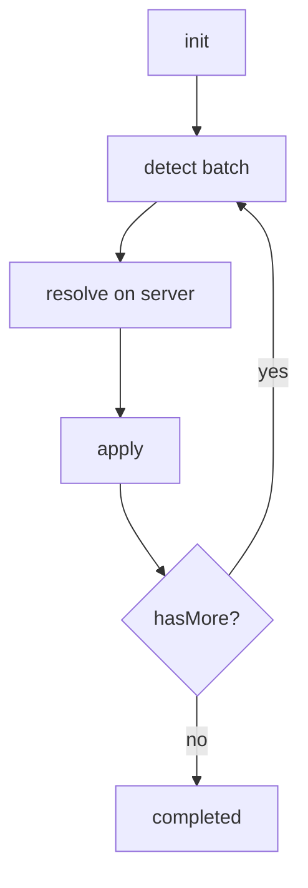
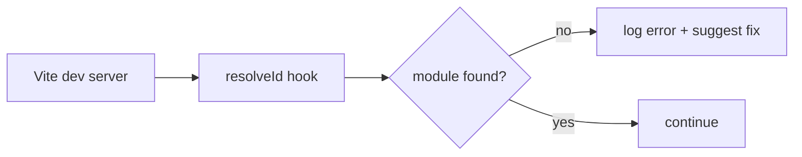

# fix-vue-imports: Alternative Methods

## Overview

This document describes alternative approaches to solving the Vue imports problem, each with different architecture and trade-offs.

---

## Method 1: fix-vue-imports (Current)

**Architecture:** Client-side execution, linear flow


**Characteristics:**
- All code runs on client
- Server only coordinates
- Single pass through all files
- No state persistence

---

## Method 2: fix-vue-imports-batch

**Architecture:** Server-side processing, batch mode



**Characteristics:**
- Heavy logic on server
- Batch processing (10 files at a time)
- State in context
- Can resume after pause

**See:** [fix-vue-imports-batch.md](fix-vue-imports-batch.md) (план). Definition: [definitions/fix-vue-imports-batch.md](../../a2a-server/src/actions/definitions/fix-vue-imports-batch.md)

---

## Method 3: fix-vue-imports-ast

**Architecture:** AST-based parsing, TypeScript Compiler API


**Key Features:**
- Uses TypeScript Language Service
- 100% accurate module resolution
- Native tsconfig.json support
- Type checking included

**Sub-actions:**

### 1. ast-create-program
Create TypeScript program with project config.

```typescript
import ts from 'typescript';

export default async function run(input: { 
  rootDir: string,
  tsconfigPath?: string 
}): Promise<{ 
  programCreated: boolean,
  sourceFiles: number 
}> {
  const configPath = ts.findConfigFile(
    input.rootDir, 
    ts.sys.fileExists, 
    input.tsconfigPath || 'tsconfig.json'
  );
  
  const { options } = ts.readConfigFile(configPath, ts.sys.readFile);
  const program = ts.createProgram({
    rootNames: [input.rootDir],
    options
  });
  
  return {
    programCreated: true,
    sourceFiles: program.getSourceFiles().length
  };
}
```

### 2. ast-detect-imports
Detect broken imports using TypeScript checker.

```typescript
import ts from 'typescript';

export default async function run(input: {
  program: ts.Program
}): Promise<{
  brokenImports: Array<{
    file: string,
    line: number,
    specifier: string,
    errorCode: number
  }>
}> {
  const broken: Array<any> = [];
  const checker = input.program.getTypeChecker();
  
  for (const sourceFile of input.program.getSourceFiles()) {
    if (sourceFile.isDeclarationFile) continue;
    
    ts.forEachChild(sourceFile, function visit(node) {
      if (ts.isImportDeclaration(node)) {
        const symbol = checker.getSymbolAtLocation(node.moduleSpecifier);
        if (!symbol) {
          const specifier = node.moduleSpecifier.getText();
          broken.push({
            file: sourceFile.fileName,
            line: sourceFile.getLineAndCharacterOfPosition(node.getStart()).line,
            specifier: specifier.slice(1, -1),
            errorCode: 2307 // Cannot find module
          });
        }
      }
      ts.forEachChild(node, visit);
    });
  }
  
  return { brokenImports: broken };
}
```

### 3. ast-get-fixes
Get suggested fixes from TypeScript.

```typescript
export default async function run(input: {
  brokenImports: Array<any>,
  program: ts.Program
}): Promise<{
  fixes: Array<{
    file: string,
    line: number,
    fix: string
  }>
}> {
  // TypeScript provides quick fixes for some import errors
  const fixes: Array<any> = [];
  
  // ... implementation using ts.CodeFixAction
  
  return { fixes };
}
```

**Pros:**
- Most accurate resolution
- Native tsconfig support
- Type safety

**Cons:**
- Requires TypeScript
- Slower on large projects
- More complex setup

---

## Method 4: fix-vue-imports-eslint

**Architecture:** ESLint-based detection and fixing


**Key Features:**
- Uses existing ESLint infrastructure
- IDE integration available
- Auto-fix support

**Sub-actions:**

### 1. eslint-check
Run ESLint with import rules.

```typescript
import { ESLint } from 'eslint';

export default async function run(input: {
  rootDir: string,
  rules?: string[]
}): Promise<{
  errors: Array<{
    file: string,
    line: number,
    ruleId: string,
    message: string
  }>
}> {
  const eslint = new ESLint({
    overrideConfig: {
      rules: {
        'import/no-unresolved': 'error',
        'import/no-useless-path-segments': 'warn'
      }
    }
  });
  
  const results = await eslint.lintFiles([input.rootDir]);
  
  const errors: Array<any> = [];
  for (const result of results) {
    for (const msg of result.messages) {
      if (msg.ruleId?.startsWith('import/')) {
        errors.push({
          file: result.filePath,
          line: msg.line,
          ruleId: msg.ruleId,
          message: msg.message
        });
      }
    }
  }
  
  return { errors };
}
```

### 2. eslint-fix
Apply ESLint auto-fixes.

```typescript
export default async function run(input: {
  rootDir: string,
  errors: Array<any>
}): Promise<{
  fixedFiles: string[]
}> {
  const eslint = new ESLint({
    fix: true,
    overrideConfig: {
      rules: {
        'import/no-unresolved': 'error'
      }
    }
  });
  
  const results = await eslint.lintFiles([input.rootDir]);
  await ESLint.outputFixes(results);
  
  return {
    fixedFiles: results
      .filter(r => r.output !== undefined)
      .map(r => r.filePath)
  };
}
```

**Pros:**
- Leverages existing tooling
- IDE support
- Configurable rules

**Cons:**
- Requires ESLint setup
- Not all rules auto-fix
- Additional dependency

---

## Method 5: fix-vue-imports-vite

**Architecture:** Vite plugin for dev-time detection



**Key Features:**
- Real-time detection during development
- Integrated with Vite's resolve system
- Uses Vite's alias configuration

**Plugin Code:**

```typescript
// vite-plugin-import-checker.ts
import type { Plugin } from 'vite';
import { resolve, dirname, relative } from 'path';
import { existsSync, readdirSync } from 'fs';

export function importCheckerPlugin(): Plugin {
  return {
    name: 'vite-plugin-import-checker',
    enforce: 'pre',
    
    resolveId(source, importer) {
      if (!importer || source.startsWith('\0')) return null;
      
      // Skip package imports
      if (!source.startsWith('.') && !source.startsWith('@/')) return null;
      
      // Try to resolve
      const basedir = dirname(importer);
      const fullPath = resolve(basedir, source);
      
      // Check if exists
      const exists = 
        existsSync(fullPath) ||
        existsSync(fullPath + '.ts') ||
        existsSync(fullPath + '.vue') ||
        existsSync(fullPath + '/index.ts');
      
      if (!exists) {
        // Find candidates
        const baseName = source.split('/').pop();
        const candidates = findCandidates(process.cwd(), baseName);
        
        if (candidates.length > 0) {
          console.warn(`\n[import-checker] Broken import in ${relative(process.cwd(), importer)}`);
          console.warn(`  ${source} not found`);
          console.warn(`  Did you mean:`);
          candidates.forEach(c => {
            const rel = relative(basedir, c).replace(/\\/g, '/');
            console.warn(`    import from './${rel.replace(/\.(ts|vue)$/, '')}'`);
          });
        }
      }
      
      return null; // Let Vite handle resolution
    }
  };
}

function findCandidates(root: string, baseName: string): string[] {
  const results: string[] = [];
  
  function walk(dir: string) {
    const entries = readdirSync(dir, { withFileTypes: true });
    for (const entry of entries) {
      const full = resolve(dir, entry.name);
      if (entry.name === 'node_modules') continue;
      if (entry.isDirectory()) walk(full);
      else if (entry.name.replace(/\.(ts|vue)$/, '') === baseName) {
        results.push(full);
      }
    }
  }
  
  walk(root);
  return results;
}
```

**Pros:**
- Real-time feedback
- Uses Vite's config
- No separate command needed

**Cons:**
- Only works with Vite
- Dev-time only
- No auto-fix

---

## Method 6: fix-vue-imports-codemod

**Architecture:** jscodeshift/ts-morph transformation


**Key Features:**
- Powerful AST transformations
- Good for mass migrations
- Precise code manipulation

**Using ts-morph:**

```typescript
import { Project, SourceFile, ImportDeclaration } from 'ts-morph';

export default async function run(input: {
  rootDir: string,
  dry?: boolean
}): Promise<{
  changes: Array<{
    file: string,
    oldImport: string,
    newImport: string
  }>
}> {
  const project = new Project({
    tsConfigFilePath: `${input.rootDir}/tsconfig.json`
  });
  
  const changes: Array<any> = [];
  
  for (const sourceFile of project.getSourceFiles()) {
    const imports = sourceFile.getImportDeclarations();
    
    for (const imp of imports) {
      const specifier = imp.getModuleSpecifierValue();
      
      if (specifier.startsWith('.')) {
        const resolved = resolveImport(sourceFile, specifier);
        
        if (resolved && resolved !== specifier) {
          changes.push({
            file: sourceFile.getFilePath(),
            oldImport: specifier,
            newImport: resolved
          });
          
          if (!input.dry) {
            imp.setModuleSpecifier(resolved);
          }
        }
      }
    }
  }
  
  if (!input.dry) {
    await project.save();
  }
  
  return { changes };
}

function resolveImport(sourceFile: SourceFile, specifier: string): string | null {
  // Implementation similar to current resolve logic
  // but with ts-morph's resolution system
  return null;
}
```

**Pros:**
- Precise transformations
- Good for migrations
- Dry-run mode built-in

**Cons:**
- Learning curve
- Separate tool
- Overkill for simple fixes

---

## Comparison Table

| Method | Accuracy | Speed | Auto-fix | Setup | Best For |
|--------|----------|-------|----------|-------|----------|
| Current (regex) | Medium | Fast | Yes | Simple | Quick fixes |
| Batch | Medium | Medium | Yes | Medium | Large projects |
| AST/TS | High | Slow | Partial | Complex | TS projects |
| ESLint | High | Medium | Partial | Medium | ESLint users |
| Vite Plugin | High | Real-time | No | Simple | Vite projects |
| Codemod | High | Medium | Yes | Complex | Migrations |

---

## Recommendation Matrix

| Scenario | Recommended Method |
|----------|-------------------|
| Quick fix for small project | Current (fix-vue-imports) |
| Large project with many files | Batch (fix-vue-imports-batch) |
| TypeScript project with tsconfig | AST (fix-vue-imports-ast) |
| Already using ESLint | ESLint (fix-vue-imports-eslint) |
| Vite project, want real-time | Vite Plugin |
| Mass migration/refactor | Codemod |

---

## Implementation Priority

1. **fix-vue-imports-batch** - Highest priority, adds server-side processing
2. **fix-vue-imports-ast** - For TypeScript accuracy
3. **fix-vue-imports-eslint** - For ESLint integration
4. **fix-vue-imports-vite** - For dev-time feedback
5. **fix-vue-imports-codemod** - For migrations

---

## Questions for Discussion

1. Which methods should be implemented first?
2. Should all methods share common utilities?
3. How to handle method selection in the system?
4. Need for a unified interface across methods?

---

## Todo List

- [ ] Choose priority method for implementation
- [ ] Implement fix-vue-imports-batch
- [ ] Add tests for batch method
- [ ] Implement fix-vue-imports-ast for TypeScript projects
- [ ] Document chosen approach