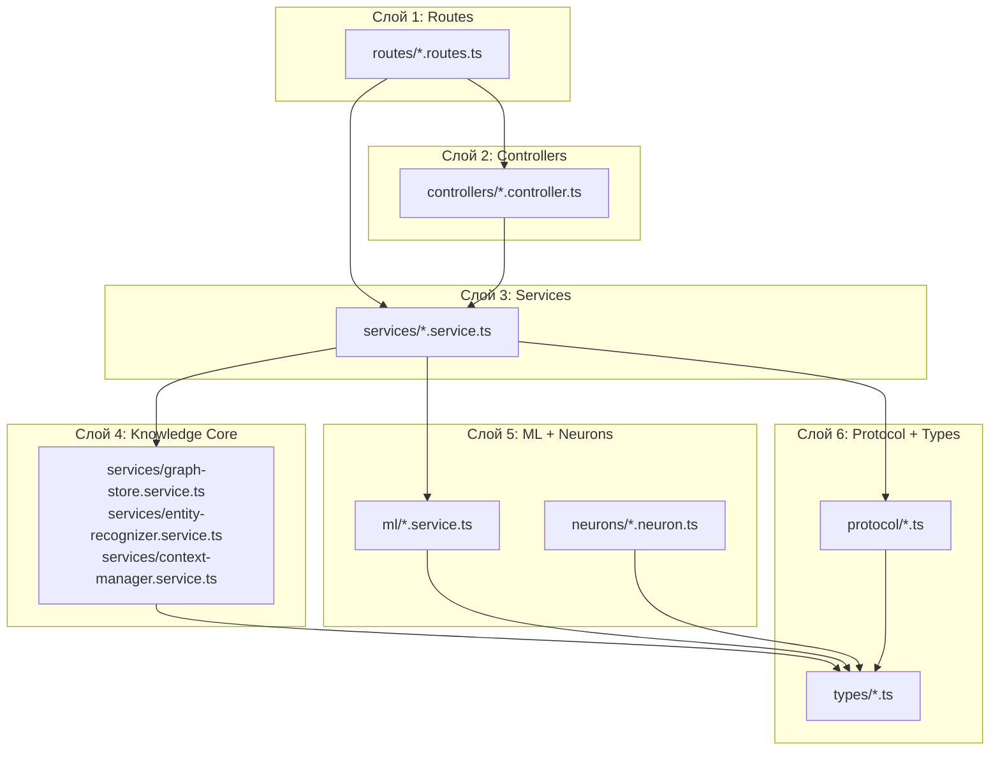
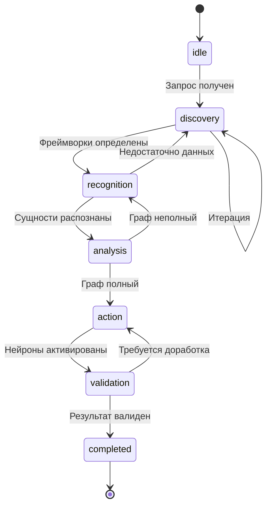

# Иерархия кода A2A Coding Orchestrator

> **Канонический документ:** структура репозитория, слои, правила зависимостей.
> **ADR:** [ADR 0023](adr/0023-code-hierarchy.md)

---

## Корень репозитория

```
a2a-coding-orchestrator/
├── a2a-server/          # Серверная часть (API, knowledge graph, neurons)
├── a2a-client/          # Клиентская часть (agent, api-client, rag, fs-utils)
├── docs/                # Документация
├── archive/             # Архив (plans, tasks, legacy)
├── scripts/             # Скрипты (questions-cli, generate-neurons)
├── AGENTS.md            # Текущие задачи для AI-агентов
├── DEV_PROJECT.json     # Dev-проект (websitestore)
└── package.json         # Root package (npm workspaces)
```

---

## a2a-server/src — Структура сервера

### Дерево каталогов

```
a2a-server/src/
├── index.ts                    # Entry point
├── app.ts                      # Express app setup
│
├── config/                     # Конфигурация
│   ├── index.ts                # Центральный конфиг
│   ├── database.ts             # PostgreSQL/Prisma
│   └── redis.ts                # Redis connection
│
├── routes/                     # API маршруты (слой 1)
│   ├── index.ts                # Router aggregation
│   ├── auth.routes.ts          # /api/v1/auth/*
│   ├── health.routes.ts        # /api/v1/health
│   ├── sessions.routes.ts      # /api/v1/sessions/*
│   └── requests.routes.ts      # /api/v1/requests/*
│
├── controllers/                # Контроллеры (слой 2)
│   └── auth.controller.ts      # Auth endpoints
│
├── middleware/                 # Middleware
│   ├── auth.middleware.ts      # JWT authentication
│   ├── error.middleware.ts     # Error handling
│   ├── rate-limiter.middleware.ts
│   └── validate.middleware.ts  # Request validation
│
├── services/                   # Сервисы (слой 3 — бизнес-логика)
│   ├── graph-store.service.ts      # Управление графом знаний
│   ├── entity-recognizer.service.ts # Распознавание сущностей
│   ├── context-manager.service.ts  # Управление контекстом
│   ├── request-processor.service.ts # Обработка запросов
│   ├── phase-machine.service.ts    # Машина фаз (idle→discovery→...→completed)
│   ├── neuron-activator.service.ts # Активация нейронов
│   ├── framework-extractor.service.ts # Извлечение фреймворков
│   ├── architectural-analyzer.service.ts
│   ├── session.service.ts
│   ├── request.service.ts
│   ├── message.service.ts
│   ├── auth.service.ts
│   ├── health.service.ts
│   ├── file-cache.service.ts
│   ├── git.service.ts
│   ├── llm-adapter.ts
│   ├── invoke.service.ts
│   ├── index-query.service.ts
│   └── session-context.service.ts
│
├── ml/                         # ML-сервисы (слой 4)
│   ├── plexe.client.ts         # Plexe API client
│   ├── embedding.service.ts    # Embeddings generation
│   ├── search.service.ts       # Semantic search
│   ├── indexer.service.ts      # Code indexing
│   └── tfidf.service.ts        # TF-IDF for sparse search
│
├── neurons/                    # Нейроны (слой 5 — анализ кода)
│   ├── index.ts                # Экспорт всех нейронов
│   ├── detect-*.neuron.ts      # Детекторы проблем (~60 шт)
│   ├── suggest-*.neuron.ts     # Рекомендации (~35 шт)
│   ├── apply-*.neuron.ts       # Автоматические исправления
│   └── generate-*.neuron.ts    # Генераторы кода
│
├── protocol/                   # Протокол A2A
│   ├── context-parser.ts       # Парсинг ContextBlock
│   ├── file-block-handler.ts   # Обработка FileBlock
│   └── message-builder.ts      # Формирование ответов
│
├── types/                      # TypeScript типы
│   ├── index.ts                # Protocol types (ContextBlock, Task, etc.)
│   ├── entity.types.ts         # Entity types (CodeBlock, RecognizedEntity)
│   ├── knowledge.types.ts      # Knowledge graph types (Neuron, etc.)
│   └── errors.ts               # Error types
│
├── repositories/               # Репозитории данных
│   ├── client.repository.ts    # Client CRUD
│   └── file.repository.ts      # File metadata
│
├── utils/                      # Утилиты
│   ├── logger.ts               # Winston logger
│   ├── crypto.ts               # Encryption utilities
│   └── validation.ts           # Validation helpers
│
└── websocket/                  # WebSocket (future)
    └── index.ts
```

---

## a2a-client/packages — Структура клиента

```
a2a-client/packages/
├── agent/                  # AI-агент для IDE
│   ├── src/
│   │   ├── index.js            # Главный entry point
│   │   ├── fs-reader.js        # Чтение файлов проекта
│   │   ├── git-ops.js          # Git операции
│   │   ├── card-manager.js     # Управление карточками
│   │   └── architectural-features.js
│   └── package.json
│
├── api-client/             # API клиент для сервера
│   ├── src/
│   │   ├── index.js            # Sync client
│   │   ├── async-client.js     # Async protocol (polling)
│   │   └── protocol.js         # Protocol helpers
│   └── package.json
│
├── fs-utils/               # Утилиты файловой системы
│   ├── src/
│   │   ├── index.js
│   │   ├── file-scanner.js     # Сканирование файлов
│   │   ├── glob-matcher.js     # Glob patterns
│   │   └── ignore-detector.js  # .gitignore, .ignore
│   └── package.json
│
└── rag/                    # RAG (Retrieval-Augmented Generation)
    ├── src/
    │   ├── index.js
    │   ├── indexer.js          # Индексация кода
    │   ├── searcher.js         # Поиск по индексу
    │   ├── chunk-manager.js    # Управление чанками
    │   └── tfidf.js            # TF-IDF implementation
    └── package.json
```

---

## Слои и правила зависимостей

### Диаграмма слоев



### Правила зависимостей

| Слой | Может импортировать | НЕ может импортировать |
|------|---------------------|------------------------|
| **routes** | controllers, services, middleware | neurons, ml, protocol |
| **controllers** | services, types | routes, neurons, ml |
| **services** | repositories, protocol, ml, types | routes, controllers |
| **knowledge** | types, utils | routes, controllers, app |
| **ml** | types, utils, config | routes, services (кроме config) |
| **neurons** | types | routes, controllers, services, ml |
| **protocol** | types | routes, controllers, services |
| **types** | — | всё (должен быть независим) |

### Ключевой принцип

> **Knowledge layer (graph-store, entity-recognizer, context-manager) не зависит от routes/controllers/app.**
> Это обеспечивает тестируемость и переиспользование из scripts.

---

## Соответствие кода и документации

| Документация | Код | Назначение |
|--------------|-----|------------|
| [protocol-json-api.md](protocol-json-api.md) | [`protocol/`](../a2a-server/src/protocol/), [`types/index.ts`](../a2a-server/src/types/index.ts) | JSON API формат |
| [flow-graph-requests.md](flow-graph-requests.md) | [`services/request-processor.service.ts`](../a2a-server/src/services/request-processor.service.ts), [`services/graph-store.service.ts`](../a2a-server/src/services/graph-store.service.ts) | Поток обработки запросов |
| [graph-local-config.md](graph-local-config.md) | [`services/context-manager.service.ts`](../a2a-server/src/services/context-manager.service.ts) | Локальная конфигурация графа |
| [neurons-and-paths-law.md](neurons-and-paths-law.md) | [`neurons/`](../a2a-server/src/neurons/), [`services/neuron-activator.service.ts`](../a2a-server/src/services/neuron-activator.service.ts) | Закон о нейронах |
| [etalon-neuron-activation.md](etalon-neuron-activation.md) | [`services/phase-machine.service.ts`](../a2a-server/src/services/phase-machine.service.ts) | Сценарии активации |
| [server-command-restrictions.md](server-command-restrictions.md) | [`services/invoke.service.ts`](../a2a-server/src/services/invoke.service.ts) | Ограничения команд |
| [a2a-client/docs/requirements.md](../a2a-client/docs/requirements.md) | [`a2a-client/packages/api-client/`](../a2a-client/packages/api-client/) | Протокол клиента |

---

## Нейроны — Классификация

### Типы нейронов

| Префикс | Назначение | Примеры |
|---------|------------|---------|
| `detect-*` | Обнаружение проблем | `detect-n1-queries`, `detect-sql-injection`, `detect-xss-vulnerabilities` |
| `suggest-*` | Рекомендации по исправлению | `suggest-eager-loading`, `suggest-validation-rules` |
| `apply-*` | Автоматические исправления | `apply-eager-loading`, `apply-form-request` |
| `generate-*` | Генерация кода | `generate-crud-module`, `generate-vue-component` |
| `analyze-*` | Анализ без изменений | `analyze-controller-size` |

### Категории по домену

| Домен | Нейроны |
|-------|---------|
| **Laravel/PHP** | `detect-n1-queries`, `detect-eloquent-*`, `detect-blade-*`, `suggest-form-request` |
| **Vue/Inertia** | `detect-vue-*`, `detect-inertia-*`, `suggest-composition-api` |
| **TypeScript** | `detect-typescript-*`, `generate-ts-types` |
| **Security** | `detect-xss-*`, `detect-sql-injection`, `detect-secrets-in-code`, `detect-auth-issues` |
| **Performance** | `detect-missing-indexes`, `detect-missing-lazy-loading`, `detect-memory-leak-patterns` |
| **Accessibility** | `detect-a11y-*`, `suggest-a11y-*` |
| **Testing** | `detect-missing-tests`, `generate-unit-tests`, `generate-e2e-tests` |
| **Tailwind** | `detect-tailwind-*`, `suggest-tailwind-*` |

---

## Машина фаз (Phase Machine)



| Фаза | Описание | Max итераций |
|------|----------|--------------|
| `idle` | Начальное состояние | 1 |
| `discovery` | Определение фреймворков | 3 |
| `recognition` | Распознавание сущностей | 5 |
| `analysis` | Проверка completeness | 3 |
| `action` | Активация нейронов | 2 |
| `validation` | Проверка результатов | 2 |
| `completed` | Завершение | 1 |

---

## Конвенции именования

| Паттерн | Пример | Описание |
|---------|--------|----------|
| `*.routes.ts` | `sessions.routes.ts` | API маршруты |
| `*.controller.ts` | `auth.controller.ts` | Контроллеры |
| `*.service.ts` | `graph-store.service.ts` | Сервисы |
| `*.neuron.ts` | `detect-n1-queries.neuron.ts` | Нейроны |
| `*.middleware.ts` | `auth.middleware.ts` | Middleware |
| `*.repository.ts` | `client.repository.ts` | Репозитории |
| `*.types.ts` | `entity.types.ts` | Типы |
| `kebab-case` | везде | Имена файлов |

---

## См. также

- [ADR 0023: Code hierarchy](adr/0023-code-hierarchy.md) — решение о каноническом документе
- [flow-graph-requests.md](flow-graph-requests.md) — поток обработки запросов
- [architecture-principles.md](architecture-principles.md) — принципы архитектуры
- [a2a-server/docs/entry-points.md](../a2a-server/docs/entry-points.md) — точки входа сервера
