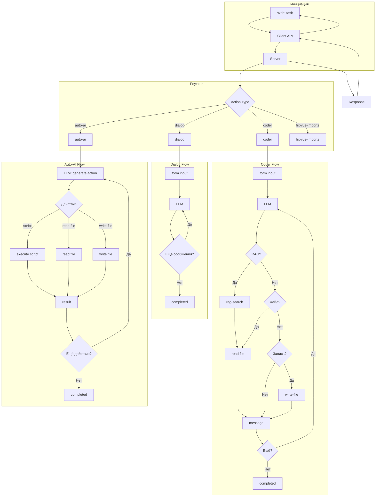

# Обзор симуляций и их этапов

## Доступные симуляции

| Симуляция | Тип | Шагов | Описание |
|-----------|-----|-------|----------|
| dialog | AI-Action | 4 | Простой диалог с LLM |
| coder | AI-Action | 10 | Диалог + файловые операции + RAG |
| auto-ai | AI-Action | 16 | AI генерация действий |
| analyze | AI-Action | - | Анализ проекта |
| fix-vue-imports | Action | - | Исправление Vue импортов |
| phpunit-deprecations | Action | - | Анализ deprecations |
| task-decomposition | AI-Action | - | Декомпозиция задачи |
| debug-dialog | AI-Action | - | Отладочный диалог |
| orchestrator-dialog | AI-Action | - | Оркестратор диалогов |
| init | Action | - | Инициализация |
| test-action-flow | Action | - | Тестирование потока действий |

---

## Сравнение структуры этапов

### Dialog (4 шага)

```
1. task="диалог" → form.choices [dialog, auto-ai, task-decomposition]
2. choice="dialog" → form.input [message]
3. message="hello" → message + form.input (LLM)
4. message="Дякую!" → completed
```

### Coder (10 шагов)

```
1. task="допомоги з кодом" → form.choices
2. choice="coder" → form.input [message]
3. message → rag-search
4. rag-search result → read-file
5. read-file result → message + form.input
6. message="спасибо" → write-file
7. write-file result → completed
8. (опционально) новый ввод → повтор
...
10. завершение
```

### Auto-AI (16 шагов)

```
1. task → form.choices
2. choice="auto-ai" → LLM генерирует действие
3. сгенерированное действие → выполнение
4-16. итерации выполнения и результатов
```

---

## Типы этапов по симуляциям

### Этапы в dialog

| Шаг | Action | Step | Execute | Result |
|-----|--------|------|---------|--------|
| 1 | task | new → router | form.choices | message: "диалог" |
| 2 | task | router → request | form.input | choice: "dialog" |
| 3 | dialog | request → request | message + form.input | message: "..." |
| 4 | dialog | request → completed | message + form.input | message: "Дякую!" |

### Этапы в coder

| Шаг | Action | Step | Execute | Result |
|-----|--------|------|---------|--------|
| 1 | task | new → router | form.choices | message: "допоможи..." |
| 2 | task | router → request | form.input | choice: "coder" |
| 3 | coder | request → request | rag-search | message: "шукаю..." |
| 4 | coder | request | read-file | rag-search result |
| 5 | coder | request | message + form.input | read-file result |
| 6 | coder | request | message + form.input | message: "запишу..." |
| 7 | coder | request | write-file | message + form.input |
| 8 | coder | request | message + form.input | write-file result |
| 9 | coder | request | message + form.input | message: "готово" |
| 10 | coder | request → completed | - | completed |

### Этапы в auto-ai

| Шаг | Action | Step | Execute | Result |
|-----|--------|------|---------|--------|
| 1 | task | new → router | form.choices | message: "..." |
| 2 | task | router → request | form.input | choice: "auto-ai" |
| 3-4 | auto-ai | request → llm-generate | form.input | message + action proposal |
| 5-6 | auto-ai | llm-generate → execute | execute.action | action result |
| ... | auto-ai | continue | - | - |
| 15-16 | auto-ai | complete | completed | - |

---

## Используемые типы действий

### Dialog
- form (choices, input)
- message

### Coder
- form (choices, input)
- message
- rag-search
- read-file
- write-file

### Auto-AI
- form (choices, input)
- message
- script
- rag-search
- read-file
- write-file
- execute-command

---

## Паттерны переходов

### Pattern 1: Router Flow
```
request (task) → response (form.choices) → request (choice) → response (form.input)
```

### Pattern 2: AI Dialog Loop
```
request (message) → LLM → response (message + form.input) → request (message) → ...
```

### Pattern 3: Action Execution
```
request → LLM (generate action) → response (execute.<action>) → request (result.<action>) → ...
```

### Pattern 4: Completion
```
request → LLM → response (step: "completed") → end
```

---

## Mermaid: Универсальная схема потока



---

## Сравнение реализации

| Компонент | Dialog | Coder | Auto-AI |
|-----------|--------|-------|---------|
| Сложность | Простая | Средняя | Высокая |
| LLM вызовы | 2+ | 5+ | 8+ |
| Файловые операции | Нет | Да | Да |
| RAG | Нет | Да | Да |
| Script | Нет | Нет | Да |

---

## References

- [simulations/dialog/description.md](../../simulations/dialog/description.md)
- [simulations/coder/description.md](../../simulations/coder/description.md)
- [simulations/auto-ai/description.md](../../simulations/auto-ai/description.md)
- [simulations/SCHEMA.md](../../simulations/SCHEMA.md)
