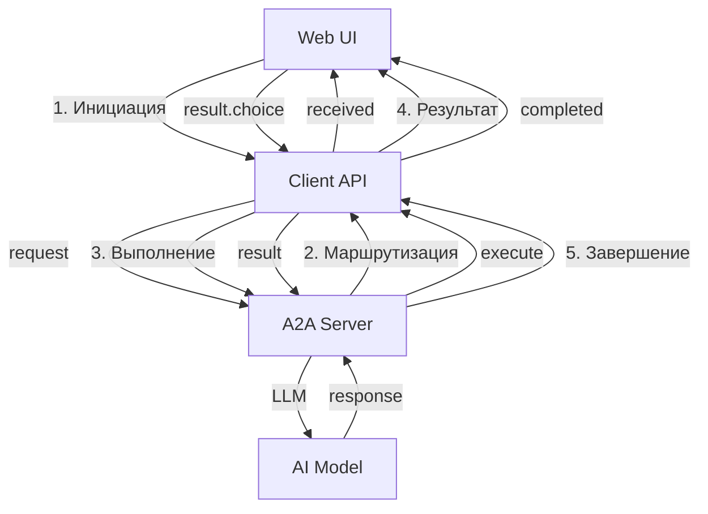

# Протокол обмена: Этапы

Документация по каждому этапу протокола A2A.

## Обзор этапов

| № | Этап | Направление | Описание |
|---|------|------------|----------|
| 1 | [Инициация](01-initiation.md) | Web → Client API | Первый запрос с задачей пользователя |
| 2 | [Маршрутизация](02-routing.md) | Server → Client → Web | Выбор доступных действий через форму |
| 3 | [Выполнение](03-execution.md) | Bidirectional | Выполнение действий сервером |
| 4 | [Результат](04-result.md) | Client → Server | Возврат результатов выполнения |
| 5 | [Завершение](05-completion.md) | Server → Client → Web | Финализация выполнения |

## Mermaid: Полный поток этапов

## Связанные документы

- [PROTOCOL.md](../PROTOCOL.md) - Основной протокол
- [SCHEMAS.md](../SCHEMAS.md) - JSON схемы
- [DATA-FLOW.md](../DATA-FLOW.md) - Диаграмма потока данных
- [simulations/SCHEMA.md](../../simulations/SCHEMA.md) - Схема симуляций
- [simulations/auto-ai/ACTIONS-MAP.md](../../simulations/auto-ai/ACTIONS-MAP.md) - Карта действий
