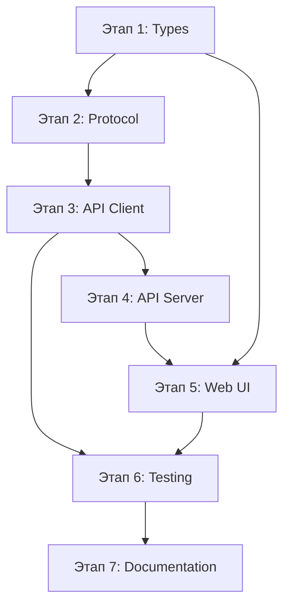

# План доработок a2a-client под новый протокол new-request-flow

## Обзор

Документ описывает план доработок пакетов `a2a-client` для полной поддержки нового протокола взаимодействия, определённого в [`docs/new-request-flow/`](docs/new-request-flow/).

### Ключевые изменения протокола

1. **Action-key shape** — все execute и result объекты должны использовать ключ с названием действия
2. **execute.form.choices** — первый ответ сервера с выбором действий вместо устаревшего `actions[]`
3. **Actions vs AI-Actions** — два типа действий с разной логикой выполнения

---

## TODO List

### Этап 1: Обновление типов (Types)

- [ ] **1.1** Обновить [`a2a-client/packages/types/src/index.ts`](a2a-client/packages/types/src/index.ts) — добавить типы для нового протокола
  - Добавить `Execute` type с action-key shape
  - Добавить `FormChoice`, `FormWithChoices` интерфейсы
  - Добавить `ServerResponse` union type (FormChoicesResponse, ExecuteResponse, CompletedResponse)
  - Обновить `Session` интерфейс согласно SCHEMAS.md
  - Добавить типы для `Context.execution` (action, step, status)

- [ ] **1.2** Обновить [`a2a-client/packages/api-client/src/types.js`](a2a-client/packages/api-client/src/types.js)
  - Обновить класс `Session` — добавить поля `context.execution`, `messages[]`, `exchangeLog[]`
  - Убрать устаревшие поля или пометить как deprecated
  - Добавить методы для работы с `execute.form.choices`

- [ ] **1.3** Обновить [`a2a-client/packages/types/src/action-types.ts`](a2a-client/packages/types/src/action-types.ts)
  - Добавить типы для всех action types: `script`, `read-file`, `write-file`, `rag-search`, `execute-command`, `form`, `message`

### Этап 2: Обновление протокола (Protocol)

- [ ] **2.1** Обновить [`a2a-client/packages/api-client/src/protocol.ts`](a2a-client/packages/api-client/src/protocol.ts)
  - Добавить функции для сериализации/парсинга `execute.form`
  - Обновить `serializeMessage` / `parseMessage` для новых форматов
  - Добавить辅助 функции для работы с action-key shape

### Этап 3: Обновление API Client

- [ ] **3.1** Обновить [`a2a-client/packages/api-client/src/async-client.ts`](a2a-client/packages/api-client/src/async-client.ts)
  - Добавить обработку `execute.form.choices` в первом ответе
  - Обновить PromisePoller для поддержки новых статусов
  - Добавить методы для отправки `result.choice` при выборе действия

- [ ] **3.2** Обновить [`a2a-client/packages/api-client/src/action-handler.ts`](a2a-client/packages/api-client/src/action-handler.ts)
  - Проверить соответствие action-key shape (уже реализовано ✓)
  - Добавить обработку `form` и `message` execute типов
  - Добавить логику Distinction между Actions и AI-Actions

### Этап 4: Обновление API Server (Client-side)

- [ ] **4.1** Обновить [`a2a-client/packages/api-server/src/index.ts`](a2a-client/packages/api-server/src/index.ts)
  - Обновить обработку `/api/v1/sessions` — возвращать новые форматы
  - Обновить SSE для передачи `execute.form.choices`
  - Добавить endpoint `/api/v1/sessions/:id/next` для отправки результатов
  - Обновить WebSocket для передачи новых форматов

- [ ] **4.2** Обновить [`a2a-client/packages/api-server/src/session-dto.ts`](a2a-client/packages/api-server/src/session-dto.ts)
  - Обновить `toSessionSummary` и `toSessionDetail` для новых форматов
  - Добавить преобразование `execute.form.choices` для UI

### Этап 5: Web UI интеграция

- [ ] **5.1** Обновить web компоненты для работы с новым протоколом
  - [`a2a-client/web/js/task-flow.js`](a2a-client/web/js/task-flow.js) — уже поддерживает `execute.form` ✓
  - [`a2a-client/web/js/session-manager.js`](a2a-client/web/js/session-manager.js) — добавить обработку `execute.form.choices`
  - [`a2a-client/web/js/components/ai-actions.js`](a2a-client/web/js/components/ai-actions.js) — проверить соответствие

### Этап 6: Тестирование

- [ ] **6.1** Обновить тесты в [`a2a-client/packages/api-client/tests/`](a2a-client/packages/api-client/tests/)
  - Добавить тесты для action-key shape
  - Добавить тесты для `execute.form.choices`
  - Обновить тесты протокола

- [ ] **6.2** Обновить E2E тесты в [`a2a-client/tests/e2e/`](a2a-client/tests/e2e/)
  - Обновить `action-progress.spec.ts` для новых форматов
  - Обновить `complete-workflow.spec.ts`

### Этап 7: Документация

- [ ] **7.1** Обновить README файлы пакетов
  - [`a2a-client/packages/api-client/README.md`](a2a-client/packages/api-client/README.md)
  - [`a2a-client/packages/api-server/README.md`](a2a-client/packages/api-server/README.md)

---

## Детали реализации

### Action-key shape формат

```typescript
// Execute (Client → Server)
{ execute: { "script": { code: "...", input: {} } } }
{ execute: { "read-file": { path: "..." } } }
{ execute: { "form": { choices: [...] } } }

// Result (Client → Server)
{ result: { "script": { output: "..." } } }
{ result: { "read-file": { content: "..." } } }
{ result: { "choice": "fix-vue-imports" } }
```

### Первый ответ сервера (execute.form.choices)

```typescript
{
  context: { session_id: "sess_xxx", task: "..." },
  execute: {
    form: {
      title: "Оберіть спосіб виконання",
      choices: [
        { id: "fix-vue-imports", label: "Виправити імпорти" },
        { id: "auto-ai", label: "AI Action Generator" }
      ]
    }
  }
}
```

### Поток выполнения

```
Web → Client API: POST /api/v1/sessions { task: "..." }
         ↓
Client API → Server: POST /api/v1/invoke { task: "..." }
         ↓
Server → Client API: { context, execute: { form: { choices } } }
         ↓
Client API → Web: SSE с execute.form.choices
         ↓
Пользователь выбирает действие
         ↓
Web → Client API: POST /api/v1/sessions/:id/next { result: { choice: "..." } }
         ↓
Client API → Server: POST /api/v1/invoke { context, result: { choice: "..." } }
         ↓
Server → Client API: { context, execute: { "script": { ... } } }
         ↓
...выполнение шагов...
```

---

## Зависимости между этапами



---

## Файлы для изменения

| Файл | Изменения |
|------|-----------|
| `packages/types/src/index.ts` | Новые типы протокола |
| `packages/types/src/action-types.ts` | Типы действий |
| `packages/api-client/src/types.js` | Класс Session |
| `packages/api-client/src/protocol.ts` | Сериализация/парсинг |
| `packages/api-client/src/async-client.ts` | HTTP клиент |
| `packages/api-client/src/action-handler.ts` | Обработка действий |
| `packages/api-server/src/index.ts` | REST API |
| `packages/api-server/src/session-dto.ts` | DTO преобразования |
| `web/js/task-flow.js` | UI обработка |
| `web/js/session-manager.js` | UI сессии |

---

## Приоритеты

1. **Высокий**: Types, Protocol, API Client — основа работы
2. **Средний**: API Server — интеграция с сервером
3. **Средний**: Web UI — пользовательский интерфейс
4. **Низкий**: Тесты, Documentation — поддержка
