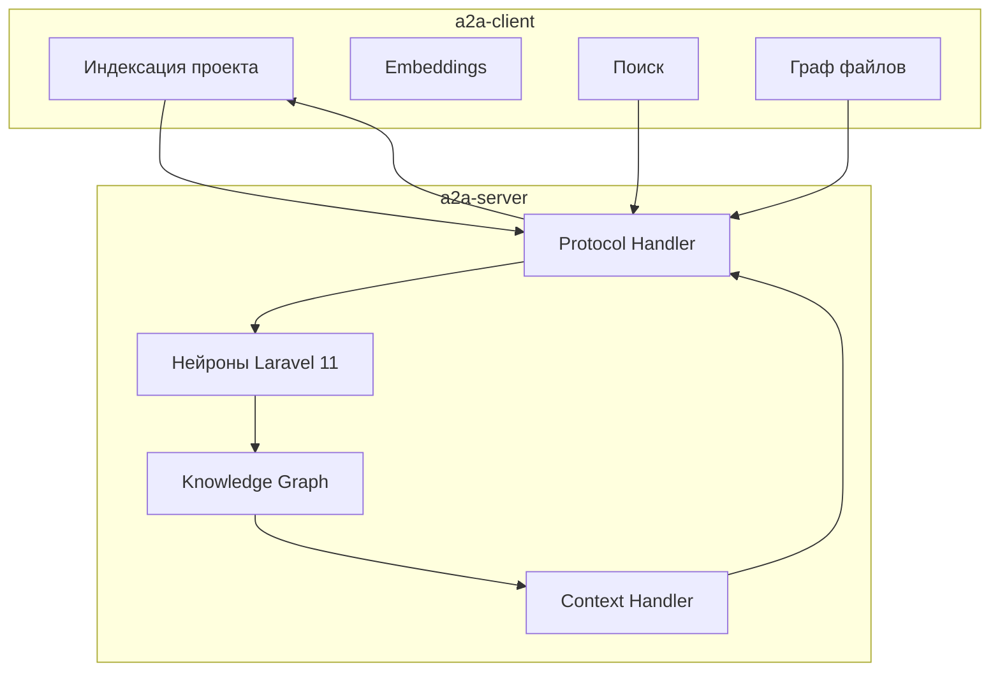
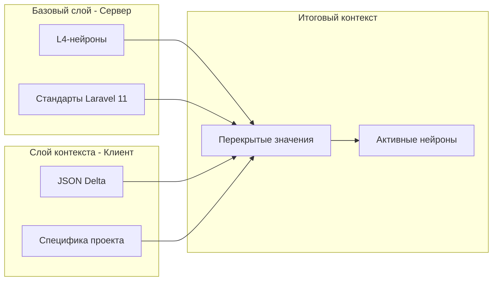

# План разделения ML и Knowledge Graph

## Обзор

Документ описывает чёткое разделение между **a2a-client** (индексация, поиск, embeddings) и **a2a-server** (нейроны, Knowledge Graph, обработка контекста).

**Ключевое понимание:**
- **a2a-client** — индексирует проект, хранит файлы, выполняет поиск
- **a2a-server** — "допрашивает" клиент, управляет нейронами, формирует context block

---

## 1. Разделение ответственности

### a2a-client (уже существует)

| Пакет | Ответственность |
|-------|-----------------|
| `packages/agent` | Работа с файлами, git операции |
| `packages/fs-utils` | Сканирование файлов, ignore-детектор |
| `packages/fulltext` | Полнотекстовый поиск и индексация |
| `packages/graph` | Граф (builder, manager, searcher) |
| `packages/hybrid-search` | Гибридный поиск |
| `packages/rag` | RAG — индексация, чанки, поиск |

### a2a-server (создаётся)

| Компонент | Ответственность |
|-----------|-----------------|
| **Нейроны** | Хранение базовых знаний Laravel 11 (ДНК) |
| **Knowledge Graph** | Идентификация сущностей и связей |
| **Context Handler** | Формирование context block для клиента |
| **Protocol Handler** | Обмен сообщениями с клиентом |

---

## 2. Архитектура взаимодействия



**Поток:**
1. Клиент индексирует проект → отправляет структуру на сервер
2. Сервер активирует нейроны по триггерам
3. Knowledge Graph строит связи между сущностями
4. Context Handler формирует context block
5. Клиент получает context block с активными нейронами

---

## 3. Слоёная архитектура контекста



**Принцип Shadowing (Перекрытия):**
- Базовый слой (L4-нейроны): Стандарты Laravel 11
- Слой контекста (JSON): Только дельта — специфика проекта
- Если в JSON есть ключ — он перекрывает стандарт

---

## 4. Структура a2a-server

```
a2a-server/src/
├── index.ts
├── app.ts
├── config/
├── controllers/
├── middleware/
├── routes/
├── types/
│
├── protocol/              # Протокол общения с клиентом
│   ├── context-parser.ts  # Парсинг context block
│   ├── file-block-handler.ts
│   └── message-builder.ts # Формирование ответов
│
├── knowledge/             # Knowledge Graph + Нейроны
│   ├── index.ts
│   ├── neurons/           # Нейроны (ДНК Laravel 11)
│   │   ├── index.ts
│   │   ├── neuron.types.ts
│   │   ├── neuron-store.ts
│   │   ├── neuron-activator.ts
│   │   └── base/
│   │       ├── validation.neuron.ts
│   │       ├── auth.neuron.ts
│   │       ├── eloquent.neuron.ts
│   │       └── routing.neuron.ts
│   ├── entity-recognizer.ts
│   ├── relation-mapper.ts
│   ├── graph-store.ts
│   └── context-handler.ts  # Формирование context block
│
├── ml/                    # ML-заглушки (если понадобятся)
│   └── ...
│
├── queue/
└── websocket/
```

---

## 5. Структура нейрона

```typescript
interface Neuron {
  id: string;
  name: string;
  category: NeuronCategory;
  
  // Triggers — паттерны активации
  triggers: string[];
  
  // Knowledge — стандартные значения Laravel
  knowledge: {
    entities: string[];
    relations: string[];
    description: string;
  };
  
  // Actions — инъекции в контекст
  actions?: NeuronAction[];
  
  // Contracts — ожидаемые методы/свойства
  contracts?: NeuronContract[];
  
  // Store — стандартные значения (пути, конвенции)
  store?: Record<string, unknown>;
}
```

**Пример нейрона project-detector:**
```json
{
  "id": "neuron-project-detector",
  "name": "Project Detector",
  "category": "architecture",
  "triggers": ["composer.json", "laravel/framework"],
  "knowledge": {
    "entities": ["composer.json", "package.json"],
    "relations": [],
    "description": "Определяет тип проекта"
  },
  "actions": [
    {
      "type": "inject",
      "target": "neuron-context-laravel-11"
    }
  ],
  "store": {
    "paths": {
      "models": "app/Models/",
      "controllers": "app/Http/Controllers/",
      "views": "resources/views/"
    },
    "stack": ["laravel", "inertia", "vue", "tailwind"]
  }
}
```

---

## 6. Что обучается

### На сервере (нейроны)
- **Пополняются** через вопросы пользователю
- **Активируются** по триггерам из входящего контекста
- **Расширяются** через createNeuronFromUnknown

### На клиенте (ML)
- **Embeddings** — обучаются на коде проекта
- **Search Ranking** — обучается через feedback
- **Индексация** — пополняется при изменении файлов

---

## 7. Следующие шаги

1. [ ] Удалить ML-компоненты из a2a-server (они в a2a-client)
2. [ ] Создать папку `src/knowledge/neurons/`
3. [ ] Реализовать `neuron.types.ts`
4. [ ] Реализовать `neuron-store.ts`
5. [ ] Реализовать `neuron-activator.ts`
6. [ ] Создать базовые нейроны Laravel 11
7. [ ] Реализовать `context-handler.ts`
8. [ ] Обновить протокол общения с клиентом

---

**Статус:** План обновлён  
**Дата:** 2026-02-20
