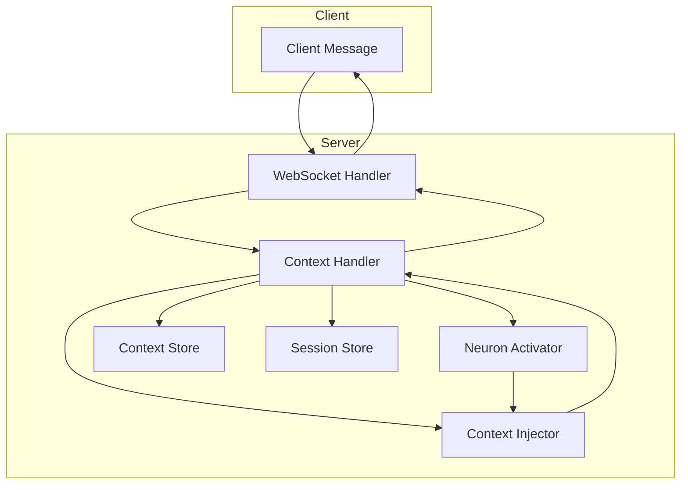
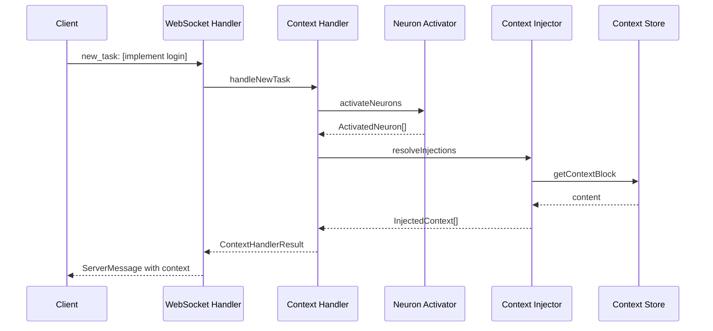
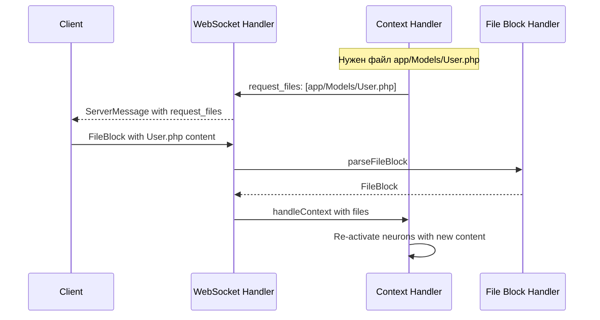

# A2A Server — Context Handler Implementation Plan

## Обзор

**Context Handler** — центральный компонент сервера, отвечающий за:
1. Формирование контекста для клиента на основе активных нейронов
2. Обработку протокола A2A (ContextBlock, FileBlock, Messages)
3. Управление сессиями и задачами

---

## Текущее состояние

### Уже реализовано

| Компонент | Файл | Статус |
|-----------|------|--------|
| Context Store | [`context-store.ts`](a2a-server/src/knowledge/context-store.ts) | ✅ Готов |
| Context Injector | [`context-injector.ts`](a2a-server/src/knowledge/context-injector.ts) | ✅ Готов |
| Neuron Activator | [`neuron-activator.ts`](a2a-server/src/knowledge/neurons/neuron-activator.ts) | ✅ Готов |
| Neuron Store | [`neuron-store.ts`](a2a-server/src/knowledge/neurons/neuron-store.ts) | ✅ Готов |
| Neuron Types | [`neuron.types.ts`](a2a-server/src/knowledge/neurons/neuron.types.ts) | ✅ Готов |
| Base Neurons | [`neurons/base/*.ts`](a2a-server/src/knowledge/neurons/base/) | ✅ Готов |

### Требует реализации (TODO заглушки)

| Компонент | Файл | Функций |
|-----------|------|---------|
| Context Parser | [`context-parser.ts`](a2a-server/src/protocol/context-parser.ts) | 11 функций |
| Message Builder | [`message-builder.ts`](a2a-server/src/protocol/message-builder.ts) | 12 функций |
| File Block Handler | [`file-block-handler.ts`](a2a-server/src/protocol/file-block-handler.ts) | 11 функций |

---

## Архитектура Context Handler



---

## Компоненты для реализации

### 1. Context Parser — [`context-parser.ts`](a2a-server/src/protocol/context-parser.ts)

**Ответственность:** Парсинг и валидация ContextBlock от клиента

```typescript
// Основные функции:

// Парсинг входящего ContextBlock
function parseContextBlock(data: unknown): ContextBlock

// Валидация структуры
function validateContextBlock(context: unknown): { valid: boolean; errors: string[] }

// Извлечение new_task
function extractNewTask(context: ContextBlock): string[] | null

// Парсинг задач
function parseTasks(context: ContextBlock): Task[]

// Проверка флагов continue/confirm
function hasContinueFlag(context: ContextBlock): boolean
function hasConfirmFlag(context: ContextBlock): boolean

// Извлечение запрошенных файлов
function extractRequestedFiles(context: ContextBlock): string[] | null

// Создание начального контекста
function createInitialContext(sessionId: string): ContextBlock

// Обновление прогресса задач
function updateTaskProgress(context: ContextBlock, taskId: string, progress: number, status: TaskStatus): ContextBlock
```

**Логика валидации ContextBlock:**
```
ContextBlock:
  version: '1.0'           — обязательное, должно быть '1.0'
  session_id: string       — обязательное, непустой string
  new_task?: string[]      — опциональное, массив строк
  architectural_features?: string[] — опциональное
  continue?: boolean       — опциональное
  tasks?: Task[]           — опциональное, массив Task
  request_files?: string[] — опциональное
  confirm?: boolean        — опциональное
  errors?: ProtocolError[] — опциональное
```

---

### 2. Message Builder — [`message-builder.ts`](a2a-server/src/protocol/message-builder.ts)

**Ответственность:** Построение сообщений по протоколу A2A

```typescript
// Основные функции:

// Построение client message
function buildClientMessage(context: ContextBlock, files?: FileBlock[]): ClientMessage

// Построение server message
function buildServerMessage(context: ContextBlock, options?: { files?: FileBlock[]; message?: string }): ServerMessage

// Построение new_task message
function buildNewTaskMessage(sessionId: string, tasks: string[], architecturalFeatures?: string[]): ClientMessage

// Построение continue/confirm messages
function buildContinueMessage(sessionId: string): ClientMessage
function buildConfirmMessage(sessionId: string): ClientMessage

// Построение file request/response
function buildFileRequestMessage(sessionId: string, paths: string[]): ServerMessage
function buildFileResponseMessage(sessionId: string, files: FileBlock[], context: ContextBlock): ClientMessage

// Построение task progress message
function buildTaskProgressMessage(sessionId: string, taskId: string, progress: number, status: string): ServerMessage

// Построение error message
function buildErrorMessage(sessionId: string, code: string, message: string, file?: string, line?: number): ServerMessage

// Построение session complete message
function buildSessionCompleteMessage(sessionId: string, summary: string): ServerMessage

// Сериализация/парсинг
function serializeMessage(message: ClientMessage | ServerMessage): string
function parseMessage(data: string): ClientMessage | ServerMessage
function validateMessage(message: unknown): { valid: boolean; errors: string[] }
```

---

### 3. File Block Handler — [`file-block-handler.ts`](a2a-server/src/protocol/file-block-handler.ts)

**Ответственность:** Работа с файловыми блоками

```typescript
// Основные функции:

// Парсинг file block
function parseFileBlock(data: unknown): FileBlock
function parseFileBlocks(data: unknown[]): FileBlock[]

// Валидация
function validateFileBlock(block: unknown): { valid: boolean; errors: string[] }

// Создание
function createFileBlock(path: string, content: string, options?: { startLine?: number; endLine?: number }): FileBlock
function createFileBlockRequest(path: string, startLine?: number, endLine?: number): FileBlockRequest

// Извлечение строк
function extractLines(block: FileBlock, startLine: number, endLine: number): string

// Чанкинг для больших файлов
function chunkFile(content: string, maxLines: number): Array<{ startLine: number; endLine: number; content: string }>

// Слияние блоков
function mergeFileBlocks(blocks: FileBlock[]): FileBlock

// Diff операции
function diffFileBlocks(original: FileBlock, modified: FileBlock): DiffResult
function applyDiff(block: FileBlock, diff: DiffChange[]): FileBlock

// Сериализация
function serializeFileBlock(block: FileBlock): string

// Определение языка
function detectLanguage(path: string): string
```

**Маппинг расширений → язык:**
```typescript
const LANGUAGE_MAP: Record<string, string> = {
  '.php': 'php',
  '.vue': 'vue',
  '.js': 'javascript',
  '.ts': 'typescript',
  '.blade.php': 'blade',
  '.json': 'json',
  '.md': 'markdown',
  '.css': 'css',
  '.scss': 'scss',
};
```

---

### 4. Context Handler — НОВЫЙ ФАЙЛ [`context-handler.ts`](a2a-server/src/knowledge/context-handler.ts)

**Ответственность:** Главный оркестратор формирования контекста

```typescript
import { activateNeurons } from './neurons/neuron-activator.js';
import { resolveInjections, mergeInjectedContext } from './context-injector.js';
import { getContextBlock, registerContextBlock } from './context-store.js';
import type { ContextBlock, FileBlock, Task } from '../types/index.js';
import type { ActivationContext, ActivatedNeuron } from './neurons/neuron.types.js';

export interface ContextHandlerResult {
  context: ContextBlock;
  injectedContent: string;
  activatedNeurons: ActivatedNeuron[];
  requestedFiles?: string[];
}

export interface SessionContext {
  context: ContextBlock;
  activatedNeurons: ActivatedNeuron[];
  history: ContextBlock[];
}

/**
 * Обработать входящий контекст от клиента
 */
export function handleContext(
  sessionContext: SessionContext,
  incomingContext: ContextBlock,
  files?: FileBlock[]
): ContextHandlerResult {
  // 1. Merge входящего контекста с существующим
  // 2. Активировать нейроны на основе файлов
  // 3. Резолвить @INJECT действия
  // 4. Вернуть результат
}

/**
 * Обработать new_task от клиента
 */
export function handleNewTask(
  sessionContext: SessionContext,
  tasks: string[],
  architecturalFeatures?: string[]
): ContextHandlerResult {
  // 1. Создать Task объекты
  // 2. Активировать нейроны по триггерам задач
  // 3. Резолвить инъекции
  // 4. Вернуть контекст с задачами
}

/**
 * Запросить файлы у клиента
 */
export function requestFiles(
  sessionContext: SessionContext,
  paths: string[]
): ContextBlock {
  // Вернуть контекст с request_files
}

/**
 * Подтвердить выполнение
 */
export function confirmAction(
  sessionContext: SessionContext
): ContextHandlerResult {
  // Обработать confirm флаг
}

/**
 * Продолжить выполнение
 */
export function continueExecution(
  sessionContext: SessionContext
): ContextHandlerResult {
  // Обработать continue флаг
}

/**
 * Shadowing — перекрытие стандартов проекта
 */
export function applyShadowing(
  projectStandards: Record<string, string>,
  neuronDefaults: Record<string, string>
): Record<string, string> {
  // Проектные стандарты перекрывают нейронные defaults
  return { ...neuronDefaults, ...projectStandards };
}

/**
 * Восстановить последовательность активных нейронов
 */
export function restoreNeuronSequence(
  sessionContext: SessionContext
): ActivatedNeuron[] {
  // Извлечь из истории сессии
}
```

---

## Flow обработки new_task



---

## Flow обработки request_files



---

## Интеграция с WebSocket

Обновить [`session.handler.ts`](a2a-server/src/websocket/handlers/session.handler.ts):

```typescript
import { handleContext, handleNewTask, requestFiles } from '../../knowledge/context-handler.js';

// В обработчике сообщения
async function handleMessage(ws: WebSocket, data: ClientMessage) {
  const sessionContext = getSessionContext(data.context.session_id);
  
  if (data.context.new_task) {
    const result = handleNewTask(sessionContext, data.context.new_task);
    // Отправить результат клиенту
  }
  
  if (data.context.continue) {
    const result = continueExecution(sessionContext);
  }
  
  if (data.files) {
    const result = handleContext(sessionContext, data.context, data.files);
  }
}
```

---

## План реализации

### Фаза 1: Protocol Layer (базовые функции)

1. **context-parser.ts**
   - [ ] `parseContextBlock` — парсинг с валидацией
   - [ ] `validateContextBlock` — проверка структуры
   - [ ] `createInitialContext` — создание начального контекста
   - [ ] `extractNewTask`, `extractRequestedFiles`
   - [ ] `hasContinueFlag`, `hasConfirmFlag`
   - [ ] `parseTasks`, `updateTaskProgress`
   - [ ] `addErrorToContext`, `serializeContext`

2. **message-builder.ts**
   - [ ] `buildClientMessage`, `buildServerMessage`
   - [ ] `buildNewTaskMessage`, `buildContinueMessage`, `buildConfirmMessage`
   - [ ] `buildFileRequestMessage`, `buildFileResponseMessage`
   - [ ] `buildTaskProgressMessage`, `buildErrorMessage`
   - [ ] `buildSessionCompleteMessage`
   - [ ] `serializeMessage`, `parseMessage`, `validateMessage`

3. **file-block-handler.ts**
   - [ ] `parseFileBlock`, `parseFileBlocks`, `validateFileBlock`
   - [ ] `createFileBlock`, `createFileBlockRequest`
   - [ ] `extractLines`, `chunkFile`, `mergeFileBlocks`
   - [ ] `diffFileBlocks`, `applyDiff`
   - [ ] `serializeFileBlock`, `detectLanguage`

### Фаза 2: Context Handler

4. **context-handler.ts** (новый файл)
   - [ ] `handleContext` — главная функция обработки
   - [ ] `handleNewTask` — обработка новых задач
   - [ ] `requestFiles` — запрос файлов у клиента
   - [ ] `confirmAction`, `continueExecution`
   - [ ] `applyShadowing` — перекрытие стандартов
   - [ ] `restoreNeuronSequence` — восстановление нейронов

### Фаза 3: Интеграция

5. **WebSocket Integration**
   - [ ] Обновить `session.handler.ts`
   - [ ] Добавить обработку всех типов сообщений
   - [ ] Интегрировать с session store

6. **Тесты**
   - [ ] Unit тесты для context-parser
   - [ ] Unit тесты для message-builder
   - [ ] Unit тесты для file-block-handler
   - [ ] Unit тесты для context-handler
   - [ ] Integration тесты для WebSocket flow

---

## Критерии приёмки

1. **Protocol Layer**
   - Все функции реализованы без TODO заглушек
   - Валидация работает корректно
   - Сериализация/десериализация без потерь

2. **Context Handler**
   - Нейроны активируются по триггерам
   - @INJECT действия резолвятся
   - Shadowing работает
   - История сессии сохраняется

3. **Интеграция**
   - WebSocket обрабатывает все типы сообщений
   - new_task создаёт задачи
   - request_files запрашивает файлы
   - continue/confirm работают

4. **Тесты**
   - Покрытие > 80%
   - Все edge cases покрыты
   - Integration тесты проходят

---

**Дата создания:** 2026-02-20
