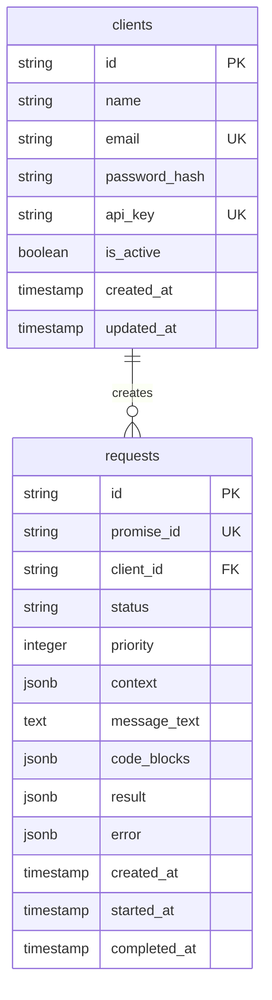

# A2A Server Database Schema

## Обзор

Схема базы данных PostgreSQL для серверной части A2A системы.

**Target architecture:** async-protocol — сервер минималистичный, только requests. Projects и Sessions хранятся на клиенте в `.a2a` папке проекта.

**Database:** PostgreSQL 16

---

## 1. Client data (не на сервере)

| Данные | Где хранятся |
|--------|---------------|
| **Projects** | `.a2a-client/projects.json` (id, name, path) |
| **Sessions** | `.a2a/sessions/*.json` в папке проекта |
| **Messages** | внутри session JSON |

Источник: `a2a-client/vite-plugin-a2a.js`, `plans/async-protocol-change.md`

---

## 2. ER Diagram (target — только сервер)



**session_id** в context — опциональная строка от клиента, сервер не валидирует и не связывает с таблицей.

---

## 3. Prisma Schema (target)

```prisma
model Client {
  id           String   @id
  name         String
  email        String   @unique
  passwordHash String   @map("password_hash")
  apiKey       String   @unique @map("api_key")
  isActive     Boolean  @default(true) @map("is_active")
  createdAt    DateTime @default(now()) @map("created_at")
  updatedAt    DateTime @updatedAt @map("updated_at")
  requests     Request[]
  @@map("clients")
}

model Request {
  id          String   @id
  promiseId   String   @unique @map("promise_id")
  clientId    String   @map("client_id")
  status      RequestStatus @default(pending)
  priority    Int      @default(0)
  context     Json
  message     String?  @map("message_text")
  codeBlocks  Json?    @map("code_blocks")
  result      Json?
  error       Json?
  createdAt   DateTime @default(now()) @map("created_at")
  startedAt   DateTime? @map("started_at")
  completedAt DateTime? @map("completed_at")
  client      Client   @relation(fields: [clientId], references: [id])
  @@index([status, priority, createdAt])
  @@index([clientId])
  @@map("requests")
}
```

---

## 4. SQL Migration (target)

```sql
-- clients
CREATE TABLE clients (
    id TEXT PRIMARY KEY,
    name VARCHAR(255) NOT NULL,
    email VARCHAR(255) UNIQUE NOT NULL,
    password_hash VARCHAR(255) NOT NULL,
    api_key VARCHAR(255) UNIQUE NOT NULL,
    is_active BOOLEAN DEFAULT true,
    created_at TIMESTAMP DEFAULT NOW(),
    updated_at TIMESTAMP DEFAULT NOW()
);

-- requests (единственная бизнес-таблица)
CREATE TABLE requests (
    id TEXT PRIMARY KEY,
    promise_id TEXT UNIQUE NOT NULL,
    client_id TEXT NOT NULL REFERENCES clients(id),
    status TEXT DEFAULT 'pending',
    priority INTEGER DEFAULT 0,
    context JSONB NOT NULL,
    message_text TEXT,
    code_blocks JSONB,
    result JSONB,
    error JSONB,
    created_at TIMESTAMP DEFAULT NOW(),
    started_at TIMESTAMP,
    completed_at TIMESTAMP
);

CREATE INDEX requests_status_idx ON requests(status);
CREATE INDEX requests_client_idx ON requests(client_id);
CREATE INDEX requests_promise_idx ON requests(promise_id);
```

---

## 5. Полезные запросы

```sql
-- Очередь pending
SELECT * FROM requests WHERE status = 'pending' ORDER BY priority DESC, created_at LIMIT 10;

-- Статус по promise_id
SELECT promise_id, status, created_at, completed_at FROM requests WHERE promise_id = $1;
```

---

## 6. Client flow (reference)

1. Projects/Sessions — в `.a2a` (vite-plugin `/api/a2a`)
2. POST /api/v1/requests → promiseId
3. Poll GET /api/v1/requests/:promiseId/status
4. GET /api/v1/requests/:promiseId/result при completed

---

## 7. Текущая реализация vs target

| | Target (async-protocol) | Текущий schema.prisma |
|--|------------------------|------------------------|
| Projects | На клиенте | Есть в DB |
| Sessions | На клиенте (.a2a) | Есть в DB |
| Requests | Единственная бизнес-таблица | Есть + session_id FK |

Миграция к target: удалить sessions.routes, session.service, message.service; переключить клиент на Storage (api/a2a) для сессий.

---

**Версия:** 1.2  
**Дата:** 2026-02-20
