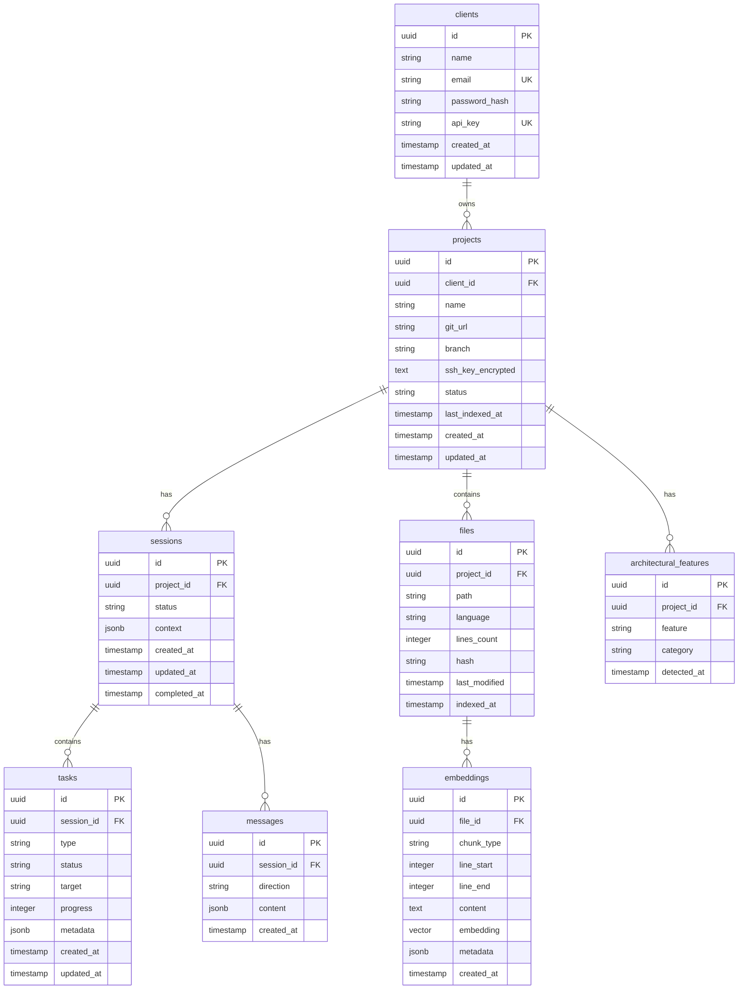

# A2A Server Database Schema

## Обзор

Схема базы данных PostgreSQL для серверной части A2A системы.

**Database:** PostgreSQL 16 + pgvector extension

---

## 1. ER Diagram



---

## 2. Prisma Schema

```prisma
// prisma/schema.prisma

generator client {
  provider = "prisma-client-js"
}

datasource db {
  provider = "postgresql"
  url      = env("DATABASE_URL")
}

// Extensions
// CREATE EXTENSION IF NOT EXISTS vector;

// ============================================
// Client Management
// ============================================

model Client {
  id            String    @id @default(uuid())
  name          String
  email         String    @unique
  passwordHash  String    @map("password_hash")
  apiKey        String    @unique @map("api_key")
  isActive      Boolean   @default(true) @map("is_active")
  createdAt     DateTime  @default(now()) @map("created_at")
  updatedAt     DateTime  @updatedAt @map("updated_at")
  
  projects      Project[]
  
  @@map("clients")
}

// ============================================
// Project Management
// ============================================

enum ProjectStatus {
  PENDING_CLONE
  CLONING
  PENDING_INDEXING
  INDEXING
  INDEXED
  ERROR
}

model Project {
  id                String          @id @default(uuid())
  clientId          String          @map("client_id")
  name              String
  description       String?
  gitUrl            String          @map("git_url")
  branch            String          @default("main")
  sshKeyEncrypted   String?         @map("ssh_key_encrypted")
  status            ProjectStatus   @default(PENDING_CLONE)
  lastIndexedAt     DateTime?       @map("last_indexed_at")
  indexingProgress  Int             @default(0) @map("indexing_progress")
  createdAt         DateTime        @default(now()) @map("created_at")
  updatedAt         DateTime        @updatedAt @map("updated_at")
  
  client            Client          @relation(fields: [clientId], references: [id])
  sessions          Session[]
  files             File[]
  architecturalFeatures ArchitecturalFeature[]
  
  @@map("projects")
}

model ArchitecturalFeature {
  id          String    @id @default(uuid())
  projectId   String    @map("project_id")
  feature     String
  category    String    // "directory_structure", "naming_convention", "custom_pattern"
  detectedAt  DateTime  @default(now()) @map("detected_at")
  
  project     Project   @relation(fields: [projectId], references: [id])
  
  @@map("architectural_features")
}

// ============================================
// Session Management
// ============================================

enum SessionStatus {
  CREATED
  ACTIVE
  PAUSED
  COMPLETED
  ERROR
}

model Session {
  id          String        @id @default(uuid())
  projectId   String        @map("project_id")
  status      SessionStatus @default(CREATED)
  context     Json?         // Current context block state
  createdAt   DateTime      @default(now()) @map("created_at")
  updatedAt   DateTime      @updatedAt @map("updated_at")
  completedAt DateTime?     @map("completed_at")
  
  project     Project       @relation(fields: [projectId], references: [id])
  tasks       Task[]
  messages    Message[]
  
  @@map("sessions")
}

enum TaskType {
  ANALYZE
  REFACTOR
  TEST
  DOCUMENT
  FIX
  CREATE
  DELETE
}

enum TaskStatus {
  PENDING
  IN_PROGRESS
  COMPLETED
  FAILED
  CANCELLED
}

model Task {
  id          String      @id @default(uuid())
  sessionId   String      @map("session_id")
  type        TaskType
  status      TaskStatus  @default(PENDING)
  target      String?     // File path or component name
  progress    Int         @default(0)
  metadata    Json?       // Additional task data
  error       String?
  createdAt   DateTime    @default(now()) @map("created_at")
  updatedAt   DateTime    @updatedAt @map("updated_at")
  completedAt DateTime?   @map("completed_at")
  
  session     Session     @relation(fields: [sessionId], references: [id])
  
  @@map("tasks")
}

enum MessageDirection {
  CLIENT_TO_SERVER
  SERVER_TO_CLIENT
}

model Message {
  id          String            @id @default(uuid())
  sessionId   String            @map("session_id")
  direction   MessageDirection
  content     Json              // Full message content
  createdAt   DateTime          @default(now()) @map("created_at")
  
  session     Session           @relation(fields: [sessionId], references: [id])
  
  @@map("messages")
}

// ============================================
// File & Embedding Management
// ============================================

model File {
  id            String      @id @default(uuid())
  projectId     String      @map("project_id")
  path          String
  language      String?
  linesCount    Int         @map("lines_count")
  hash          String      // SHA-256 of content
  lastModified  DateTime    @map("last_modified")
  indexedAt     DateTime?   @map("indexed_at")
  
  project       Project     @relation(fields: [projectId], references: [id])
  embeddings    Embedding[]
  
  @@unique([projectId, path])
  @@map("files")
}

enum ChunkType {
  FILE
  CLASS
  METHOD
  FUNCTION
  COMPONENT
  BLOCK
  SECTION
}

model Embedding {
  id          String      @id @default(uuid())
  fileId      String      @map("file_id")
  chunkType   ChunkType   @map("chunk_type")
  lineStart   Int         @map("line_start")
  lineEnd     Int         @map("line_end")
  content     Text
  embedding   Unsupported("vector(768)")  // pgvector column
  metadata    Json?       // symbols, imports, etc.
  createdAt   DateTime    @default(now()) @map("created_at")
  
  file        File        @relation(fields: [fileId], references: [id])
  
  @@index([fileId])
  @@map("embeddings")
}

// ============================================
// Indexing Queue (alternative to Redis for simple cases)
// ============================================

enum JobStatus {
  PENDING
  PROCESSING
  COMPLETED
  FAILED
}

model IndexingJob {
  id          String    @id @default(uuid())
  projectId   String    @map("project_id")
  type        String    // "full_index", "incremental_index", "file_index"
  payload     Json
  status      JobStatus @default(PENDING)
  progress    Int       @default(0)
  error       String?
  createdAt   DateTime  @default(now()) @map("created_at")
  startedAt   DateTime? @map("started_at")
  completedAt DateTime? @map("completed_at")
  
  @@map("indexing_jobs")
}
```

---

## 3. SQL Migration (Initial)

```sql
-- migrations/001_initial_schema.sql

-- Enable pgvector extension
CREATE EXTENSION IF NOT EXISTS vector;

-- ============================================
-- Clients
-- ============================================

CREATE TABLE clients (
    id UUID PRIMARY KEY DEFAULT gen_random_uuid(),
    name VARCHAR(255) NOT NULL,
    email VARCHAR(255) UNIQUE NOT NULL,
    password_hash VARCHAR(255) NOT NULL,
    api_key VARCHAR(255) UNIQUE NOT NULL,
    is_active BOOLEAN DEFAULT true,
    created_at TIMESTAMP DEFAULT CURRENT_TIMESTAMP,
    updated_at TIMESTAMP DEFAULT CURRENT_TIMESTAMP
);

CREATE INDEX idx_clients_email ON clients(email);
CREATE INDEX idx_clients_api_key ON clients(api_key);

-- ============================================
-- Projects
-- ============================================

CREATE TYPE project_status AS ENUM (
    'PENDING_CLONE',
    'CLONING',
    'PENDING_INDEXING',
    'INDEXING',
    'INDEXED',
    'ERROR'
);

CREATE TABLE projects (
    id UUID PRIMARY KEY DEFAULT gen_random_uuid(),
    client_id UUID NOT NULL REFERENCES clients(id) ON DELETE CASCADE,
    name VARCHAR(255) NOT NULL,
    description TEXT,
    git_url VARCHAR(500) NOT NULL,
    branch VARCHAR(100) DEFAULT 'main',
    ssh_key_encrypted TEXT,
    status project_status DEFAULT 'PENDING_CLONE',
    last_indexed_at TIMESTAMP,
    indexing_progress INTEGER DEFAULT 0,
    created_at TIMESTAMP DEFAULT CURRENT_TIMESTAMP,
    updated_at TIMESTAMP DEFAULT CURRENT_TIMESTAMP
);

CREATE INDEX idx_projects_client_id ON projects(client_id);
CREATE INDEX idx_projects_status ON projects(status);

-- ============================================
-- Architectural Features
-- ============================================

CREATE TABLE architectural_features (
    id UUID PRIMARY KEY DEFAULT gen_random_uuid(),
    project_id UUID NOT NULL REFERENCES projects(id) ON DELETE CASCADE,
    feature TEXT NOT NULL,
    category VARCHAR(100) NOT NULL,
    detected_at TIMESTAMP DEFAULT CURRENT_TIMESTAMP
);

CREATE INDEX idx_architectural_features_project_id ON architectural_features(project_id);

-- ============================================
-- Sessions
-- ============================================

CREATE TYPE session_status AS ENUM (
    'CREATED',
    'ACTIVE',
    'PAUSED',
    'COMPLETED',
    'ERROR'
);

CREATE TABLE sessions (
    id UUID PRIMARY KEY DEFAULT gen_random_uuid(),
    project_id UUID NOT NULL REFERENCES projects(id) ON DELETE CASCADE,
    status session_status DEFAULT 'CREATED',
    context JSONB,
    created_at TIMESTAMP DEFAULT CURRENT_TIMESTAMP,
    updated_at TIMESTAMP DEFAULT CURRENT_TIMESTAMP,
    completed_at TIMESTAMP
);

CREATE INDEX idx_sessions_project_id ON sessions(project_id);
CREATE INDEX idx_sessions_status ON sessions(status);

-- ============================================
-- Tasks
-- ============================================

CREATE TYPE task_type AS ENUM (
    'ANALYZE',
    'REFACTOR',
    'TEST',
    'DOCUMENT',
    'FIX',
    'CREATE',
    'DELETE'
);

CREATE TYPE task_status AS ENUM (
    'PENDING',
    'IN_PROGRESS',
    'COMPLETED',
    'FAILED',
    'CANCELLED'
);

CREATE TABLE tasks (
    id UUID PRIMARY KEY DEFAULT gen_random_uuid(),
    session_id UUID NOT NULL REFERENCES sessions(id) ON DELETE CASCADE,
    type task_type NOT NULL,
    status task_status DEFAULT 'PENDING',
    target VARCHAR(500),
    progress INTEGER DEFAULT 0,
    metadata JSONB,
    error TEXT,
    created_at TIMESTAMP DEFAULT CURRENT_TIMESTAMP,
    updated_at TIMESTAMP DEFAULT CURRENT_TIMESTAMP,
    completed_at TIMESTAMP
);

CREATE INDEX idx_tasks_session_id ON tasks(session_id);
CREATE INDEX idx_tasks_status ON tasks(status);

-- ============================================
-- Messages
-- ============================================

CREATE TYPE message_direction AS ENUM (
    'CLIENT_TO_SERVER',
    'SERVER_TO_CLIENT'
);

CREATE TABLE messages (
    id UUID PRIMARY KEY DEFAULT gen_random_uuid(),
    session_id UUID NOT NULL REFERENCES sessions(id) ON DELETE CASCADE,
    direction message_direction NOT NULL,
    content JSONB NOT NULL,
    created_at TIMESTAMP DEFAULT CURRENT_TIMESTAMP
);

CREATE INDEX idx_messages_session_id ON messages(session_id);

-- ============================================
-- Files
-- ============================================

CREATE TABLE files (
    id UUID PRIMARY KEY DEFAULT gen_random_uuid(),
    project_id UUID NOT NULL REFERENCES projects(id) ON DELETE CASCADE,
    path VARCHAR(1000) NOT NULL,
    language VARCHAR(50),
    lines_count INTEGER,
    hash VARCHAR(64) NOT NULL,
    last_modified TIMESTAMP,
    indexed_at TIMESTAMP,
    UNIQUE(project_id, path)
);

CREATE INDEX idx_files_project_id ON files(project_id);
CREATE INDEX idx_files_path ON files(path);

-- ============================================
-- Embeddings
-- ============================================

CREATE TYPE chunk_type AS ENUM (
    'FILE',
    'CLASS',
    'METHOD',
    'FUNCTION',
    'COMPONENT',
    'BLOCK',
    'SECTION'
);

CREATE TABLE embeddings (
    id UUID PRIMARY KEY DEFAULT gen_random_uuid(),
    file_id UUID NOT NULL REFERENCES files(id) ON DELETE CASCADE,
    chunk_type chunk_type NOT NULL,
    line_start INTEGER NOT NULL,
    line_end INTEGER NOT NULL,
    content TEXT NOT NULL,
    embedding vector(768),
    metadata JSONB,
    created_at TIMESTAMP DEFAULT CURRENT_TIMESTAMP
);

CREATE INDEX idx_embeddings_file_id ON embeddings(file_id);

-- Vector similarity index (IVFFlat for approximate search)
CREATE INDEX idx_embeddings_vector ON embeddings 
    USING ivfflat (embedding vector_cosine_ops)
    WITH (lists = 100);

-- ============================================
-- Indexing Jobs
-- ============================================

CREATE TYPE job_status AS ENUM (
    'PENDING',
    'PROCESSING',
    'COMPLETED',
    'FAILED'
);

CREATE TABLE indexing_jobs (
    id UUID PRIMARY KEY DEFAULT gen_random_uuid(),
    project_id UUID NOT NULL REFERENCES projects(id) ON DELETE CASCADE,
    type VARCHAR(100) NOT NULL,
    payload JSONB,
    status job_status DEFAULT 'PENDING',
    progress INTEGER DEFAULT 0,
    error TEXT,
    created_at TIMESTAMP DEFAULT CURRENT_TIMESTAMP,
    started_at TIMESTAMP,
    completed_at TIMESTAMP
);

CREATE INDEX idx_indexing_jobs_project_id ON indexing_jobs(project_id);
CREATE INDEX idx_indexing_jobs_status ON indexing_jobs(status);

-- ============================================
-- Updated_at trigger function
-- ============================================

CREATE OR REPLACE FUNCTION update_updated_at_column()
RETURNS TRIGGER AS $$
BEGIN
    NEW.updated_at = CURRENT_TIMESTAMP;
    RETURN NEW;
END;
$$ language 'plpgsql';

-- Apply trigger to tables with updated_at
CREATE TRIGGER update_clients_updated_at BEFORE UPDATE ON clients
    FOR EACH ROW EXECUTE FUNCTION update_updated_at_column();

CREATE TRIGGER update_projects_updated_at BEFORE UPDATE ON projects
    FOR EACH ROW EXECUTE FUNCTION update_updated_at_column();

CREATE TRIGGER update_sessions_updated_at BEFORE UPDATE ON sessions
    FOR EACH ROW EXECUTE FUNCTION update_updated_at_column();

CREATE TRIGGER update_tasks_updated_at BEFORE UPDATE ON tasks
    FOR EACH ROW EXECUTE FUNCTION update_updated_at_column();
```

---

## 4. Полезные запросы

### 4.1 Семантический поиск

```sql
-- Поиск похожих чанков по вектору
SELECT 
    e.id,
    f.path,
    e.content,
    e.line_start,
    e.line_end,
    1 - (e.embedding <=> $1::vector) as similarity
FROM embeddings e
JOIN files f ON e.file_id = f.id
WHERE f.project_id = $2
ORDER BY e.embedding <=> $1::vector
LIMIT 20;
```

### 4.2 Статистика проекта

```sql
-- Статистика по проекту
SELECT 
    p.id,
    p.name,
    p.status,
    COUNT(DISTINCT f.id) as files_count,
    COUNT(e.id) as chunks_count,
    SUM(f.lines_count) as total_lines
FROM projects p
LEFT JOIN files f ON f.project_id = p.id
LEFT JOIN embeddings e ON e.file_id = f.id
WHERE p.id = $1
GROUP BY p.id;
```

### 4.3 Архитектурные особенности

```sql
-- Получить архитектурные особенности для context блока
SELECT array_agg(feature) as features
FROM architectural_features
WHERE project_id = $1;
```

---

## 5. Индексы для производительности

| Таблица | Индекс | Тип | Назначение |
|---------|--------|-----|------------|
| embeddings | `idx_embeddings_vector` | IVFFlat | Косинусная схожесть |
| files | `idx_files_project_id` | B-tree | Быстрый поиск по проекту |
| sessions | `idx_sessions_project_id` | B-tree | Сессии проекта |
| tasks | `idx_tasks_session_id` | B-tree | Задачи сессии |
| messages | `idx_messages_session_id` | B-tree | История сообщений |

---

**Версия:** 1.0  
**Дата:** 2026-02-19
