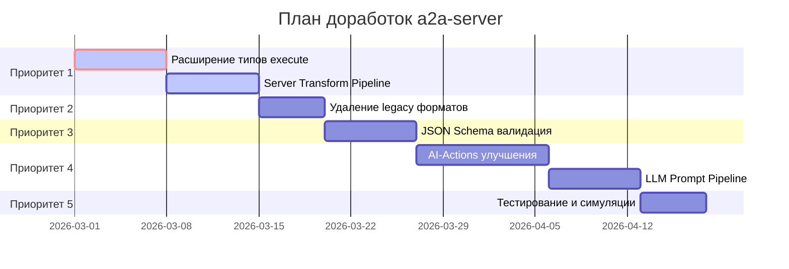

# План доработок a2a-server под new-request-flow

## Обзор

Данный документ описывает план доработок сервера `a2a-server` для полного соответствия спецификации new-request-flow, описанной в [`docs/new-request-flow/`](../docs/new-request-flow/).

## Источники истины (Каноничные документы)

| Документ | Описание |
|----------|----------|
| [`docs/new-request-flow/PROTOCOL.md`](../docs/new-request-flow/PROTOCOL.md) | Основной протокол взаимодействия |
| [`docs/new-request-flow/SCHEMAS.md`](../docs/new-request-flow/SCHEMAS.md) | Схемы данных |
| [`docs/new-request-flow/SERVER-ARCHITECTURE.md`](../docs/new-request-flow/SERVER-ARCHITECTURE.md) | Архитектура сервера |
| [`simulations/SCHEMA.md`](../simulations/SCHEMA.md) | Каноничная схема симуляций |

## Текущее состояние

### Реализовано ✅

1. **execute.form.choices** — частично реализовано в [`action-request-processor.ts`](../a2a-server/src/services/core/request-processor/action-request-processor.ts:232)
2. **Action-key shape** — типы [`ExecuteCommand`](../a2a-server/src/types/index.ts:136) и [`ResultCommand`](../a2a-server/src/types/index.ts:209) определены
3. **PromiseId async flow** — реализован в [`ollama-adapter.ts`](../a2a-server/src/services/ai/ollama-adapter.ts) и request service
4. **Timer-based polling** — REQUEST_PROCESSOR_INTERVAL_MS (по умолчанию 5 секунд)
5. **Context Block** — [`ContextBlock`](../a2a-server/src/types/index.ts:14) с полями `execution.action`, `execution.step`
6. **Actions vs AI-Actions** — разделение в [`ActionRequestProcessor`](../a2a-server/src/services/core/request-processor/action-request-processor.ts) и [`PhaseMachine`](../a2a-server/src/services/core/context/context-manager.service.ts:468)

### Требует доработки ⚠️

1. Полная поддержка всех типов execute (message, read-file, write-file, rag-search, execute-command, list-directory, grep-search)
2. Server-side transform pipeline (server-transforms-request.json / server-transforms-response.json)
3. Удаление legacy форматов (actions[], proposedActions, executingAction, dslScript)
4. JSON Schema валидация на основе [`json-schemas/`](../docs/new-request-flow/json-schemas/)
5. integration с Client API (web → client-api → server поток)

---

## Список доработок

### Приоритет 1: Критические доработки протокола

#### 1.1 Расширение поддержки типов execute

**Описание:** Добавить полную поддержку всех типов execute, описанных в SCHEMAS.md

**Файлы:**
- [`types/index.ts`](../a2a-server/src/types/index.ts) — расширить ExecuteCommand
- [`services/core/request-processor/base-processor.ts`](../a2a-server/src/services/core/request-processor/base-processor.ts) — добавить обработку типов
- [`services/core/context/context-manager.service.ts`](../a2a-server/src/services/core/context/context-manager.service.ts) — PhaseMachine для AI-Actions

**Типы для реализации:**

```typescript
// Добавить в ExecuteCommand
| { 'list-directory': ExecuteListDirectory }
| { 'grep-search': ExecuteGrepSearch }

// Новые интерфейсы
interface ExecuteListDirectory {
    path: string;
}

interface ExecuteGrepSearch {
    pattern: string;
    path?: string;
    glob?: string;
}
```

**Результат:** execute может содержать любой из поддерживаемых типов с правильной структурой action-key

---

#### 1.2 Server Transform Pipeline

**Описание:** Реализовать pipeline трансформации request/response для LLM

**Файлы:**
- Создать [`services/core/transform/transform-pipeline.service.ts`](../a2a-server/src/services/core/transform/transform-pipeline.service.ts)
- Обновить [`services/core/request-processor/neuron-request-processor.ts`](../a2a-server/src/services/core/request-processor/neuron-request-processor.ts)

**См. схему:** [`json-schemas/server-transform.schema.json`](../docs/new-request-flow/json-schemas/server-transform.schema.json)

**Поддерживаемые операции:**
- `copy` — копирование значений
- `set` — установка значений
- `append-to-array` — добавление в массив
- `parse-json-from-md` — парсинг JSON из markdown
- `render-markdown` — рендеринг markdown
- `switch` — условная логика

**Pipeline:**

```
request.json
    ↓
server-transforms-request.json (preprocessing)
    ↓
request.md → LLM
    ↓
response.md
    ↓
server-transforms-response.json (postprocessing)
    ↓
response.json
```

---

### Приоритет 2: Удаление Legacy форматов

#### 2.1 Удаление actions[] из первого ответа

**Описание:** Полностью перейти на execute.form.choices, удалить legacy actions[]

**Файлы:**
- [`services/core/request-processor/action-request-processor.ts`](../a2a-server/src/services/core/request-processor/action-request-processor.ts:232)
- [`services/core/request-processor/neuron-request-processor.ts`](../a2a-server/src/services/core/request-processor/neuron-request-processor.ts)
- [`types/index.ts`](../a2a-server/src/types/index.ts:93)

**Изменения:**
1. Удалить использование `response.actions[]` в пользу `response.execute.form.choices`
2. Удалить `response.fallbackActions[]` — интегрировать в choices
3. Обновить парсеры контекста

---

#### 2.2 Удаление executingAction и dslScript

**Описание:** Удалить legacy поля из response

**Удаляемые поля:**
- `executingAction` (top-level)
- `dslScript`
- `proposedActions`
- `subActions`

**Файлы:**
- [`types/index.ts`](../a2a-server/src/types/index.ts) — ServerMessage
- Все файлы, генерирующие ответы

---

### Приоритет 3: JSON Schema Валидация

#### 3.1 Интеграция AJV валидации

**Описание:** Добавить валидацию запросов и ответов по JSON Schema

**Файлы:**
- Создать [`services/core/validation/schema-validator.service.ts`](../a2a-server/src/services/core/validation/schema-validator.service.ts)
- Обновить [`routes/index.ts`](../a2a-server/src/routes/index.ts:38) — добавить валидацию
- Обновить [`services/core/request-processor/base-processor.ts`](../a2a-server/src/services/core/request-processor/base-processor.ts)

**Схемы для валидации:**

| Schema | Назначение |
|--------|------------|
| `server-invoke-request.schema.json` | POST /api/v1/invoke request |
| `server-invoke-response-first-form.schema.json` | Первый ответ с form choices |
| `server-invoke-response-execute.schema.json` | Ответ с execute |
| `server-invoke-response-pending.schema.json` | Async pending response |
| `client-result.schema.json` | Result от клиента |

**Пример использования:**

```typescript
import Ajv from 'ajv';
import serverInvokeRequestSchema from '../docs/new-request-flow/json-schemas/server-invoke-request.schema.json';

const ajv = new Ajv({ strict: false });
const validate = ajv.compile(serverInvokeRequestSchema);

function validateRequest(data: unknown): ValidationResult {
    const isValid = validate(data);
    if (!isValid) {
        return { valid: false, errors: validate.errors };
    }
    return { valid: true };
}
```

---

### Приоритет 4: AI-Actions (LLM-Driven) Улучшения

#### 4.1 PhaseMachine для AI-Actions

**Описание:** Улучшить PhaseMachine для поддержки динамических шагов AI-Actions

**Файлы:**
- [`services/core/context/context-manager.service.ts`](../a2a-server/src/services/core/context/context-manager.service.ts:468) — PhaseMachine
- [`services/core/request-processor/neuron-request-processor.ts`](../a2a-server/src/services/core/request-processor/neuron-request-processor.ts)

**См. документацию:** [PROTOCOL.md — AI-Actions](docs/new-request-flow/PROTOCOL.md:88)

**Изменения:**
1. AI-Actions: шаги не в фиксированной последовательности
2. Сервер показывает список *доступных* шагов
3. Следующий шаг определяется из ответа LLM
4. `execution.step` часто просто `"request"`

---

#### 4.2 Поддержка LLM Prompt Pipeline

**Описание:** Полный цикл: request → LLM → response

**Файлы:**
- [`services/ai/llm-adapter.ts`](../a2a-server/src/services/ai/llm-adapter.ts)
- Создать [`services/core/transform/request-transformer.ts`](../a2a-server/src/services/core/transform/request-transformer.ts)
- Создать [`services/core/transform/response-transformer.ts`](../a2a-server/src/services/core/transform/response-transformer.ts)

**Pipeline:**

```
request.json (Client → Server)
    ↓
server-transforms-request.json (transform)
    ↓
request.md (Server → LLM)
    ↓
response.md (LLM → Server)
    ↓
server-transforms-response.json (transform)
    ↓
response.json (Server → Client)
```

---

### Приоритет 5: Тестирование и Симуляции

#### 5.1 Запуск симуляций

**Описание:** Проверить соответствие реализации симуляциям

**Симуляции для проверки:**

| Симуляция | Тип | Описание |
|-----------|-----|----------|
| `fix-vue-imports` | Action | Vue imports — hardcoded steps |
| `fix-vue-imports-batched` | Action | Batched variant |
| `dialog` | AI-Action | Простой диалог |
| `coder` | AI-Action | Диалог + RAG + read/write |
| `coder-smart` | AI-Action | Контекст-документ |
| `auto-ai` | AI-Action | Полные возможности |

**Команда:**

```bash
# Запустить симуляцию
node simulations/run-simulation.js fix-vue-imports

# Запустить все
node simulations/run-all-simulations.js
```

---

#### 5.2 Обновить JSON схемы

**Описание:** Убедиться что все схемы актуальны и соответствуют коду

**Файлы в [`docs/new-request-flow/json-schemas/`](../docs/new-request-flow/json-schemas/):**

- `server-invoke-request.schema.json`
- `server-invoke-response-first-form.schema.json`
- `server-invoke-response-execute.schema.json`
- `server-invoke-response-pending.schema.json`
- `server-transform.schema.json`
- `client-result.schema.json`

---

## Roadmap



---

## Ключевые файлы для изменений

| Файл | Изменения |
|------|-----------|
| `src/types/index.ts` | Расширить ExecuteCommand, ResultCommand; удалить legacy поля |
| `src/routes/index.ts` | Добавить валидацию по JSON Schema |
| `src/services/core/request-processor/action-request-processor.ts` | execute.form.choices вместо actions[] |
| `src/services/core/request-processor/neuron-request-processor.ts` | AI-Actions, PhaseMachine |
| `src/services/core/context/context-manager.service.ts` | PhaseMachine для AI-Actions |
| `src/services/ai/llm-adapter.ts` | LLM prompt pipeline |
| `src/services/core/transform/*` | Создать server transform pipeline |

---

## Метрики успешности

- [ ] Все симуляции проходят успешно
- [ ] JSON Schema валидация работает для всех запросов/ответов
- [ ] execute.form.choices используется вместо actions[]
- [ ] Action-key shape соблюдается во всех execute/result объектах
- [ ] Server-side transforms работают корректно
- [ ] AI-Actions поддерживают динамические шаги
- [ ] Legacy форматы полностью удалены

---

## Ссылки

- [PROTOCOL.md](../docs/new-request-flow/PROTOCOL.md)
- [SCHEMAS.md](../docs/new-request-flow/SCHEMAS.md)
- [SERVER-ARCHITECTURE.md](../docs/new-request-flow/SERVER-ARCHITECTURE.md)
- [simulations/SCHEMA.md](../simulations/SCHEMA.md)
- [simulations/REFERENCE.md](../simulations/REFERENCE.md)
