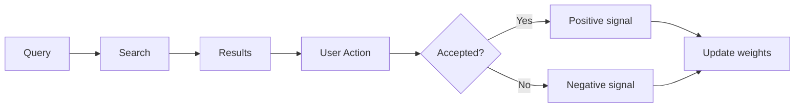

# A2A — План обучения

## Обзор

Документ описывает что будет обучаться, как и где.

---

## 1. Чёткое разделение: ЧТО и ГДЕ

### a2a-client — ML для поиска

| Компонент | Что делает | Обучается? |
|-----------|------------|------------|
| Embeddings | Превращает код в векторы | ✅ На коде проекта |
| Hybrid Search | Семантический + лексический поиск | ✅ Через feedback |
| RAG | Chunking и индексация | ❌ Правила |
| Graph | Связи между файлами | ❌ Статический |

### a2a-server — Knowledge Graph

| Компонент | Что делает | Обучается? |
|-----------|------------|------------|
| Нейроны | ДНК Laravel 11 | ❌ Предустановленные |
| Entity Recognizer | Идентификация сущностей | ❌ Правила |
| Relation Mapper | Связи между сущностями | ❌ Правила |
| Context Handler | Формирование контекста | ❌ Алгоритм |

---

## 2. Методы обучения

### 2.1 ML на клиенте (Embeddings + Search)

```
Код проекта → Embedding Model → Векторы → Vector DB
     ↓
Query → Semantic Search → Results → User Feedback → Корректировка весов
```

**Данные для обучения:**
- Код проекта (PHP, Vue, JS)
- Запросы пользователя
- Feedback: принят/отклонён результат

### 2.2 Нейроны на сервере (пополнение)

```
Неизвестная сущность → Question Generator → Ответ пользователя → Новый нейрон
```

**Механизм createNeuronFromUnknown:**
1. Система находит неизвестную связь
2. Генерирует вопрос пользователю
3. Получает ответ
4. Создаёт новый нейрон с триггерами и знаниями

---

## 3. Путь миграции: Regex → Embeddings

### Этап 1: Текущий (Regex)
```
Входящий текст → Regex-паттерны в triggers → Активация нейрона
```

### Этап 2: Будущий (Embeddings)
```
Входящий текст → Embedding вектор → Semantic Plexer → Активация по смыслу
```

### Инструменты для миграции

| Этап | Инструмент | Где |
|------|------------|-----|
| Semantic Plexer | TensorFlow.js / Natural | a2a-client |
| Vector DB | pgvector / Weaviate | a2a-client |
| LLM Integration | Ollama (Llama 3) | a2a-server |

---

## 4. Данные для обучения

### 4.1 Собираемые данные

| Тип | Источник | Хранилище |
|------|----------|-----------|
| Query logs | Поисковые запросы | PostgreSQL |
| Click data | Выбранные результаты | PostgreSQL |
| Code snippets | Индексируемый код | Vector DB |
| Session data | Контекст сессий | PostgreSQL |

### 4.2 Feedback loop



---

## 5. Метрики качества

### 5.1 Поиск

| Метрика | Формула | Цель |
|---------|---------|------|
| Precision@K | relevant_in_top_k / k | > 0.8 |
| Recall@K | relevant_in_top_k / total_relevant | > 0.7 |
| MRR | 1 / rank_first_relevant | > 0.6 |
| NDCG | normalized discounted cumulative gain | > 0.7 |

### 5.2 Нейроны

| Метрика | Описание | Цель |
|---------|----------|------|
| Activation accuracy | Правильность активации | > 0.9 |
| Coverage | Покрытие Laravel понятий | > 0.8 |
| False positive rate | Ложные активации | < 0.1 |

---

## 6. Следующие шаги

1. [ ] Реализовать сбор feedback на клиенте
2. [ ] Создать базовые нейроны Laravel 11 на сервере
3. [ ] Настроить логирование query → results
4. [ ] Подготовить данные для fine-tuning embeddings
5. [ ] Реализовать Question Generator для создания нейронов

---

**Дата создания:** 2026-02-20
