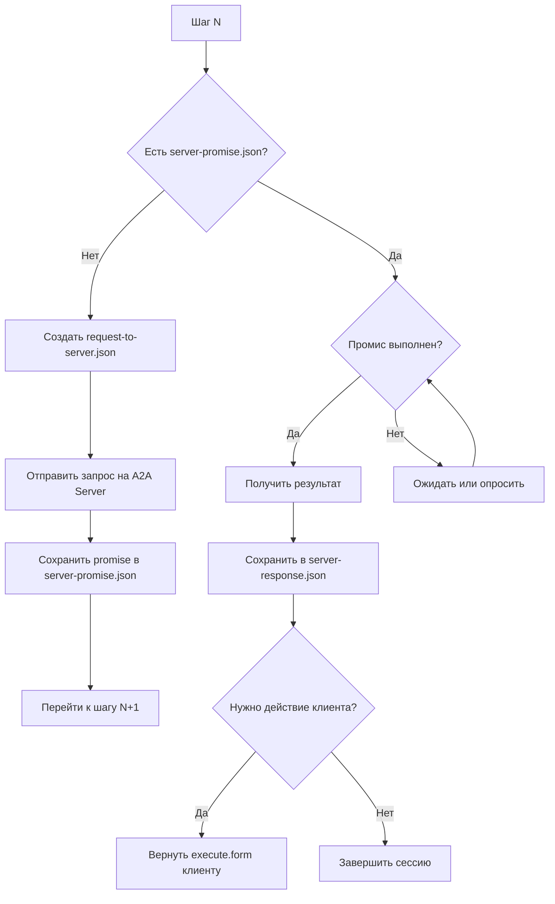

# API Client Server — Логика работы

> **Статус:** Утверждено  
> **Дата:** 2026-03-11

## Обзор

API Client Server (порт 3001) выступает прокси-сервером между Web UI (порт 5173) и A2A Server (порт 3000). Сервер управляет сессиями и обрабатывает асинхронные запросы с использованием Promise ID.

## Основные функции

### 1. Проксирование запросов

- Перенаправляет запросы от Web UI на A2A Server
- Трансформирует формат данных между клиентом и сервером
- Обрабатывает ответы и возвращает их клиенту

### 2. Управление сессиями

- Создание новых сессий (`POST /api/sessions`)
- Получение сессий (`GET /api/sessions/:id`)
- Обновление сессий (`PUT /api/sessions/:id`)
- Удаление сессий (`DELETE /api/sessions/:id`)

### 3. Обработка действий

- `POST /api/sessions/:id/action` — выбор варианта (form.choices)
- `POST /api/sessions/:id/next` — отправка следующего сообщения

## Поток обработки шагов (Step Flow)

### Структура файлов шага

Каждый шаг в директории сессии содержит:

```
storage/sessions/{SESSION_ID}/
├── session.json                 # Данные сессии
├── {N}/
│   ├── server-response.json     # Ответ от A2A сервера
│   ├── client-result.json       # Результат от клиента (web/авто)
│   ├── request-to-server.json   # Запрос к серверу (перед отправкой)
│   └── messages.json            # История сообщений
├── {N+1}/
│   ├── server-promise.json      # Данные о промисе (если async) — в следующем шаге
│   └── ...
```

### Логика обработки шага



### Детальное описание

#### 1. Нет server-promise.json (новый запрос)

Если в папке шага нет файла `server-promise.json`:

1. Создать `request-to-server.json` на основе:
   - `client-result.json` (если есть) — данные от пользователя
   - Контекста из предыдущих шагов
   - Текущего состояния сессии

2. Отправить запрос на A2A Server (`POST /api/v1/requests`)

3. Сохранить данные о промисе в **следующий шаг** `{N+1}/server-promise.json`:
```json
{
  "promiseId": "uuid-...",
  "status": "pending",
  "submittedAt": "2026-03-11T..."
}
```

4. Перейти к шагу N+1 (promise хранится в папке N+1)

#### 2. Есть server-promise.json (проверка статуса)

Если файл существует:

1. Проверить статус промиса:
   - **pending** — ожидать завершения
   - **completed** — получить результат
   - **failed** — обработать ошибку

2. Для ожидающих промисов:
   - Автоматический опрос (polling) каждые 5 секунд
   - Или ожидание внешнего триггера

3. После завершения:
   - Получить результат от A2A Server
   - Сохранить в `server-response.json`

#### 3. Ответ от клиента

Когда получен ответ от Web клиента:

1. Сохранить в `client-result.json`:
```json
{
  "result": {
    "message": "текст сообщения"
    // или
    "choice": "выбранный вариант"
  }
}
```

2. Создать новый шаг (N+1)

3. Создать `request-to-server.json` для следующего запроса

#### 4. Ответ от сервера

Когда получен ответ от A2A Server:

1. Определить тип ответа:
   - **sync** — немедленный ответ с `execute`
   - **async** — требуется ожидание через promiseId

2. Для синхронного ответа:
   - Вернуть `execute` объект клиенту
   - Клиент отображает форму или сообщение

3. Для асинхронного ответа:
   - Сохранить promiseId
   - Начать опрос статуса
   - После завершения вернуть результат

## Типы автоматической обработки

### Автоматический (Auto Mode)

- Скрипт или симуляция самостоятельно отправляет данные
- Не требуется участие пользователя
- Используется для тестирования

### Ручной (Manual Mode)

- Ожидание ввода от пользователя через Web UI
- Сервер возвращает `execute.form.input` или `execute.form.choices`
- Клиент отображает форму и ждёт ввода

### Гибридный (Hybrid Mode)

- Автоматическое продолжение после таймаута
- Предопределённые ответы для известных сценариев
- Fallback на ручной режим при неизвестном состоянии

## Файловая структура storage

### Режим Storage (по умолчанию - локальный)

```
a2a-client/storage/sessions/{SESSION_ID}/
├── session.json
├── 1/
│   ├── server-response.json
│   ├── client-result.json
│   ├── request-to-server.json
│   └── messages.json
├── 2/
│   └── ...
```

### Режим Project

```
{projectPath}/.a2a/sessions/{SESSION_ID}.json
```

### Глобальный (для продакшена)

Установите переменную окружения `A2A_CLIENT_STORAGE_DIR` для использования глобального хранилища:

```bash
export A2A_CLIENT_STORAGE_DIR=~/.a2a-client
```

## Ожидаемые файлы

| Файл | Папка | Описание |
|------|-------|----------|
| `request-to-server.json` | `{N}/` | Запрос к серверу (перед отправкой) |
| `server-promise.json` | `{N+1}/` | promiseId после async-запроса из шага N |
| `client-result.json` | `{N}/` | Результат от Web клиента |
| `server-response.json` | `{N}/` | Ответ от A2A Server |
| `messages.json` | `{N}/` | История сообщений |

## Валидация правок кода

### client-result (Web → Client API)

При `POST /api/sessions/:id/next` проверять структуру:

```json
{
  "result": {
    "message": "string" | "choice": "string"
  }
}
```

- `result` — обязательно
- `result.message` или `result.choice` — хотя бы одно

### edit-patch (A2A Server)

Валидация на стороне A2A Server (`action-validator.ts`, `edit-patch.ts`):

| Уровень | Что проверяется |
|---------|-----------------|
| Schema | `path`, `operations[]`, `type` ∈ {replace, insert, delete, replaceContent} |
| Path | Безопасность пути (вне workspace — отказ) |
| File | Файл существует |
| Operations | `startLine`/`endLine`/`content`/`search` по типу операции |

При ошибке — `success: false`, `error` в ответе.

### request-to-server (Client API → A2A)

Перед отправкой на A2A Server:

- Наличие `task`, `context`
- Корректность `context.execution` при наличии

## Коды завершения

- `pending` — запрос в обработке
- `completed` — успешно завершено
- `failed` — ошибка выполнения
- `cancelled` — отменено пользователем
