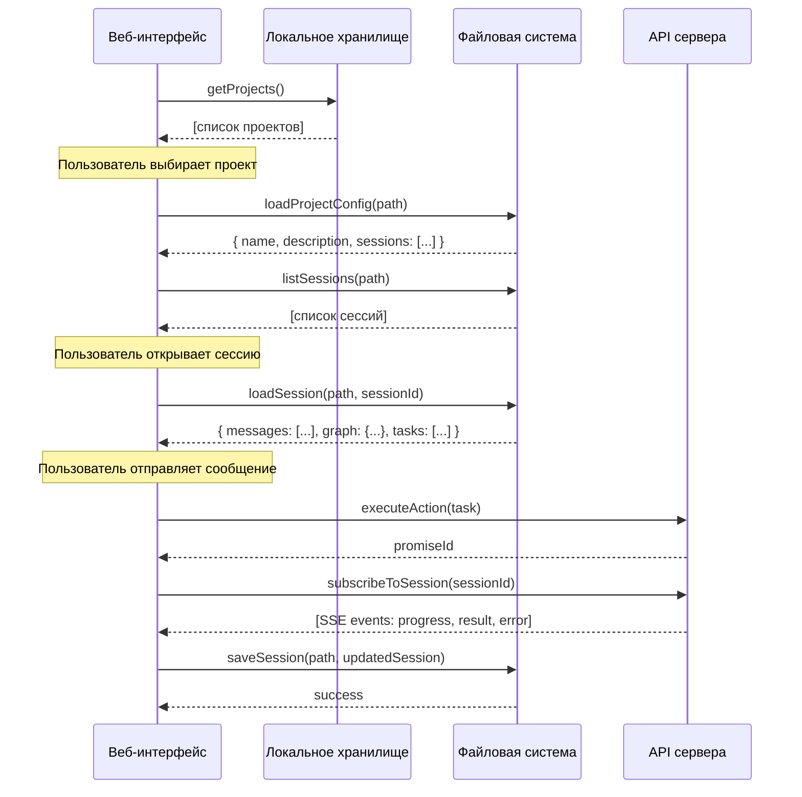

# План: Разделение ответственности между API клиента и сервера

## Текущее состояние

### Клиент (a2a-client/web)
- **Хранилище**: Только in-memory (данные теряются при перезагрузке)
- **API**: `http://localhost:8080/api/v1`
- **Основные операции**: `sendTask()`, `createSession()`, `connectSSE()`

### Сервер (a2a-server)
- **Хранилище**: PostgreSQL (Client, Project, Session, Request, Message, GraphEntity, File, Embedding)
- **Основные эндпоинты**: `/requests`, `/actions`, `/sse`, `/auth`, `/health`

---

## Новая архитектура: Клиент хранит список проектов локально

### 1. Данные клиента (локально, в файловой системе)

| Данные | Путь | Описание |
|--------|------|----------|
| **Список проектов** | `a2a-client/storage/projects.json` | Массив: `{ id, name, path }` |
| **Конфигурация** | В папке проекта `.a2a/config.json` | Настройки проекта |
| **Сессии** | В папке проекта `.a2a/sessions/` | Файлы JSON |
| **Граф знаний** | В папке проекта `.a2a/graph.json` | Кеш графа |

### 2. Данные проекта (в папке проекта)

Каждый проект хранит данные в своей папке:

```
project-folder/
├── .a2a/                      # Папка метаданных A2A
│   ├── config.json           # Конфигурация проекта
│   ├── sessions/             # Сессии (файлы JSON)
│   │   ├── session-uuid1.json
│   │   └── session-uuid2.json
│   ├── graph.json           # Граф знаний (кеш)
│   └── index/               # Индекс файлов (опционально)
│       └── embeddings.json
├── src/                      # Исходный код проекта
└── ...
```

### 3. Ответственность сервера

| Операция | Эндпоинт | Когда вызывается |
|----------|----------|-----------------|
| **Выполнение действий** | `POST /api/v1/requests` | Клиент отправляет задачу на выполнение |
| **Поиск actions** | `GET /api/v1/actions/search` | Поиск доступных действий |
| **SSE-события** | `GET /api/v1/sse/:sessionId` | Подписка на прогресс выполнения |
| **Аутентификация** | `POST /api/v1/auth/token` | Получение токена доступа |
| **Health check** | `GET /api/v1/health` | Проверка доступности сервера |

---

## API-запросы веб-интерфейса клиента

### Список проектов (локально в файловой системе)

| Операция | Метод | Назначение |
|----------|-------|------------|
| `getProjects()` | Чтение `projects.json` | Получить список всех проектов |
| `addProject(project)` | Запись `projects.json` | Добавить новый проект |
| `updateProject(id, data)` | Запись `projects.json` | Обновить метаданные проекта |
| `removeProject(id)` | Запись `projects.json` | Удалить проект из списка |

### Управление проектом (в папке проекта)

| Операция | Метод | Назначение |
|----------|-------|------------|
| `loadProjectConfig(path)` | Файл (FS) | Чтение `.a2a/config.json` |
| `saveProjectConfig(path, data)` | Файл (FS) | Запись `.a2a/config.json` |
| `listSessions(path)` | Файл (FS) | Чтение списка сессий из `.a2a/sessions/` |
| `loadSession(path, sessionId)` | Файл (FS) | Чтение `.a2a/sessions/{sessionId}.json` |
| `saveSession(path, session)` | Файл (FS) | Запись сессии |
| `loadGraph(path)` | Файл (FS) | Чтение `.a2a/graph.json` |
| `saveGraph(path, graph)` | Файл (FS) | Сохранение графа |

### Взаимодействие с сервером

| Операция | Метод | Назначение |
|----------|-------|------------|
| `executeAction(task)` | `POST /api/v1/requests` | Отправить задачу на выполнение |
| `getActionStatus(promiseId)` | `GET /api/v1/requests/{promiseId}/status` | Проверить статус задачи |
| `getActionResult(promiseId)` | `GET /api/v1/requests/{promiseId}/result` | Получить результат |
| `cancelAction(promiseId)` | `DELETE /api/v1/requests/{promiseId}` | Отменить задачу |
| `searchActions(query)` | `GET /api/v1/actions/search?q={query}` | Найти доступные действия |
| `subscribeToSession(sessionId)` | `GET /api/v1/sse/{sessionId}` | Подписаться на события |
| `authenticate(credentials)` | `POST /api/v1/auth/token` | Авторизоваться |
| `checkServerHealth()` | `GET /api/v1/health` | Проверить доступность |

---

## Поток данных при открытии проекта



---

## Структура данных проекта (локально)

### Список проектов (`a2a-client/storage/projects.json`)

```json
{
  "projects": [
    {
      "id": "p_1771576028988",
      "name": "websitestore",
      "path": "C:\\workspace\\domain-platform\\websitestore.com.ua"
    }
  ]
}
```

### Операции с файлом проектов

| Операция | Метод | Путь |
|----------|-------|------|
| `getProjects()` | Чтение | `a2a-client/storage/projects.json` |
| `addProject(project)` | Запись | `a2a-client/storage/projects.json` |
| `updateProject(id, data)` | Запись | `a2a-client/storage/projects.json` |
| `removeProject(id)` | Запись | `a2a-client/storage/projects.json` |

### Конфигурация проекта (.a2a/config.json)

```typescript
interface ProjectConfig {
  version: "1.0";
  name: string;
  description?: string;
  defaultModel?: string;
  framework?: string;
  settings: {
    autoIndex: boolean;
    maxContextSize: number;
  };
}
```

### Сессия (.a2a/sessions/{id}.json)

```typescript
interface Session {
  id: string;
  title: string;
  createdAt: string;
  updatedAt: string;
  messages: Message[];
  tasks: Task[];
  graph: Graph | null;
  context: Record<string, unknown>;
}
```

---

## Итоговая таблица ответственности

| Компонент | Локально (Файл) | Сервер |
|-----------|-----------------|--------|
| **Список проектов** | ✅ Да (`a2a-client/storage/projects.json`) | ❌ Нет |
| **Метаданные проекта** | ✅ Да (в `.a2a/config.json` проекта) | ❌ Нет |
| **Сессии** | ✅ Да (в `.a2a/sessions/` проекта) | ❌ Нет |
| **Сообщения** | ✅ Да (в сессии) | ❌ Нет |
| **Граф знаний** | ✅ Да (`.a2a/graph.json`) | ❌ Нет |
| **Выполнение действий** | ❌ Нет | ✅ Да |
| **Поиск actions** | ❌ Нет | ✅ Да |
| **Аутентификация** | ❌ Нет | ✅ Да |
| **Аудит логи** | ❌ Нет | ✅ Да |

---

## Рекомендуемые изменения в коде

### 1. Модифицировать `app-state.js`
- Добавить загрузку/сохранение списка проектов из `a2a-client/storage/projects.json`
- Реализовать методы `loadProjects()`, `saveProject()`, `deleteProject()`

### 2. Создать сервис работы с файлами проекта
- `project-fs-service.js` - методы для работы с `.a2a/` в папке проекта
- `readProjectConfig(path)`, `writeProjectConfig(path, data)`
- `listSessions(path)`, `readSession(path, id)`, `writeSession(path, data)`
- `readGraph(path)`, `writeGraph(path, graph)`

### 3. Модифицировать `api-integration.js`
- Оставить методы для работы с сервером (executeAction, searchActions, SSE)
- Интегрировать с сервисом файлов проекта

### 4. Обновить UI компоненты
- Добавить панель списка проектов (чтение из `projects.json`)
- Реализовать импорт/экспорт проектов
- Показать индикатор статуса сервера
